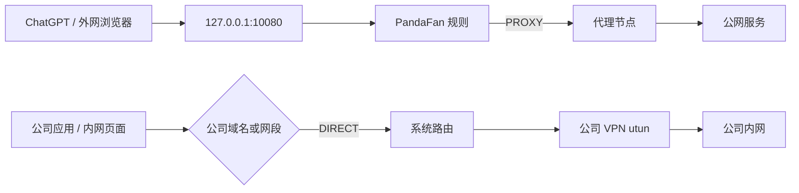

1. Table of Contents, ordered
{:toc}

晚上打开 YouTube，代理客户端明明在运行，页面却一直转圈；断开节点重连想测个速，结果连百度都打不开了。更奇怪的是，Google 和 YouTube 恢复后，ChatGPT 与 Gemini 仍然超时，而同一台机器上的 Codex 偶尔要重试很久才开始输出。

这些现象不是一个开关造成的。端口代理、TUN、系统 DNS、fake-ip、macOS `pf` 和公司 VPN 分处不同层级，同一种“打不开”可能来自完全不同的链路。

这次排查也留下了一个比结论本身更重要的教训：**恢复现象不等于唯一归因已经成立**。文中把证据分成三类：

- **已验证事实**：能通过配置前后对照、进程连接或重复实验直接确认；
- **高相关推断**：时间和行为高度吻合，但缺少完整日志证明内部机制；
- **待验证解释**：能够解释现象，却不是唯一可能。

最终目标不是继续给 TUN 打补丁，而是把流量拆成两条稳定路径：外网应用显式交给 PandaFan 端口代理，公司内网交给 VPN 的分流隧道。

## 先把三条流量路径拆开

定位代理故障的第一步不是换节点，而是确认应用把请求交给了谁。端口代理、PandaFan TUN 和公司 VPN TUN 虽然都叫“代理”或“隧道”，接管位置并不相同。

### 端口代理把域名交给本地代理

HTTP/SOCKS 端口模式要求应用主动连接本地端口，例如 `127.0.0.1:10080`。以 Chromium 的 HTTP 代理实现为例，HTTP、HTTPS、WebSocket 请求的目标域名由代理侧解析，而不是先由浏览器调用系统 DNS；HTTPS 通过 `CONNECT` 建立隧道，TLS 仍然是端到端的。[Chromium 的代理实现文档](https://chromium.googlesource.com/chromium/src/+/main/net/docs/proxy.md)明确说明了这条解析路径。

因此，只要应用确实使用这个 HTTP 代理，目标站点的污染 DNS 答案通常不会进入应用连接链路。这里的限定词很重要：**只有遵守代理配置的网络栈才成立**，后台助手、更新器和应用自行拉起的原生进程未必自动继承。

### PandaFan TUN 接管的是系统发出的 IP 包

TUN 模式创建 `utun` 虚拟网卡，并通过路由接管原本要发往外部地址的数据包。为了保留域名规则，mihomo 通常再配合 DNS 劫持和 fake-ip：DNS 模块先返回 `198.18.0.0/16` 中的保留地址，TUN 收到数据包后根据映射表还原域名。

这条路比端口代理覆盖得广，却同时依赖四个环节：

1. 系统 DNS 请求进入 mihomo；
2. 系统缓存与 mihomo 映射一致；
3. fake-ip 数据包能到达 TUN；
4. TUN 之前没有更早的过滤或重定向。

任何一环断掉，表面症状都只是“网站超时”。

### 公司 VPN 通常只应接管公司网段

公司 VPN 也是 TUN，但理想状态是 split tunnel：只安装公司 CIDR 和内部 DNS 的路由，不接管互联网默认路由。这样它与 PandaFan 端口模式可以并存，因为两者看到的目的地不同。



这张图同时揭示一个容易漏掉的条件：如果浏览器把公司域名也交给 PandaFan，PandaFan 必须将它判为 `DIRECT`，并让内部域名使用 VPN 的 scoped DNS；否则请求会被送到远端代理，系统的公司网段路由根本看不到原目标。

## DNS 与本地状态为什么制造“随机故障”

三条路径分清后，前半夜出现的故障可以归到两个局部问题：macOS 实际采用了哪套 DNS，以及本地 DNS 状态是否仍与 mihomo 一致。

### 同一域名出现了两套答案

当时的对照实验是：

- `nslookup` 返回 `198.18.x.x`，说明查询进入了 mihomo fake-ip DNS；
- `dscacheutil` 返回疑似污染的公网 IPv4 和异常 IPv6，说明 macOS 系统解析路径选中了另一套 resolver。

清缓存后错误答案立刻重新出现，证明它不是单纯残留在系统缓存里，而是下一次查询仍走了不合适的上游。

原始判断把它概括成“mDNSResponder 天生绑定物理网卡，所以 TUN 永远劫持不到”，这个说法过满。macOS 支持按接口、域名和 VPN 配置选择 **scoped DNS**；具体查询走哪套 resolver，取决于当时的网络服务顺序、VPN DNS、路由和代理客户端实现。[Apple 关于 scoped DNS 的说明](https://developer.apple.com/forums/thread/742655)也强调了这种按作用域选择的能力。

因此，更准确的结论是：**这台机器当时的系统 resolver 没有进入预期的 mihomo DNS 路径**，而不是所有 macOS TUN 都存在同一个结构性盲区。排查时应先看：

```bash
scutil --dns
route -n get 1.1.1.1
```

### 把系统 DNS 指向本地核心会引入强耦合

将 Wi-Fi DNS 改成 `127.0.0.1` 后，系统解析统一进入 mihomo，网络当场恢复：

```bash
sudo networksetup -setdnsservers Wi-Fi 127.0.0.1
sudo dscacheutil -flushcache
sudo killall -HUP mDNSResponder
```

但这相当于把整台机器的 DNS 生存期绑定给 PandaFan：核心停止、启动失败或配置未就绪时，连国内直连域名也无法解析。它适合定位问题，不适合作为这套机器的最终稳态。

### `system` 自引用确实危险，但字段职责需要纠正

当时配置包含：

```yaml
dns:
  default-nameserver:
    - system
    - 119.29.29.29
    - 223.5.5.5
```

系统 DNS 已经指向 `127.0.0.1`，mihomo 再调用 `system`，就可能把查询送回自己，形成递归依赖。删除 `system` 后，断开节点和重启后的恢复能力明显改善。

不过，`default-nameserver` 不能简单解释为“专门解析代理节点域名”。按当前 [mihomo DNS 官方文档](https://wiki.metacubex.one/config/dns/)：

- `default-nameserver` 用于解析 DNS 服务器地址中的域名，是 bootstrap resolver；
- `proxy-server-nameserver` 才专门解析代理节点域名；
- `nameserver` / `fallback` 承担普通域名查询。

所以这里已经证实的是“本地 DNS 与 `system` 形成了自引用风险，移除后恢复”，并没有日志证明每次锁死都恰好发生在解析代理节点域名。长期配置应使用明确的 IP bootstrap，并单独设置 `proxy-server-nameserver`。

### 删除 fake-ip 缓存能恢复，但“毒缓存”不是完整解释

修正 DNS 自引用后，仍观察到一批已访问域名超时；完全停止核心、删除 `fakeip-v4.json`、清系统 DNS 缓存并重启后，这批请求恢复。

这能确认：

- 故障与旧 fake-ip 状态有关；
- 同时重建系统缓存和核心映射是一种有效恢复手段。

但它不能直接证明 `store-fake-ip: true` 会制造“重启后必死的映射”。这个选项的设计目的恰恰是持久化域名到 fake-ip 的对应关系，让下次启动继续使用。更谨慎的解释是：**当时可能存在系统仍缓存旧假 IP、核心映射未完整恢复、配置切换改变地址池，或特定版本恢复异常中的一种**。

因此，这部分应记录为“已验证恢复动作，根因尚未唯一确定”，而不是推广成 fake-ip 持久化的通用缺陷。

## 为什么最后只剩 ChatGPT 和 Gemini 超时

DNS 与 fake-ip 状态恢复后，YouTube、Google 和普通网站都已正常，ChatGPT 与 Gemini 却仍在 TUN 路径超时。这时故障边界已经从“整个代理”缩小到了“特定 fake-ip 的出站连接”。

### `pf` 重定向提供了直接证据

当时在 macOS `pf` 中观察到类似规则：

```text
rdr pass inet proto tcp to 198.18.0.5 port = 443 -> 127.0.0.1 port 34010
pass out route-to (lo0 127.0.0.1) inet proto tcp to 198.18.0.5 port 443 ...
```

它们会在数据包进入 TUN 前，把目标 443 流量改道到本机 `34010`。现场还出现了三个连续现象：

1. 清除相关规则后，ChatGPT 与 Gemini 立即连通；
2. 约几十秒后规则重新出现，两个站点再次超时；
3. 机器上存在长期运行的 `/opt/didi/lca/bin/lcanetmon`，并由高权限账户拉起。

这组对照足以支持“有常驻组件持续维护这些重定向规则”，也能解释为什么 TUN 没有收到数据包。但仅凭进程名和时间相关性，还不足以确认软件厂商、具体策略意图，或断言它就是有意封锁某两个产品。

### 它如何把域名映射到 fake-ip 仍是推测

原始排查提出了两种可能：

- 监听系统 DNS 事件，记录域名到 fake-ip 的映射；
- 从 TLS SNI 或其他终端网络元数据识别目标，再安装 IP 规则。

两种机制都说得通，但目前没有该进程的策略日志或实现证据，不能写成既定事实。文章能确认的只有“规则命中了对应 fake-ip，并被某个常驻组件周期性恢复”。

这类规则属于终端管控层。正确处置仍是确认公司策略，而不是写守护进程每隔几十秒清一次规则。即便应用代理技术上可以改变流量路径，也应在公司允许使用相关服务和代理的前提下部署。

### HTTP 421 不是 API 健康证明

排查过程中还曾用 `api.openai.com` 返回 `421` 作为“Codex API 已经连通”的证据。这个判断需要纠正。

[RFC 9110](https://datatracker.ietf.org/doc/html/rfc9110#section-15.5.20) 对 `421 Misdirected Request` 的定义是：请求被送到了无法或不愿为目标 URI 提供权威响应的服务器。它可能说明 TLS/HTTP 链路收到过响应，却不能证明认证、目标路径、流式响应或 Codex 实际业务调用正常。

最终验收应以真实 ChatGPT/Codex 请求和连接表为准，而不是把任意 HTTP 状态码解释成成功。

## 最终收口：端口代理与 VPN 分流各管一层

排查完成后，没有继续修补 PandaFan TUN，而是主动减少接管层级：

- **PandaFan 只开端口代理**，不再开启 TUN；
- **系统 DNS 保持 DHCP / VPN 下发**，PandaFan 退出时不会拖垮整机解析；
- **浏览器继续使用 PandaFan 端口和规则分流**；
- **ChatGPT 桌面版通过专用启动器显式使用 PandaFan**；
- **公司 VPN 只接管公司网段和内部 DNS**。

这套方案在家和公司分别形成清晰路径：

| 场景 | ChatGPT / 公网 | 公司内网 |
|---|---|---|
| 家里，连接公司 VPN | ChatGPT → PandaFan 端口 → 代理节点 | 公司域名或网段 → `DIRECT` → VPN |
| 公司，不连接 VPN | ChatGPT → PandaFan 端口 → 代理节点 | 公司网络原生访问 |

它不是“完美无瑕”的自动分流，至少需要满足四个条件：

1. 公司 VPN 是 split tunnel，没有安装 `0.0.0.0/0`、`::/0` 或强制 kill switch；
2. 公司网段不与家庭局域网、PandaFan 代理节点路由冲突；
3. 公司域名与网段在 PandaFan 中走 `DIRECT`，内部域名使用 VPN DNS；
4. 公司允许在这台机器上使用 ChatGPT 和 PandaFan。

只要这四条成立，PandaFan 不再创建 fake-ip TUN 路径，公司 VPN 也不需要处理公网代理流量，两套机制就不会再争夺同一层路由。

## 给 ChatGPT 做一个干净、失败即停的启动器

最终方案生效后又发现，ChatGPT 桌面版不只有一套网络栈：

- 主界面的 Chromium 网络服务认识 `--proxy-server`；
- 内嵌的 `codex app-server` 是独立原生进程，还需要标准代理环境变量兜底。

第一次从另一个桌面 Agent 启动 ChatGPT 时，父进程的整套环境变量被一并传入，其中包括与 ChatGPT 无关的 API 凭据。虽然代理确实生效了，这种启动方式扩大了密钥暴露面。因此，最终脚本采用 `env -i` 从空环境启动，只白名单保留必要变量。

脚本保存为 `~/bin/chatgpt-via-pandafan`：

```zsh
#!/bin/zsh

set -euo pipefail

readonly APP_PATH="/Applications/ChatGPT.app"
readonly APP_EXEC="${APP_PATH}/Contents/MacOS/ChatGPT"
readonly PROXY_HOST="127.0.0.1"
readonly PROXY_PORT="10080"
readonly PROXY_URL="http://${PROXY_HOST}:${PROXY_PORT}"
readonly NO_PROXY_VALUE="localhost,127.0.0.1,::1"
readonly CURRENT_USER="${USER:-$(/usr/bin/id -un)}"
readonly CURRENT_HOME="${HOME:?HOME is required}"

if [[ ! -x "$APP_EXEC" ]]; then
  print -u2 "ChatGPT app not found: $APP_PATH"
  exit 1
fi

# PandaFan 没启动时直接失败，不让 ChatGPT 回退到直连。
if ! /usr/bin/nc -z -w 2 "$PROXY_HOST" "$PROXY_PORT" \
  >/dev/null 2>&1; then
  print -u2 "PandaFan proxy is unavailable at ${PROXY_HOST}:${PROXY_PORT}."
  exit 2
fi

# 已运行的实例不会重新读取启动参数，因此必须先完全退出。
if /bin/ps axww -o command= | /usr/bin/awk -v exe="$APP_EXEC" '
  index($0, exe) == 1 { found = 1 }
  END { exit(found ? 0 : 1) }
'; then
  print -u2 "ChatGPT is already running. Quit it, then retry."
  exit 3
fi

typeset -a clean_env
clean_env=(
  -i
  "HOME=$CURRENT_HOME"
  "USER=$CURRENT_USER"
  "LOGNAME=${LOGNAME:-$CURRENT_USER}"
  "SHELL=/bin/zsh"
  "PATH=$CURRENT_HOME/bin:$CURRENT_HOME/.local/bin:/opt/homebrew/bin:/opt/homebrew/sbin:/usr/local/bin:/usr/bin:/bin:/usr/sbin:/sbin"
  "TMPDIR=${TMPDIR:-/tmp}"
  "LANG=${LANG:-en_US.UTF-8}"
  "HTTP_PROXY=$PROXY_URL"
  "HTTPS_PROXY=$PROXY_URL"
  "ALL_PROXY=$PROXY_URL"
  "NO_PROXY=$NO_PROXY_VALUE"
  "http_proxy=$PROXY_URL"
  "https_proxy=$PROXY_URL"
  "all_proxy=$PROXY_URL"
  "no_proxy=$NO_PROXY_VALUE"
)

# Git 仍可使用当前 SSH Agent，但不继承其他父进程变量。
if [[ -n "${SSH_AUTH_SOCK:-}" ]]; then
  clean_env+=("SSH_AUTH_SOCK=$SSH_AUTH_SOCK")
fi

/usr/bin/nohup /usr/bin/env "${clean_env[@]}" \
  "$APP_EXEC" "--proxy-server=$PROXY_URL" \
  >/dev/null 2>&1 &

readonly app_pid=$!
disown "$app_pid" 2>/dev/null || true

/bin/sleep 1
if ! /bin/kill -0 "$app_pid" >/dev/null 2>&1; then
  print -u2 "ChatGPT exited during startup."
  exit 4
fi

print "ChatGPT started through PandaFan with PID $app_pid."
```

安装和启动：

```bash
chmod 755 ~/bin/chatgpt-via-pandafan

# 先用 Command+Q 完全退出 ChatGPT，再执行：
~/bin/chatgpt-via-pandafan
```

这里同时设置大小写代理变量，是为了覆盖不同运行库的约定；`NO_PROXY` 保留本机回环地址，否则 Codex 的本地服务和工具可能被错误送进代理。Chromium 参数没有配置 `direct://` fallback，脚本又在启动前检查端口，因此 PandaFan 不可用时会尽早失败。

### 用连接表验收，而不是凭“感觉变快”

启动后先确认主进程带着参数：

```bash
ps axww -o pid=,ppid=,command= |
  grep '/Applications/ChatGPT.app/' |
  grep -v grep
```

再检查网络服务和 `codex app-server` 是否连接 PandaFan：

```bash
lsof -nP -iTCP@127.0.0.1:10080 |
  grep -E 'ChatGPT|Codex|codex'
```

实际验收中，两类进程都出现了到 `127.0.0.1:10080` 的 `ESTABLISHED` 连接，随后真实 Codex 对话能够持续输出，之前长时间重试的现象消失。这个结果证明当前版本和当前业务路径已经使用代理，但不应扩大成“所有插件、更新器和用户命令 100% 永远走代理”。

还有一条安全教训：不要直接把未经筛选的 `ps eww` 输出贴进日志或对话，它会展开目标进程的全部环境变量，可能连 API Key 一起打印。验证代理变量时只输出变量名或“是否存在”，不要输出值。

## 边界、逃生通道与最终结论

端口代理方案减少了 TUN、fake-ip 和系统 DNS 的耦合，但没有改变公司终端软件与网络策略的权限。若公司 VPN 改成全隧道、公司网段发生重叠，或终端组件开始直接过滤 PandaFan 进程与代理节点，仍需重新检查路由和策略。

### 代理异常时先恢复系统 DNS

这几条命令保留作逃生通道：

```bash
# DNS 恢复为 DHCP 下发
sudo networksetup -setdnsservers Wi-Fi Empty

# 清理系统 DNS 缓存
sudo dscacheutil -flushcache
sudo killall -HUP mDNSResponder

# 查看当时涉及的 pf 重定向
sudo pfctl -a http-forwarding -s nat
```

操作代理核心时不要让系统 DNS 长时间停留在 `127.0.0.1`；否则核心一停，浏览器、终端甚至远程排障连接都会一起失去域名解析。

### Gemini 的地区判断属于另一层

链路恢复后，Gemini 网页仍曾提示“不支持所在区域”。第三方数据库对同一出口 IP 给出了香港和中国大陆等不同结果，而 [Google 服务条款页](https://policies.google.com/terms)显示的地区与 Gemini 的行为一致。

这不是 DNS、TUN 或 pf 故障，而是目标服务依据自己的 GeoIP 与账号策略作出的地区判断。排查此类问题时，应优先采用目标服务自身的判定口径；更换同一机场 IP 池中的节点，也未必改变结果。

### 这次真正稳定下来的是什么

最终稳定的不是一组更复杂的 TUN 参数，而是**减少重叠接管**：

- PandaFan 负责明确交给它的公网应用流量；
- 公司 VPN 负责公司网段和内部 DNS；
- macOS 系统 DNS 保持由当前网络环境管理；
- ChatGPT 用干净启动器同时覆盖 Chromium 与 Codex 原生进程；
- 观察事实、恢复动作和根因推断分开记录。

“代理时好时坏”并不玄学，但也不能因为一次恢复就把每个内部机制都写成定论。先回答请求经过哪一层，再用前后对照锁定故障边界，最后只保留必要的接管组件，通常比继续叠加规则更可靠。
