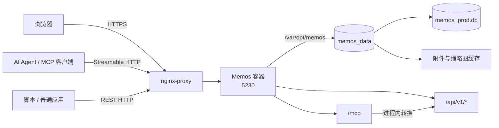
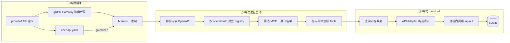
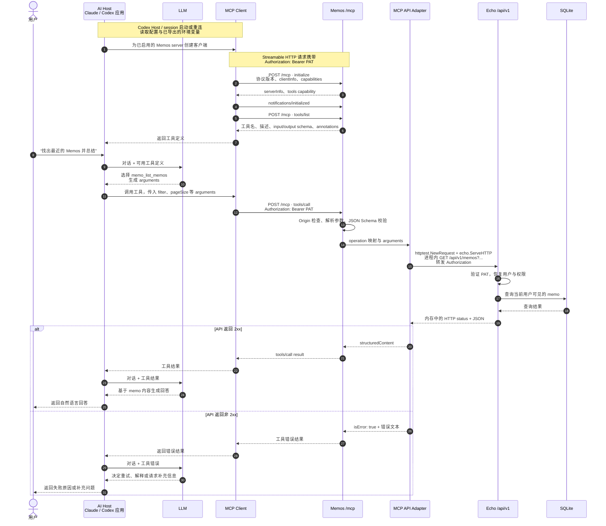

把 Memos 跑进 Docker 之后，日常使用几乎感受不到容器、数据库和接口的存在：浏览器打开网页，写下一条 memo，内容就留在时间线上。直到需要升级版本，几个原本藏在界面后面的问题才会同时出现：容器删掉后数据还在不在，SQLite 应该怎样备份，`/api/v1` 和 `/mcp` 又为什么能操作同一批 memo？

这些问题对应 Memos 的三层边界：**容器负责运行，数据卷负责持久化，API 与 MCP 负责把能力开放给不同客户端**。沿着这三层向下梳理，升级过程和 AI 接入方式就能落在同一套系统结构里。

1. Table of Contents, ordered
{:toc}

## 一个容器背后的运行、数据与接口

当前实例运行在 VPS 上，由 `nginx-proxy` 提供域名和 HTTPS 入口，Memos 容器只监听内部的 `5230` 端口。完整的单容器命令仍记录在[Docker 服务汇总](/life/2023/03/13/dockerize-nginx/#memos)中；从系统边界看，这条命令实际建立了三组关系。



运行层是可以替换的容器。`docker rm memos` 删除的是进程、镜像配置和容器可写层，不会自动删除独立的 named volume。持久化层来自下面这段挂载：

```bash
-v memos_data:/var/opt/memos
```

`memos_data` 是 Docker 管理的命名卷，`/var/opt/memos` 是 Memos 在容器内看到的数据目录。当前宿主机上的实际目录为：

```text
/var/lib/docker/volumes/memos_data/_data
```

升级前实测整个 volume 约 `233 MiB`，主要包括：

| 内容 | 实测大小 | 作用 |
|---|---:|---|
| `memos_prod.db` | 约 `138 MiB` | SQLite 主数据库，保存 memo 和实例数据 |
| `memos_prod.db-wal`、`memos_prod.db-shm` | 随运行状态变化 | SQLite WAL 模式的辅助文件 |
| `.thumbnail_cache` | 约 `95 MiB` | 图片缩略图缓存 |
| `assets/` | 当前未出现，后续可能存在 | 使用本地附件存储时保存上传文件 |

因此，**volume 不是另一种数据库，而是承载 SQLite 数据库及本地文件的持久化目录**。Memos 的[备份文档](https://usememos.com/docs/operations/backup-restore)也把数据库、附件存储和部署配置列为完整恢复所需的三类内容。

## 升级必须先围绕数据设计

Memos 会在新版本启动时自动迁移数据库。迁移让升级变得省事，也意味着旧程序未必还能理解迁移后的结构；[官方升级说明](https://usememos.com/docs/operations/upgrade)明确把升级流程概括为“备份、替换版本、启动、验证”，并要求回退时恢复升级前备份，而不是让旧版直接读取新版数据库。

### 先拉取并核对目标版本

这次升级前，容器使用可变的 `neosmemo/memos:stable` tag，但容器内实际版本仍为 `0.29.1`。拉取新 tag 不会影响正在运行的旧容器，因此可以先完成下载并检查版本，缩短后面的停机时间：

```bash
docker pull neosmemo/memos:0.30.0

docker run --rm \
  --entrypoint /usr/local/memos/memos \
  neosmemo/memos:0.30.0 version
# 0.30.0
```

生产部署改用明确的 `0.30.0`，避免下一次拉取 `stable` 时在不知情的情况下跨版本。

### 停机打包整个 volume

SQLite 正在 WAL 模式下写入时，单独复制 `memos_prod.db` 可能得到不一致的文件。手动升级频率不高，最稳妥的方案是让 Memos 短暂停机，再通过临时 BusyBox 容器只读挂载并打包整个 volume：

```bash
memos_backup_dir=/home/pichu/backups/memos
memos_backup_stamp=$(date '+%Y%m%d-%H%M%S')
memos_backup_file="memos-data-pre-0.30.0-${memos_backup_stamp}.tar.gz"

mkdir -p "$memos_backup_dir"
docker stop --time 30 memos

docker run --rm \
  -v memos_data:/data:ro \
  -v "$memos_backup_dir":/backup \
  busybox:latest \
  tar -czf "/backup/$memos_backup_file" -C /data .

# 压缩包至少要能完整读取，并记录校验值。
tar -tzf "$memos_backup_dir/$memos_backup_file" >/dev/null
sha256sum "$memos_backup_dir/$memos_backup_file"
```

这次实际生成的备份是：

```text
/home/pichu/backups/memos/memos-data-pre-0.30.0-20260831-211147.tar.gz
```

压缩后约 `231 MiB`。它能处理版本迁移失败和误操作，但仍与原数据位于同一块 VPS 磁盘；要防范磁盘损坏或整机丢失，还要把备份复制到另一台机器或对象存储。日常不停机备份则应使用 SQLite 的 `.backup` 命令获取 WAL 一致快照，并另行备份本地附件，不能定时生硬地 `cp memos_prod.db`。

### 用原 volume 重建容器

备份通过检查后，删除旧容器并用同一个 `memos_data` 创建 `0.30.0` 容器：

```bash
docker rm memos

docker run --detach --name memos \
  --restart=always \
  -v memos_data:/var/opt/memos \
  --env VIRTUAL_HOST=memos.puppylpg.top \
  --env VIRTUAL_PORT=5230 \
  --env LETSENCRYPT_HOST=memos.puppylpg.top \
  --env MEMOS_PORT=5230 \
  neosmemo/memos:0.30.0
```

Memos `0.30.0` 在没有设置 `MEMOS_INSTANCE_URL` 时会进入 private mode。当前实例保留这个行为：匿名用户不能读取 memo，登录用户和携带有效 token 的客户端仍能按账号权限访问。如果需要公开时间线、RSS 等匿名能力，应把 `MEMOS_INSTANCE_URL` 设置为实例的规范外部地址。

升级是否完成不能只看容器处于 `Up` 状态，还要验证版本、迁移日志、HTTPS 入口和访问边界：

```bash
docker exec memos /usr/local/memos/memos version
docker logs --tail 100 memos
curl -I https://memos.puppylpg.top/
curl -i 'https://memos.puppylpg.top/api/v1/memos?pageSize=1'
```

本次验收结果为版本 `0.30.0`、日志显示 `Access mode: private`、HTTPS 返回 `200`，匿名读取 memo API 返回 `401 authentication required`。

## API 是能力底座，MCP 是 Agent 适配层

服务恢复后，浏览器、脚本和 AI Agent 最终都在读写同一个 SQLite 数据库，但它们面对的接口并不相同。普通集成使用 `/api/v1` 下的 REST API；MCP 客户端连接单一的 `/mcp` 入口，通过 `tools/list` 发现工具，再通过 `tools/call` 调用工具。

| 维度 | REST API | MCP |
|---|---|---|
| 入口 | `/api/v1/...` 多个资源路径 | `/mcp` 单一协议入口 |
| 调用者 | 脚本、CLI、普通应用 | Claude、Codex 等 AI Host 内的 MCP 客户端 |
| 表达方式 | HTTP method、path、query、JSON body | 工具名、描述、JSON Schema、arguments |
| 能力范围 | 完整公开 API | 从 API 中挑选出的工具白名单 |
| 鉴权 | Bearer token | 转发同一个 Bearer token |
| 业务实现 | API service、store、SQLite | 不拥有独立 store，复用 API |

这不是两套平行实现，更不是相互依赖。**依赖方向只有 MCP → API**：REST API 可以独立工作，MCP 是建立在 API 描述和 API 路由之上的 Agent 适配层。

### OpenAPI 描述 API，但不负责注册 API

OpenAPI 只是 **REST API 的机器可读说明书**。`/api/v1` 是真正接收请求并执行读写的接口；OpenAPI 文档则记录每项接口的 HTTP method、path、参数、请求体、返回值和 `operationId`。它不监听端口、不处理请求，也不访问数据库。

Memos 也不是先写 OpenAPI，再让 OpenAPI 在运行时“注册”REST API。`v0.30.0` 以 protobuf API 定义为源头，[`buf.gen.yaml`](https://github.com/usememos/memos/blob/v0.30.0/proto/buf.gen.yaml) 在构建阶段分别生成 gRPC-Gateway 路由代码和 OpenAPI 文档。两者是从同一份定义生成的兄弟产物：前者参与实现 `/api/v1`，后者负责描述 `/api/v1`。

普通开发者可以阅读 API 文档后手写 `curl`；代码生成器可以读取 OpenAPI 生成客户端；Memos 的 MCP 实现则读取同一份 OpenAPI，把其中一部分 API 操作转换成模型能理解的工具。因此三者的关系是：

```text
REST API：真正执行业务能力
OpenAPI：对 REST API 的结构化描述
MCP：把部分 API 描述转换成工具，执行时仍复用 REST API
```

### 工具生成横跨构建、启动和请求三个阶段

“根据 OpenAPI 生成 MCP Tools”听起来像编译，但在 Memos 中实际分成三个生命周期。只有第一段属于构建产物；容器重启和每次工具调用走的是另外两段。



在**构建阶段**，生成的 `openapi.yaml` 会通过 `go:embed` 打进 Memos 二进制，所以部署 `neosmemo/memos:0.30.0` 时，不需要在 volume 里另外保存一份 OpenAPI 文件，也不需要容器启动后再联网下载它。

在**每次进程启动时**，[`service.go`](https://github.com/usememos/memos/blob/v0.30.0/server/router/mcp/service.go) 会解析二进制里内嵌的 OpenAPI，建立 operation registry，筛选白名单，再把工具名、说明、输入输出 JSON Schema 和 handler 注册到内存。容器或 Memos 进程重启后，这段初始化会自动再执行一次；它只是读取和整理已有描述，并不是重新运行代码生成器、重新编译程序或重新构建镜像。

在**每次请求时**，MCP handler 不会重新解析 OpenAPI。它直接查询启动时建立的内存映射，把 `tools/call` 的工具名和 arguments 对应到具体 API operation。由此可以得到一个更精确的结论：**接口不变时，OpenAPI 不参与单次请求的执行；但 Memos 当前实现仍需要它在每次启动时重建内存中的工具目录。**

如果一个项目选择提前把工具定义和 handler 生成为静态代码，确实可以让运行时完全不再读取 OpenAPI；但 Memos `v0.30.0` 没有采用这种“提前编译完 Tools”的实现。

例如，同一项能力在几层中的名字依次为：

| OpenAPI operation | MCP tool | 内部 REST 请求 |
|---|---|---|
| `MemoService_ListMemos` | `memo_list_memos` | `GET /api/v1/memos` |
| `MemoService_CreateMemo` | `memo_create_memo` | `POST /api/v1/memos` |
| `MemoService_UpdateMemo` | `memo_update_memo` | `PATCH /api/v1/memos/{id}` |
| `AttachmentService_CreateAttachment` | `attachment_create_attachment` | `POST /api/v1/attachments` |
| `AuthService_GetCurrentUser` | `auth_get_current_user` | `GET /api/v1/auth/me` |

`v0.30.0` 的工具白名单共有 20 项，覆盖 memo、评论、附件、reaction、relation、shortcut 和当前用户识别，但没有把全部管理 API 都交给 Agent。具体 operation 列表集中在 [`catalog.go`](https://github.com/usememos/memos/blob/v0.30.0/server/router/mcp/catalog.go)；工具名称、输入 schema、输出 schema 以及只读、幂等、破坏性提示也都从 OpenAPI operation 和少量覆盖规则生成。

### MCP 接住协议请求，业务仍由 API 执行

客户端调用 `memo_list_memos` 后，[`adapter.go`](https://github.com/usememos/memos/blob/v0.30.0/server/router/mcp/adapter.go) 会把 arguments 分解成 path 参数、query 参数和 JSON body，构造对应的 `/api/v1/...` HTTP 请求，并原样转发 `Authorization` header。

这条请求虽然有完整的 method、path、query、header、body 和 HTTP response，却没有从 VPS 发到公网域名再绕回来。源码中的具体动作是：`httptest.NewRequest` 在内存里创建请求，`httptest.NewRecorder` 接收响应，再由同一个 Echo 实例的 `ServeHTTP` 把请求直接派发给 `/api/v1` 路由。整个过程不经过 DNS、TCP、TLS 或 nginx，但 API 原有的路由、认证、授权、参数校验、错误处理和 service/store 逻辑都会照常执行。成功的 API JSON 被包装成 MCP `structuredContent`；非 `2xx` 响应则被转换为 `isError: true` 的工具结果，让模型能够看到错误并调整下一步。

同进程内当然也可以直接调用 Go 函数，但那会要求 MCP handler 自己决定应该跳过哪些 HTTP middleware、怎样注入当前用户、如何复用 REST 参数校验，以及如何把 service error 重新映射为 HTTP/MCP error。Memos 选择“**保持 HTTP 形状，但省掉网络传输**”，就能让 Web、普通 API 客户端和 MCP 走过同一套认证与业务边界。代价是多一次内存中的 JSON 编解码和路由派发，收益则是不用维护第二套容易漂移的业务入口；对个人知识库这类调用频率，这个开销通常远小于一次模型推理和公网往返。

因此，“MCP 可以独立承接请求”要分两层理解：`/mcp` 可以作为独立的网络入口接收 MCP 协议请求；但生成出来的 Tool 只是 schema、operation 映射和通用 handler，并没有复制 memo 的 CRUD 业务逻辑。Memos MCP 仍依赖同一进程中的 `/api/v1` 路由、认证、service、store 和 SQLite，不能把 OpenAPI 用完后就脱离 API 单独提供等价服务。

OpenAPI 在这里承担“单一事实源”的作用：API 字段发生变化时，MCP 工具 schema 也从同一份描述生成，避免手写两套参数定义逐渐分叉。

### OpenAPI 转 MCP 是实现选择，不是 MCP 标准要求

MCP 标准规定的是服务器向客户端暴露 `tools/list`、响应 `tools/call`，以及每个 Tool 应怎样提供名称、描述和 JSON Schema；它没有规定这些工具必须来自 OpenAPI。服务器完全可以手写并注册工具，让 handler 直接调用内部 service，也可以像 Memos 一样用 OpenAPI 包装已有 REST API。

对已经拥有大量 REST API 的服务，OpenAPI 转 MCP 能复用现有接口描述、鉴权和业务实现，是一种实用的工程路径；但它不是 MCP Server 的唯一形式，也不是协议要求的“标准编译步骤”。Memos 还在自动转换之上增加了 20 项工具白名单和少量 schema 覆盖规则，因此也不是把整份 OpenAPI 不加选择地一键变成 MCP。

## MCP 客户端的一次完整调用

MCP 把 REST 操作改写成模型理解的工具，但工具不会凭空执行。一次完整调用同时涉及用户、AI Host、Host 内的 MCP Client、Memos MCP handler、API 路由和数据库。

调用的起点是 Host 中的一条 MCP server 配置。当前实例处于 private mode，因此 Codex 连接 `/mcp` 时要随请求携带单独创建的 PAT。PAT 的值不直接写进配置，而是让 Codex 从本机环境变量读取。当前的完整配置如下：

```toml
# ~/.codex/config.toml
[mcp_servers.memos]
url = "https://memos.puppylpg.top/mcp"
bearer_token_env_var = "MEMOS_MCP_PAT"
enabled = true
default_tools_approval_mode = "writes"
startup_timeout_sec = 20
tool_timeout_sec = 60
enabled_tools = [
  "auth_get_current_user",
  "memo_list_memos",
  "memo_get_memo",
  "memo_list_memo_comments",
  "memo_list_memo_attachments",
  "memo_list_memo_reactions",
  "memo_list_memo_relations",
  "attachment_list_attachments",
  "attachment_get_attachment",
  "shortcut_list_shortcuts",
  "memo_create_memo",
  "memo_update_memo",
  "memo_create_memo_comment",
  "memo_set_memo_attachments",
  "memo_upsert_memo_reaction",
  "memo_set_memo_relations",
  "attachment_create_attachment",
]
disabled_tools = [
  "memo_delete_memo",
  "memo_delete_memo_reaction",
  "attachment_delete_attachment",
]
```



这段时序已经覆盖了 MCP Client 从初始化、发现工具到一次工具执行的完整主链路。省略的是分页继续调用、工具列表缓存、超时、重连和 Host 的审批 UI，它们不会改变这条核心依赖关系。

### 初始化发生在 Codex 会话准备阶段

配置了一个启用的 MCP server 后，不需要等用户第一次说“调用 Memos”，Codex 才临时创建客户端。Codex 会在本地 Host/session 启动或需要重建 MCP 连接时，自动初始化已启用的 server，并在为模型准备工具目录时完成工具发现。[Codex 的开源说明](https://github.com/openai/codex/blob/main/codex-rs/README.md)把它概括为客户端在 startup 连接 MCP server；[Codex MCP 文档](https://developers.openai.com/codex/mcp)也要求桌面端保存配置后执行 Restart，并说明 Codex 会读取 server 在 initialization 中返回的 instructions。

因此，“一打开 Codex 就初始化”作为日常理解基本成立，但更准确的触发对象是 **Codex 的本地 Host/session 生命周期**，不是窗口绘制本身：同一个已运行 Host 可以复用已建立的客户端和工具目录；新 Host、新 session、配置刷新、连接失效或显式重启可能重新初始化。单次 `tools/call` 不会从头重复 `initialize` 和 `tools/list`。

Memos `0.30.0` 的 stateless 是另一层概念：Memos server 不要求多次 HTTP 请求绑定一份服务端 session 状态，但 MCP Client 仍要完成协议协商和工具发现。stateless 并不等于没有 `initialize`。

**连接与发现阶段**先执行 `initialize`，协商协议版本和 capability。Memos `0.30.0` 只声明 tools，不提供旧版 MCP 的 prompts 和 resources；随后 `tools/list` 把工具名称、说明和 JSON Schema 交给 Host。Memos 使用 Streamable HTTP，但服务端配置为 stateless 和 JSON response：协议握手仍然存在，服务端不依赖跨请求 session 保存调用状态。

**对话与执行阶段**由 Host 把用户消息和工具定义一起交给模型。模型输出工具名和 arguments 后，Host 内的 MCP Client 才真正发送 `tools/call`。也就是说，Memos MCP server 不会自动看到整段聊天记录；它只收到这次工具调用所需的参数和认证信息。这个边界与 MCP 的[Host—Client—Server 架构](https://modelcontextprotocol.io/specification/2025-06-18/architecture)一致：对话编排和用户确认属于 Host，Memos server 只负责聚焦的数据能力。

## PAT 接入要同时处理配置、进程环境和数据权限

REST API 和 MCP 复用同一种 token 与用户权限，因此 MCP 并不会天然获得额外权限，也不会天然更安全。PAT 安全至少有三层：值放在哪里、哪个进程能得到它，以及它代表的账号可以读写哪些数据。只解决其中一层，很容易得到“配置文件里没有 token，所以 Agent 看不到秘密”的错误安全感。

### 用环境变量注入，但不要把环境变量当保险箱

[Codex MCP 配置](https://developers.openai.com/codex/mcp)中的 `bearer_token_env_var` 保存的是**环境变量名**。发起 Streamable HTTP 请求时，Codex 从本机环境读取对应值，再把它放进 `Authorization: Bearer ...`；`config.toml`、普通工具参数和文章里都不需要出现 PAT 原文。

```zsh
# ~/.zshrc
export MEMOS_MCP_PAT='memos_pat_替换为真实值'
```

写完后要让新的 shell 重新加载配置，并完整重启 Codex，使新的本地 Host 得到这份环境。检查时只判断变量是否进入子进程，不要把值打印到终端或 Agent 上下文：

```zsh
source ~/.zshrc
printenv MEMOS_MCP_PAT >/dev/null && echo 'MEMOS_MCP_PAT is exported'
```

这里最容易漏掉的恰好是 `export`。下面两行在 zsh 中不是一回事：

```zsh
MEMOS_MCP_PAT='memos_pat_...'         # 仅当前 shell 的 shell variable
export MEMOS_MCP_PAT='memos_pat_...'  # 当前 shell + 后续子进程的 environment
```

漏掉 `export` 时，手写 `curl` 仍可能成功：shell 会先展开命令中的 `$MEMOS_MCP_PAT`，再把展开后的 header 作为普通命令参数交给 `curl`。这只证明**当前 shell 知道值**，不证明另一个进程能通过环境读取它。Codex MCP Host 是独立进程，只能看到自己启动时继承或显式加载的 environment；已经运行的进程也不会因为 `.zshrc` 刚被编辑就自动获得新值。这就解释了“CLI 能用、Codex MCP 却拿不到 token”的表面矛盾。

这台 Mac 上在补上 `export` 并重启 Codex 后恢复正常。一般情况下还要注意，`.zshrc` 属于 zsh 启动文件，从 Dock/Finder 启动的 GUI 应用不必然继承交互式 shell 的环境；如果某个桌面版本没有主动加载 shell 环境，应从已加载变量的终端启动应用，或改用系统级凭据注入方式。

环境变量的收益是避免 PAT 出现在 Codex 配置和普通 MCP 调用参数中，**不是对本机 Agent 建立不可突破的秘密边界**。拥有同一用户身份和终端执行权限的 Agent，理论上仍可能读取进程环境或 shell 配置。因此要使用专门为 MCP 创建、可随时撤销、有有效期的 PAT，而不能把高价值主密钥仅靠环境变量“藏”起来。[Memos 安全文档](https://usememos.com/docs/configuration/security)也建议每个 integration 使用独立 PAT、检查 last-used time，并在不需要永久凭据时设置过期时间。

### PAT 代表账号，不会自动缩成 MCP 最小权限

[Memos MCP 文档](https://usememos.com/docs/integrations/mcp)写明，工具调用复用 Web App 的 REST API 和相同权限：token identifies you，工具能看到和修改的内容与该账号一致。Memos 当前没有给 PAT 单独配置“只读”“不能看 PRIVATE”或“只能访问某个 tag”的 scope。

这也解释了一个看似反直觉的现象：memo 即使标记为 `PRIVATE`，自己的 PAT 仍然可以读取。`PRIVATE` 的含义是[只有 memo 所有者可读](https://usememos.com/docs/usage/sharing)，而 owner PAT 在服务端恢复出来的身份正是所有者本人。它不是鉴权绕过，也不是 MCP 获得了额外权限。

Codex 里的工具白名单、禁用 delete 工具和 `default_tools_approval_mode = "writes"` 仍然有价值：它们缩小模型可选择的动作，并让写操作先经过确认。但这些是**客户端侧的工具暴露和审批策略**，不会改变 PAT 在 Memos 服务端的权限。换一个 REST 客户端携带同一枚 PAT，账号原本能做的操作仍然能做。

### PRIVATE 过滤是默认护栏，不是硬隔离

如果日常约定是“除非明确授权，否则 Agent 不读 PRIVATE memo”，每次列表或搜索都应该把限制放进服务端 CEL filter，而不是先拉回全部内容再让模型过滤：

```text
visibility != "PRIVATE"
```

这个条件要与日期、作者、关键词等其他条件用 `&&` 合并。按 ID 读取 memo、附件、评论、关系或 reaction 前，也应先在不接触 private 数据的前提下确认目标 memo 不是 `PRIVATE`。本地 `AGENTS.md` 可以固化这条默认行为，减少误调用；但它仍是 Agent 执行策略，而不是 Memos 强制的权限 scope，因此不能用来保护真正的密钥。

尤其不要把可复用 token 或 key 保存在**同一账号的 PRIVATE memo** 中，再把该账号 PAT 交给 Agent。对浏览者而言它是 private，对这枚 PAT 而言却是自己的正常数据；一旦列表或搜索漏掉 filter，秘密就可能进入工具结果和模型上下文。发生这种情况时应停止继续读取、立即轮换凭据，并检查调用记录。

更稳妥的边界从弱到强依次是：

1. 每个集成使用独立、可过期、易撤销的 PAT；Codex 只通过环境变量名引用它；
2. 禁用删除工具，对写操作启用审批，并默认给 list/search 加 `visibility != "PRIVATE"`；
3. 把真正的 secret 放进密码管理器或专用 secret store，不与 Agent 可读的知识内容混放；
4. 需要服务端硬隔离时，为 Agent 建独立的 Memos 账号，或在 Memos 前增加受限代理，只暴露明确 allowlist 中的 memo 和操作。

脚本需要精确控制 HTTP method、批量处理数据或调用 MCP 白名单之外的能力时，直接使用 `/api/v1` 更合适；希望模型根据自然语言选择操作、读取结果再继续推理时，使用 `/mcp` 更自然。二者最终汇入同一条 API service、store 和 SQLite 链路，所以备份保护的数据、账号限制的权限以及升级迁移的数据库始终只有一套。
