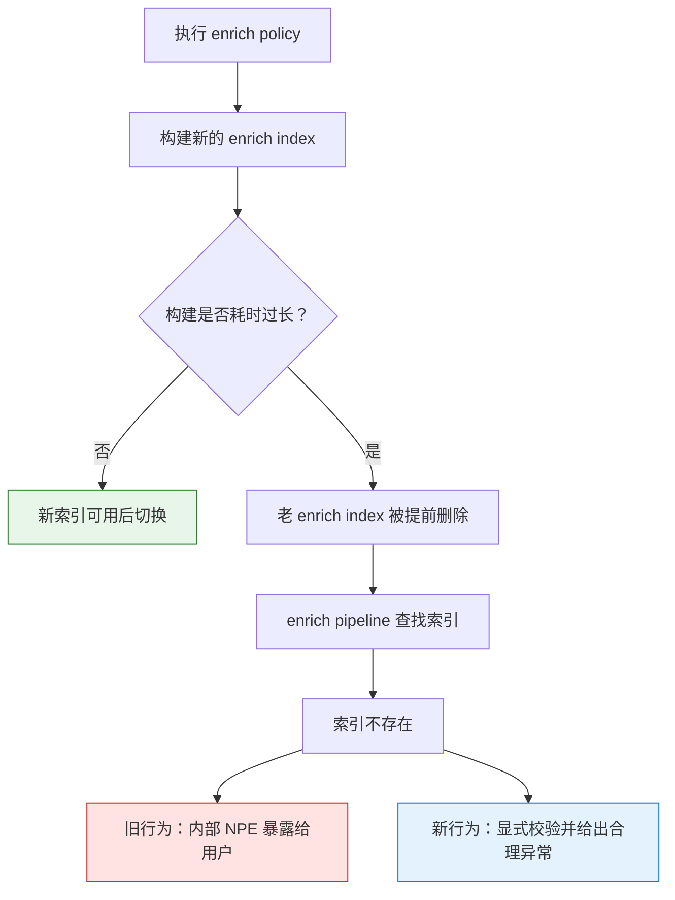
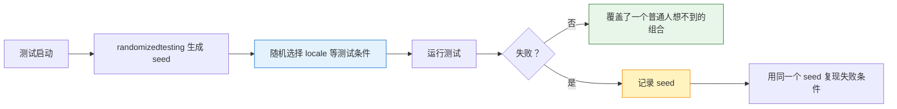

- [my issue](https://github.com/elastic/elasticsearch/issues?q=is%3Aissue+author%3A%40me+)
- [my PR](https://github.com/elastic/elasticsearch/pulls?q=is%3Apr+author%3A%40me+)

1. Table of Contents, ordered
{:toc}

## [#99604](https://github.com/elastic/elasticsearch/pull/99604)

当时用的 Elasticsearch 7.17.6 有[一个 bug](https://github.com/elastic/elasticsearch/issues/85221)：在 enrich index 过大、enrich 时间过长的时候，新的 enrich 索引还没生成好，老的 enrich 索引就被删掉了。结果系统里的 enrich pipeline 再去查索引时，直接找不到对应的 enrich 索引。

这个问题分两层：

| 层次 | 要解决的问题 | 处理方式 |
|------|--------------|----------|
| enrich 策略本身 | 新索引没准备好，老索引先被删掉 | 在 [#85221 的修复讨论](https://github.com/elastic/elasticsearch/issues/85221#issuecomment-1488108528)里处理 |
| 用户可见异常 | 内部 NPE 直接抛给用户，用户摸不着头脑 | 本 PR 主动做 NPE 校验，抛出更合理的异常 |

这个 PR 的重点不是“把底层 bug 全部修掉”，而是把异常边界收住：用户看到的应该是“enrich 索引找不到了”，而不是一个脱离上下文的内部 NPE。

> 测试用例不错，展示了enrich cache的作用。
{: .prompt-tip }

## [#105823](https://github.com/elastic/elasticsearch/pull/105823)

这次修改的内容很小，但问题本身很有意思。之前一直好奇 Java 的中文异常信息到底是怎么打出来的，虽然知道和 locale 相关，但具体要怎么调整并不清楚。这次正好趁着这个问题搞明白了：真正起作用的是 `LANGUAGE` 环境变量。

另一个意外收获，是这个问题引出了对[随机 locale](https://github.com/elastic/elasticsearch/issues/105822#issuecomment-1966829814)的讨论。虽然最终证明它和本次问题并不相关，但顺手了解到了 Elasticsearch 会故意使用随机 locale 进行测试，**以应对各种可能但又不太可能穷举的情况**。

这正是 [randomizedtesting](https://github.com/randomizedtesting/randomizedtesting) 被引入的[意义](https://github.com/randomizedtesting/randomizedtesting/wiki/Core-Concepts)：测试不是只跑维护者想得到的路径，而是让框架帮忙制造一些“可能发生、但人工很难系统穷举”的环境组合。

> 通过seed可以复现某次失败的随机条件，很有用！
{: .prompt-tip }
