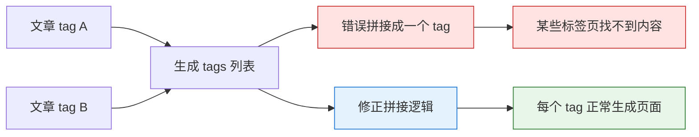

1. Table of Contents, ordered
{:toc}

## MyBatis

### [#2836](https://github.com/mybatis/mybatis-3/pull/2836)

这个 PR 修正了一个有误导性的中文文档翻译。读中文文档的时候半天没看明白，换成英文就通顺了。

这类改动不复杂，但很有价值：文档翻译一旦偏掉，读者会怀疑自己理解错了，而不是第一时间怀疑文档错了。顺手修掉，后面的人就少绕一圈。

## docsy-jekyll

在使用 Chirpy 之前，我用的是 docsy-jekyll。这两次贡献都来自真实使用时踩到的坑：一个是标签页生成问题，一个是资源加载问题。

### [#76](https://github.com/vsoch/docsy-jekyll/pull/76)

标签页总有某些标签找不到，后来不能忍了，看了看源码，发现是拼接 tag 的时候，有两个标签被错误拼接成一个了。

### [#26](https://github.com/vsoch/docsy-jekyll/pull/26)

这个 PR 处理的是 jQuery 加载问题。问题本身倒不复杂，复杂的是它出现的原因非常现实：

> 唉，这尴尬的墙啊……你墙 jQuery 干嘛……
{: .prompt-tip }

所以这次修复的核心不是炫技，而是让站点资源加载更可靠。博客这种东西，页面能打开是第一位的，别让一个外部资源把整页交互都拖没了。
