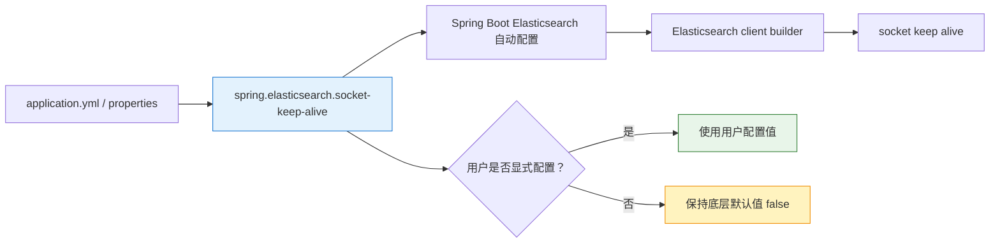

- [my issue](https://github.com/spring-projects/spring-boot/issues?q=is%3Aissue+author%3A%40me+)
- [my PR](https://github.com/spring-projects/spring-boot/pulls?q=is%3Apr+author%3A%40me+)

1. Table of Contents, ordered
{:toc}

## [#32051](https://github.com/spring-projects/spring-boot/pull/32051)

这个 PR 为 Spring Boot 增加了配置参数：`spring.elasticsearch.socket-keep-alive`，用于启用 Elasticsearch client 和 server 之间的 socket keep alive。直觉上它像是一个很有用的开关，因为长连接场景里，连接是否能被及时探活直接影响客户端和服务端之间的稳定性。

不过 Spring Boot 的自动配置有一个很重要的原则：**自动配置不应该偷偷改变底层组件的默认行为**。所以即便这个配置很有用，自动配置出来的 client 依然要和底层参数初始值保持一致，默认值仍然是 `false`。

这次改动本身不大，但它把 Spring Boot 自动配置的边界讲得很清楚：**可以暴露开关，让用户更容易配置；但不能因为维护者觉得某个值“更合理”，就替用户改掉默认语义。**

> 测试用例不错，展示了如何方便地在spring系统中增加一个property value。
{: .prompt-tip }
