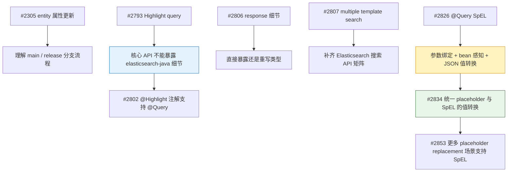
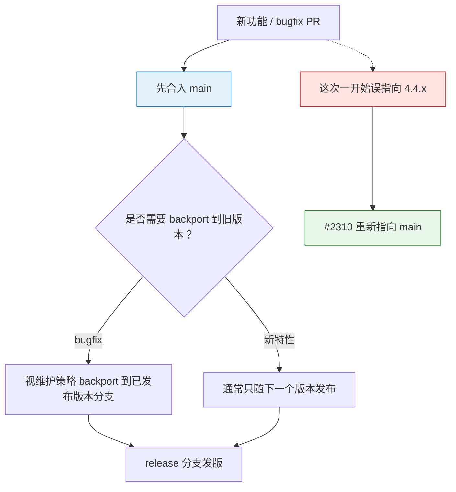
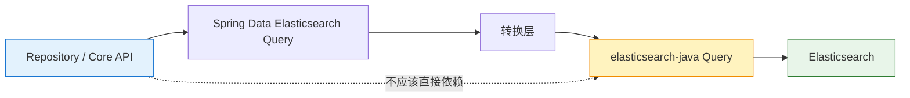
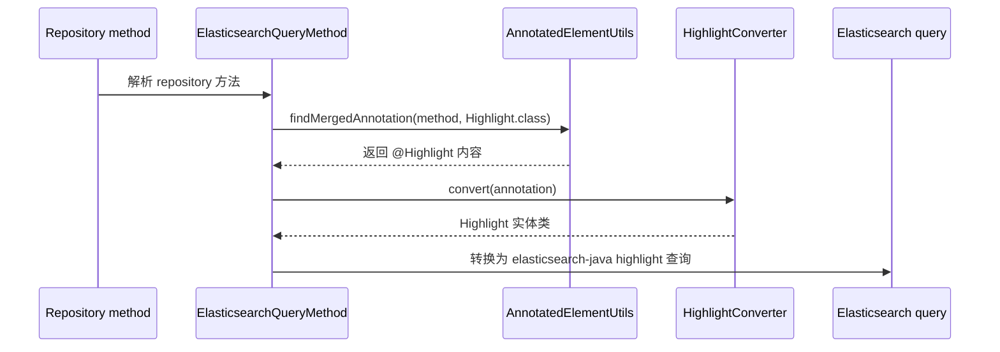
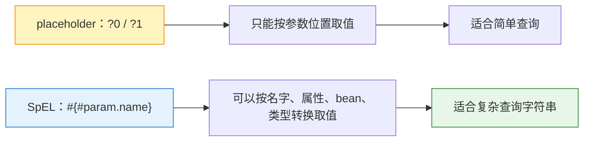
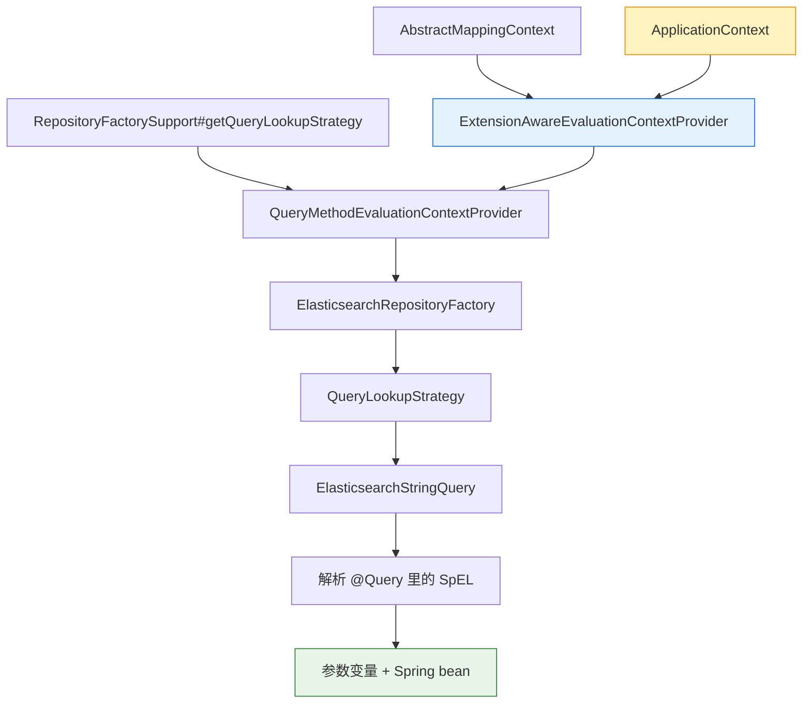
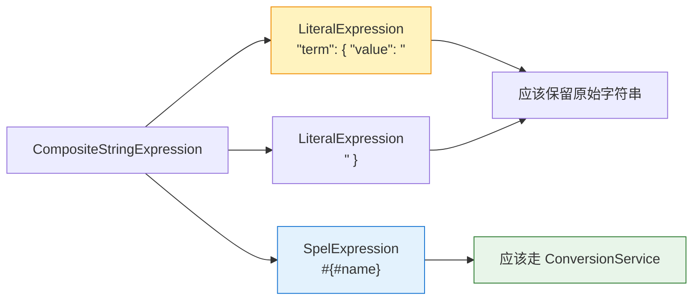
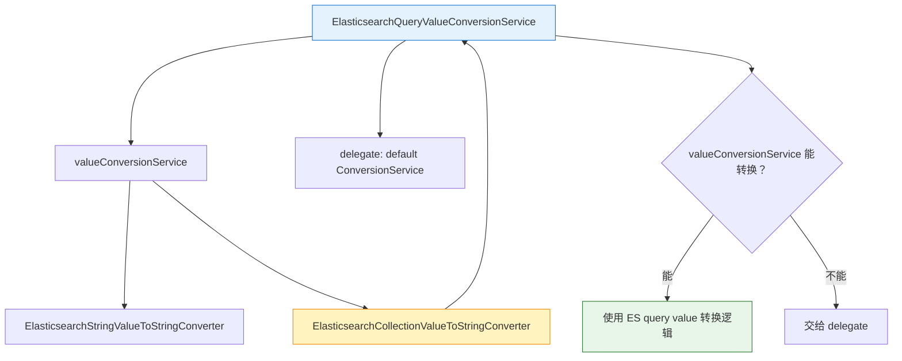
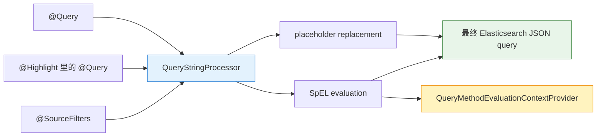

- [my issue](https://github.com/spring-projects/spring-data-elasticsearch/issues?q=is%3Aissue+author%3A%40me+)
- [my PR](https://github.com/spring-projects/spring-data-elasticsearch/pulls?q=is%3Apr+author%3A%40me+)

1. Table of Contents, ordered
{:toc}

这几次 Spring Data Elasticsearch 的贡献，大体可以分成三条线：补 API、补 Repository 注解能力，以及把查询字符串处理逻辑往 Spring Data 的公共机制上靠。



## [#2305](https://github.com/spring-projects/spring-data-elasticsearch/pull/2305)

这个 PR 增加了一个根据 entity 属性直接更新数据的方法，方便做更新操作。

不过它更值得记住的地方，是我把 target branch 设置错了：指向了 `4.4.x`，而不是 `main`。刚开始对开源项目的发布流程不太懂，后来看多了慢慢就知道了：通常所有代码先合到 `main`，然后再视情况 backport 到不同的维护分支。



所以 [#2310](https://github.com/spring-projects/spring-data-elasticsearch/pull/2310) 重新指向了 `main`。这类小乌龙很适合作为第一次参与大型开源项目的提醒：PR 的代码重要，目标分支也很重要。

## [#2793](https://github.com/spring-projects/spring-data-elasticsearch/pull/2793)

这个 PR 为 highlight 增加 query 支持，让 highlight 部分可以使用和查询部分不同的 query。

一开始我使用的是 elasticsearch-java 里的 query 类型。到了 code review 才了解到，[Spring Data Elasticsearch 的核心类要屏蔽 Elasticsearch 底层细节](https://github.com/spring-projects/spring-data-elasticsearch/pull/2793#discussion_r1421031379)，不能直接把 elasticsearch-java 的类型暴露出来，因为核心类还要被别的项目依赖。



重新构思之后，这里和 query 概念对应的应该是 Spring Data Elasticsearch 自己的 query，所以改成了项目内的抽象。两个 query 之间的转换是核心常用操作，项目里已经有相关方法，直接拿来用就可以了。

> 测试用例不错，展示了索引数据的index流程。
{: .prompt-tip }

## [#2802](https://github.com/spring-projects/spring-data-elasticsearch/pull/2802)

这个 PR 为 `@Highlight` 注解增加 `@Query` 支持。

逻辑上它承接 [#2793](https://github.com/spring-projects/spring-data-elasticsearch/pull/2793)：既然底层 highlight 已经支持 query，那么 `@Highlight` 注解也应该提供对应入口。这样用户就可以继续使用 Spring Data repository 的方式，通过注解完成配置。

实际实现比想象中复杂，因为一开始没注意到：在注解里定义 string query 时，是可以支持参数替换的。项目里已经有了相关参数替换代码，这里新建了 `HighlightConverter`，把这一流程比较简洁地封装起来。因为参数替换和单个请求的参数相关，所以 highlight converter 不像其他 converter，不是单例，每一个请求都要实例化一个。

第一次注意到 Spring Data 里可以直接用 `@NonNullApi` 给整个 package 默认标注 nonnull，允许为 null 的地方需要手动设置 `@Nullable`。这对开发流程有非常大的帮助，所有 nullable 的地方如果忘记了判断，编码时 IDE 直接就提示了。

`@Highlight` 注解作用到查询代码的路径大致是这样：



关键点是生成 `ElasticsearchQueryMethod` 时，要从方法上获取 `@Highlight` 注解内容，可以使用 Spring Core 里的 `AnnotatedElementUtils#findMergedAnnotation`，非常简单：

```java
this.highlightAnnotation = AnnotatedElementUtils.findMergedAnnotation(method, Highlight.class);
```

> 测试用例不错，展示了如何以spring-data repository的方式使用spring-data-elasticsearch。
{: .prompt-tip }

## [#2806](https://github.com/spring-projects/spring-data-elasticsearch/pull/2806)

这个 PR 在 Spring Data Elasticsearch 的返回里添加了更多 Elasticsearch response 细节，比如 shard 统计信息。

需求本身比较简单，但实现时遇到一个尴尬问题：shard 统计信息里有很多自定义类，这些类[究竟是要重写，还是直接暴露 elasticsearch-java 的类型](https://github.com/spring-projects/spring-data-elasticsearch/pull/2806#discussion_r1436214492)？

| 方案 | 好处 | 问题 |
|------|------|------|
| 直接暴露 elasticsearch-java 类型 | 省事，少写重复类 | 会把底层 client 细节泄漏到 Spring Data Elasticsearch API |
| 在 Spring Data Elasticsearch 重写类型 | API 边界更干净 | 代码显得有些重复，也更累 |

维护者也承认了这个[窘境](https://github.com/spring-projects/spring-data-elasticsearch/pull/2806#discussion_r1436548128)，并表示 elasticsearch-java 里的类是使用脚本生成的，但我们的类不是啊！所以不太能复用，显得有些丑。我也在 [elasticsearch-specification](https://github.com/puppylpg/elasticsearch-specification/tree/main/specification) 里注意到了这一情况。

最终还是选择了类重写。好在 Elasticsearch 里的 `ErrorCause` 是复用的，所以这里也可以借助之前的代码，稍稍省些力。

## [#2807](https://github.com/spring-projects/spring-data-elasticsearch/pull/2807)

这个 PR 为项目添加 [multiple template search](https://www.elastic.co/guide/en/elasticsearch/reference/current/search-template.html#run-multiple-templated-searches) 支持。

之前项目已经支持了 [search](https://www.elastic.co/guide/en/elasticsearch/reference/current/search-search.html)、[msearch](https://www.elastic.co/guide/en/elasticsearch/reference/current/search-multi-search.html)、[template search](https://www.elastic.co/guide/en/elasticsearch/reference/current/search-template-api.html)，但还没有支持 [multiple template search](https://www.elastic.co/guide/en/elasticsearch/reference/current/multi-search-template.html)。

| 是否模板查询 | 单个请求 | 多个请求 |
|--------------|----------|----------|
| 否 | `search` | `msearch` |
| 是 | `template search` | `multiple template search` |

一开始我看到 `SearchTemplateQuery` 是 Spring Data Elasticsearch 的 query 接口子类之一，还以为 [search template](https://docs.spring.io/spring-data/elasticsearch/reference/elasticsearch/misc.html#elasticsearch.misc.searchtemplates) 是 Spring Data Elasticsearch 自己创建的独立功能，看了文档才发现它是 Elasticsearch 的能力。

比较麻烦的是，elasticsearch-java 中这四个请求基本是独立的，需要使用独立方法发起请求。所以在 Spring Data Elasticsearch 里，要根据请求具体类型，选择四个方法之一。而且虽然 API 里 template search 的 request body 和 multiple template search 的 body 部分一致，但 elasticsearch-java 实际提供的是不同的类，所以代码并不能直接复用。

好在研究完 elasticsearch-java 提供的代码后，我发现 `MsearchRequest` 和 `MsearchTemplateRequest` 在 request body 的 header 部分共用了 `MultisearchHeader`，构造 multiple template search 时简单了一些。body 部分虽然不同，但 multiple template search 的 body 参数较少，直接参考 template search 的 body 构建即可，不算麻烦。

返回结果部分更省心：elasticsearch-java 的 `MsearchResponse` 和 `MsearchTemplateResponse` 共用了 `MultiSearchResponseItem`，直接避免了再来一次 hits 遍历和转型，大大节省了工作量。

> 测试用例不错，展示了完整的以spring-data repository的方式使用spring-data-elasticsearch的流程。同时也展示了在spring-data-elasticsearch里构建集成测试时，测试索引防重名的办法。
{: .prompt-tip }

## [#2826](https://github.com/spring-projects/spring-data-elasticsearch/pull/2826)

这个 PR 为 `@Query` 添加 [SpEL](https://docs.spring.io/spring-framework/reference/core/expressions.html) 支持！

> 目前为止改动最大的一处，实现大概花了完整的两天时间，后续修复一些测出来的bug又花了半天。

Spring Data Elasticsearch 的 `@Query` 支持 string query，query 可以[使用 placeholder 绑定参数](https://docs.spring.io/spring-data/elasticsearch/reference/elasticsearch/repositories/elasticsearch-repository-queries.html#elasticsearch.query-methods.at-query)，从而实现不同参数的查询。这种绑定方式比较简单，只能通过 `?0` / `?1` 来绑定第 N 个业务型参数（`Pageable`、`Sort` 等不算）。

如果能够以 SpEL 的方式访问参数，就会方便很多。SpEL 不只可以拿到参数本身，还支持访问参数属性、通过 SpEL 语法做类型转换等更高阶的用法，这会让 query 方法支持的参数类型更灵活。

### 背景：placeholder 不够用了



为了给 query 增加 SpEL 支持，我先研究了一下 [SpEL 的解析器](https://docs.spring.io/spring-framework/reference/core/expressions/evaluation.html)。之前 Spring 用得比较多，所以对 SpEL 并不陌生，经常拿来对 bean 做赋值操作。但也仅限于此，并没有深入研究 SpEL 的解析和计算流程。

这里真正需要理解的是 `Expression`、`ExpressionParser` 和 `EvaluationContext`，以及一些更高阶的 SpEL 语法，包括 **[variable 访问 `#`](https://docs.spring.io/spring-framework/reference/core/expressions/language-ref/variables.html)、[bean 访问 `@`](https://docs.spring.io/spring-framework/reference/core/expressions/language-ref/bean-references.html)、[属性访问 `.`](https://docs.spring.io/spring-framework/reference/core/expressions/language-ref/properties-arrays.html)、[集合转换 `.![]`](https://docs.spring.io/spring-framework/reference/core/expressions/language-ref/collection-projection.html)、[表达式模板](https://docs.spring.io/spring-framework/reference/core/expressions/language-ref/templating.html)** 等。

除此之外，由于 Spring Data JPA [很早](https://spring.io/blog/2014/07/15/spel-support-in-spring-data-jpa-query-definitions/)就在查询里[支持 SpEL](https://docs.spring.io/spring-data/jpa/reference/jpa/query-methods.html#jpa.query.spel-expressions) 了，所以我还找了 [Spring Data JPA](https://github.com/spring-projects/spring-data-jpa) 和它的 [example](https://github.com/spring-projects/spring-data-examples)，希望能得到一些借鉴。深入分析后才发现，Spring Data JPA 的实现比想象中复杂很多：它要支持多种 QL，所以用了多种正则对 `@Query` 里的 string 进行匹配，判断合适的 SpEL 替换位置。我们只需要支持 Elasticsearch JSON query，没必要这么复杂。

### 第一步：参数怎么进入 SpEL

接下来开始构建 Spring Data Elasticsearch 里的 SpEL 支持。一开始想得比较简单：直接对 `@Query` 里的语句做 SpEL evaluation 即可。比较困难的地方在于：**怎么把查询方法参数绑定到 SpEL 的 `EvaluationContext` 上？**

这一点参考了 Spring Data JPA 的实现。Spring Data Commons 提供了 `QueryMethodEvaluationContextProvider#getEvaluationContext` 方法，接收 `Parameters` 信息和对应的参数值数组 `Object[]`，之后 Spring Data Commons 会自动把它们一个个绑定为 SpEL `EvaluationContext` 里的变量。

在 Spring Data Elasticsearch 里，这些参数信息都可以从 `ElasticsearchParametersParameterAccessor` 拿到，所以实现起来并不难。我先在 `ElasticsearchStringQuery` 里自己创建了一个 `QueryMethodEvaluationContextProvider` default 实例，用来完成参数绑定。

### 第二步：怎么让 SpEL 看见 bean

上面的做法是可以的，**但它只能让 SpEL 从参数里取到信息**。按理说，既然项目基于 Spring，那么也应该支持从 Spring context 里获取 bean 信息。问题变成了：**怎么和 bean factory 扯上关系？**

Spring Data Elasticsearch 之前已经有过使用 SpEL 的实现，且可以支持获取 bean 信息，只不过局限在 [`@Document` 注解对 index name 的处理](https://www.sothawo.com/2020/07/how-to-provide-a-dynamic-index-name-in-spring-data-elasticsearch-using-spel/) 上。所以看看它是怎么获取 `QueryMethodEvaluationContextProvider` 的，我们也找到同样的 provider 就行了。

深入代码后发现，这个 provider 来自 Commons 里的 `BasicPersistentEntity`。provider 默认和我手动创建的一样，也是 `EvaluationContextProvider.DEFAULT`。但如前所述，这个 default context 显然不具备解析 bean 的能力。再仔细看，才发现它还提供了一个 setter，可以由外部重新注入 provider……

原来 default context 在运行时被替换掉了。真正被 set 进来的是 `ExtensionAwareEvaluationContextProvider`，在 `AbstractMappingContext` 里完成。由于该类是个 `ApplicationContextAware`，所以它可以拿到 `ApplicationContext`。bean factory 这不就来了嘛！这个 bean factory 会被设置到 provider 里，从而 provide 一个具有 bean 感知能力的 `EvaluationContext`。



接下来的问题是：**怎么把这样的 provider 传给 `ElasticsearchStringQuery`，让它去解析 SpEL？** `ElasticsearchStringQuery` 是由 `ElasticsearchRepositoryFactory` 里的 `QueryLookupStrategy` 创建的，而在 Commons 里，它的父类 `RepositoryFactorySupport` 的 `getQueryLookupStrategy` 方法已经提供了 `QueryMethodEvaluationContextProvider` 参数。它正是我们想要的、带有 bean factory 信息的 provider。

只不过之前 Spring Data Elasticsearch 并不支持在 `@Query` 里添加 SpEL，所以这个由 Commons 传过来的参数也没有用上。现在就可以用了。

搞完上面的东西，基本上 SpEL 功能就算实现了。虽然过程很复杂，但最终写出来的代码并不多，加上测试用例也就一百多行。时间主要花在了对 Spring Data Commons 代码的理解上。

说实话，想理解 Commons 的逻辑还是有点儿费劲，而且非常难找 Spring Data Commons 本身的资料，找到的都是 Spring Data 一众子项目。不过它之所以是一众 Spring Data 的父项目，自然是提供了不少公共性支持，比如原始参数的解析获取、参数在 SpEL context 里的绑定等。

### 第三步：JSON 查询值怎么正确转义

跑测试的时候，才发现事情并没有结束。

项目里有一个单元测试专门用来测试 Spring Data Elasticsearch 生成的原始 Elasticsearch JSON query 是否符合预期。仿照其中几个用例加了关于 SpEL 的单元测试后，我发现当前实现的 SpEL 替换结果并不总是符合 Elasticsearch 查询语法。

比如 `"term": { "value": "#{#name}" }`。**在查询里，`#{#name}` 解析后的值被放在双引号里，如果 `name` 变量的值本身带引号**，如 `hello "world"`，SpEL 解析完就会变成 `"term": { "value": "hello "world"" }`，这不符合 Elasticsearch JSON query 语法。

字符串里原有的引号应该被转义，变成 `"term": { "value": "hello \"world\"" }`。但是显然 SpEL 不知道这一点。

再看看原有已支持的占位符（`?0`）参数绑定功能，才意识到当初他们实现该功能时也遇到了同样的问题，所以对参数里碰到的引号手动多加了一层转义：

```java
parameterValue = parameterValue.replaceAll("\"", Matcher.quoteReplacement("\\\""));
```

而这些单元测试，也正是针对这一功能的。

所以我们**还需要干预 SpEL 计算值的过程**，让 string 里的引号多一层额外转义。当然 collection 也有类似问题，因为 JDK 默认的 `Collection#toString` 不满足 Elasticsearch JSON query 对集合值（比如 `terms` 查询会用到集合值）的定义：

- 空 collection 要转为 `[]`；
- 如果里面的值是 string 类型，**转换后的字符串要带上引号**，比如 `["a", "b"]`。由于这个引号，string 里原本的引号要被转义，比如 `["hello \"world\""]`。这个转换最好由刚刚说的 string 转换器处理，而不是 collection 转换器；
- 非 string 类型直接处理成 string 即可，**这样的值不需要被引号包围**，比如 `[1, 2, 3]`。

**SpEL 是怎么计算值的？**继续回到上面的 provider，看看它提供的是什么样的 `EvaluationContext`。`ExtensionAwareEvaluationContextProvider#getEvaluationContext` 得到的是 `StandardEvaluationContext` 实例，它比 `EvaluationContext` 接口多了两个非常重要的方法：

- `setBeanResolver`：bean resolver 接受一个 bean factory，从而完成上述在 SpEL 里查找 bean 的功能；
- `setTypeConverter`：接受一个 type converter，从而完成 SpEL 的值转换功能。

第二个方法涉及的 `TypeConverter` 正是我们需要的。Spring Expression 在实现 SpEL 功能时，会委托给 Spring 的 `ConversionService`。Conversion service 是 Spring 内置的一套通用值转换机制，里面注册了一堆 `Converter` 和 `GenericConverter`，用于完成任意两种类型的值转换。

**Elasticsearch JSON query 里主要就两类值：单值、多值。其中单值包括 string 和非 string，多值就是 collection。**

| 值类型 | 示例 | 目标输出 | 处理方式 |
|--------|------|----------|----------|
| 单值非 string | `1` | `1` | 保持原值，默认 integer 转换器即可 |
| 单值 string | `hello "world"` | `hello \"world\"` | 自定义 string 到 string 的转换器 |
| 多值 collection | `["a", "b"]` | `["a", "b"]` | 自定义 collection 到 string 的转换器 |

> 如果集合里面的元素是string，只要继续调用`ConversionService`进行转换，自然会使用上述自定义的字符串到字符串的转换器，不用collection转换器操心字符串的转义问题。

所以才有了本次 MR 里的 `ElasticsearchStringValueToStringConverter` 和 `ElasticsearchCollectionValueToStringConverter` 两个 converter。但是因为这两个 converter 靶向 Elasticsearch JSON query，所以这个 `ConversionService` 只能在解析 `@Query` 里的 SpEL 这一场景使用，不能通用。

### 第四步：literal expression 不能被 converter 误伤

最后，经过 SpEL 解析后的 `@Query` string 结果依然有问题。

比如 `"term": { "value": "#{#name}" }` 会被解析为 `\"term\": { \"value\": \"hello \"world\"\" }`。除了 `hello \"world\"` 里的引号得到了正确转义，查询其他部分的引号也被转义了，这就不对了。

再看 SpEL 的解析过程：`Expression#getValue(EvaluationContext, Class)`。由于 `@Query` 里的 string 并不全是 SpEL 表达式，只有 `#{#name}` 部分是，所以会用 `new SpelExpressionParser().parseExpression(queryString, ParserContext.TEMPLATE_EXPRESSION)` 对表达式进行解析。`#{` 和 `}` 前后的部分会被当做 plain string，只有中间的部分才是真正需要 evaluation 的表达式。

实际解析后，该 string 得到的是一个 `CompositeStringExpression`：



SpEL expression 的 `getValue` 方法会获取值，然后使用 `ConversionService` 转换。如果值里有引号，会被自定义的 `ElasticsearchStringValueToStringConverter` 转换。问题是 literal expression 的 `getValue` 方法会直接获取 literal 部分，然后**也使用 `ConversionService` 转换**！所以查询模板里的普通引号自然也被错误转义了。

没办法，只能单独判断：

- **literal expression 直接通过 `getExpressionString` 获取原始字符串，而不是用 `getValue` 获取转换后的值**；
- SpEL expression 通过 `getValue` 获取转换后的值；
- 如果是 composite expression，递归解析其中每一个 expression。

至此，SpEL 终于成功支持了！由于该功能用到了参数绑定，所以 Spring Data Commons 里的 `@Param` 注解也有了用武之地。

光写下这一段话，梳理这个mr的实现历程，就花了我半天时间。梳理完后不得不感叹确实复杂。而在一开始，我对该功能的设想是：在转换`ElasticsearchStringQuery`之前，“直接对`@Query`里的语句做SpEL evaluation即可”。至于其中的曲折复杂，无论如何是想不到的。比如`ConversionService`，都是碰到之后再系统性边查边看的。还好，一路走来，终究是搞定了，爽！充实的一个周末~

后来根据维护者的review意见，又对代码增加了reactive支持，又断断续续花了两天时间。本来以为虚线程出了之后就不太用管reactive programming了，现在看来还是得管的:D

> 在`ElasticsearchStringQueryUnitTests`里，对解析后的`@Query`所做的判断不错，值得一看。
{: .prompt-tip }


## [#2834](https://github.com/spring-projects/spring-data-elasticsearch/pull/2834)

这个 PR 主要是为了统一 `@Query` 里旧有 placeholder replacement 和新加 SpEL 对查询值的处理逻辑：都使用 `ConversionService` 里新添加的 `ElasticsearchCollectionValueToStringConverter` 和 `ElasticsearchStringValueToStringConverter` 处理值。顺带修正了 placeholder 对值替换时的一个 bug，在 [#2833](https://github.com/spring-projects/spring-data-elasticsearch/pull/2833) 里有详细阐述。

这次代码虽然改动远没上次多，但是我可以给满分！上次支持 SpEL 的时候，就打算使用新加的 conversion service 统一两处值转换逻辑，但是在单元测试时失败了。失败原因是用户注册的 custom converter 注册到了 default conversion service 上，没有注册到新加的 conversion service 上，导致后者没有能力做一些自定义值转换。

问题变成了：**怎么让新的 conversion service 拥有 default conversion service 的能力，同时又不让后者使用前者？**

这次设计了一个 `ConversionService` 实现类 `ElasticsearchQueryValueConversionService`，里面放两个 conversion service：

- `valueConversionService`：注册上次实现的两个 converter，专门转换 Elasticsearch query value；
- default conversion service：作为 delegate，保留用户已有的自定义转换能力。

优先使用 `valueConversionService` 做值转换，如果转换不了，再使用 delegate 尝试。问题迎刃而解！



尤其是下面把 `this` 注册到 `ElasticsearchCollectionValueToStringConverter` 的这一行代码，改动的那一瞬间惊为天人：

```java
private ElasticsearchQueryValueConversionService(ConversionService delegate) {
    Assert.notNull(delegate, "delegated ConversionService must not be null");
    this.delegate = delegate;

    // register elasticsearch custom type converters for conversion service
    valueConversionService.addConverter(new ElasticsearchCollectionValueToStringConverter(this));
    valueConversionService.addConverter(new ElasticsearchStringValueToStringConverter());
}
```

在注册 Elasticsearch 值转换相关 converter 时，因为 collection 类型转换是递归的，所以需要传入一个 conversion service，用于递归转换 collection 里的值。一开始放的是 `valueConversionService`。单元测试没过的那一刻突然意识到：它不包含默认 converter，这里的 converter 应该用 `this`，也就是新创建的、内含两重 conversion service 的 conversion service。

果然代码是逻辑上的体现，逻辑设计得好，代码写得就漂亮。

> 在`CustomMethodRepositoryELCIntegrationTests`里新加了`ElasticsearchCustomConversions`的注册逻辑，是spring data elasticsearch注册自定义converter的方式，值得一看。
{: .prompt-tip }

## [#2853](https://github.com/spring-projects/spring-data-elasticsearch/pull/2853)

这个 PR 给工程里原来使用 placeholder replacement 的地方都添加 SpEL 支持，比如 `@Query` in `@Highlight`、`@SourceFilters`。

为了避免各处重复处理 placeholder 和 SpEL，需要把二者的处理逻辑封装在一起，放入 `QueryStringProcessor`。比较麻烦的是，所有这些地方都要传入 `QueryMethodEvaluationContextProvider`，以提供对 SpEL 表达式 eval 的能力。



到这里，`@Query` SpEL 支持就不只是一个孤立能力了，而是开始变成查询字符串处理链路的一部分：老的 placeholder replacement、新的 SpEL evaluation，以及 Elasticsearch JSON query value conversion，都逐渐收拢到同一套处理逻辑里。
