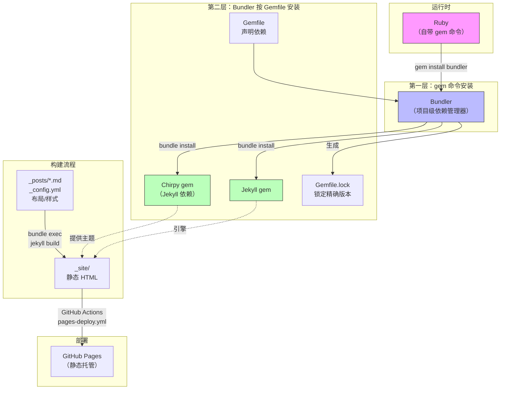

使用 GitHub 搭建[个人网站](https://puppylpg.github.io)，是一件很炫酷的事情。以后有什么所思所学都可以发布在自己的网站上，很是方便。（同时为了丰富网站的内容，还会经常不自觉地开始学习:D，简直是进步神器~）。

> 最重要的是，这一切还不用自己花钱买服务器 :D

1. Table of Contents, ordered
{:toc}

# 从这个项目开始

这个博客基于 [Jekyll](https://jekyllrb.com/) + [Chirpy](https://github.com/cotes2020/jekyll-theme-chirpy) 主题，源码就放在 [puppylpg.github.io](https://github.com/puppylpg/puppylpg.github.io) 仓库。技术栈很简单：

| 组件 | 作用 |
|------|------|
| Jekyll | 静态站点生成器，把 Markdown 转成 HTML |
| Ruby | Jekyll 的运行环境（Jekyll 是 Ruby 写的） |
| Bundler | 依赖管理工具，管理 Jekyll 及其依赖 gem |
| Chirpy | Jekyll 主题 gem，提供博客布局/样式/JS |

它们之间的依赖和包含关系：



本地启动只需要两步：

```bash
bundle install              # 安装依赖（只需要首次或 Gemfile 变更时执行）
bundle exec jekyll serve    # 启动本地服务器，打开 http://localhost:4000
```

或者用项目自带的脚本（macOS）：

```bash
bin/jekyll-dev.sh start     # 后台启动，按需 bundle install
bin/jekyll-dev.sh stop      # 停止服务
```

看起来很简单——但对从 Python 或 Java 过来的人来说，第一反应往往是：**为什么是 `bundle exec` 而不是直接 `jekyll serve`？`gem` 和 `bundle` 到底什么关系？`Gemfile` 和 `Gemfile.lock` 又是什么？**

这就涉及 Ruby 包管理的"套娃"结构。

# Ruby 包管理：两层套娃

## 与 Python、Java 的对比

先放一张三方对比表，建立整体印象：

| Python | Ruby | Java (Maven) | 说明 |
|--------|------|-------------|------|
| package / distribution | **gem** | **artifact (jar)** | 包本身 |
| pip / pipenv / poetry | **Bundler** | **Maven** | 依赖管理工具 |
| PyPI | rubygems.org | Maven Central | 中央仓库 |
| requirements.txt / pyproject.toml | **Gemfile** | **pom.xml** | 声明依赖 + 版本约束 |
| Pipfile.lock / poetry.lock | **Gemfile.lock** | — | 锁定精确版本 |
| pip install / poetry install | **bundle install** | **mvn install** | 安装依赖 |
| pipenv shell / poetry run | **bundle exec** | **mvn exec:java** | 在项目上下文中运行命令 |

Maven 没有标准锁文件，它靠 pom.xml 里的精确版本声明 + 依赖调解规则保证确定性。Gradle 有 `gradle.lockfile`，但 Maven 没有。

另外 Maven 除了依赖管理还有完整的构建生命周期（compile → test → package → deploy），职责比 Bundler 更广，更像是 Bundler + Rake 的合体。

## 最根本的差异：包管理器从哪来

这是三者最根本的差异——**包管理器本身从哪来，和"被管理的包"是什么关系**：

| | Python | Ruby | Java (Maven) |
|--|--------|------|-------------|
| 包管理器怎么来 | **随 Python 自带**（`ensurepip`） | 用 `gem`（随 Ruby 自带）**手动安装** | **独立安装**（brew / sdkman / 下载） |
| 管理器和包的关系 | pip 管理所有包，**包括自己** | gem 管 bundler，bundler 管项目 gem；**两层套娃** | Maven 管理 jar，但 **Maven 自己不是 jar**，和被管物完全分离 |
| 典型流程 | `python -m pip install xxx` | `gem install bundler` → `bundle install` | `mvn install`（一步到位） |

用这个博客项目来走一遍 Ruby 的流程：

```
Ruby（自带 gem 命令）
  └─ gem install bundler     ← 第一层：用 gem 装 bundler
       └─ bundle install     ← 第二层：用 bundler 按 Gemfile 安装项目依赖
            └─ bundle exec jekyll serve   ← 在项目上下文中运行 jekyll
```

- **Python** 是一层结构：pip 随 Python 装好，直接管一切。
- **Ruby** 是两层结构：先用内建的 `gem` 装 `bundler`，再用 `bundler` 管项目级的 gem。初学者容易困惑"为什么要先装一个包管理器，再用它装别的包"。
- **Maven** 是分离结构：工具本身和被管理的 jar 体系互不隶属，不存在套娃，但也意味着工具版本需要单独管理。

> **提示**：`bundle install` 报 `cannot load such file -- bundler` 就是因为 Ruby 版本切换后 bundler 没装到新版本里，需要重新 `gem install bundler`。
>
> Bundler 版本由 `Gemfile.lock` 末尾的 `BUNDLED WITH` 字段决定，CI 中的 `ruby/setup-ruby` action 会自动读取并安装对应版本。

## 为什么不能直接 `jekyll serve`

可以，但不应该。直接运行 `jekyll serve` 用的是全局安装的 Jekyll，版本可能和 `Gemfile.lock` 里锁定的不一致。`bundle exec` 的作用是"在 Gemfile.lock 约束的依赖上下文中运行命令"，确保本地跑的和别人跑的、CI 跑的完全一样。

类比一下：

- Python：`pipenv run jekyll serve` 或 `poetry run jekyll serve`——在虚拟环境的依赖约束下运行。
- Java：不需要这一步，Maven 本身就管依赖隔离。

# 这个项目的依赖结构

看一眼 `Gemfile`，核心就一行：

```ruby
gem "jekyll-theme-chirpy", "~> 6.2.3", "< 6.3"
```

只声明了 Chirpy 主题，Jekyll、html-proofer 等都是 Chirpy 的传递依赖。`Gemfile.lock` 记录了所有依赖的精确版本，`bundle install` 按它安装，保证和 CI 一致。

# GitHub Pages 的两种部署模式

博客能在网上访问，靠的是 GitHub Pages。但它有两种工作方式，行为完全不同：

## 模式一：GitHub Pages 默认构建（本博客不用这种）

```
你 push 代码 → GitHub Pages 用自己的 Jekyll 构建 → 发布
```

这种模式下，Jekyll 版本由 GitHub 锁定（目前是 3.10.0），插件只能用[白名单](https://pages.github.com/versions/)里的。
你的 Gemfile 里的版本约束**会被忽略**。

## 模式二：GitHub Actions 自定义构建（本博客用这种）

```
你 push 代码 → GitHub Actions 跑 pages-deploy.yml → 用 Gemfile 里的 Jekyll 构建 → 把 _site 静态文件交给 GitHub Pages → 发布
```

这种模式下，GitHub Pages 只做**静态文件托管**，不参与构建。
Jekyll 版本、插件完全由你的 `Gemfile` 控制。

本博客走的是模式二（`.github/workflows/pages-deploy.yml`），所以：

- Jekyll 版本 = `Gemfile.lock` 里锁定的（目前是 **4.4.1**）
- Ruby 版本 = workflow 里 `ruby-version` 指定的（目前是 **4.0**）
- `pages.github.com/versions/` 那个页面对本博客**无关**

# 本地与 CI 对齐

## gem 版本对齐

只需要：

```bash
bundle install   # 按 Gemfile.lock 安装，和 CI 完全一致
```

## Ruby 版本对齐

本地 Ruby 版本不需要和 CI 完全一致，只要所有 gem 都兼容即可。CI 用的是 Ruby 4.0。

如果出现 gem 不兼容的问题，用 rbenv 切换版本：

```bash
# 安装 rbenv（如果没有）
brew install rbenv ruby-build

# 写入 shell 配置
echo 'export PATH="$HOME/.rbenv/bin:$PATH"' >> ~/.zshrc
echo 'eval "$(rbenv init - zsh)"' >> ~/.zshrc
source ~/.zshrc

# 安装指定版本（用国内镜像加速）
export RUBY_BUILD_MIRROR_URL=https://cache.ruby-china.com/
rbenv install 4.0.5
rbenv local 4.0.5  # 在项目目录生效
```

## gem 源

Gemfile 已配置国内镜像源（`gems.ruby-china.com`），`bundle install` 速度正常。

系统级 gem 命令也建议切换：

```bash
gem sources --add https://gems.ruby-china.com/ --remove https://rubygems.org/
```

# gem 兼容性注意事项

升级 Ruby 大版本时需要关注 gem 的 Ruby 版本约束，尤其是：

- **有 native extension 的 gem**（nokogiri、ffi、sass-embedded 等）：包含 C 代码，需要针对 Ruby 版本重新编译，但通常不限制版本范围
- **明确限制 Ruby 版本的 gem**：如 html-proofer 4.x 要求 `< 4.0`，升级到 Ruby 4.0 时必须同步升级到 html-proofer 5.x

查看某个 gem 的 Ruby 版本要求：

```bash
gem specification --remote <gem名> -v <版本> | grep -A8 required_ruby_version
```