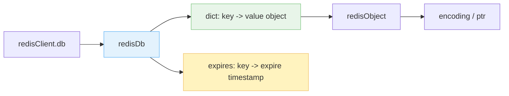
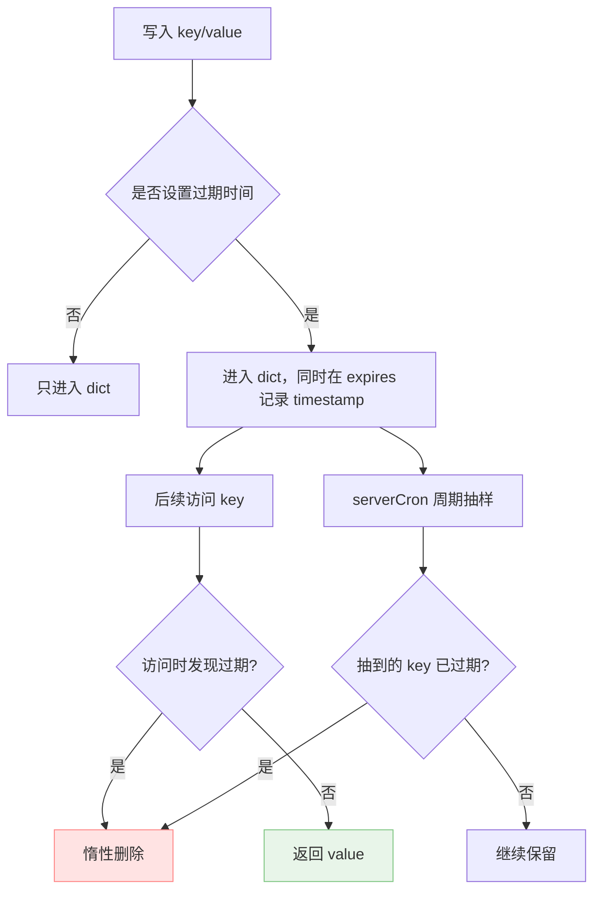
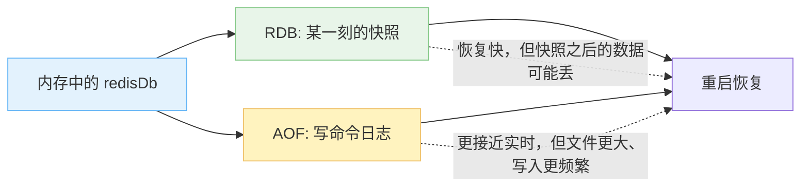
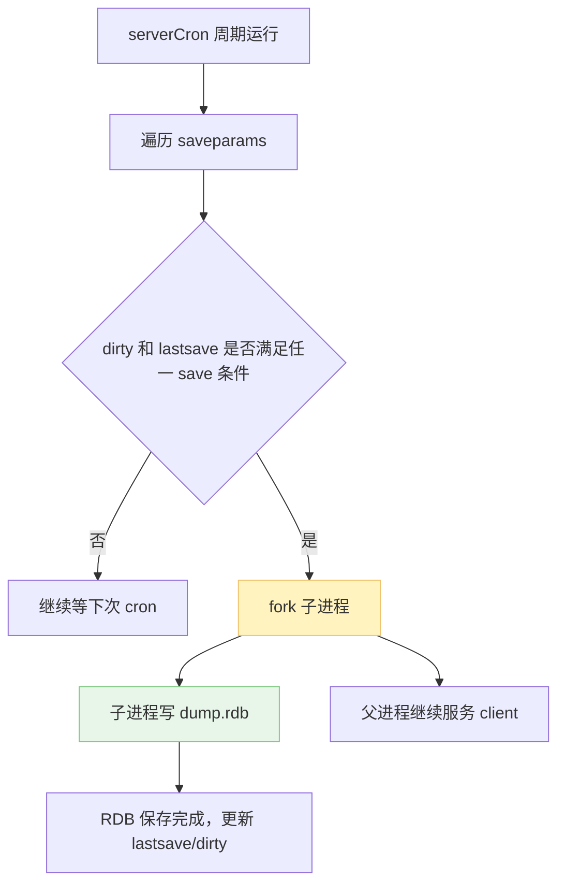
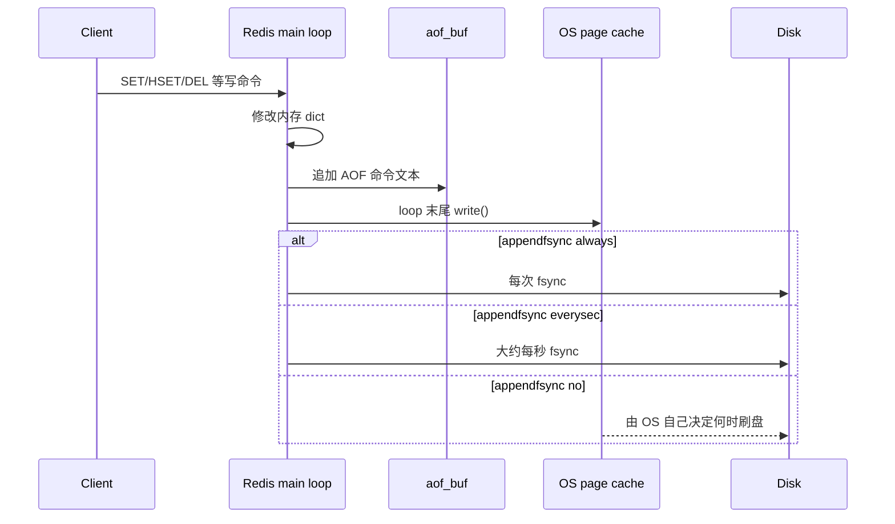
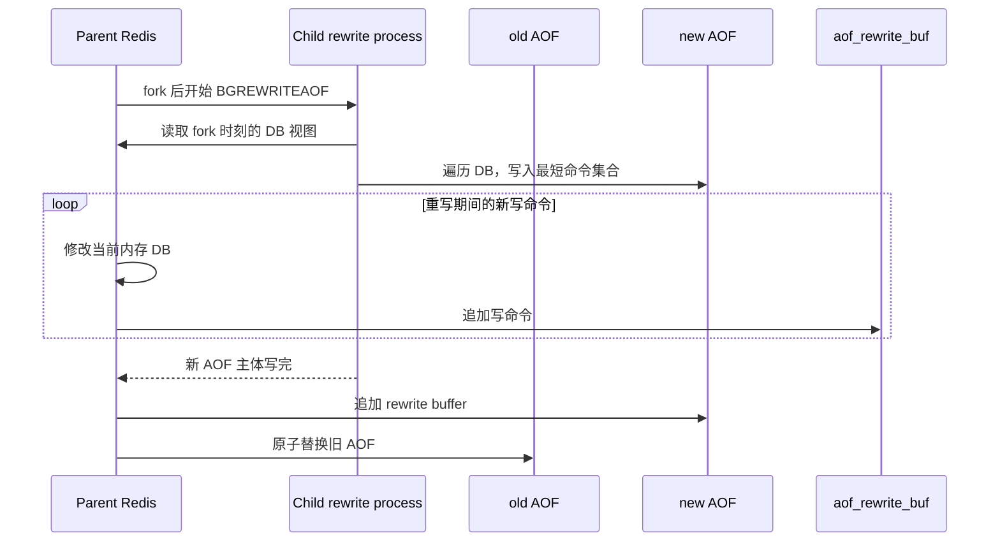

Redis 的数据库功能和数据库持久化，本质上都是围绕一件事展开：**内存里的 dict 很快，但内存不可靠**。所以 Redis 一边把数据组织成极轻量的内存结构，一边用 RDB/AOF 把状态落到磁盘上。

1. Table of Contents, ordered
{:toc}

# DB

## db number

Redis 使用 `redisServer` 保存服务器状态，其中和数据库直接相关的是：

- `redisDb *db`：Redis 数据库数组，默认 16 个；
- client 默认使用 0 号 DB，可以用 `SELECT <db>` 切换；
- `redisClient` 里也有一个 `redisDb *db`，指向这个 client 当前正在使用的 DB。

也就是说，**“当前在哪个库里操作”不是 Redis 全局状态，而是 client 自己的状态**。Redis 没有查询当前 client 正在使用哪个 DB 的命令，所以如果代码里用了多个 DB，用之前最好老老实实再来一次 `SELECT`。不然写错库这种问题，排查起来很容易让人怀疑人生。

## dict

Redis 的数据库本质上是一个 dict。从 `redisDb` 里能看到两个关键字典：

- `dict *dict`：真正保存 key/value；
- `dict *expires`：保存 key 的过期时间。



如果某个 value 的类型是 hash，那它本身又会用 dict 一类结构承载。于是就是 dict 套 dict，开始套娃，但这个套娃是有意义的：外层 dict 解决 DB 里的 key 定位，内层结构解决某个 value 自己的类型语义。

## 增删改查

不同 value 类型使用不同命令：

- 增：`SET`；
- 删：`DEL`；
- 改：`SET`、`HSET` 等；
- 查：`GET`、`HGET`、`LRANGE` 等。

**命令看起来花里胡哨，本质上都是根据 value 的类型选择操作方式，因为 key 永远是 string。**

## 过期时间

Redis 可以给 key 设置过期时间。它用 Unix timestamp 表示绝对时间，所以和时区无关：

- `EXPIRE key ttl`：相对时间，单位秒；
- `PEXPIRE key ttl`：相对时间，单位毫秒；
- `EXPIREAT key timestamp`：绝对时间，单位秒；
- `PEXPIREAT key timestamp`：绝对时间，单位毫秒；
- `TTL key`：多久后过期，单位秒；
- `PTTL key`：多久后过期，单位毫秒；
- `PERSIST key`：移除过期时间。

`SETEX` 可以在 `SET` 一个 key 的同时设置过期时间。`TIME` 返回当前 Unix timestamp，结果是数组，分别是秒数和当前秒内的微秒数。

## 过期键删除

过期时间存在哪里？就是前面说的 `dict *expires`。它的 key 和主 dict 里的 key 对应，value 是过期时间。

删除过期 key 至少有几种策略：

- 定时删除：给每个 key 搞一个定时任务，到点就删。释放及时，但额外 CPU 和定时器管理成本很高；
- 惰性删除：用到这个 key 的时候检查一下，发现过期再删。实现简单，但如果一个过期 key 永远没人访问，它就可能赖在内存里；
- 周期性主动删除：Redis 周期性抽样检查一批带过期时间的 key，删掉已经过期的。

Redis 的策略是**惰性删除 + 周期性主动删除**。它没有给每个 key 都挂一个精确 timer，这样太奢侈；也不会只靠惰性删除，因为内存会被过期垃圾慢慢吃掉。



所以，**Redis 数据库可以先粗暴理解成 `dict + expires` 两个字典**。主 dict 决定数据在哪儿，expires 决定它什么时候该滚蛋。

# 持久化

Redis 是内存型数据库，不持久化的话，一旦进程崩溃，内存里的数据就没了。

Redis 常见的持久化方式有两种：

- **RDB**：Redis Database，把某个时间点的数据库快照保存成 `.rdb` 文件；
- **AOF**：Append Only File，记录 Redis 执行过的写命令。恢复时让一个新的 Redis 照着命令重新执行一遍，状态自然就追上来了。



## RDB

使用 `SAVE` 或 `BGSAVE` 生成 RDB 文件：

- `SAVE`：主进程自己保存，保存期间会阻塞；
- `BGSAVE`：主进程 `fork()` 出子进程保存，主进程继续处理请求。

`BGSAVE` 是 background 行为，所以通常用它。这里马上就会冒出一个经典问题：

> 众所周知，`fork()` 出来的进程几乎就是父进程的 copy，而 Redis 是内存型数据库，DB 所占的空间都算父进程内存。那岂不是子进程也要来一份一模一样的 DB 内容？如果 DB 超过机器总内存的 50%，是不是就没法 `fork()` 子进程了？

答案要靠 Linux 的 copy-on-write 解释，具体放在 [redis 与 linux fork]() 里。这里先记住工程结论：**`BGSAVE` 不会立刻把内存复制一份，但它仍然依赖系统能接受这次 fork 的内存承诺**。

RDB 文件只能在 Redis 启动时自动载入，Redis 不提供类似 `LOAD` 的在线加载命令。

## 配置 BGSAVE

因为 `BGSAVE` 不阻塞主进程，所以可以周期性执行。一旦满足配置条件，就触发 `BGSAVE`。

配置在 `redis.conf` 里，格式是：

```bash
save <duration seconds> <modification times>
```

比如：

```bash
save 100 10
```

表示 100 秒内 DB 只要修改过 10 次，就执行一次 `BGSAVE`。这种配置可以有多条，**任意一条被触发就会执行 `BGSAVE`**。

内部实现可以对应到 `redisServer`：

- `struct saveparam *saveparams`：把配置里的多条 `save` 转成数组；
- `time_t lastsave`：上次成功保存的时间；
- `long long dirty`：上次保存后 DB 修改次数；
- `serverCron`：周期函数，默认 100ms 左右跑一次，顺手检查是否满足保存条件。



## RDB 结构

RDB 是二进制文件，从前到后大致是：

- `"REDIS"`：常量，标志这是一个 RDB 文件；
- `version`：RDB 文件版本，4 byte；
- `databases`：Redis 默认有多个 DB，如果某个 DB 不为空，会被依次序列化在这里。如果都为空，这部分不存在；
- `"EOF"`：正文结束标记，1 byte；
- `checksum`：8 byte，用于验证文件没有损坏。

每个非空 DB 会保存：

- `"SELECTDB"`：1 byte；
- `db_number`：数据库编号；
- `key_value_pairs`：这个 DB 的所有 kv 数据。

每个 kv 又大致保存：

- `"EXPIRETIME_MS"`：如果这个 kv 有过期时间，会先写这个标记；
- `ms`：过期时间，8 byte，单位毫秒的 Unix timestamp；
- `type`：value 类型，1 byte；
- `key`：按 Redis string object 的方式序列化；
- `value`：根据具体 value 类型，用对应 Redis object 的方式序列化。

至于每一个 type 对应的序列化方式，就不展开考古了。大体套路和我们平时写序列化很像：先写类型，再写长度，再写内容。list、hash、set 这些类型只是各自把内部元素按自己的结构写进去。

> 序列化的时候不会序列化过期 key，反序列化的时候也不会反序列化已经过期的 key。

Redis 编译后，`src` 目录下有 `redis-check-rdb`，可以检查 RDB 文件：

```bash
% ./redis-check-rdb dump.rdb
[offset 0] Checking RDB file dump.rdb
[offset 26] AUX FIELD redis-ver = '6.0.9'
[offset 40] AUX FIELD redis-bits = '64'
[offset 52] AUX FIELD ctime = '1610279241'
[offset 67] AUX FIELD used-mem = '845432'
[offset 83] AUX FIELD aof-preamble = '0'
[offset 85] Selecting DB ID 0
[offset 139] Checksum OK
[offset 139] \o/ RDB looks OK! \o/
[info] 2 keys read
[info] 0 expires
[info] 0 already expired
```

## AOF

AOF 记录的是每一条写 Redis 的命令。

Redis 启动时，**如果 AOF 开启，会优先使用 AOF 恢复数据；AOF 关闭时才使用 RDB**。原因很直观：AOF 的更新频率通常高于 RDB，更不容易丢数据。

开启 AOF：

```bash
appendonly yes
```

## 写策略

并不是每来一条写命令，Redis 就立刻把它同步刷到磁盘。写文件需要系统调用，强制刷盘更贵，如果每条命令都这么干，Redis 就快不起来了。

Redis 先把写命令放进 `redisServer` 的 `aof_buf`。主线程的 event loop 大致是：

```bash
while true:
    processFileEvents()
    processTimeEvents()
    flushAOF()
```

每次 loop 末尾，Redis 会把 `aof_buf` 里的内容写到 AOF 文件。



这里至少有三层缓冲和权衡：

1. Redis 自己有 `aof_buf`，避免每条命令都马上写文件；
2. OS 有 page cache，`write()` 不等于数据真的落到磁盘；
3. Redis 是否调用 `fsync`/`fdatasync`，由 `appendfsync` 决定。

`appendfsync` 常见配置：

- `always`：`write` 后每次都 `fsync`，安全性最好，性能最差；
- `no`：只 `write`，什么时候刷盘交给 OS，性能最好，宕机时可能丢较多数据；
- `everysec`：折中方案，大约每秒 `fsync` 一次，通常最多丢 1 秒左右写入。

所以一般 `everysec` 最合适：性能不至于太难看，数据也不至于丢得离谱。

> AOF 的“反序列化”挺好玩：既然把 AOF 文件里的命令一条条执行一遍，最终 DB 内容就恢复了，那就搞个 fake client，读 AOF 文件，把命令喂给 Redis server，让 server 依次执行。偷懒但优雅，Redis 老小机灵鬼了。

## AOF 重写

AOF 文件会越来越大。比如先 `SET a 1`，再 `SET a 2`，前一条对最终状态已经没意义了。AOF 重写就是把最终状态重新写成更短的一组写命令。

但注意，**AOF 重写不是分析旧 AOF 文件再合并命令**。它的做法更直接：遍历 Redis 当前所有 DB 的所有 kv，重新生成一份新的 AOF 文件。这样就不用实现一套复杂的“日志语义压缩器”了，真是个小机灵鬼。

和 `BGSAVE` 一样，AOF 重写使用 `BGREWRITEAOF`，由子进程完成。子进程从逻辑上拥有一份 Redis DB 的 copy，所以它能安安静静遍历旧状态，父进程继续处理新请求。

问题又来了：子进程重写需要时间，这期间父进程里的 DB 可能又变了，怎么办？

Redis 使用 `list *aof_rewrite_buf_blocks`，也就是 **AOF 重写缓冲区**。重写期间，父进程除了正常写 `aof_buf`，还会把新的写命令额外记录一份到 AOF 重写缓冲区。子进程写完新 AOF 后，父进程把这段缓冲追加过去，最后替换旧 AOF。



这里很容易混淆两个 buffer：

- `aof_buf`：日常 AOF 写入缓冲；
- `aof_rewrite_buf_blocks`：AOF 重写期间，为了补齐子进程快照之后的新写入。

目的完全不同，名字长一点也是有道理的。

## RDB vs. AOF

| 对比项 | RDB | AOF |
| --- | --- | --- |
| 保存内容 | 某一刻的数据快照 | 写命令日志 |
| 恢复速度 | 通常更快 | 需要重放命令，可能更慢 |
| 数据安全 | 快照之后的数据可能丢 | 通常最多丢 `appendfsync` 窗口内的数据 |
| 运行开销 | 周期性 fork + 写快照 | 持续追加写文件，偶尔重写 |
| 适合场景 | 备份、快速恢复、可接受少量丢失 | 更在意少丢数据 |

又是一个性能和数据安全性的考量。Redis 很多配置最后都会回到这句话：**你想快一点，还是想稳一点？**

## 启动 RDB/AOF

Redis 默认启动 RDB，关闭 AOF。

默认 RDB 配置：

```bash
save 900 1
save 300 10
save 60 10000

dbfilename dump.rdb
```

默认 AOF 配置：

```bash
# 默认不开启 AOF，改成 yes 即可
appendonly no
appendfilename "appendonly.aof"
appendfsync everysec
```

默认 working directory：

```bash
dir ./
```

所以如果 RDB 和 AOF 都开启，默认情况下 `dump.rdb` 和 `appendonly.aof` 都会写入启动 server 的当前目录。

关闭 Redis 时会提示 AOF 和 RDB 都保存了：

```bash
796:M 12 Jan 2021 02:22:53.398 # User requested shutdown...
796:M 12 Jan 2021 02:22:53.399 * Calling fsync() on the AOF file.
796:M 12 Jan 2021 02:22:53.404 * Saving the final RDB snapshot before exiting.
796:M 12 Jan 2021 02:22:53.407 * DB saved on disk
```

启动 Redis 时提示：

```bash
900:M 12 Jan 2021 02:28:56.908 * DB loaded from append only file: 0.000 seconds
```

这说明它使用了 AOF 文件恢复 DB 内容。

## 开启 AOF 配置为什么还是没有生成 AOF 文件？

**Redis 启动时要明确指定配置文件，否则它不会从你改的那个配置文件加载配置，而是直接使用默认配置**。默认配置不开启 AOF，所以只改了某个 `redis.conf`，但启动时没指定它，当然不会生成 AOF 文件。

使用指定配置文件启动：

```bash
./src/redis-server redis.conf
```

# Finally

Redis 为了实现一种新功能，会不断往 `redisServer`、`redisDb` 这些结构里添加属性。持久化尤其明显：RDB 要 `saveparams`、`lastsave`、`dirty`，AOF 要 `aof_buf`，重写还要 `aof_rewrite_buf_blocks`。

所以看 Redis 源码时不要被 struct 里的字段吓到。很多字段并不神秘，它们就是把一个工程问题硬塞进内存结构里：要记录状态，就加字段；要跨阶段补数据，就加 buffer。功能都是代码堆起来的，朴素，但好使。
