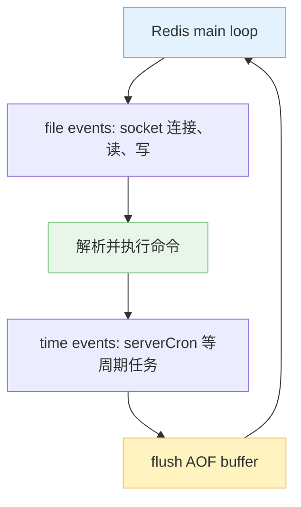
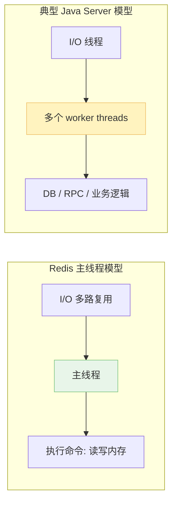
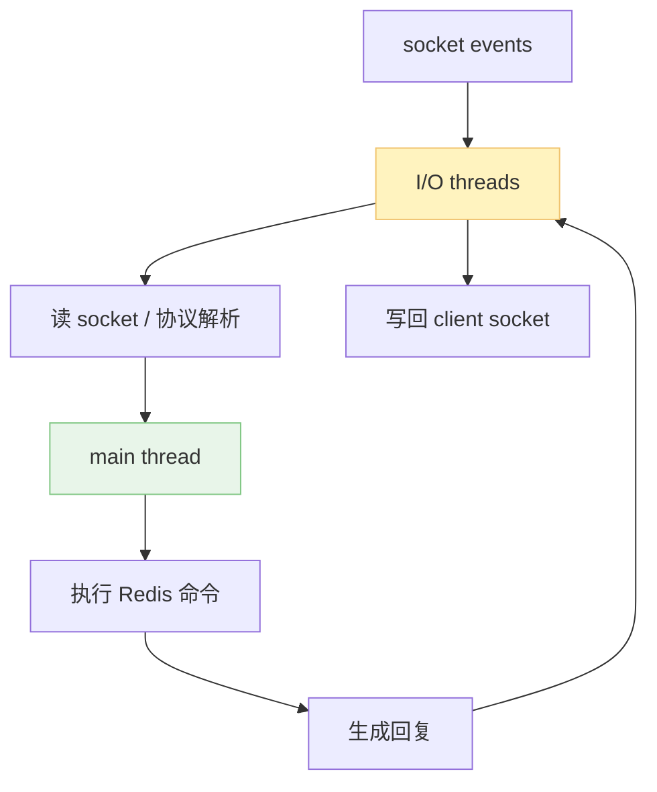
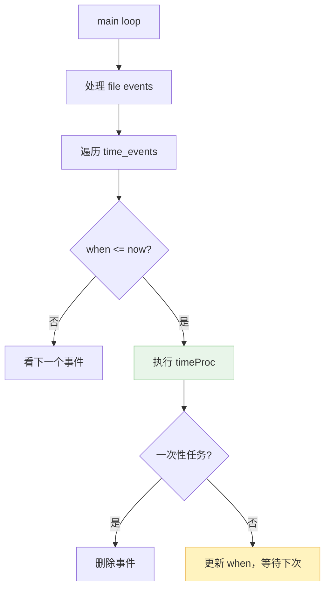

上篇写了 Redis DB 和持久化。DB 是 Redis server 的主要功能，这篇梳理 Redis server 的架构和事件处理逻辑。

一句话概括：**Redis 的主服务流程是一个非常快的事件循环，主要由一个线程完成连接处理、命令执行和定时任务调度**。它不是“进程里只有一个线程”，而是“核心读写内存和执行命令这条路径尽量单线程”。

1. Table of Contents, ordered
{:toc}

# 事件驱动程序

Redis server 的主流程可以粗略写成：

```bash
while true:
    processFileEvents()
    processTimeEvents()
    flushAOF()
```

**这个 loop 由 Redis 主进程里的主线程完成。**



Redis 事件主要有两类：

1. **file events**：服务器通过 socket 与 client 连接，读写 socket。Linux 上“一切皆文件”，socket 也是文件，所以对 socket 的处理就是 file event；
2. **time events**：定时任务，比如 `serverCron`，负责过期键清理、持久化条件检查、复制心跳等。

> Linux “一切皆文件”可以这么理解：
>
> - 普通文件是文件；
> - 目录也是文件，打开目录其实就是打开目录文件；
> - 进程、硬件设备、socket、`/dev/zero`、`/dev/null`、pipe 都可以通过文件抽象处理；
> - 既然都抽象成文件，就能尽量使用 `read`/`write`/`close` 这一套 API。
>
> 意义很朴素：一套 API 搞定一堆东西，工具和系统调用都能复用。这意义还不大？

# file event: 单线程的魅力

Redis 的主进程是单线程的吗？不是。Redis 还有后台线程或子进程做其他事情，比如异步释放、后台 I/O、`BGSAVE` 子进程等。

更准确的说法是：**Redis 的核心服务流程主要由一个主线程完成**。这个主线程处理 client 连接、socket I/O、命令解析、命令执行。

从开发 Java 服务器的角度看，这好像不现实。但别忘了，Redis 和 Java 业务服务器面对的问题不一样：

- Java 服务器处理一个请求时，很可能要读写 MySQL、请求其他服务、做复杂业务逻辑。一个请求慢了，就可能把处理线程占住，所以需要多线程并行和并发处理多个请求；
- Redis 的请求通常是简单命令，主要是读写内存里的数据结构，执行非常快。只要命令不把主线程 block 住，一个主线程就能高速处理大量请求。

Redis 基于 Reactor 模式和 I/O 多路复用，一个线程监听多个 socket 事件，然后快速处理。等等，一个线程怎么还能有并发？

回到并发定义：**一段时间内，很多事情看起来像是同时被处理，它就是并发**。Redis 一个线程可以在很短时间内处理大量请求，所以从效果上看就是并发。Java 多线程并发则往往是并行与并发的结合：多个线程可能同时在多个核上执行，也可能在单核上快速切换。



> Redis 的单线程“并发”更像概念上的并发；Java 多线程在一个核上不断切换的“并发”，更符合一开始学操作系统时的那个味儿。

关于 Redis 单线程并发，可以参考 Stack Overflow 上的讨论：[Redis is single threaded, then how does it do concurrent I/O?](https://stackoverflow.com/questions/10489298/redis-is-single-threaded-then-how-does-it-do-concurrent-i-o)。

## 单线程的好处

好处很直接：**核心数据结构不需要考虑多个 worker 线程同时写内存的问题，也就不需要给每个操作加锁**。

不加锁，是 Redis 快的一大因素。另一方面，单线程在设计和实现上也简单得多。你不用到处想“这段代码会不会被另一个线程同时改掉”，脑子能省不少内存。

## 单线程的不足

既然 Redis server 的主要处理流程都由主线程干，那 CPU 实际上主要用了一个核。现在 CPU 都多核了，这不是浪费嘛。

> 那咋办？单机部署多个 Redis 呗。别笑，这真是一个常见解决方案。

针对 Redis 对 CPU 利用不足，[阿里云的 Redis 多线程方案文章](https://www.alibabacloud.com/blog/improving-redis-performance-through-multi-thread-processing_594150) 提出过一种思路：读写 I/O 时使用多个 I/O thread，真正执行命令仍交给一个 worker thread。

这样相当于把 Redis 主线程的活拆成两段：

- I/O thread：负责读写 socket、解析请求，属于比较耗 I/O 的活；
- worker thread：负责执行命令、读写内存，仍然只有一个。

**因为只有一个 worker thread 读写内存，所以仍然不需要加锁。** 同时仍然是 NIO 和多路复用模型，只不过处理 I/O 的人变多了。

典型 Java Server NIO 的思路通常反过来：一个或少数 I/O thread，加一堆 worker thread。原因还是场景不同：

- Java 的重活在 worker thread：查 DB、调 RPC、跑业务逻辑。一个 worker 处理不过来，只能上一堆 worker；
- Redis 的重活反而可能在 socket 读写和协议解析。命令执行只是读写内存，快得很。所以 Redis 更适合让多个 I/O thread 干 I/O，单个执行线程守住内存一致性。

> 架构之间的差异，都是业务场景决定的。多对比不同架构，它们瞬间都合理了。

如果 Redis 的 worker thread 也变成一堆，会不会并发更高？看起来线程多了，干活的人多了；但只要共享内存，锁基本就跑不掉。锁、线程切换、缓存失效这些成本叠上来，可能比 Redis 命令本身还贵。所以核心命令执行路径一直不适合粗暴改成多个 worker。

## Redis 6

Redis 6 发布了 I/O 多线程。说 “I/O 多线程” 比说 “Redis 多线程” 更严谨，因为命令执行这条核心路径仍然由主线程控制。

> 现在可以自信地说：Redis 绝对不是“只有一个线程”的程序了。但也别反过来误会成“Redis 命令执行已经多线程乱飞”。

Redis 6.0.0+ 的 `redis.conf` 里有相关配置，核心是这两个：

```bash
# 启用 I/O threads，例如 4 个
io-threads 4

# 默认只把写 socket 交给 I/O threads；
# 如果设为 yes，也会把读和协议解析交给 I/O threads。
io-threads-do-reads no
```

官方配置注释里有几个关键建议，整理成人话就是：

- 默认不开启 I/O 多线程；
- 至少 4 核机器才建议考虑开启，并且要给系统留核；
- 线程数不是越多越好，超过 8 个通常收益不大；
- 只有 Redis 实例真的遇到 I/O 瓶颈时才值得开；
- `io-threads` 不能运行时通过 `CONFIG SET` 修改；
- 用 `redis-benchmark` 测时，benchmark 自己也要配 `--threads`，否则压测端可能先成瓶颈。



用 `redis-benchmark` 测试时，有人测到 QPS 接近翻倍，可以参考这篇记录：[Redis 6 多线程性能测试](https://blog.csdn.net/weixin_45583158/article/details/100143587)。但工程上不要只看“翻倍”两个字，先确认瓶颈真在 I/O，不然开了也是多一层复杂度。

# timer event

执行完 file event，紧接着就是 timer event。Redis 的时间事件实现也很朴素。

`redisServer` 里有一个 `time_events` 链表。每个时间事件节点包含：

- `id`；
- `when`：执行时间，Unix timestamp；
- `timeProc`：回调函数，到点就执行它。

执行 timer event 时，Redis 遍历链表，判断 `when` 是否已经到期：

- 一次性定时任务：执行完删除节点；
- 周期任务：执行完更新下一次 `when`。



忍不住类比一下 Java：`ScheduledThreadPoolExecutor` 内部也有类似的延时任务队列，任务作为 `Delayed` 对象放进 `DelayQueue`。但执行逻辑和 Redis 不同：

- Java：单独线程从 `DelayQueue` 取任务。没到点就等待，醒来再取；
- Redis：自己一直在 loop，所以每轮 loop 顺手检查一下时间事件，到点就执行。

Redis 这么做简单，是因为它本来就在高速循环。把“检查定时任务”塞进 loop 里就行了，不需要额外搞一个专门等时间的线程。

还有个问题：Redis loop 是执行完 file event 之后才执行 timer event，如果没有命令要处理，岂不是一直卡在 file event 那一步？

不会。I/O 多路复用等待文件事件时有最大阻塞时间，默认和周期任务频率相关，大致 100ms。超过这个时间，主线程就不继续傻等 file event 了，该看看有没有周期任务要执行了。

# 总结

Redis 架构的核心不是“单线程”三个字，而是这条取舍链：

- Redis 命令大多是内存操作，足够快；
- 主线程统一执行命令，避免锁和共享内存并发问题；
- I/O 多路复用让一个线程能处理大量连接；
- 时间事件塞进主 loop，简单粗暴；
- Redis 6 把一部分 I/O 读写拆给多线程，但仍然守住命令执行的单线程核心。

场景决定架构，架构决定实现。Redis 的模型看起来简单，恰恰是因为它非常清楚自己要解决什么问题。
