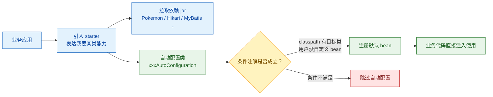

Spring Boot 最容易让人产生错觉的地方，是“引入一个 starter 之后，很多 bean 就自动出现了”。这背后不是魔法，而是一套约定：starter 负责组织依赖，自动配置类负责按条件创建 bean，配置属性类负责把外部配置绑定到对象上。

Spring Boot 的能力可以粗略分成四类：

- starter：整合依赖，减少版本冲突，让使用者用一个依赖表达一组能力；
- **自动配置**：利用条件注解推测当前应用可能需要的 bean，并在用户没有显式配置时自动补齐；
- cli：用 Groovy 快速写 demo 或小工具；
- actuator：为应用加入运行期观测和管理能力。

这篇文章聚焦其中最核心的自动配置，并用一个自定义的 `pikachu-spring-boot-starter` 把整个链路串起来。

1. Table of Contents, ordered
{:toc}

文章的主线是：先解释“为什么引入 jar 就能得到 bean”，再实现一个最小 starter，最后回到 Spring Boot 如何发现并加载这些自动配置类。

先用一张图把 starter、auto-configuration 和最终 bean 的关系摆出来：



# 为什么spring boot可以自动配置？
spring怎么管理bean的？
> spring bean map: string -> bean。搞一个bean到map里，然后可以根据它的名字或者类型从map里取出来，注入到需要的地方。

老spring一开始怎么搞的？怎么new出来这些bean的？
>使用xml，用xml声明bean，然后spring用反射把他们new出来。

后来为什么用@Bean标注的Java类取代xml？
> @Bean取代xml更简洁、可用IDE方便重构。反射应该还是需要的，但是应该更简单了，毕竟Java反射可以直接取到class上的annotation。如果用xml感觉还要用xml parser一个一个解析。

springboot干什么了，怎么就自动配置了？
> 当开发者引入一个jar的时候，spring boot推测会用这个jar的bean，所以直接就自动new出这些bean，开发者就可以直接用了。

这就是传说中的**约定大于配置**：我把你可能用到的所有bean都写进来，如果你想用某个，就引个jar包就行了。这就是暴力if...then...else...啊！

所以约定大于配置的结果就是：开发者引入jar，就可以直接用bean了。

怎么根据引入的jar去new相应的bean？
> 提前写好啊！类似于if 有jar then new bean。只不过这种写不是用if else，而是用条件注解。

# 自动配置原理：以自定义的pikachu-spring-boot-starter为例
有些中间件是常用的，spring boot已经用条件注解为他们写了自动new bean的类。比如DataSource，发现有hikari的包就直接new HikariDataSource。但是显然spring boot不可能写全的，世界上这么多中间件，springboot也就只能把最火的那些提前写好。对于第三方的，如果想接入springboot，会自己写好各种starter，比如mybatis-spring-boot-starter，引入它之后，再引入mybatis，就能自动配置mybatis的bean了。

这些starter（springboot & 第三方starter）都干了什么？

以自己写的pikachu-spring-boot-starter为例——

假设世界上有一个接口叫pokemon：
```java
public interface Pokemon {
    String show();
}
```
pikachu就是一个pokemon，所以是该接口实现者之一。它就是一个普通的类，定义了一些属性，实现了show方法：打印一只皮卡丘。

## auto config类
starter里一般有autoconfig包，里面写的有用@Configuration标记的xxxAutoConfiguration配置类。

在类里，使用@Bean去new一些bean，比如这里new一只pikachu。当然这些new不是无条件的，最基本的条件之一就是“必须在没有皮卡丘的情况下才能自动new出一只pikachu”。所以我们用条件注解写为：
```java
@Configuration
@ConditionalOnClass(Pikachu.class)
@EnableConfigurationProperties(PikachuProperties.class)
public class PikachuAutoConfig {

    @Bean
    @ConditionalOnMissingBean(Pokemon.class)
    public Pikachu getPikachu(PikachuProperties properties) {
        Pikachu pikachu =  new Pikachu(properties.getName(), properties.getHeight());

        if (properties.getGirlFriend() != null) {
            Pikachu.GirlFriend girlFriend = new Pikachu.GirlFriend();
            girlFriend.setName(properties.getGirlFriend().getName());
            girlFriend.setInterest(properties.getGirlFriend().getInterest());
            pikachu.setGirlFriend(girlFriend);
        }

        return pikachu;
    }
}
```
在有Pikachu这个类的情况下才考虑配置pikachu（sure，没有pikachu这个类还怎么new。。。），且Pokemon这个bean不存在，即：开发者还没有手动new。**如果开发者自己手动new了pikachu或者其他的pokemon实现类，那我们就别瞎掺和了**。人家已经有自己中意的bean了，就不要再自动配置了。

> 条件注解有@ConditionalOnClass、@ConditionalOnMissingBean、@ConditionalOnProperty等等注解。
>
> 比如还可以给上述new pikachu的@Bean加上一句`@ConditionalOnProperty(prefix = "pokemon.pikachu",value = "enabled", havingValue = "true")`，代表只有显示指定`pokemon.pikachu.enabled=true`才会配置这个bean。

## properties类
new pikachu可以，因为pikachu的类在这儿。new出来的pikachu的属性填什么？比如pikachu有个name属性，填什么？它可以叫pika，也可以叫雷恩，还可以叫杰尼龟、皮狗蛋。名字这种东西自然是开发者指定的，所以应该留个给开发者配置pikachu的属性的地方。

一般都是让开发者在配置文件里配置pikachu的属性。所以我们搞个读取配置文件的类，不如就设置两个配置：
- `pokemon.pikachu.name`设定name属性；
- `pokemon.pikachu.height`设定height属性。

这个类应该写成：
```java
@Data
@ConfigurationProperties(prefix = PikachuProperties.PIKACHU_PREFIX)
public class PikachuProperties {

    public static final String PIKACHU_PREFIX = "pokemon.pikachu";

    private String name;

    private int height;
}
```
使用了`@ConfigurationProperties`，就是从配置文件里读pokemon.pikachu.xxx了。

在刚刚写的pikachu的autoconfig类里，有`@EnableConfigurationProperties(PikachuProperties.class)`，就是说启用这个类，并在new pikachu的时候从这个类里读数据。

# Spring Boot 怎么加载这些 auto config 类？
springboot程序是使用一个主类，标记上`@SpringBootApplication`来启动的。这个注解含有`@ComponentScan`，而后者的定义是：**扫描指定的包。如果没指定要扫描的basePackge，则只会扫描标注这个注解的类所在的包（及其子包）**。

但是我们写的starter作为第三方依赖被开发者引入程序，肯定不在上述自动扫描的包下，那pikachu的auto config的类是怎么被实例化的？

## `spring.factories` 时代

> Spring Boot 3.x 起不再使用这种方式注册新的自动配置类。

那就再做个约定呗。spring boot会读某个提前约定好的文件，这个文件下指定的类spring boot都加载就完事儿了。

这个文件就是META-INF/spring.factories。

spring boot会加载META-INF/spring.factories指定的那些类，而各个autoconfig的starter（除了spring boot自己写的一堆的，还有第三方的starter），就在这里指定所有自己的AutoConfiguration类，来让自己被加载。

所以我们的pikachu-spring-boot-starter在resources新建META-INF/spring.factories：
```properties
org.springframework.boot.autoconfigure.EnableAutoConfiguration=\
  io.puppylpg.pokemon.pikachu.PikachuAutoConfig
```
多个类之间使用逗号分隔。

META-INF/spring.factories必须要打包到jar的root下，不放在resources下当然也行，但是必须用maven的指定resources的方法把它指定为resources。

这样一个starter就搞好了。

### Spring Boot 3.x
从 Spring Boot 3.x 开始，自动配置不再写到 `spring.factories` 里，而是挪到 [`META-INF/spring/org.springframework.boot.autoconfigure.AutoConfiguration.imports`](https://github.com/spring-projects/spring-boot/wiki/Spring-Boot-2.7-Release-Notes#auto-configuration-registration) 文件里，直接写自动配置类名即可。**相当于把自动配置注册这件事单独拆了出来**。

```properties
io.puppylpg.pokemon.pikachu.PikachuAutoConfig
```
每个类独占一行。

该变动是 [Spring Boot 2.7 引入的](https://github.com/spring-projects/spring-boot/wiki/Spring-Boot-2.7-Release-Notes#auto-configuration-registration)，当时新旧两种方式均支持；Spring Boot 3.x 之后只支持新版配置。

# 制作starter需要引入的包
要引入两个包：
- spring-boot-autoconfig
- spring-boot-configuration-processor

## spring-boot-autoconfig
显然，首先我们要用到那些条件注解，比如`@ConditionalOnClass`，这些注解就在spring-boot-autoconfig包里。另外，之前说的spring-boot已经为一些热门中间件写好了自动配置，这些也在这个包里。

所以spring-boot-autoconfig包：
- 有条件注解；
- 有提前写好的AutoConfig + Properties类。

这些AutoConfig不包含的中间件自然不能自动配置，比如我们的pikachu中间件，就要自己去写能给它自动配置的starter了。

## spring-boot-configuration-processor
`spring-boot-configuration-processor` 主要处理 `@ConfigurationProperties`，生成配置元数据。IDE 可以利用这些 metadata，在用户编辑 `application.properties` 或 `application.yml` 时提供自动补全。这个用途可以参考 [Stack Overflow 上对 configuration processor 的解释](https://stackoverflow.com/a/53708051/7676237)。

# 使用starter
初始化一个spring boot工程，引入pikachu的starter，声明一个pokemon，直接使用`@Autowired`自动注入，然后使用pokemon.show()，就会发现是pikachu在show。

# 其他
当文件被打成jar包之后，就不能从file读了：
```java
        ClassLoader classLoader = getClass().getClassLoader();
        File file = new File(classLoader.getResource("pikachu.pic").getFile());
```
但是可以从InputStream读：
```java
        ClassLoader classLoader = getClass().getClassLoader();
        InputStream inputStream = classLoader.getResourceAsStream("pikachu.pic");
        try {
            pic = IOUtils.toString(inputStream, StandardCharsets.UTF_8);
        } catch (IOException e) {
            e.printStackTrace();
        }
```
打成jar之后，file就不是file了。和操作系统从文件系统上读普通文件是不一样的。

相关讨论可以参考 [jar 包内资源不再是普通文件](https://stackoverflow.com/a/20389418/7676237) 和 [用 classloader 读取资源流](https://stackoverflow.com/a/10144757/7676237)。
