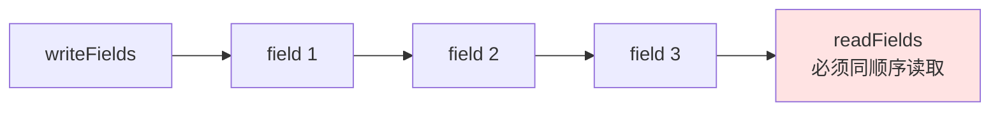
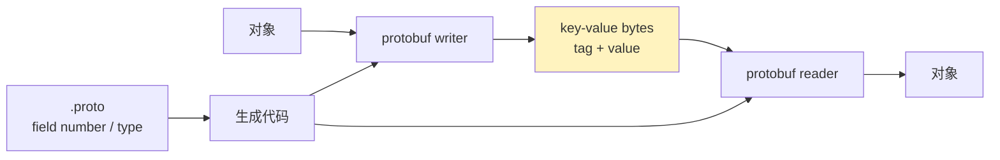
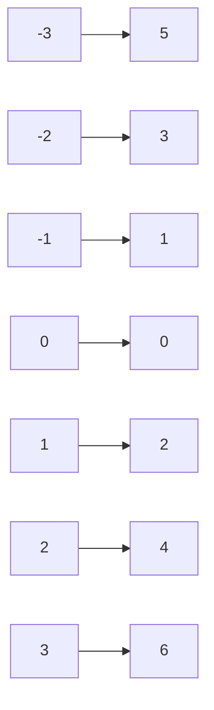
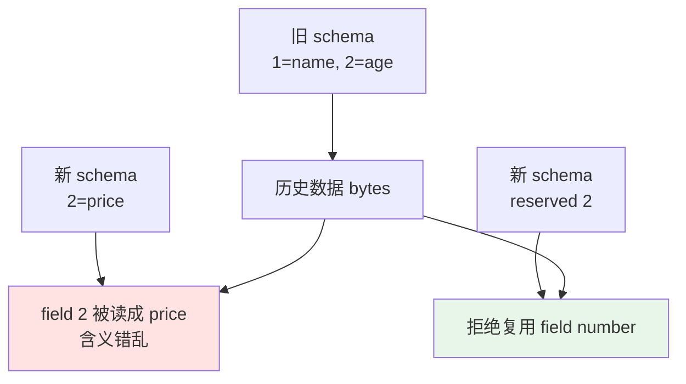

[Protocol Buffers](https://developers.google.com/protocol-buffers/docs/overview) 比 XML 更快、更小。这句话没啥问题，但如果只记住“更快更小”，就有点儿像只背结论，真正有意思的是：**它到底少写了什么、怎么少写的、为什么还能兼容 schema 演进。**

顺便探讨一下序列化的机制。

1. Table of Contents, ordered
{:toc}

# 语言规范

Proto3 语言规范见官方文档：[Protocol Buffer Language Guide](https://developers.google.com/protocol-buffers/docs/proto3)。

# Java 使用

- [Protocol Buffer Java Tutorial](https://developers.google.com/protocol-buffers/docs/javatutorial)
- [Java Generated Code Guide](https://developers.google.com/protocol-buffers/docs/reference/java-generated)

# Encoding

## 普通的序列化

先看一个简单粗暴的逐字段序列化例子：

```java
@Data
@NoArgsConstructor
@AllArgsConstructor
public class ApkInfo implements IWritable {

    /**
     * ad content id
     */
    private Long adContentId;

    /**
     * app name
     */
    private String appName;

    /**
     * app package name
     */
    private String packageName;

    /**
     * app version
     */
    private String appVersion;

    /**
     * app size(bytes)
     */
    private long appSizeByte;

    /**
     * md5 of this app
     */
    private String appMd5;

    @Override
    public void writeFields(DataOutput out) throws IOException {
        out.writeLong(adContentId);
        StringWritable.writeStringNull(out, appName);
        StringWritable.writeStringNull(out, packageName);
        StringWritable.writeStringNull(out, appVersion);
        out.writeLong(appSizeByte);
        StringWritable.writeStringNull(out, appMd5);
    }

    @Override
    public void readFields(DataInput in) throws IOException {
        adContentId = in.readLong();
        appName = StringWritable.readStringNull(in);
        packageName = StringWritable.readStringNull(in);
        appVersion = StringWritable.readStringNull(in);
        appSizeByte = in.readLong();
        appMd5 = StringWritable.readStringNull(in);
    }

    @Override
    public IWritable copyFields(IWritable value) {
        throw new UnsupportedOperationException();
    }
}
```

这个序列化有几个特点：

1. `read` 和 `write` 必须按照固定顺序，二者必须一致，否则凉凉。因为实际上**二者默认都按某个顺序序列化/反序列化**，这种默认不能不一致。
2. 不管某个 field 有没有数据，都要写一个数据。比如 long 类型的 `adContentId`，如果不存在，也必须写个 0。
3. 写 String 的代码如下：具体实现是先写一个 boolean 标识 String 是否存在，如果存在再写长度。这个长度是 String 按照**某种编码方式**编码后的字节数，最后再写字节。

```java
public static int writeString(DataOutput out, String s) throws IOException {
    if (s.length() == 0) {
        return CDataOutputStream.writeVInt(0, out);
    } else {
        int targetLength = s.length() * 3;
        byte[] bytes = Limit.createBuffer(targetLength);
        int length = encode(s, bytes, 0);
        int lengthSize = CDataOutputStream.writeVInt(length, out);
        out.write(bytes, 0, length);
        return lengthSize + length;
    }
}
```

具体每一个对象（long、int 等）是怎么被写到 DataOutput 里的，有赖于 DataOutput 的实现。如果用 `DataOutputStream`，它的 `writeLong` 方法实际是这么做的：

```java
/**
 * Writes a <code>long</code> to the underlying output stream as eight
 * bytes, high byte first. In no exception is thrown, the counter
 * <code>written</code> is incremented by <code>8</code>.
 *
 * @param      v   a <code>long</code> to be written.
 * @exception  IOException  if an I/O error occurs.
 * @see        java.io.FilterOutputStream#out
 */
public final void writeLong(long v) throws IOException {
    writeBuffer[0] = (byte)(v >>> 56);
    writeBuffer[1] = (byte)(v >>> 48);
    writeBuffer[2] = (byte)(v >>> 40);
    writeBuffer[3] = (byte)(v >>> 32);
    writeBuffer[4] = (byte)(v >>> 24);
    writeBuffer[5] = (byte)(v >>> 16);
    writeBuffer[6] = (byte)(v >>>  8);
    writeBuffer[7] = (byte)(v >>>  0);
    out.write(writeBuffer, 0, 8);
    incCount(8);
}
```

就是把 long 的八个字节转成 byte，再把 byte 数组（8 byte）交给底层的 OutputStream。

> 题外话：如果 DataOutputStream 包裹的底层 OutputStream 是 ByteArrayOutputStream，那么就是把这个字节数组使用 `System.arraycopy` 拷到自己内部的 byte array 里。

这样的话，即使根本没有 long 值，也还是写了 8 byte：

1. 占地方。
2. 根本不知道 long 字段的确就是 0，还是默认值 0。

这类方案的本质像数组：



顺序就是协议的一部分。顺序一乱，协议就“您哪位”了。

## protobuf 序列化

protobuf 的编码细节见官方文档：[Protocol Buffer Encoding](https://developers.google.com/protocol-buffers/docs/encoding)。

protobuf 的核心变化是：**不再用字段顺序当协议，而是用 field number + wire type 标识字段。**



### 序列化数字：Varint

**`int32`、`int64`、`uint32`、`uint64`、`sint32`、`sint64`、`bool`、`enum` 这些，protobuf 全都序列化为自定义的 Varint（可变 int）。**

具体规则：

- 字节最高有效位（Most Significant Bit, MSB）为 1，代表数还没序列化完，后面的字节还是该数字的内容。
- MSB 为 0，代表结束。

取出这些字节，去掉 MSB，再逆序（因为 protobuf 采用 Little-Endian 编码），拼接字节，翻译成数字即可。

所以一个字节有 7 bit 是用来编码数字的。对于 int32 来讲，一个数字如果小于 128，1 byte 就够了。如果很大，需要 5 byte（原本 4 byte 能表示的数，每个 byte 都有一个 bit 用来当 MSB 了，自然得 5 byte 来表示）。

| 数值分布 | `int32` 定长 | Varint |
|----------|--------------|--------|
| 大量小正数 | 固定 4 byte | 常常 1-2 byte |
| 接近 `2^28` 或更大 | 固定 4 byte | 可能 5 byte |
| 大量负数且用 `int32` | 固定 4 byte | 可能很长 |

所以除非全是很大的数值，否则 Varint 平均下来肯定比恒定 4 byte 的 int 要短。

> 又是定长编码 vs. 变长编码。

**如果确定全都是大于 `2^28` 的数（需要 5 byte），建议用 `fixed32` 类型，恒定 4 byte，和普通 int 一样。`fixed64` 同理。**

### key-value pair

protobuf 序列化的是 key-value pair。

比如 `.proto` 里定义的是 `int32 number = 5;`，实际 `number` 值为 1024，那么在语义上存储的就是：**key 为 5 + value 的类型 Varint**（`int32` 属于 Varint），**value 为 1024** 的 pair。

value 1024 的序列化就是上面的 Varint。

key 要解决两个问题：怎么标识 field number 是 5，又怎么标识 value 是 Varint？

#### key

首先，定义 key 的值为：`(field_number << 3) | wire_type`，即：

- 末尾 3 bit 用来标识 value 的类型（所以 protobuf 实际序列化时的 value 只能有 8 种 wire type）。
- 前面的 bit 代表 field number。

这样只要读到 key，就能知道这个字段的 field number，也能按照所标识的 wire type 取到 value 并反序列化。

**其次，由于 key 本身是作为一个数字存储，所以 key 的字节也是以 Varint 存储的。**

这样就可以读出 key-value pair 的内容：field number 和 value 值。

此时只有两个东西不知道：

- 字段名称。这个需要在 `.proto` 源文件里根据 field number 找到。
- 字段的实际类型，比如 Varint 到底是 int 还是 long。这个也需要在源文件里找到。

> 所以如果一个新 protobuf（新增了字段）协议序列化后的字节被一个老 protobuf（没有新增字段）反序列化，新增字段也能被读过；但如果显示为肉眼可见的 JSON，可能就是“field number : value”，因为不知道该字段名。类型的话基本能确定，虽然到底是 long 还是 int 分不清，倒是无所谓了。

**因为用的是 key-value pair，如果一个 field 没有值，就不用序列化它。而且，序列化和反序列化也不需要都按照相同 field 顺序。**

### int32 vs. sint32：ZigZag 编码

**负数如果看做原码，实际是很大的一个数，所以如果用 protobuf 的 `int32` 存储负数，是需要 5 个字节的。ZigZag 编码能解决这个问题，它能把所有负数映射为非负数**：`0 = 0, -1 = 1, 1 = 2, -2 = 3, 2 = 4, -3 = 5, 3 = 6 ...`。**output 为自然数，input 为所有整数，但是 input 的映射规则从 0 开始不断左右左右横跳**，很 zigzag！

映射下来：

1. 非负数 x 全都映射为非负偶数 2x：0、2、4、6、8。
2. 负数则全部映射为非负奇数：1、3、5、7、9。



**所有负数都用正数表示了，-1 就不需要用 5 byte 表示，1 byte 就够了。**

ZigZag 用函数表示很简单：

```java
return v < 0 ? (- 2 * v  - 1) : 2 * v
```

但是用补码表示更高效：[`(n << 1) ^ (n >> 31)`](https://gist.github.com/mfuerstenau/ba870a29e16536fdbaba)。

`sint32` 就是使用 ZigZag 将数值全变为正数，再用变长编码序列化为字节。

**所以当数值会出现大量负值时，使用 `sint32` / `sint64` 会明显优于 `int32` / `int64`。**

### field number

`field number` 对 protobuf 来说相当重要。官方文档关于 reserved 的说明见：[Proto3 reserved fields](https://developers.google.com/protocol-buffers/docs/proto3#reserved)。

如果一个 field number 不用了，可以删掉，但必须声明为 reserved，别让后来人用了。否则如果用新协议反序列化老协议的字节，同样 field number 的含义、类型都变了，就出错了。



> field name 最好也 reserved，别让后来人用了。主要是如果转成 JSON 用，JSON 是按照名字来标识字段的。同名字段在新老协议里含义却不一样，相互转换时又尴尬了。

### packed

protobuf encoding 文档关于 repeated 的说明见：[repeated elements encoding](https://developers.google.com/protocol-buffers/docs/encoding#optional)。

field number 如此重要，那么新协议把旧协议的一个 `repeated string` 的 `repeated` 直接删掉，旧协议序列化后的字节能不能被新协议（相同 field number，却是 optional string）反序列化？可以的！

**protobuf 规定 repeated 字段存储时，可以一个 key 后面跟上所有 value（packed 模式），也可以分开成多个 key-value pair 存储。二者逻辑上等效。**

所以假设 repeated 字段作为多个 key-value pair 存储，取一个 pair，正好反序列化为一个 string。如果再取一个 pair，protobuf 实现为覆盖之前的 string。所以反序列化之后，repeated 的值相当于只留了最后一个。

**protobuf3 默认对 repeated primitive type 进行 packed 存储，省得写多个 key 费空间。**

# 优点

所以 protobuf 的优势可以拆开看：

| 优势 | 来自哪里 |
|------|----------|
| 省空间 | Varint、ZigZag、字段没值不写、packed repeated |
| 顺序灵活 | key-value pair 不依赖字段顺序 |
| schema 演进 | field number 稳定，废弃字段 reserved |
| 速度快 | 直接读字节并按 wire type 翻译，不像 XML 一样先构建结构树 |

更具体地说：

- Varint 存小数字省空间。
- `sint32` / `sint64` 用 ZigZag 存负数更省。
- `fixed32` / `fixed64` 存很大的数更稳。
- 一个字段没有值就不需要序列化：key-value pair。
- 序列化和反序列化每一个字段的顺序不用相同：key-value pair 不需要在意顺序。

# 感想

## 数据结构决定灵活度：List vs. Map

序列化的决策方式决定了实现的优缺点：

1. 上面举例的普通序列化方式，共同保持了相同字段顺序，**保存字段的方式有点儿像数组**，字段顺序不可变更。而且字段没有值时也必须 write 一个值，比如 false，代表这个字段值不存在。
2. JSON 使用 name-value pair 作为序列化/反序列化的约定，**保存字段的方式类似于 map**。所以不存在字段顺序问题。同 name 就是同一个 field，但是一个 name 如果不用了，不能随便复用。否则后续别人新加了同样 name 的字段，新老协议在相互转换时 name 含义不一致，其实就出错了。
3. protobuf 使用 field number-value 作为序列化/反序列化的约定，**保存字段的方式类似于 map**，也不存在字段顺序问题。同样 field number 如果不用了，也不要复用；或者说可以删，但必须声明为 reserved，不让后来者用。

## 数据结构决定效率

在同样存储一个数字的实现上，不同实现方式差别也很大：

1. 普通序列化方式在存储数字时，就是直接序列化该数字。
2. protobuf 使用自定义 Varint，用变长编码存储数字，平均下来体积要小很多。`sint32` 使用 ZigZag 存储负值，又是一个很大的改进。

这些对序列化的灵活度和存储效率影响极大。

还有一个不错的中文参阅：[IBM developerWorks 的 Protocol Buffers 介绍](https://www.ibm.com/developerworks/cn/linux/l-cn-gpb/)。
