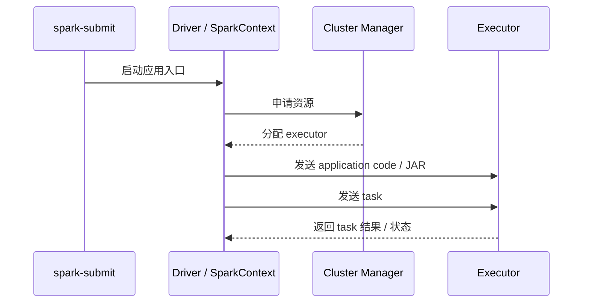
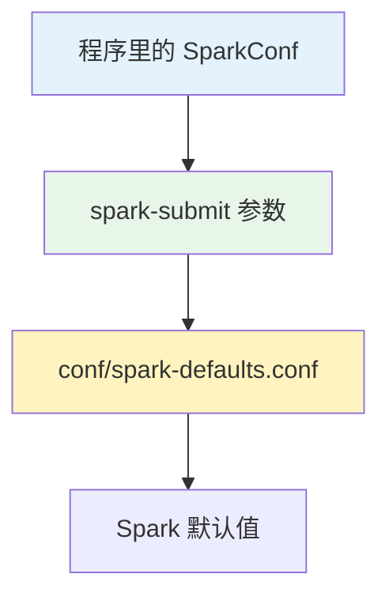

这篇记录 Spark 跑任务时用到的集群组件，以及任务是怎么通过 `spark-submit` 提交出去的。

1. Table of Contents, ordered
{:toc}

# 组件

Spark 提交任务的主线其实很短：



对应到术语：

| 概念 | 粒度 | 说明 |
|------|------|------|
| application | 最大 | 一次 Spark 应用运行，包含 driver 和一组 executor |
| job | action 触发 | `save`、`collect` 等 action 产生的并行计算任务 |
| stage | shuffle 切分 | 比 job 更小的 task 集合，类似 MapReduce 的 map/reduce stage |
| task | 最小调度单元 | 真正发送到 executor 上跑的任务 |

简单说：`SparkContext` 连上 cluster manager，申请 executor，把应用代码发过去，再把一个个 task 发给 executor 跑。

# 任务提交：spark-submit

使用的是 `spark-submit` 脚本。一般会把自己的程序打成一个胖包（uber jar），Maven 里就是用 assembly 或 shade 插件。

## 提交参数

```bash
./bin/spark-submit \
  --class <main-class> \
  --master <master-url> \
  --deploy-mode <deploy-mode> \
  --conf <key>=<value> \
  --verbose \
  ... # other options
  <application-jar> \
  [application-arguments]
```

核心就两组：**主类、集群、部署方式、配置；jar 和主类参数。**

### `--master`

| 模式 | 示例 | 说明 |
|------|------|------|
| local | `local` | 单线程 |
| local[N] | `local[4]` | N 个线程 |
| local[*] | `local[*]` | 线程数与本机核数相同 |
| standalone | `spark://localhost:7077` | Spark 自带 cluster manager |
| standalone HA | `spark://HOST1:PORT1,HOST2:PORT2` | 带 standby master 的 standalone 集群 |
| YARN | `yarn` | 通过 Hadoop 配置找到 ResourceManager |
| Mesos | `mesos://HOST:PORT` | Mesos 集群 |
| Kubernetes | `k8s://HOST:PORT` | Kubernetes 集群 |

> 当集群用 YARN 的时候，只需填 `yarn`，无需指定 YARN 地址。Spark 要用 HDFS，需要 Hadoop 配置；Hadoop 配置里自然有 YARN 配置。

### `--deploy-mode`

部署方式决定 **driver 在哪儿启动**：是在提交任务的机器上，还是在集群里。

| deploy mode | driver 位置 | 优点 | 缺点 |
|-------------|-------------|------|------|
| client | 提交任务的机器 | 输入输出和 console 相关，尤其适合 REPL，比如 `spark-shell` | 如果提交机和 executor 不在同一个局域网，driver/executor 网络开销会很大 |
| cluster | 集群内部 | driver 和 executor 更靠近，网络开销更小 | executor 侧输出不直接显示在提交端 |

默认是 client mode。这个名字也挺直白：提交任务的机器看起来就是 cluster 的一个 client。

## 配置优先级

Spark 配置大致按下面的优先级覆盖：



比如 `conf/spark-defaults.conf`：

```bash
spark.master            spark://5.6.7.8:7077
spark.executor.memory   4g
spark.eventLog.enabled  true
spark.serializer        org.apache.spark.serializer.KryoSerializer
```

**`spark-submit` 指定 `--verbose` 可以看出配置到底来自哪里。**

`spark-submit` 的 `--conf, -c PROP=VALUE` 是一种比较通用的配置入口，可以指定任意 Spark configuration。这些 configuration 如果太常用，也会被单独挑出来做成独立参数，比如：

```bash
--conf spark.driver.extraJavaOptions="-Djava.io.tmpdir=/disk1/liuhaibo/tmp" \
--driver-java-options '-Djava.io.tmpdir=/disk1/liuhaibo/tmp'
```

效果是一样的。可以使用 `spark-submit.sh --help` 查看：

```bash
--conf, -c PROP=VALUE       Arbitrary Spark configuration property.

--driver-java-options       Extra Java options to pass to the driver.
```

## 依赖

### `--jars`：说实话没必要

`--jars` 指定 jar 包，逗号分隔。jar 会被发送到 cluster。

- `file:`：driver 上的绝对路径。
- `hdfs:` / `http:` / `ftp:`：jar 的路径，大家都去下载。
- `local:`：从每个 executor 的本地加载。**打 jar 包用这个省时间。**

### `--packages` 和 `--repositories`：正确姿势

`--packages` 和 `--repositories` 也都是逗号分隔。它们指定 Maven 坐标和仓库地址，让依赖从 Maven repo 里下载。

如果依赖能用 Maven 坐标表达，优先用 `--packages`，比到处扔 jar 清爽很多。

# cluster manager 类型

| 类型 | 说明 |
|------|------|
| standalone | Spark 自带的简单 cluster manager |
| yarn | Hadoop 2 提供的 resource manager |
| mesos | Apache Mesos |
| 其他 | Kubernetes、Nomad 等 |

> **注意是 cluster manager，所以它们都是运行在集群上的。** 本地模式不运行在集群上；standalone 模式虽然名字像“单机”，但它是运行在集群上的 Spark 自带 manager。

## standalone

standalone 模式是 Spark 额外提供的一个简单部署方式，用于在集群上跑 Spark，而不是跑在现成的 YARN 或 Mesos 上。

**所以 standalone 也是一个基于集群的 cluster manager，不是本地模式。**

### 启动

使用 Spark 提供的 `sbin` 下的脚本启动。比如启动一个 master，就可以在 [http://localhost:8080](http://localhost:8080) 查看 Spark 集群信息：

```bash
Spark Master at spark://DESKTOP-T467619.localdomain:7077

URL: spark://DESKTOP-T467619.localdomain:7077
Alive Workers: 0
Cores in use: 0 Total, 0 Used
Memory in use: 0.0 B Total, 0.0 B Used
Applications: 0 Running, 0 Completed
Drivers: 0 Running, 0 Completed
Status: ALIVE
```

> 这是 Spark 的 cluster manager，有自己的管理界面，而不是 Hadoop 的 YARN 管理界面。

## YARN

YARN 模式下，`--master` 不写 ResourceManager 地址，只写 `yarn`。官方文档的描述很直接：

> Unlike other cluster managers supported by Spark in which the master’s address is specified in the --master parameter, in YARN mode the ResourceManager’s address is picked up from the Hadoop configuration. Thus, the --master parameter is yarn.

这也解释了为什么跑在 YARN 上时，Hadoop 配置比 `--master` 里的地址更关键。
