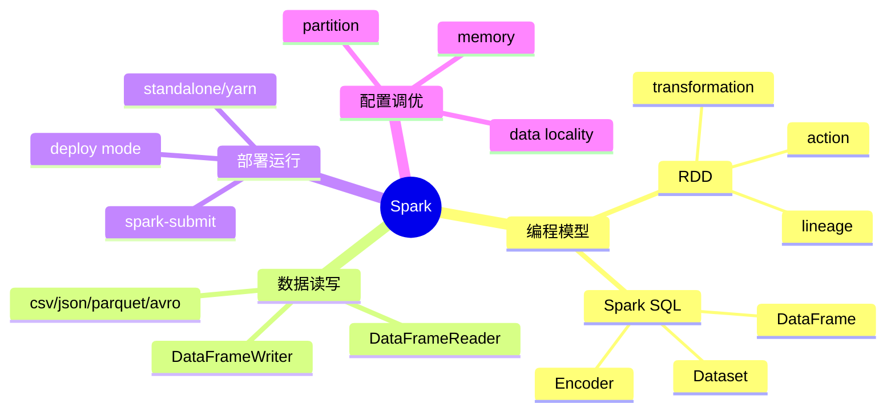

Spark 学习当然可以先看书，拿到一些基本概念。不过 Spark 官网已经提供了足量的、覆盖各个方面的学习资料，更重要的是这些内容都非常新，这一点是书本没法比的。

所以这篇不打算把官网再抄一遍，而是把“先看什么、后看什么、每块解决什么问题”汇总一下，方便后面系统学习。

1. Table of Contents, ordered
{:toc}

# 学习路线

先把 Spark 拆成几条线，会比上来就啃一堆 API 清楚很多：

最开始先看 **programming guide**，理解 RDD、DataFrame、Dataset 到底是什么；然后看 **cluster/deploying**，弄明白 driver、executor、cluster manager 怎么协作；最后再看配置和调优，否则很容易陷入“参数很多但不知道在调什么”的懵逼现场。

# 官网资料

## docs 下的入口

- overview：[Spark 官方文档入口](https://spark.apache.org/docs/latest/index.html)，也是其他各类文档的汇集处。
- programming guides：主要就是 Spark、RDD、Spark SQL、DataFrame、Dataset 相关的几篇。
  - [x] [Quick Start](https://spark.apache.org/docs/latest/quick-start.html)
  - [x] [RDD Programming Guide](https://spark.apache.org/docs/latest/rdd-programming-guide.html)
  - [x] [Spark SQL, DataFrames and Datasets Guide](https://spark.apache.org/docs/latest/sql-programming-guide.html)
  - [Spark Streaming Programming Guide](https://spark.apache.org/docs/latest/streaming-programming-guide.html)：Kafka 通过 Spark Streaming 落地到 HDFS 等场景，需要的时候再看。
- api：主要看 Scala API，PySpark 暂时用得不多。
  - [Scala API](https://spark.apache.org/docs/latest/api/scala/org/apache/spark/index.html)
  - [PySpark API](https://spark.apache.org/docs/latest/api/python/pyspark.html)
- Deploying：任务提交、Spark 运行模式等。这下面的文章都挺重要，基本都要看。
  - [x] [Cluster Mode Overview](https://spark.apache.org/docs/latest/cluster-overview.html)
  - [x] [Submitting Applications](http://spark.apache.org/docs/latest/submitting-applications.html)
  - [x] [Standalone Mode](http://spark.apache.org/docs/latest/spark-standalone.html)
  - [x] [Running on YARN](http://spark.apache.org/docs/latest/running-on-yarn.html)
- More：配置、调优、监控、安全等，深入之后再逐步补。
  - [x] [Spark Configuration](https://spark.apache.org/docs/latest/configuration.html)

## 非 docs 下的有用链接

- [Spark Examples](https://spark.apache.org/examples.html)
- [Spark developer tools](https://spark.apache.org/developer-tools.html)

# 论文和分享

- [Apache Spark Architecture 分享](https://www.slideshare.net/AGrishchenko/apache-spark-architecture)
- [MapReduce and Spark 课程 slides](https://cs.stanford.edu/~matei/courses/2015/6.S897/slides/mr-and-spark.pdf)
- [RDD 论文：Resilient Distributed Datasets](https://cs.stanford.edu/~matei/papers/2012/nsdi_spark.pdf)

RDD 论文值得单独看。很多 API 记不住其实问题不大，关键是要知道 **RDD 为什么能容错：它记录的是 lineage，而不是每一步都把中间结果落盘**。理解这个，后面看 transformation/action、shuffle、persist 才不会只剩背单词。

# 其他资料

- [DataFlair 的 Spark 教程](https://data-flair.training/blogs/spark-tutorial/)：看起来貌似还可以，适合查漏补缺。

# 总结

Spark 的学习主要分三块：

| 主线 | 要解决的问题 | 重点资料 |
|------|--------------|----------|
| Spark SQL / RDD / DataFrame / Dataset | 怎么表达计算、怎么做转换、怎么读写结构化数据 | quick start、RDD guide、SQL guide |
| 部署运行 | driver 在哪儿、executor 在哪儿、怎么通过 `spark-submit` 提交任务 | cluster overview、submitting applications、standalone、yarn |
| 配置调优 | partition、memory、locality、shuffle 参数到底影响什么 | configuration、tuning |

如果只从 API 开始，会很容易只记住 `groupBy`、`map`、`show` 这些碎片；如果只从部署开始，又会被 driver、executor、cluster manager 绕晕。比较舒服的路线是：**先知道 Spark 用什么抽象表达计算，再知道这些计算怎么被提交到集群，最后再用配置和调优去解释性能现象。**

这应该是第二次比较多地接触 Spark。上次接触应该是一年多之前，就像新接触一个复杂的东西一样，有点儿忙乱，总感觉没深入进去，也对整体没有把握，一种“这不是我要/能用到的技术”的感觉。最近一个月才算是真正了解了 Spark，包括系统学习 Spark 等。当然也只能算是应用层次的深入。Spark 的确复杂，之后应该就可以逐渐深入了解其内部原理了。期待！
