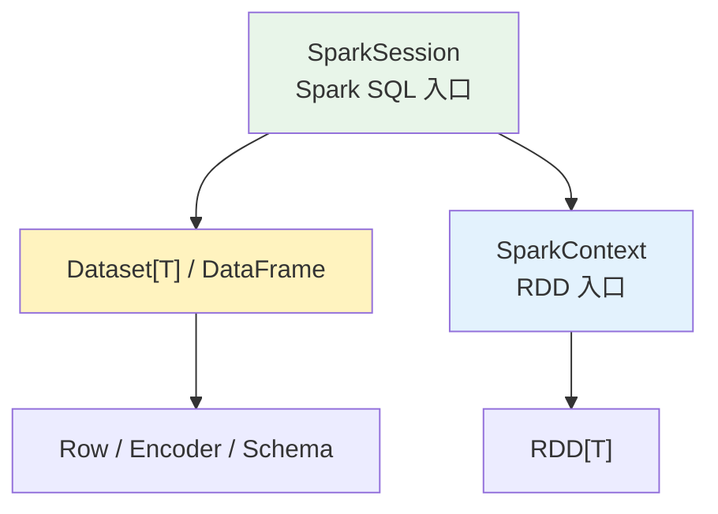
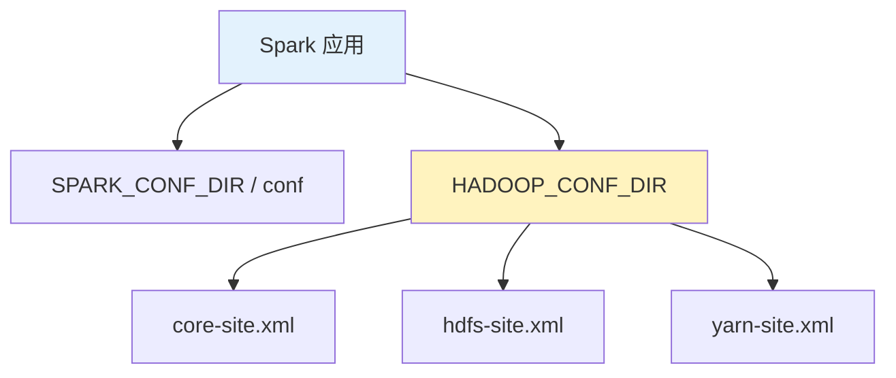

在能独立成章之前，把一些其他关于 Spark 需要记录的东西先写在这里。它们看起来零散，但其实都围绕一个问题：**代码入口、数据入口和配置入口分别在哪里。**

1. Table of Contents, ordered
{:toc}

# SparkContext vs. SparkSession

SparkContext 和 SparkSession 的关系可以先这么看：



## SparkContext：RDD 入口

SparkContext 用于 Spark 2 之前，也仍然是创建 RDD 的基础入口。它适合读一些非结构化数据，构造出 RDD，比如 `sequenceFile`、`textFile`、`parallelize`。

SparkContext 通过 SparkConf 来构建：

```scala
val conf = new SparkConf()
  .setAppName("RetailDataAnalysis")
  .setMaster("spark://master:7077")
  .set("spark.executor.memory", "2g")

val sc = new SparkContext(conf)
```

## SparkSession：Dataset / DataFrame 入口

SparkSession 在 Spark 2 引入，用于读结构化数据，构造 Dataset / DataFrame。SparkSession 内部保存了一个 `sparkContext` 变量，所以它不是替代掉 SparkContext，而是把 SQL、catalog、配置等入口统一起来。

```scala
val spark = SparkSession
  .builder
  .appName("WorldBankIndex")
  .getOrCreate()

spark.conf.set("spark.sql.shuffle.partitions", 6)
spark.conf.set("spark.executor.memory", "2g")
```

参考：[SparkSession vs SparkContext](https://data-flair.training/forums/topic/sparksession-vs-sparkcontext-in-apache-spark/)。

# spark-shell

使用 `spark-shell` 本地验证程序正确性是个不错的方案。

常用参数：

- `--master "local[4]"`
- `--packages com.databricks:spark-avro_2.11:4.0.0,mysql:mysql-connector-java:5.1.42`
- `--repositories http://nexus.corp.youdao.com/nexus/content/groups/public/`

## 本地读文件

```scala
scala> val file = sc.textFile("~/order_detail_json")
file: org.apache.spark.rdd.RDD[String] = ~/order_detail_json MapPartitionsRDD[7] at textFile at <console>:24

scala> file.foreach(println(_))
org.apache.hadoop.mapred.InvalidInputException: Input path does not exist: file:/home/pichu/Utils/spark/spark-2.3.0-bin-hadoop2.7/~/order_detail_json
  at org.apache.hadoop.mapred.FileInputFormat.singleThreadedListStatus(FileInputFormat.java:287)
  at org.apache.hadoop.mapred.FileInputFormat.listStatus(FileInputFormat.java:229)
  at org.apache.hadoop.mapred.FileInputFormat.getSplits(FileInputFormat.java:315)
  at org.apache.spark.rdd.HadoopRDD.getPartitions(HadoopRDD.scala:200)
  at org.apache.spark.rdd.RDD$$anonfun$partitions$2.apply(RDD.scala:253)
  at org.apache.spark.rdd.RDD$$anonfun$partitions$2.apply(RDD.scala:251)
  at scala.Option.getOrElse(Option.scala:121)
  at org.apache.spark.rdd.RDD.partitions(RDD.scala:251)
  at org.apache.spark.rdd.MapPartitionsRDD.getPartitions(MapPartitionsRDD.scala:35)
  at org.apache.spark.rdd.RDD$$anonfun$partitions$2.apply(RDD.scala:253)
  at org.apache.spark.rdd.RDD$$anonfun$partitions$2.apply(RDD.scala:251)
  at scala.Option.getOrElse(Option.scala:121)
  at org.apache.spark.rdd.RDD.partitions(RDD.scala:251)
  at org.apache.spark.SparkContext.runJob(SparkContext.scala:2092)
  at org.apache.spark.rdd.RDD$$anonfun$foreach$1.apply(RDD.scala:921)
  at org.apache.spark.rdd.RDD$$anonfun$foreach$1.apply(RDD.scala:919)
  at org.apache.spark.rdd.RDDOperationScope$.withScope(RDDOperationScope.scala:151)
  at org.apache.spark.rdd.RDDOperationScope$.withScope(RDDOperationScope.scala:112)
  at org.apache.spark.rdd.RDD.withScope(RDD.scala:363)
  at org.apache.spark.rdd.RDD.foreach(RDD.scala:919)
  ... 49 elided
```

如果使用相对路径，**相对的是当前 working directory**，不是 shell 启动前脑子里想的那个目录。这个坑挺朴素，也挺烦。

## 本地读 Avro（读为 Dataset）

```scala
scala> val avroRdd = spark.read.format("com.databricks.spark.avro").load("/home/pichu/data/tmp/*.avro")
org.apache.spark.sql.AnalysisException: Failed to find data source: com.databricks.spark.avro. Please find an Avro package at http://spark.apache.org/third-party-projects.html;
  at org.apache.spark.sql.execution.datasources.DataSource$.lookupDataSource(DataSource.scala:630)
  at org.apache.spark.sql.DataFrameReader.load(DataFrameReader.scala:190)
  at org.apache.spark.sql.DataFrameReader.load(DataFrameReader.scala:174)
  ... 49 elided
```

使用 Avro 需要加额外依赖：

```bash
bin/spark-shell --master "local[4]" --packages com.databricks:spark-avro_2.11:4.0.0,mysql:mysql-connector-java:5.1.42 --repositories http://nexus.corp.youdao.com/nexus/content/groups/public/
```

启动时会去 Central 里找依赖，不过貌似是用 Ivy resolve 的依赖……

```scala
scala> val avrodf = spark.read.format("com.databricks.spark.avro").load("/home/pichu/data/tmp/*.avro")
avrodf: org.apache.spark.sql.DataFrame = [guid: string, abtest: string ... 50 more fields]
```

# 创建 DataFrame 和 RDD

## DataFrame：SparkSession

SparkSession 提供结构化数据入口：

| 方法 | 返回 | 说明 |
|------|------|------|
| `range()` | DataFrame | 快速创建一列数字，列名为 `id` |
| `createDataFrame(rowRDD, schema)` | DataFrame | RDD[Row] + StructType |
| `createDataset[T](data: RDD[T])` | Dataset[T] | 需要 Encoder[T] |
| `createDataset[T](data: Seq[T])` | Dataset[T] | shell 里很方便 |
| `read` | DataFrameReader | 加载各种格式的数据，返回 DataFrame |

`range()` 示例：

```scala
scala> spark.range(start = 0, end = 10, step = 3).show
+---+
| id|
+---+
|  0|
|  3|
|  6|
|  9|
+---+
```

RDD 转 DataFrame 的两种方式，要么 RDD 存的是 Row，手动指定 schema；要么 RDD 存的是 T，自动使用 T 的 Encoder 转成 Dataset。

> 这个 T 的 Encoder 可以自动提供，比如复杂类 case class；基础类型也有 Spark 提供的 Encoder；自定义类又不是 case class，就只能自己提供了。。。

```scala
import spark.implicits._

case class Person(name: String, age: Long)

val data = Seq(Person("Michael", 29), Person("Andy", 30), Person("Justin", 19))
val ds = spark.createDataset(data)

ds.show()
// +-------+---+
// |   name|age|
// +-------+---+
// |Michael| 29|
// |   Andy| 30|
// | Justin| 19|
// +-------+---+
```

基础类型的 Seq 也可以很方便地在 spark-shell 里创建 Dataset：

```scala
scala> spark.createDataset(1 to 5).show
+-----+
|value|
+-----+
|    1|
|    2|
|    3|
|    4|
|    5|
+-----+
```

> `range` 生成的 DataFrame 列名是 `id`，`createDataset` 生成的是 `value`，因为它不只可以用 int。

## RDD：SparkContext

SparkContext 提供 RDD 入口：

| 方法 | 说明 |
|------|------|
| `range()` | 类似 SparkSession 的 `range`，不过重载没那么多 |
| `parallelize[T](seq, numSlices)` | 从 Seq 构造 RDD |
| `textFile()` | 读文本 |
| `sequenceFile()` | 读 sequence file |

```scala
scala> sc.range(0, 10).toDF.show
+-----+
|value|
+-----+
|    0|
|    1|
|    2|
|    3|
|    4|
|    5|
|    6|
|    7|
|    8|
|    9|
+-----+
```

```scala
scala> sc.parallelize(1 to 5).toDF.show
+-----+
|value|
+-----+
|    1|
|    2|
|    3|
|    4|
|    5|
+-----+
```

# Configuration

Spark 如果要读 HDFS，一定要有：

- `hdfs-site.xml`：HDFS 配置，client 需要用，比如 namenode、datanode 的位置、replicas=3 等。
- `core-site.xml`：HDFS 的 name，比如 `fs.defaultFs`。

如果 Spark 运行在 YARN 上，一定要有：

- `yarn-site.xml`

Spark 默认配置地址是 `conf/spark-env.sh`。

可以设置 `SPARK_CONF_DIR` 修改默认配置地址。

Spark 的配置里可以设置 `HADOOP_CONF_DIR`，相当于给 Spark 指定了上述 Hadoop 配置文件。



# 测试

- MRUnit
- hadoop-minicluster
