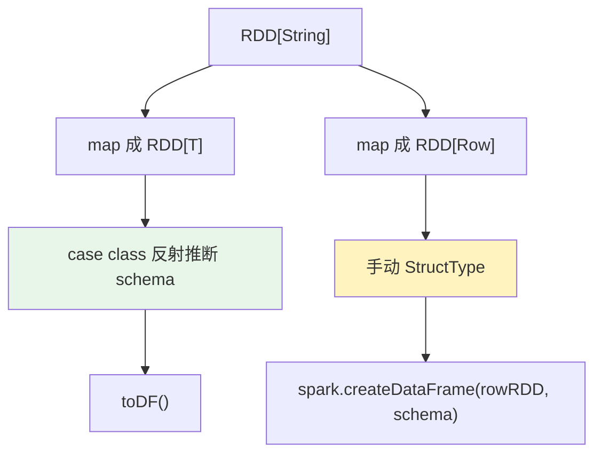

这篇主要介绍 RDD、Dataset/DataFrame 三者之间的转换，以及一些使用上的差异。

1. Table of Contents, ordered
{:toc}

# basic

先放一张总图，避免一开始被三个名字绕住：

```mermaid
flowchart LR
    RDD["RDD[T]<br/>分布式对象集合"] -->|加 schema| DF["DataFrame<br/>Dataset[Row]"]
    DF -->|as[T] + Encoder| DS["Dataset[T]<br/>强类型结构化数据"]
    DS -->|toDF| DF
    DF -->|rdd| RDDRow["RDD[Row]"]

    Schema["StructType / StructField"] --> DF
    Encoder["Encoder[T]"] --> DS

    style RDD fill:#e3f2fd
    style DF fill:#fff3bf
    style DS fill:#e8f5e9
```

| 抽象 | 数据形态 | schema | 类型安全 | 典型入口 |
|------|----------|--------|----------|----------|
| `RDD[T]` | 对象集合 | 没有内置 schema | 取决于 T，但没有列级 API | `SparkContext` |
| `DataFrame` | `Dataset[Row]` | 有 `StructType` | 字段名错误多在运行时暴露 | `SparkSession.read` |
| `Dataset[T]` | 强类型对象集合 | 由 Encoder/schema 支撑 | 编译期更强 | case class + `Encoder[T]` |

## RDD[T]

RDD 出现得早，一般用于**非结构化的数据**。比如通过 SparkContext 的 `sequenceFile` 方法读取一个 sequence file，或者通过 `parallelize` 从一个 Seq 构建 RDD。

**RDD 没有 schema，没有结构。一般 RDD 转成有结构的 DataFrame 后只有一列 column，名为 `value`。**

## DataFrame

DataFrame 适用于**结构化的数据**。比如通过 SparkSession 的 `read` 获得 DataFrameReader，再用 `csv`、`json`、`parquet` 等方法读取相应的数据文件。或者使用 `format` 指定一个类型，再 `load` 文件，比如读取 Avro：

```scala
spark.read.format("com.databricks.spark.avro").load("xxx")
```

很显然，不管怎么搞，读的都是格式化的数据：要么自带 schema（CSV、JSON、Avro），要么指定 schema（比如通过 `schema(schemaString: String)`，但目前还不太用到）。

另外，DataFrameReader 还提供了一个 `text(paths: String*)` 方法，返回 DataFrame。它的 schema 以 `value` 为 column 名。比如读一个普通纯文本文件：

```text
scala> spark.read.text("licenses/LICENSE-protobuf.txt")
res1: org.apache.spark.sql.DataFrame = [value: string]

scala> val df = spark.read.text("licenses/LICENSE-protobuf.txt")
df: org.apache.spark.sql.DataFrame = [value: string]

scala> df.printSchema
root
 |-- value: string (nullable = true)

scala> df.schema
res7: org.apache.spark.sql.types.StructType = StructType(StructField(value,StringType,true))

scala> df.show(3, false)
+---------------------------------------------------------------------------+
|value                                                                      |
+---------------------------------------------------------------------------+
|This license applies to all parts of Protocol Buffers except the following:|
|                                                                           |
|  - Atomicops support for generic gcc, located in                          |
+---------------------------------------------------------------------------+
only showing top 3 rows
```

**普通 RDD 转成的 DataFrame 也就这样。**

## DataSet[T]

Dataset 和 DataFrame 基本一样，API 都合并了。Dataset 是所含内容为 T 的数据集，**一般和 case class 一起用，T 就是 class 的类型。** 获取数据后可以直接用 `T.xxx` 获取某个字段内容。

## DataFrame vs. Dataset

DataFrame 虽然是结构化的，但是其中的值并没有对应一个用户自定义 class，所以 Spark 定义了一个 class 名为 Row，作为 DataFrame 的行数据结构。**所以 DataFrame 等价于 Dataset[Row]。**

Row 又没有定义具体 field，具体包含哪些字段，没法像 case class 那样直接取出来，所以只能通过 Row 的各种方法，比如 `getAs[Int](xxx)`，来获取属性 `xxx` 的内容。而 Dataset 定义了 case class 后，可以更自然地获得每一行的信息。

> DataFrame 是 Dataset 这个泛型的一种具象化：T 为 Row。**类似于 `List<String>` 和 `List<T>` 的区别。**

# DataFrame 取值

DataFrame 获取字段示例：

```text
scala> df.show
+----+-------+
| age|   name|
+----+-------+
|null|Michael|
|  30|   Andy|
|  19| Justin|
+----+-------+

scala> df.foreach(line => println(line.getAs[String]("name")))
Michael
Andy
Justin

scala> df.foreach(line => println(line.getAs[String]("age")))
null
30
19

scala> df.foreach(line => println(line.getAs[Int]("age")))
null
30
19

scala> df.foreach(line => println(line.getAs[Int]("name")))
Michael
Andy
Justin
```

常用方式：

- 取列：`$(xxx)`、`col(xxx)`、`your_df(xxx)`。
- 取行的某一个字段：`getAs[T](xxx)`。

这里顺便提醒一句：别把 DataFrame 的字段名字符串当成“类型安全”。字段名写错、schema 不匹配，很多时候都是运行时才爆。

# 相互转换

## Dataset -> DataFrame: `toDF`

这个很简单，因为只是把 case class 封装成 Row，相当于抹掉 class 的属性：

```scala
import spark.implicits._

val dataFrame = dataset.toDF
```

> toDF(): DataFrame
>
> Converts this strongly typed collection of data to generic Dataframe. In contrast to the strongly typed objects that Dataset operations work on, a Dataframe returns generic Row objects that allow fields to be accessed by ordinal or name.

## DataFrame -> Dataset: `as[T]`

```scala
import spark.implicits._

// 定义类的字段名和类型
case class Person(age : Int, name : String) extends Serializable
val ds = df.as[Person]
```

这就要定义一个 case class，为每一列对应一个具体类型的属性。然后使用 `as` 方法（`org.apache.spark.sql.Encoder` 里的）转换。

> `as[U](implicit arg0: Encoder[U]): Dataset[U]`
>
> Returns a new Dataset where each record has been mapped on to the specified type. The method used to map columns depend on the type of U:
>
> - When U is a class, fields for the class will be mapped to columns of the same name (case sensitivity is determined by spark.sql.caseSensitive).
> - When U is a tuple, the columns will be mapped by ordinal (i.e. the first column will be assigned to _1).
> - When U is a primitive type (i.e. String, Int, etc), then the first column of the DataFrame will be used.

一定要导入 SparkSession 实例的 implicits：`import spark.implicits._`，因为用了里面的 Encoder 来进行对象转换。

## RDD -> DataFrame

**DataFrame 转为 RDD 后的类型是 `org.apache.spark.rdd.RDD[org.apache.spark.sql.Row]`。但有趣的地方在于，想把该类型再直接转为 DataFrame 不行：`error: value toDF is not a member of org.apache.spark.rdd.RDD[org.apache.spark.sql.Row]`。**

原因是 RDD 转 DataFrame **必须要有 schema**。可通过两种方式搞定 schema：要么 Spark 自己推断 schema，要么程序员手动指定 schema。



### 方法一：使用反射推断 schema

定义一个 case class：

> The case class defines the schema of the table. The names of the arguments to the case class are read using reflection and become the names of the columns.

参考：[Inferring the Schema Using Reflection](https://spark.apache.org/docs/latest/sql-getting-started.html#inferring-the-schema-using-reflection)。

步骤：

1. 一般读到的 RDD 是 `RDD[String]`，要先转为 `RDD[T]`，T 是一个 case class。
2. 调用 `toDF`。

```scala
// For implicit conversions from RDDs to DataFrames
import spark.implicits._

// Create an RDD of Person objects from a text file, convert it to a Dataframe
val peopleDF = spark.sparkContext
  .textFile("examples/src/main/resources/people.txt")
  .map(_.split(","))
  .map(attributes => Person(attributes(0), attributes(1).trim.toInt))
  .toDF()
```

一个自己的例子：

```text
scala> case class DummyAvro(s: String)
defined class DummyAvro

scala> avrodf.rdd.map(x => DummyAvro(x.toString)).toDF.show(2, false)
+--------------------------+
|s                         |
+--------------------------+
```

**此时的 column name 是 case class 的属性。**

当然，把 Row 搞成基本类型，比如 String（使用 Row 的 `toString` 方法）也是可以的：

```text
scala> avrodf.rdd.map(x => x.toString).toDF.show(2, false)
+--------------------------+
|value                     |
+--------------------------+
```

此时 DataFrame 只有一个 column：`value`。

或者直接搞一个 Tuple：

```scala
val whodf = whoami.map{
    map => (map.getOrElse("guid", ""), map.getOrElse("action", ""), map.getOrElse("unit", ""), map.getOrElse("type", ""), map.getOrElse("date", ""), map.getOrElse("keyfrom", ""))
}.toDF("guid", "action", "unit", "type", "date", "keyfrom")
```

另外，如果将一个 DataFrame 转为另一个 DataFrame，后者也是需要 Encoder 的。比如这里给 `Dataset[Map[K, V]]` 定义了一个 Encoder：

```scala
// No pre-defined encoders for Dataset[Map[K,V]], define explicitly
implicit val mapEncoder = org.apache.spark.sql.Encoders.kryo[Map[String, Any]]
// Primitive types and case classes can be also defined as
// implicit val stringIntMapEncoder: Encoder[Map[String, Any]] = ExpressionEncoder()

// row.getValuesMap[T] retrieves multiple columns at once into a Map[String, T]
teenagersDF.map(teenager => teenager.getValuesMap[Any](List("name", "age"))).collect()
// Array(Map("name" -> "Justin", "age" -> 19))
```

Dataset 对 `map` 的定义：

```scala
def map[U](func: MapFunction[T, U], encoder: Encoder[U]): Dataset[U]
(Java-specific) Returns a new Dataset that contains the result of applying func to each element.

def map[U](func: (T) => U)(implicit arg0: Encoder[U]): Dataset[U]
(Scala-specific) Returns a new Dataset that contains the result of applying func to each element.
```

**Encoder 是必须的，只不过是显式还是 implicit 调用的问题。**

Row 的 `getValuesMap` 方法定义如下：

```scala
def getValuesMap[T](fieldNames: Seq[String]): Map[String, T]
Returns a Map consisting of names and values for the requested fieldNames For primitive types if value is null it returns 'zero value' specific for primitive ie. 0 for Int - use isNullAt to ensure that value is not null
```

### 方法二：指定一个自定义的 schema

步骤：

1. 一般读到的 RDD 是 `RDD[String]`，要先转为 `RDD[Row]`。
2. 创建一个匹配 Row 结构的 `StructType` schema。
3. 转换时指定该 schema。

```scala
import org.apache.spark.sql.Row
import org.apache.spark.sql.types._

// RDD
val peopleRDD = spark.sparkContext.textFile("examples/src/main/resources/people.txt")

// The schema is encoded in a string
val schemaString = "name age"

// Generate the schema based on the string of schema
val fields = schemaString.split(" ")
  .map(fieldName => StructField(fieldName, StringType, nullable = true))
// 创建 schema
val schema = StructType(fields)

// RDD[String] 转换为 RDD[Row]: Convert records of the RDD (people) to Rows
val rowRDD = peopleRDD
  .map(_.split(","))
  .map(attributes => Row(attributes(0), attributes(1).trim))

// 应用 schema，RDD[Row] 转为 DF
val peopleDF = spark.createDataFrame(rowRDD, schema)
```

参考：[Programmatically Specifying the Schema](https://spark.apache.org/docs/latest/sql-getting-started.html#programmatically-specifying-the-schema)。

### 方法总结

结合以上两种转换方法，可总结如下：

- `RDD[String]` 转 `RDD[T]` 或 `RDD[Row]`。
- 如果是 case class RDD，直接 `toDF` 就好了，会自动推断 schema。
- 如果是 `RDD[Row]`，Row 又不是基本类型，使用 `SparkSession#createDataFrame(RDD, StructType)` 手动指定 schema。

**`DataFrame#schema` 和它的 `Row#schema` 是同一个 schema。**

### 一个关于 implicit 的理解

因为当时对 Scala implicit 还不是很了解，所以这里先保留一个不太严谨但很有用的理解：

1. RDD 的 `toDF` 实际是使用 `DatasetHolder` 的 `toDF`。
2. `DatasetHolder` 本身就 hold 一个 Dataset。也就是说，RDD 调用 `toDF` 之前其实已经可以转为 Dataset 了。
3. 使用的是 SparkSession 的 implicits，它继承了 `SQLImplicits` 类：**A collection of implicit methods for converting common Scala objects into [[Dataset]]s.** 所以它就是将 Scala 对象转为 Dataset 的。它里面有一堆 Encoder，比如 `StringEncoder`。`rddToDatasetHolder` 方法使用相应的 Encoder 将 RDD 转为 Dataset。

在 Encoder 的接口 `org.apache.spark.sql.Encoder` 文档中，有这样的描述：

```scala
 * == Scala ==
 * Encoders are generally created automatically through implicits from a `SparkSession`, or can be
 * explicitly created by calling static methods on [[Encoders]].
 *
 *
 *   import spark.implicits._
 *
 *   val ds = Seq(1, 2, 3).toDS() // implicitly provided (spark.implicits.newIntEncoder)
 *
```

Java 不能用隐式转化，所以就很清晰：

```java
 * == Java ==
 * Encoders are specified by calling static methods on [[Encoders]].
 *
 *
 *   List<String> data = Arrays.asList("abc", "abc", "xyz");
 *   Dataset<String> ds = context.createDataset(data, Encoders.STRING());
 *
```

当然，熟悉之后你也可以说比 Scala 更麻烦……

## DataFrame -> RDD: `rdd`

直接调用 `rdd` 方法即可，返回 `RDD[T]`。

```text
scala> avrodf.rdd
res6: org.apache.spark.rdd.RDD[org.apache.spark.sql.Row] = MapPartitionsRDD[15] at rdd at <console>:26
```

> rdd: RDD[T]
>
> Represents the content of the Dataset as an RDD of T.

DataFrame 转为 RDD 后的类型是 `org.apache.spark.rdd.RDD[org.apache.spark.sql.Row]`。

DataFrame 虽然转成了 RDD，但是取出后的对象 T 还是 Row 类型，所以它依然有结构：

```text
scala> avrodf.rdd.first.schema
res27: org.apache.spark.sql.types.StructType = StructType(StructField(guid,StringType,true), StructField(abtest,StringType,true), StructField(advertising,StringType,true), StructField(alg_id,LongType,true), StructField(apps,ArrayType(StringType,true),true), StructField(course_category_id,StringType,true), StructField(course_sub_category_ids,StringType,true), StructField(date,StringType,true), StructField(dict_role,StringType,true), StructField(dict_state,StringType,true), StructField(dict_state_pred,StringType,true), StructField(dict_tags,ArrayType(StringType,true),true), StructField(end,StringType,true), StructField(flTag,StringType,true), StructField(image,StringType,true), StructField(imei,StringType,true), StructField(infoid,StringType,true), StructField(ip,StringType,true), StructF...
```

依然可以用 `getAs[T](xx)` 取字段。

也就是说，**RDD 也可以存储结构化数据**，甚至可以存 case class 对象。如果把数据取出来，就是 case class 对应的对象。**使用 RDD 存储结构化数据不方便的地方，大概是 RDD 中没有 Dataset 的 `select`、`show` 等直接操作结构化对象的方法，因为它没有为结构化数据设计这些方法。**

# RDD 和 Dataset/DataFrame 在一些方法上的区别

RDD 除了不具备 `select` 等结构化数据 DataFrame 才有的方法，其他一些名称相同的方法其实也是有差异的。

比如 `groupByKey`：

- RDD 中，`groupByKey` 操作的是类型为 Tuple2 的 PairRDD，没有参数，直接将同 key 的 value 聚合起来，返回 `RDD[(K, Iterable[V])]`。
- Dataset 中，数据都是表，一列一列的，而非 Tuple2。`groupByKey[K](func: (T) => K)(implicit arg0: Encoder[K]): KeyValueGroupedDataset[K, T]` 传入一个 map 函数，根据 Dataset 的数据类型 T 产生一个 K 类型的 key（**自造一个 key**），然后返回一个 K、T pair 的 Dataset。这个 Dataset 的类型是 `KeyValueGroupedDataset[K, T]`。**接下来才可以对它做一些按 key 操作的行为；而 PairRDD 一开始就可以根据 key 作出 group by 的行为。** 鉴于这个 grouped dataset 已经是按 key group 过的，所以不再有类似 `groupByKey` 的操作，而是有一些其他方法，比如 `mapGroups[U](f: (K, Iterator[V]) => U)(implicit arg0: Encoder[U]): Dataset[U]`，将 `(K, Iterator[V])` 映射为 U。

一个例子：

```scala
my_df.groupByKey(x => x.getAs[String]("pv_device_id"))
    .mapGroups(
        (k, iter) => (k, iter.map(x => x.getAs[String]("package_name")).toSeq.toSet.toSeq)
    )
    .toDF("deviceId", "packageNames")
    .sort(size($"packageNames").desc)
    .show(1000, false)
```

这段逻辑分两步：

- 先自造一个 key：`pv_device_id`。
- 再将 `pv_device_id` 和 T 的 pair 映射为 `pv_device_id` 和 `package_name` 的 pair。

# Ref

- [A Tale of Three Apache Spark APIs: RDDs, DataFrames, and Datasets](https://databricks.com/blog/2016/07/14/a-tale-of-three-apache-spark-apis-rdds-dataframes-and-datasets.html)
- [中文翻译版](https://zhuanlan.zhihu.com/p/35440915)
- [Spark SQL：Interoperating with RDDs](https://spark.apache.org/docs/latest/sql-getting-started.html#interoperating-with-rdds)

总体来说，**从 RDD 到 DataFrame 到 Dataset，数据越来越结构化，类型越来越强**。强类型需要严格的语法，同时会带来非常大的好处：编译时错误检查。

举例而言：

- RDD 基本不存在操作列的方法，这是结构化的数据抽象 DataFrame/Dataset 才有的。RDD 通过 `map` 去操作 value，具体操作得对不对，要运行时才知道。
- 如果在 DataFrame 中调用了 API 之外的函数，编译器可以发现这个错。不过，如果你使用了一个不存在的字段名字，那就要到运行时才能发现错误。
- Dataset API 都是用 lambda 函数和 JVM 类型对象表示的，所有不匹配的类型参数都可以在编译时发现。而且在使用 Dataset 时，一部分分析错误也会提前暴露，能节省开发者的时间和代价。
