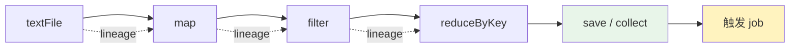
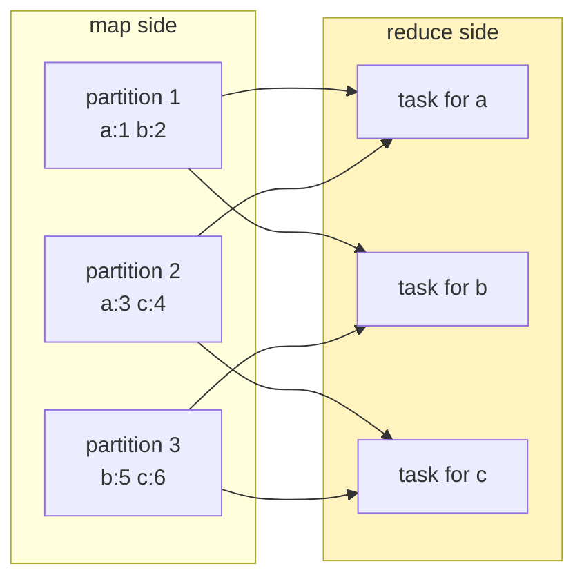
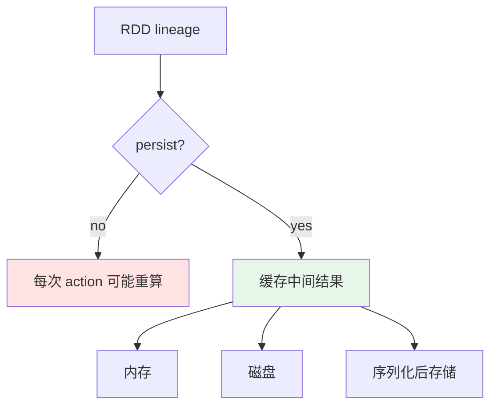

RDD 操作大体上和 Dataset 是一致的，比如创建、transformation、action 等。但是还是有区别：`groupByKey` 在 RDD 中应用于 Tuple2 类型，在 Dataset 中则可以按照任意指定 column group by。另外二者的序列化方式貌似也是不同的，RDD 使用 Java 或 Kryo，Dataset 使用具体的 Encoder，支持在不反序列化的情况下进行 filter 等操作。

1. Table of Contents, ordered
{:toc}

# RDD 操作

## 创建 RDD

创建 RDD 多使用 SparkContext（Spark 2.0 之前，SparkContext + RDD 是标配）：

- `parallelize(Seq)`
- `textFile`
- `wholeTextFiles`
- `sequenceFile`

这些都是 SparkContext 的方法。

## 存储 RDD

RDD 有以下直接存储数据的方法，当然不如 Avro 等格式效率高：

- `saveAsObjectFile`：Save this RDD as a SequenceFile of serialized objects. 使用的是 Java 对象序列化方式。
- `saveAsTextFile`：Save this RDD as a text file, using string representations of elements.

RDD 中也有一个 `sparkContext` 变量，和 SparkSession 一样。

## transformation 和 action

RDD 的核心特征是 **transformation lazy，action 触发执行**：



常见的 PairRDD transformation 在 `PairRDDFunctions[K, V]` 上：

- `reduceByKey(func: (V, V) => V): RDD[(K, V)]`：`(T, T) => T`。
- `foldByKey(zeroValue: V)(func: (V, V) => V): RDD[(K, V)]`：相比 `reduceByKey` 还要有个初始 zero value。
- `aggregateByKey[U](zeroValue: U)(seqOp: (U, V) => U, combOp: (U, U) => U)(implicit arg0: ClassTag[U]): RDD[(K, U)]`：类似 `foldByKey`，但能改变返回值类型。
  - 参数 1：新的返回类型的零值。
  - 参数 2：同 partition 内的原有类型 V 怎么吸收进类型 U。
  - 参数 3：不同 partition 之间的 U 怎么合并。

比如有一个 pair RDD：

```scala
val pairs: RDD[(String, Int)] = sc.parallelize(Array(("a", 3), ("a", 1), ("b", 7), ("a", 5)))
```

把它按 key 聚合，值收集为 set：

```scala
val sums: RDD[(String, HashSet[Int])] = pairs.aggregateByKey(new HashSet[Int])(_ += _, _ ++= _)
```

> **RDD 里的 `reduceByKey` 和 Dataset 里的 `reduceByKey` 是两回事。** 名字像，抽象层不一样，这种 API 命名真的很会给人挖坑。

那些不带 `byKey` 的版本：

- `reduce`
- `fold`
- `aggregate`

其实就是把整个 RDD（没有 key）当做同一个 key 去聚合，最终结果就是 **整个 `RDD[T]` 被转换为一个单值 T 或 U**。

# 常见误操作

RDD 是 Tuple2 时，经常有一个误操作：

```scala
scala> val rdd = sc.wholeTextFiles("licenses")
rdd: org.apache.spark.rdd.RDD[(String, String)] = licenses MapPartitionsRDD[1] at wholeTextFiles at <console>:24

scala> rdd.map((k, v) => k).foreach(println)
<console>:26: error: missing parameter type
Note: The expected type requires a one-argument function accepting a 2-Tuple.
      Consider a pattern matching anonymous function, `{ case (k, v) =>  ... }`
       rdd.map((k, v) => k).foreach(println)
                ^
<console>:26: error: missing parameter type
       rdd.map((k, v) => k).foreach(println)
```

原因很简单：`map` 的函数是个单参数函数，传入 T，map 为 U。这里 T 指代的是 Tuple2：

```scala
scala> rdd.map(t => t._1).foreach(println)
file:/home/win-pichu/Utils/spark/spark-2.4.6-bin-hadoop2.7/licenses/LICENSE-join.txt
file:/home/win-pichu/Utils/spark/spark-2.4.6-bin-hadoop2.7/licenses/LICENSE-AnchorJS.txt
file:/home/win-pichu/Utils/spark/spark-2.4.6-bin-hadoop2.7/licenses/LICENSE-CC0.txt
```

或者使用花括号和 `case`：

```scala
scala> rdd.map({ case (k, v) => k }).foreach(println)
```

我们自己转换成 Tuple2 的 RDD 也一样：

```scala
scala> val file = sc.textFile("licenses/LICENSE-protobuf.txt")
file: org.apache.spark.rdd.RDD[String] = licenses/LICENSE-protobuf.txt MapPartitionsRDD[5] at textFile at <console>:24

scala> val filePair = file.map(line => (line, 1))
filePair: org.apache.spark.rdd.RDD[(String, Int)] = MapPartitionsRDD[7] at map at <console>:25

scala> filePair.map(t => t._1).foreach(println)
```

## 输出所有数据

想按序输出 RDD 所有元素，必须都 `collect` 到 driver 里（注意 driver 可能 OOM）：

```scala
scala> rdd.sortByKey(true).map(t => t._1).collect.foreach(println)
```

否则：

- 对于 local 运行模式，会无序输出，因为哪个 executor 先输出不一定。
- 对于 cluster 运行模式，可能不输出到 driver 端，因为 executor 的输出不直接显示在 driver 端。

## 重新分区

关于 `coalesce` 和 `repartition`：

```scala
scala> filePair.saveAsTextFile("tmp-data/protobuf")

scala> filePair.coalesce(1).saveAsTextFile("tmp-data/protobuf-coalesce")

scala> filePair.repartition(4).saveAsTextFile("tmp-data/protobuf-repartition")
```

结果：

```text
win-pichu@DESKTOP-T467619:~/Utils/spark/spark-2.4.6-bin-hadoop2.7/tmp-data
% tree                                                                                              20-06-17 - 22:41:21
.
├ protobuf
│   ├ part-00000
│   ├ part-00001
│   └ _SUCCESS
├ protobuf-coalesce
│   ├ part-00000
│   └ _SUCCESS
└ protobuf-repartition
    ├ part-00000
    ├ part-00001
    ├ part-00002
    ├ part-00003
    └ _SUCCESS

3 directories, 10 files
```

# shuffle

To organize all the data for a single `reduceByKey` reduce task to execute, Spark needs to perform an all-to-all operation. It must read from all partitions to find all the values for all keys, and then bring together values across partitions to compute the final result for each key. **This is called the shuffle.**



以下操作会发生 shuffle：

- repartition
  - `repartition`
  - `coalesce`
- `XByKey`
  - `groupByKey`
  - `reduceByKey`
- join
  - `join`
  - `cogroup`

Spark 使用了类似 MapReduce 里的 map 和 reduce 的操作。map 的数据存储在内存中，供 reduce 用。在 shuffle 时，因为要使用内存里的数据结构来组织数据记录，会消耗大量内存。如果内存不够用，会先溢出到硬盘上，reduce 再从硬盘上读。临时文件会存储在 `spark.local.dir` 指定的地方。

# 共享变量

因为可读写的共享变量在不同 task 间同步很费劲，也不高效，所以 Spark 只提供了两种共享变量：一种只读，一种只可累加。

| 类型 | 方向 | 适合场景 |
|------|------|----------|
| Broadcast | driver 发给 executor，executor 只读缓存 | 大的只读查询表 |
| Accumulator | executor 累加，driver 汇总最终值 | 计数、指标汇总 |

## Broadcast

Broadcast 是只读的。把一个变量创建为 Broadcast 的好处是：只向各个 executor 发送一次，就会被 executor 缓存下来，供以后使用。适用于一些大的只读查询表。

常规变量作为函数的一部分，每次发送函数到 executor 时都要重新发一遍这些变量。

```scala
scala> val broadcastVar = sc.broadcast(Array(1, 2, 3))
broadcastVar: org.apache.spark.broadcast.Broadcast[Array[Int]] = Broadcast(0)

scala> broadcastVar.value
res0: Array[Int] = Array(1, 2, 3)
```

## Accumulator

累加器（可以 +1，也可以加其他值，并不是只能 +1）由 driver 发给 executor。task 执行完毕后，driver 还能汇集累加器的最终值。

# persist

RDD 的 persist 本质是在 lineage 重算和存储成本之间做选择：



| StorageLevel | 含义 |
|--------------|------|
| `MEMORY_ONLY` | 直接把 Java 对象放内存 |
| `MEMORY_ONLY_SER` | 先序列化再存内存，用 CPU 换 RAM |
| `MEMORY_AND_DISK` | 内存放不下再落磁盘 |
| `MEMORY_AND_DISK_SER` | 序列化后存内存，放不下再落磁盘 |
| `DISK_ONLY` | 只放磁盘 |
| `MEMORY_ONLY_2`, `MEMORY_AND_DISK_2` | 存 2 份，防止一份丢了还要重算，适用于土豪集群 |
| `OFF_HEAP` | 堆外内存 |
