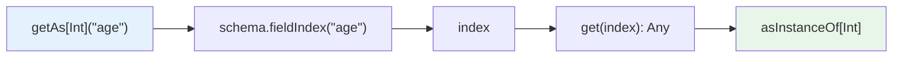
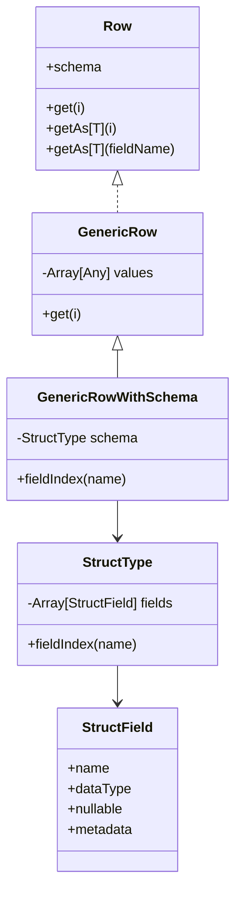

Row 可以粗略理解为 Spark 预设好的“通用行对象”。当不想为 `Dataset[T]` 定义 case class 时，就用 `Dataset[Row]`，也就是 DataFrame。

1. Table of Contents, ordered
{:toc}

# 定义

[Spark Row API](https://spark.apache.org/docs/latest/api/scala/index.html#org.apache.spark.sql.Row) 里，Row 是一个接口和伴生对象。它代表一行数据，核心信息包括：

- `size` / `length`：这一行包含几个元素。
- `schema`：各个元素对应的 schema。
- `get(index): Any`：根据 index 获取元素。

这个 `get` 是个很重要的方法，因为其他 `getXX` 基本都是基于它实现的：

- `getAs[T](Int)`: `def getAs[T](i: Int): T = get(i).asInstanceOf[T]`
- `getAs[T](String)`: `def getAs[T](fieldName: String): T = getAs[T](fieldIndex(fieldName))`
- `getBoolean()` 等：这一类基于 `getAs[T]`，所以也是基于 `get`

获取字段有两种 `getAs`：一种使用 index，另一种使用 name。比如 `getAs[Int]("age")`。它其实是先通过 name 在 schema 中的位置获取 index，再根据 index 获取字段值。



# 实现

## 数据

Row 最基础的实现类 `GenericRow`，内部保存了一个 `Array[Any]`，然后实现了 `get(index)` 方法：

```scala
override def get(i: Int): Any = values(i)
```

所以，可以把 Row 的核心理解为一个能保存 Any 类型的数组。

> `GenericRow` 没有实现 `fieldIndex` 方法，而 Row 使用它获取 name 在 schema 中的 index，借以实现 `getAs[T](String)`。所以 `GenericRow` 应该不是 Row 的常用类，因为它没有 schema，没法实现和 schema 相关的功能，比如 `fieldIndex`。

## schema

`GenericRowWithSchema` 是一个带 schema 的实现。它继承了 `GenericRow`，多加了一个 schema，也就是 `StructType`。

```scala
override def fieldIndex(name: String): Int = schema.fieldIndex(name)
```

因为它有 schema，所以就能按字段名取值。

整体关系如下：



### StructType

[StructType](https://spark.apache.org/docs/latest/api/scala/index.html#org.apache.spark.sql.types.StructType) 本质上也是一个数组：`Array[StructField]`。这个数组保存在它的 `fields` 属性中。

另外 StructType 也是 DataType 的子类，而 StructField 的类型就是 DataType，所以 StructType 可以嵌套：

```scala
import org.apache.spark.sql._
import org.apache.spark.sql.types._

val innerStruct =
  StructType(
    StructField("f1", IntegerType, true) ::
    StructField("f2", LongType, false) ::
    StructField("f3", BooleanType, false) :: Nil)

val struct = StructType(
  StructField("a", innerStruct, true) :: Nil)

// Create a Row with the schema defined by struct
val row = Row(Row(1, 2, true))
```

上面定义了一个名为 `struct` 的结构体，它的字段 `a` 是一个新的 struct。对应到数据，就是 Row 的嵌套：上述 `row` 就是 Row 套 Row。

- `a` 对应一个 Row。
- 这个 Row 中，`f1` 对应 1。
- `f2` 对应 2。
- `f3` 对应 true。

### StructField

[StructField](https://spark.apache.org/docs/latest/api/scala/index.html#org.apache.spark.sql.types.StructField) 是一个结构体，包含：

- `name`：名称，比如 `bid`。
- `dataType`：`DataType` 类型，是 Spark SQL 的基本数据类型，比如 String 等。**也可以是 StructType，所以 StructType 就可以嵌套了：StructType 中的一个 StructField 可以是一个 StructType。**
- `nullable`：是否可以是 null。
- `metadata`：`Metadata` 类型，本质上是一个 Map wrapper。嗯，它就是一个 map，很多 k-v 组成了 metadata 吧。

# 获取数据和 schema

所以：

- 获取一个 Row 的 schema：`row.schema`。
- 想知道 schema 的名称，比如 `bid`、`click`、`age` 等：`row.schema.fields.map(field => field.name)`。

一个以 Zeppelin table 格式输出 Dataset 的样例：

```scala
val show_zp_table = (dataset: org.apache.spark.sql.Dataset[org.apache.spark.sql.Row]) => {
    val title = dataset.schema.fields.map(x => x.name).mkString("\t")
    val content = dataset.collect().map(x => x.mkString("\t")).mkString("\n")

    print("%table\n" + title + "\n" + content)
}
```

这里分两步：

1. 获取所有字段名称，使用 tab 分隔。主要用了 Array 的 `mkString`，将 array 使用 separator 连接为 String。
2. 获取每一行，字段之间用 tab 分隔，行与行之间用换行符分隔。这里要知道 Row 是有 `mkString` 方法的，和 Array 的 `mkString` 类似；实际上 `mkString` 的实现就是获取所有元素，构造一个 Array，然后调用 Array 的 `mkString`。

最后别忘了这个现实：Row 很灵活，但也意味着很多错误要到运行时才发现。能用 case class 表达清楚时，Dataset[T] 的强类型还是香一点儿。
