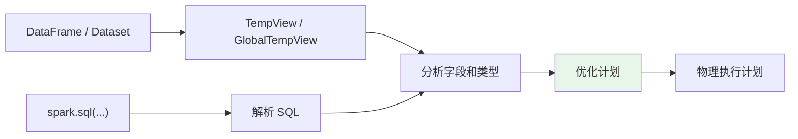
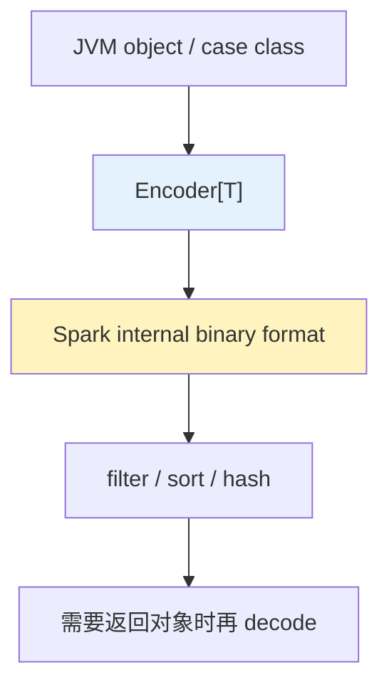
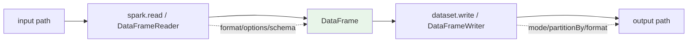

Spark SQL is a Spark module for structured data processing. Unlike the basic Spark RDD API, the interfaces provided by Spark SQL provide Spark with more information about the structure of both the data and the computation being performed. Internally, Spark SQL uses this extra information to perform extra optimizations.

和 RDD 相比，上面的描述反映了几个关键信息：**结构化数据处理、API 提供数据和计算的结构信息、Spark 使用这些结构信息做额外优化。**

1. Table of Contents, ordered
{:toc}

# sql

SQL 查询原来是这么操作的：

```scala
// Register the DataFrame as a SQL temporary view
df.createOrReplaceTempView("people")

val sqlDF = spark.sql("SELECT * FROM people")
sqlDF.show()
// +----+-------+
// | age|   name|
// +----+-------+
// |null|Michael|
// |  30|   Andy|
// |  19| Justin|
// +----+-------+
```

TempView 是 session-scoped，session 结束就消失。GlobalTempView 是跨 session 的，Spark 应用结束才消失。

Global temporary view is tied to a system preserved database `global_temp`, and we must use the qualified name to refer it, e.g. `SELECT * FROM global_temp.view1`.

```scala
// Register the DataFrame as a global temporary view
df.createGlobalTempView("people")

// Global temporary view is tied to a system preserved database `global_temp`
spark.sql("SELECT * FROM global_temp.people").show()
// +----+-------+
// | age|   name|
// +----+-------+
// |null|Michael|
// |  30|   Andy|
// |  19| Justin|
// +----+-------+

// Global temporary view is cross-session
spark.newSession().sql("SELECT * FROM global_temp.people").show()
// +----+-------+
// | age|   name|
// +----+-------+
// |null|Michael|
// |  30|   Andy|
// |  19| Justin|
// +----+-------+
```

这套机制的意思是：DataFrame 不只是 API 对象，也可以注册成 SQL 可见的表。Spark SQL 负责把 SQL 解析、分析、优化，再变成物理执行计划。



# Dataset

Datasets are similar to RDDs, however, **instead of using Java serialization or Kryo they use a specialized Encoder to serialize the objects for processing or transmitting over the network**. While both encoders and standard serialization are responsible for turning an object into bytes, **encoders are code generated dynamically and use a format that allows Spark to perform many operations like filtering, sorting and hashing without deserializing the bytes back into an object**.

所以 Encoder 和 standard serialization 相比，可以做到额外优化：在不反序列化的情况下进行过滤、排序、hash。

> 这一点像 Hadoop 中额外提供的 `RowComparator<T> extends Comparator<T>` 接口。它新增的 compare 接口需要实现一种直接比较序列化后字节的方式，从而做到在不反序列化的情况下比较对象。方法需要指定序列化后的字节数组、开始比较的字节位置、需要比较的字节长度三个参数。



```scala
case class Person(name: String, age: Long)

// Encoders are created for case classes
val caseClassDS = Seq(Person("Andy", 32)).toDS()
caseClassDS.show()
// +----+---+
// |name|age|
// +----+---+
// |Andy| 32|
// +----+---+

// Encoders for most common types are automatically provided by importing spark.implicits._
val primitiveDS = Seq(1, 2, 3).toDS()
primitiveDS.map(_ + 1).collect() // Returns: Array(2, 3, 4)

// DataFrames can be converted to a Dataset by providing a class. Mapping will be done by name
val path = "examples/src/main/resources/people.json"
val peopleDS = spark.read.json(path).as[Person]
peopleDS.show()
// +----+-------+
// | age|   name|
// +----+-------+
// |null|Michael|
// |  30|   Andy|
// |  19| Justin|
// +----+-------+
```

Seq 有 `toDS` 方法，又是通过 implicits 来搞的，肯定也是 `DatasetHolder` 里的 `toDS`。

这么看来，除了基本类型有 Encoder 之外，case class 也会自动创建 Encoder。这个自动生成的 Encoder 甚至还能做到在不反序列化的情况下完成过滤、排序、哈希等操作。

突然想起来 Hadoop 的那个什么方法来着，可以做到这一点。

# Interoperating with RDDs

RDD 想转 DataFrame，`map` 之类的都得自定义或获得一个 Encoder。参考官方文档：[Interoperating with RDDs](https://spark.apache.org/docs/latest/sql-getting-started.html#interoperating-with-rdds)。

## Inferring the Schema Using Reflection

The Scala interface for Spark SQL supports automatically converting an RDD containing case classes to a DataFrame.

看到没看到没。

The case class defines the schema of the table. The names of the arguments to the case class are read using reflection and become the names of the columns.

也就是说：case class 的字段名会被反射出来，成为 DataFrame 的 column name。

## Programmatically Specifying the Schema

没有 case class 时，records 的类型就是 String，也没有 schema 信息：

1. 创建 `RDD[Row]`。
2. 创建 schema：`StructType`。
3. 应用 schema，将 RDD 创建为一个 DataFrame。

Row 可以直接 `Row(attributes(0), attributes(1).trim)` 这样创建对象。

`RDD[String]` 转 `RDD[Row]` 和 `RDD[String]` 转 `RDD[T]`（T 是一个 case class）其实是一样的。不同的是 case class 能使用反射自动获取属性名创建 schema，Row 得自己配上 schema。

# IO

Spark SQL 数据源文档：[Generic Load/Save Functions](https://spark.apache.org/docs/latest/sql-data-sources.html)。



## load

```scala
sparkSession.read.format("xxx").load(path)
```

Spark load file 时必须指定类型，比如全限定名 `org.apache.spark.sql.parquet`；但是对于内置格式，使用简写也可以，比如 `json`、`parquet`、`csv`、`text`、`avro` 等。

load 之前还能指定一些 option：

```scala
spark.read.format("csv")
    .option("header", "true")
    .option("seq", ";")
    .load(path)
```

告诉 Spark 读的时候有 header，分隔符不是逗号而是分号。

所有 CSV option 可参考 Databricks 的数据源文档；原笔记里这里贴的是 Avro 链接，顺手保留一下：[Databricks Avro data source](https://docs.databricks.com/data/data-sources/read-avro.html)。

Spark 源码中也可以窥见这些 option 的使用：[CSVOptions.scala](https://github.com/apache/spark/blob/v2.1.0/sql/core/src/main/scala/org/apache/spark/sql/execution/datasources/csv/CSVOptions.scala#L74)。

所有 datasource 文档见：[Databricks data sources](https://docs.databricks.com/data/data-sources/index.html)。

读的时候支持 filter 和递归读取模式：

```scala
val testGlobFilterDF = spark.read.format("parquet")
  .option("recursiveFileLookup", "true")
  .option("pathGlobFilter", "*.parquet") // json file should be filtered out
  .load("examples/src/main/resources/dir1")
```

## save

```scala
dataset.write.format("xxx").save(path)
```

一般存储时会指定模式，可以用 Enum，也可以直接用 plain text：

| SaveMode | 字符串 | 说明 |
|----------|--------|------|
| `SaveMode.Overwrite` | `"overwrite"` | 文件已存在则覆盖，一般用这个 |
| `SaveMode.Append` | `"append"` | 追加 |
| `SaveMode.ErrorIfExists` | `"error"` / `"errorifexists"` | **默认情况**，如果文件已存在则报错 |
| `SaveMode.Ignore` | `"ignore"` | 如果文件已存在，忽略，既不 overwrite 也不 error |

# DataFrameWriter: partitionBy/bucketBy/sortBy

这些都是 DataFrameWriter 里的方法。

```scala
val df = Seq((2012, 8, "Batman", 9.8),
    (2012, 8, "Hero", 8.7),
    (2012, 7, "Robot", 5.5),
    (2011, 7, "Git", 2.0))
    .toDF("year", "month", "title", "rating")

df.write.mode("overwrite").partitionBy("year", "month").format("avro").save("/tmp/test_dataset")
```

文件会以如下形式存放：

```text
dbfs:/tmp/test_dataset/year=2011/
dbfs:/tmp/test_dataset/year=2012/
```

读的时候**指定到根目录就行了**：

```scala
val data = spark.read.format("avro").load("/tmp/test_dataset")
```

这样存放和直接存 Dataset，在读取后没啥区别，不过看起来在 HDFS 上更“条理化”了。

# 时间（格式）转换

- [Datetime Patterns for Formatting and Parsing](https://spark.apache.org/docs/latest/sql-ref-datetime-pattern.html)
- [Built-in Date and Timestamp Functions](https://spark.apache.org/docs/latest/sql-ref-functions-builtin.html#date-and-timestamp-functions)

# UDF

- [Databricks Scala UDF](https://docs.databricks.com/spark/latest/spark-sql/udf-scala.html)
- [Spark functions.udf API](https://spark.apache.org/docs/latest/api/scala/org/apache/spark/sql/functions$.html#udf[RT](f:()=%3ERT)(implicitevidence$3:reflect.runtime.universe.TypeTag[RT]):org.apache.spark.sql.expressions.UserDefinedFunction)
- [UserDefinedFunction API](https://spark.apache.org/docs/latest/api/scala/org/apache/spark/sql/expressions/UserDefinedFunction.html)

UDF 是**应用于 DataFrame column 的函数（column-based function）**。除了 Spark 定义的那些函数以外，用户还能根据自己的需求自定义一些操作 DataFrame 的函数。

定义一个 UDF 很简单：

1. 定义一个普通函数。
2. 使用 `udf()` 包装一下这个函数。

这个 UDF 就能应用于 Column 了。

注意 UDF 不支持可变参数，即普通函数的参数个数不能是无限个。在 Spark 里内置了零参数 UDF 一直到 10 参数 UDF。这种定义方式有点儿暴力啊……

```scala
import org.apache.spark.sql.functions.{col, udf}

val squared = udf((s: Long) => s * s)
display(spark.range(1, 20).select(squared(col("id")) as "id_squared"))
```
