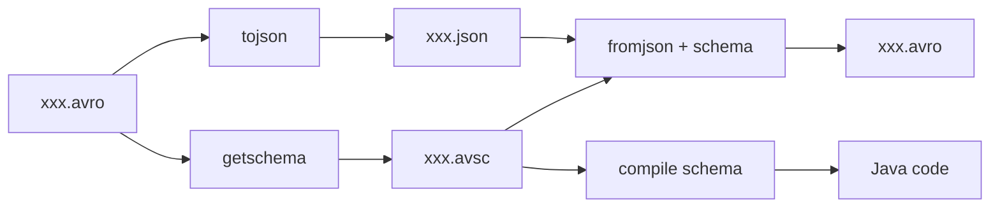

使用 Avro 提供的工具，可以通过命令行直接查看 Avro 文件、查看 Avro schema、Avro 和 JSON 互转，以及生成 Java 代码。

1. Table of Contents, ordered
{:toc}

# avro-tools

Avro release 里有很多东西，`java` 文件夹下有各种工具，`avro-tools` 是其中一个。可以从清华镜像的 [Apache Avro stable java 目录](https://mirrors.tuna.tsinghua.edu.cn/apache/avro/stable/java/) 下载。

它最适合做三类事：



# 命令

## base

```bash
java -jar avro-tools-1.10.0.jar
```

这相当于 help，会显示各个子命令。

## 查看 Avro：tojson

查看 Avro 一般是转成 JSON 再看，要不然二进制也没法看：

```bash
java -jar avro-tools-1.10.0.jar tojson xxx.avro > xxx.json
```

> Avro To XXX，只需要指明 xxx 就行了，所以是 `tojson`。

## 查看 schema：getschema

```bash
java -jar avro-tools-1.10.0.jar getschema xxx.avro
```

## JSON 转 Avro：fromjson

JSON 转 Avro 需要指明 Avro 的 schema 定义文件，也就是 avsc 文件。通过子命令 `fromjson` 的选项 `--schema-file` 指定：

```bash
java -jar avro-tools-1.10.0.jar fromjson --schema-file xxx.avsc xxx.json > xxx.avro
```

> Avro from xxx，只需要指明 xxx 就行了，所以是 `fromjson`。

另外，Avro 也可以使用压缩。比如使用 Snappy 压缩，指定 `--codec`：

```bash
java -jar avro-tools-1.10.0.jar fromjson --codec snappy --schema-file xxx.avsc xxx.json > xxx.avro
```

`fromjson` 的文档：

```bash
pichu@Archer ~/Utils/avro $ java -jar avro-tools-1.10.0.jar fromjson
Expected 1 arg: input_file
Option                  Description
------                  -----------
--codec <String>        Compression codec (default: null)
--level <Integer>       Compression level (only applies to deflate, xz, and
                          zstandard) (default: -1)
--schema [String]       Schema
--schema-file [String]  Schema File
```

## 生成 Java code

> 使用 avro-maven-plugin 可以直接在 Maven 工程里生成 Java 代码，没必要手撸。

手撸命令：

```bash
java -jar avro-tools-1.10.0.jar compile schema user.avsc .
```

这会将指定 avsc 编译为 Java 代码，输出到本目录，代码按照 avsc 里指定的 package 存放。

# Ref

- [Reading and Writing Avro Files From the Command Line](https://www.michael-noll.com/blog/2013/03/17/reading-and-writing-avro-files-from-the-command-line/)
- [avro-tool API](http://avro.apache.org/docs/current/api/java/org/apache/avro/tool/package-summary.html)
- [Avro documentation](http://avro.apache.org/docs/current/)
