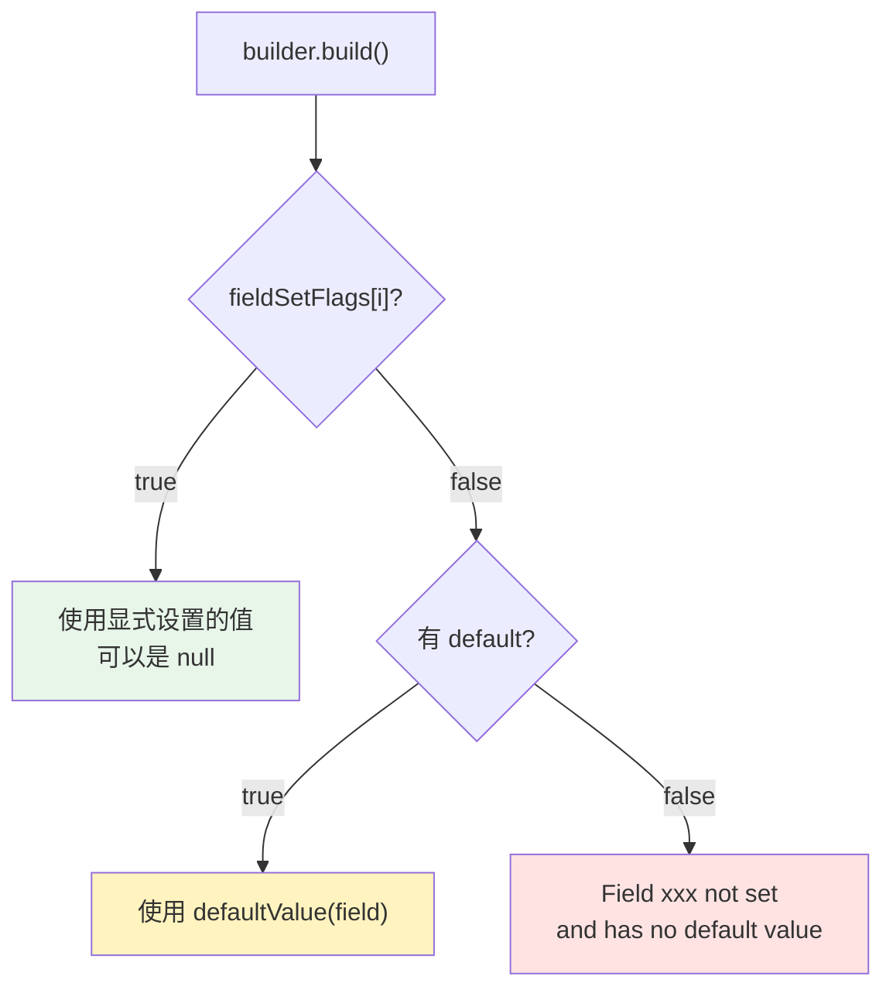
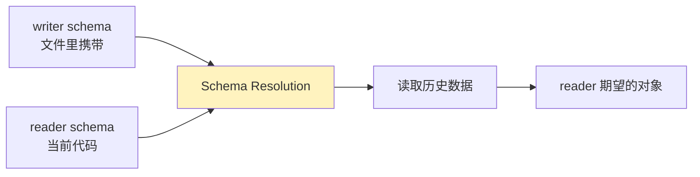

Avro 结合 Java 使用，主要有两条路：

- avsc 编译为 Java 代码，再用生成的类读写对象。
- 不生成代码，直接使用 `GenericRecord` + `Schema` 读写对象。

1. Table of Contents, ordered
{:toc}

# 编译 avsc

可以使用 avro-tools 手动编译 avsc 生成 Java 代码，也可以使用 avro-maven-plugin。

```bash
java -jar avro-tools-1.10.0.jar compile schema user.avsc .
```

会在当前目录下生成 package 目录，里面有生成的 Java 类。

# 创建对象

一般用 builder，但也可以用 constructor。

使用 constructor 创建对象可以只设置需要的属性，但是 using a builder requires setting all fields, even if they are null。

# Avro null value

> 以 Avro 1.7.7 为例。

Avro 允许 null，只要 field type 定义为 `null` 或 union 类型（union 里有 `null`）就行。定义好之后，不管是显式设置 null，还是设置 default 为 null，都是可以的。**Avro 不允许的是没有设置 default，同时也没有显式设置值。null 不 null 倒不是问题的关键。**

Avro 有一个 boolean flag 数组，标志每一个 field 是否已经被显式赋值。每次 set 一个 field 时，它对应的 flag 就会被设为 true。**如果没有赋值，会检查有没有 default；如果没有 default，就会报错。**



假设一个 field 为普通类型 int，也可以为 null，那么可以定义 type 为 union：`["null", "int"]`，default 可以设置成 `null`：

```json
{
  "doc": "range condition",
  "namespace": "com.puppylpg",
  "type": "record",
  "name": "Range",
  "fields": [
    {
      "name": "min",
      "type": [
        "null",
        "int"
      ],
      "default": null
    },
    {
      "name": "max",
      "type": [
        "null",
        "int"
      ],
      "default": null
    }
  ]
}
```

需要注意的是，在 union 里，`null` 一定要放在 int 前面：

- [Stack Overflow 解释](https://stackoverflow.com/a/23387590/7676237)
- [Avro 1.7.7 spec：Unions](https://avro.apache.org/docs/1.7.7/spec.html#Unions)

如果类型为 record，一样的道理，它的类型可以为上面定义的 Range 或 null：

```json
{
  "name": "avgView30Day",
  "type": [
    "null",
    "Range"
  ],
  "default": null,
  "doc": "最近30天media平均观看量"
}
```

这样的话，它就可以 set null 值，也可以不设置值，使用默认 null 值。

## 代码分析

上述定义中，`max` 是这个 record 的第二个值，`fields()[1]` 就是指 max：

```java
public com.youdao.quipu.avro.schema.Range.Builder setMax(java.lang.Integer value) {
  validate(fields()[1], value);
  this.max = value;
  fieldSetFlags()[1] = true;
  return this;
}
```

只要设置值了，flag 就是 true。

最后 build 时，会检查有没有显式设置值。如果没有，就取 default：

```java
public Range build() {
  try {
    Range record = new Range();
    record.min = fieldSetFlags()[0] ? this.min : (java.lang.Integer) defaultValue(fields()[0]);
    record.max = fieldSetFlags()[1] ? this.max : (java.lang.Integer) defaultValue(fields()[1]);
    return record;
  } catch (Exception e) {
    throw new org.apache.avro.AvroRuntimeException(e);
  }
}
```

**此时如果这个 field 没设置 default，`field.defaultValue()` 就会返回 null，会抛 AvroRuntimeException**：Field xxx not set and has no default value。

```java
public Object getDefaultValue(Field field) {
  JsonNode json = field.defaultValue();
  if (json == null)
    throw new AvroRuntimeException("Field " + field
                                   + " not set and has no default value");
  if (json.isNull()
      && (field.schema().getType() == Type.NULL
          || (field.schema().getType() == Type.UNION
              && field.schema().getTypes().get(0).getType() == Type.NULL))) {
    return null;
  }

  // Check the cache
  Object defaultValue = defaultValueCache.get(field);

  // If not cached, get the default Java value by encoding the default JSON
  // value and then decoding it:
  if (defaultValue == null)
    try {
      ByteArrayOutputStream baos = new ByteArrayOutputStream();
      BinaryEncoder encoder = EncoderFactory.get().binaryEncoder(baos, null);
      ResolvingGrammarGenerator.encode(encoder, field.schema(), json);
      encoder.flush();
      BinaryDecoder decoder =
        DecoderFactory.get().binaryDecoder(baos.toByteArray(), null);
      defaultValue =
        createDatumReader(field.schema()).read(null, decoder);

      defaultValueCache.put(field, defaultValue);
    } catch (IOException e) {
      throw new AvroRuntimeException(e);
    }

  return defaultValue;
}
```

**那如果给 max 设置个 null 呢？只要 max 的定义里允许接受 null，那么设置 null 就相当于设置了值，`flag = true`。** 这一切都由 `setMax` 里的 `validate` 方法校验：

```java
protected void validate(Field field, Object value) {
  if (isValidValue(field, value)) {
    return;
  }
  else if (field.defaultValue() != null) {
    return;
  }
  else {
    throw new AvroRuntimeException(
        "Field " + field + " does not accept null values");
  }
}

protected static boolean isValidValue(Field f, Object value) {
  if (value != null) {
    return true;
  }

  Schema schema = f.schema();
  Type type = schema.getType();

  // If the type is null, any value is valid
  if (type == Type.NULL) {
    return true;
  }

  // If the type is a union that allows nulls, any value is valid
  if (type == Type.UNION) {
    for (Schema s : schema.getTypes()) {
      if (s.getType() == Type.NULL) {
        return true;
      }
    }
  }

  // The value is null but the type does not allow nulls
  return false;
}
```

**如果 field 的类型是 `Type.NULL`，或者类型是 `Type.UNION` 且 union 里允许 `Type.NULL`，那么 Avro 就可以设置 null，这个值就是合法的。**

所以 Avro 报错的依据就一条：**值没设置，且没有默认值**。跟 null 不 null 没关系。

null 是另一个问题：如果 schema 里定义了 null，null 就是可设置的合法值（无论显式设置还是使用 default 设置），否则设置 null 就会报错。

## null 定义的特例

上面的 schema，如果 field 能接受 null，我们就定义 default 为 null，这样写很规范。但是根据实验，假设 schema 的 type 里没有 null，也是可以定义 default 为 null 的：编译时可以过，编译 Avro 会报警，但不会报错。

但用起来会不会错就不一定了：

1. 这种情况下显式设置 null 是可以的。Avro 认为既然 default 允许 null，显式设置 null 也行。
2. 但如果没有显式设置值，default 为 null，取 default 时就会报错，因为 schema 不允许 null。

这个就有点儿抽象了。

所以还是像之前的 schema 一样写规范点儿比较好：

1. 如果允许 null（default 为 null 说明这个 field 就需要允许 null），field 设置为 union 类型，老老实实加上 null。
2. 老老实实给所有 field 设好默认值。

按照这两个准则使用 Avro 准没错。

# 序列化反序列化

Avro 序列化时，会先在文件里写当前对象的 schema，再写对象。

反序列化时，文件里记录的有 writer（DatumWriter）写时的 schema，reader（DatumReader）会有读时的 schema：

- writer schema 告诉 Avro writer 当时写字段时是按照什么顺序写的。
- reader schema 告诉 Avro 转成对象时都需要哪些字段，以及对于新增的、writer 写时还不存在的字段，使用哪些默认值。

如果两套 schema 不一样，按照 [Schema Resolution](http://avro.apache.org/docs/current/spec.html#Schema+Resolution) 来搞。



## 使用生成的代码

```java
// Serialize user1, user2 and user3 to disk
DatumWriter<User> userDatumWriter = new SpecificDatumWriter<User>(User.class);

DataFileWriter<User> dataFileWriter = new DataFileWriter<User>(userDatumWriter);

dataFileWriter.create(user1.getSchema(), new File("users.avro"));
dataFileWriter.append(user1);
dataFileWriter.append(user2);
dataFileWriter.append(user3);
dataFileWriter.close();
```

如果已经编译 avsc 生成了特定类的代码，可以创建特定类（这里指 User）的 writer。**特定类的 DatumWriter 使用 SpecificDatumWriter。**

接着创建一个 DataFileWriter 写入 file。先写 schema，再 append 对象。DataFileWriter 封装了写时的内部细节，其实还是用 DatumWriter 往 file 里写。

```java
// Deserialize Users from disk
DatumReader<User> userDatumReader = new SpecificDatumReader<User>(User.class);

DataFileReader<User> dataFileReader = new DataFileReader<User>(file, userDatumReader);

User user = null;
while (dataFileReader.hasNext()) {
  // Reuse user object by passing it to next(). This saves us from
  // allocating and garbage collecting many objects for files with
  // many items.
  user = dataFileReader.next(user);
  System.out.println(user);
}
```

读的时候类似，DatumReader 使用的是 SpecificDatumReader。使用迭代器读数据。

需要注意这里的标准读法：**传入一个 User 的引用，Avro 会始终复用这个对象，对这个对象的属性赋值，从而避免创建多个对象。** 如果数据量不大，则没有必要这么复用，可以直接使用：

```java
for (User user : dataFileReader)
```

每次 new 一个新的 User。

> Hadoop 读对象的时候也是这么搞的，Kafka 貌似也是。处理大量数据的时候，基本都是这么复用对象。

同样，DataFileReader 也是封装了读时的内部细节，实际肯定也是用 DatumReader 从 file 里反序列化。

总结：

- DatumWriter -> SpecificDatumWriter
- DatumReader -> SpecificDatumReader
- DataFileReader / DataFileWriter

## 不使用生成的代码

也可以不使用生成的代码，直接用通用方式写对象。

首先，因为没有编译 avsc 生成 Java 代码，所以没法用 constructor 或 builder 创建对象：

```java
Schema schema = new Schema.Parser().parse(new File("user.avsc"));

GenericRecord user1 = new GenericData.Record(schema);
user1.put("name", "Alyssa");
user1.put("favorite_number", 256);
// Leave favorite color null

GenericRecord user2 = new GenericData.Record(schema);
user2.put("name", "Ben");
user2.put("favorite_number", 7);
user2.put("favorite_color", "red");
```

只能使用 GenericRecord，按照一个 Schema（avsc）操作，以 k-v 的形式摄入数据。如果 schema 里没有这个属性，会抛出运行时错误 AvroRuntimeException。

序列化时，也没法使用 SpecificDatumWriter，而是 GenericDatumWriter（就像 GenericRecord 一样），同时传入 Schema（avsc）：

```java
// Serialize user1 and user2 to disk
DatumWriter<GenericRecord> datumWriter = new GenericDatumWriter<GenericRecord>(schema);

DataFileWriter<GenericRecord> dataFileWriter = new DataFileWriter<GenericRecord>(datumWriter);

dataFileWriter.create(schema, new File("users.avro"));
dataFileWriter.append(user1);
dataFileWriter.append(user2);
dataFileWriter.close();
```

同样还是用 DataFileWriter 去写，这点没变，只不过封装的 DatumWriter 是 GenericDatumWriter。

```java
// Deserialize users from disk
DatumReader<GenericRecord> datumReader = new GenericDatumReader<GenericRecord>(schema);

DataFileReader<GenericRecord> dataFileReader = new DataFileReader<GenericRecord>(file, datumReader);

GenericRecord user = null;
while (dataFileReader.hasNext()) {
  // Reuse user object by passing it to next(). This saves us from
  // allocating and garbage collecting many objects for files with
  // many items.
  user = dataFileReader.next(user);
  System.out.println(user);
}
```

读的时候类似，使用的是 GenericDatumReader。

总结：

- DatumWriter -> GenericDatumWriter
- DatumReader -> GenericDatumReader
- DataFileWriter / DataFileReader

# Specific vs. Generic

| 方式 | 数据对象 | writer/reader | 优点 | 缺点 |
|------|----------|---------------|------|------|
| Specific | avsc 生成的 Java 类 | SpecificDatumWriter / SpecificDatumReader | 类型明确，使用 builder/constructor | 需要生成代码 |
| Generic | GenericRecord | GenericDatumWriter / GenericDatumReader | 不需要生成代码，schema 驱动 | 字段名字符串，运行时错误更多 |

# Ref

- [Avro Java 开发](http://avro.apache.org/docs/current/gettingstartedjava.html)
- [Avro specification](http://avro.apache.org/docs/current/spec.html)
