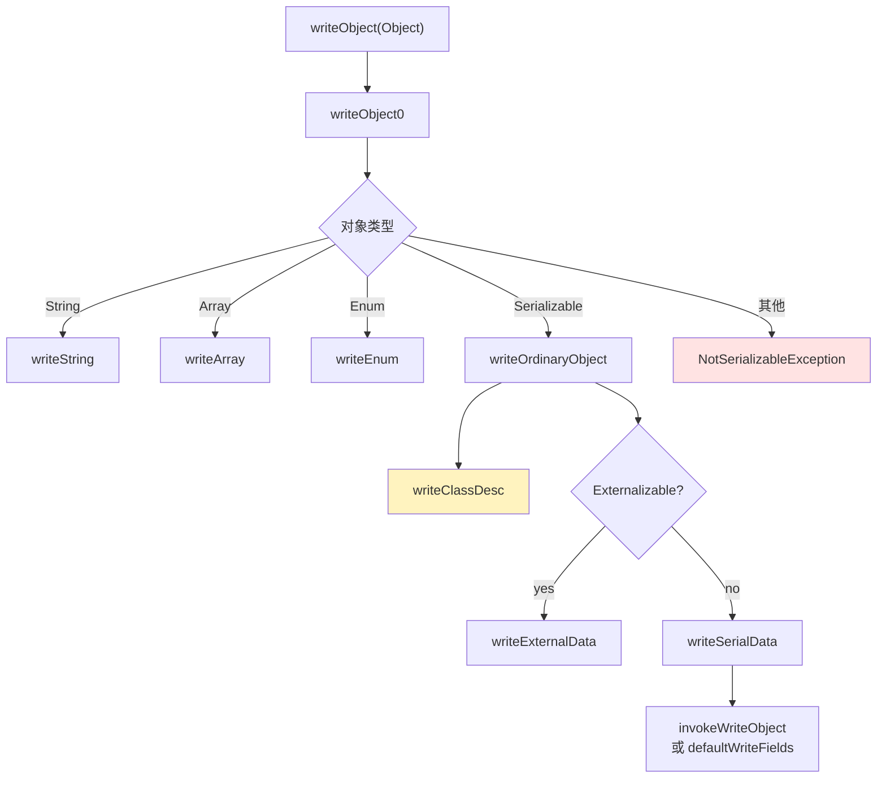

Java 序列化框架是一种 Java 专有的非通用序列化方案，这是和 protobuf、Avro、JSON 等通用序列化框架的根本区别。除此之外，Java 原生序列化更慢、序列化后的体积更大，所以即使是在 Java 里，应用也没有以上通用序列化框架广泛。

1. Table of Contents, ordered
{:toc}

# Java 如何序列化反序列化

序列化样例：

```java
String location = "/tmp/people.ser";

try {
    FileOutputStream fos = new FileOutputStream(location);
    ObjectOutputStream oos = new ObjectOutputStream(fos);

    oos.writeObject(inputStudent);

    oos.close();
    fos.close();
} catch (IOException e) {
    e.printStackTrace();
}
```

反序列化样例：

```java
try {
    FileInputStream fis = new FileInputStream(location);
    ObjectInputStream ois = new ObjectInputStream(fis);

    // readObject() -> ClassNotFoundExcception
    // For a JVM to be able to deserialize an object,
    // it must be able to find the bytecode for the class
    Student resStudent = (Student)ois.readObject();

    // SerializeDemo.Student(name=Lily, age=18, think=null, dreams=[eat, play])
    System.out.println(resStudent);

    ois.close();
    fis.close();
} catch (FileNotFoundException e) {
    e.printStackTrace();
} catch (IOException e) {
    e.printStackTrace();
} catch (ClassNotFoundException e) {
    e.printStackTrace();
}
```

最直观的 API 只有 `writeObject` / `readObject`，但背后做的事很多。

# 序列化：write

先看接口层级：

- `DataOutput`：定义了写基本类型的接口，比如 `writeChar` / `writeInt` / `writeBoolean` / `writeByte` 等。
- `ObjectOutput`：定义了写 Object 的接口，继承 DataOutput 接口。
- `ObjectOutputStream`：实现了 ObjectOutput 接口，拥有 `writeObject` 的实现。

那就看 `writeObject` 怎么实现：



玄机都藏在这几步里。

## 为什么想要序列化的类必须实现 Serializable 接口

在 `writeObject0` 里有以下几步：

```java
// remaining cases
if (obj instanceof String) {
    writeString((String) obj, unshared);
} else if (cl.isArray()) {
    writeArray(obj, desc, unshared);
} else if (obj instanceof Enum) {
    writeEnum((Enum<?>) obj, desc, unshared);
} else if (obj instanceof Serializable) {
    writeOrdinaryObject(obj, desc, unshared);
} else {
    if (extendedDebugInfo) {
        throw new NotSerializableException(
            cl.getName() + "\n" + debugInfoStack.toString());
    } else {
        throw new NotSerializableException(cl.getName());
    }
}
```

所以一个类如果不实现 Serializable 接口，最终会落到 else 里，抛出 `NotSerializableException`。

## 都序列化了什么东西

在 `writeOrdinaryObject` 里，有如下代码：

```java
desc.checkSerialize();

bout.writeByte(TC_OBJECT);
writeClassDesc(desc, false);
handles.assign(unshared ? null : obj);
if (desc.isExternalizable() && !desc.isProxy()) {
    writeExternalData((Externalizable) obj);
} else {
    writeSerialData(obj, desc);
}
```

所以写了：

- 一个专属于 Object 的 magic byte（String、Enum 之类用其他 magic byte）。
- 类描述信息。
- 真实数据信息。

其中，类描述信息是 ObjectStreamClass 类，它里面放了要序列化对象的类信息，比如：

```java
/** class associated with this descriptor (if any) */
private Class<?> cl;
/** name of class represented by this descriptor */
private String name;
/** serialVersionUID of represented class (null if not computed yet) */
private volatile Long suid;

/** true if represents dynamic proxy class */
private boolean isProxy;
/** true if represents enum type */
private boolean isEnum;
/** true if represented class implements Serializable */
private boolean serializable;
/** true if represented class implements Externalizable */
private boolean externalizable;
/** true if desc has data written by class-defined writeObject method */
private boolean hasWriteObjectData;
...
```

大致有：

- 类名。
- 类的 serial version id（实现了 Serializable 接口，就得有这个 id）。
- 其他很多辅助信息。

最后使用 `defaultWriteFields` 方法真正序列化对象：

```java
/**
 * Fetches and writes values of serializable fields of given object to
 * stream.  The given class descriptor specifies which field values to
 * write, and in which order they should be written.
 */
private void defaultWriteFields(Object obj, ObjectStreamClass desc)
    throws IOException
{
    Class<?> cl = desc.forClass();
    if (cl != null && obj != null && !cl.isInstance(obj)) {
        throw new ClassCastException();
    }

    desc.checkDefaultSerialize();

    int primDataSize = desc.getPrimDataSize();
    if (primVals == null || primVals.length < primDataSize) {
        primVals = new byte[primDataSize];
    }
    desc.getPrimFieldValues(obj, primVals);
    bout.write(primVals, 0, primDataSize, false);

    ObjectStreamField[] fields = desc.getFields(false);
    Object[] objVals = new Object[desc.getNumObjFields()];
    int numPrimFields = fields.length - objVals.length;
    desc.getObjFieldValues(obj, objVals);
    for (int i = 0; i < objVals.length; i++) {
        if (extendedDebugInfo) {
            debugInfoStack.push(
                "field (class \"" + desc.getName() + "\", name: \"" +
                fields[numPrimFields + i].getName() + "\", type: \"" +
                fields[numPrimFields + i].getType() + "\")");
        }
        try {
            writeObject0(objVals[i],
                         fields[numPrimFields + i].isUnshared());
        } finally {
            if (extendedDebugInfo) {
                debugInfoStack.pop();
            }
        }
    }
}
```

它按照类描述里的内容，决定写哪些 field、按什么顺序写 field。所以还是靠反射。

## 为什么大、慢、不能跨语言

所以：

- Java 序列化后的体积为什么比其他序列化框架（Avro、protobuf、JSON）大？**因为写了很多额外信息。**
- Java 序列化的速度为什么比其他序列化框架慢？**因为写的东西多，检查多，执行步骤多。**
- **Java 序列化为什么不能跨语言？** 因为不止写了数据信息，还加入了乱七八糟的只有 Java 才有的信息。

其他序列化框架写了啥？

| 框架 | 写入内容 | 特点 |
|------|----------|------|
| JSON | 属性名 + 数据，可能加入多态 metadata | 人可读，体积不一定小 |
| protobuf | field number + wire type + value | 不写字段名，依赖 `.proto` |
| Avro | 文件里带 writer schema，对象按 schema 写 value | 适合 schema resolution |
| Java serialization | magic byte、类描述、serialVersionUID、字段值、handle 等 | Java 专有，信息多 |

当然还有其他优化操作：

- Avro 是先写一个 schema，写对象时只写各个 value 的内容，按照 schema 字段顺序写，免去了写 key。protobuf 是写 id:value 的键值对，每个 id 对应一个字段，且不可修改。反序列化时，按照代码里的 id 去反序列化为相应字段。
- Avro 和 protobuf 都需要先编译 schema 生成 schema 定义对象的专用代码，然后用该对象的专用代码去序列化/反序列化对象。Java 序列化则不单独为某对象生成相应的序列化和反序列化代码，而是使用反射，这应该也是 Java 序列化更慢一些的原因。（不过好处是 Java 不需要提前单独编译类似 protobuf/Avro 的 schema 生成相应代码。）

Ref：

- [protobuf 序列化](https://puppylpg.github.io/protobuf/serialization/2020/05/15/serialization-protobuf.html)
- [fastjson 的一些序列化](https://hollis.blog.csdn.net/article/details/107150646)
- [Java 原生序列化为什么慢](https://my.oschina.net/u/1787735/blog/1919855)

## Externalizable：能用，但今天没太必要

曾经 Java 序列化巨慢（1.3 之后就好多了），所以 Java 提供了 Externalizable 接口，由用户自定义 `readExternal` / `writeExternal` 接口，而不是 Java 用反射序列化/反序列化 Java 类里的 field。这样会快一些，但是所有逻辑都是用户自己维护了，如果增删字段，也要修改这些方法。

这就是序列化时调用 `writeExternal` 方法所做的事。

> Java 序列化优化之后，就没太必要用这个了。不过可以作为一种拓展吧。

参考：[Stack Overflow 关于 Serializable 和 Externalizable 的回答](https://stackoverflow.com/a/818093/7676237)。

## 自定义序列化方式

在序列化最后真正写数据时，`invokeWriteObject` 里还有这样的代码：

```java
writeObjectMethod.invoke(obj, new Object[]{ out })
```

调用了一个反射去写对象。方法是：

```java
/** class-defined writeObject method, or null if none */
private Method writeObjectMethod;
```

该方法来自于：

```java
writeObjectMethod = getPrivateMethod(
    cl,
    "writeObject",
    new Class<?>[] { ObjectOutputStream.class },
    Void.TYPE
);
```

被写对象的 `writeObject`！

所以 Java 序列化框架给了序列化对象自己序列化自己的机会。

有什么用呢？比如 ArrayList 底层用的是数组，快满时会扩容。序列化时最好只写已存放的数据。如果把整个数组都序列化了，岂不是存了一大堆 null……所以自己如何序列化自己最清楚。

如果自己没定义 `writeObject` 方法呢？

那 `writeSerialData` 就会调用 `defaultWriteFields` 方法，进行 Java 序列化框架默认的序列化。

Ref：[Java 序列化](https://www.hollischuang.com/archives/1140)。

# 反序列化：read

反序列化对应的接口是：

- `DataInput`
- `ObjectInput`
- `ObjectInputStream`

读的时候也不是简单“按字段读回来”就结束了。JVM 需要能找到对应 class 的 bytecode，需要校验 serialVersionUID，需要根据类描述信息创建对象并恢复字段。也就是说，Java 原生序列化不仅保存“数据”，还保存了一堆帮助 JVM 还原 Java 对象世界的信息。

# 总结

1. Java 序列化不能跨语言。
2. Java 序列化体积大、速度慢是有原因的。
3. Java 序列化为 Java 的自主序列化和反序列化做了很多事情，远不是其他序列化平台那样直接写数据那么简单。
