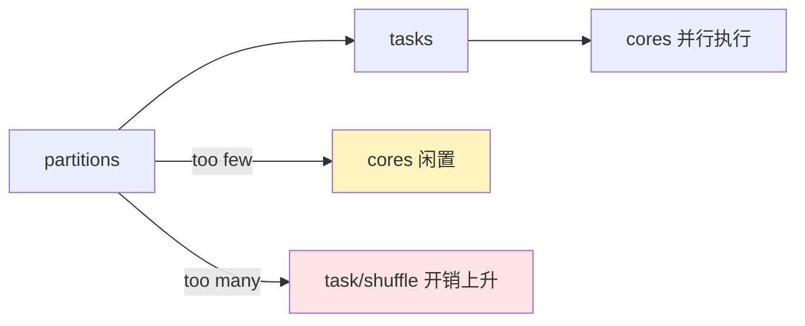
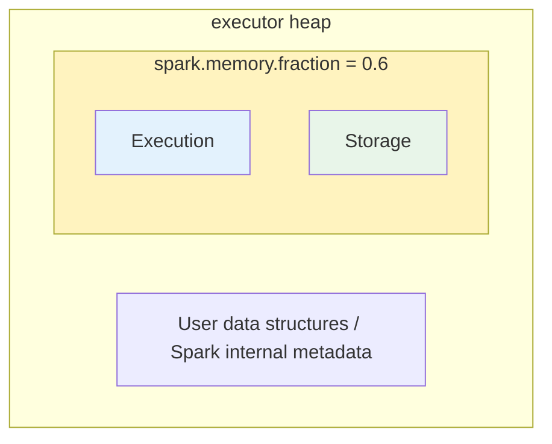
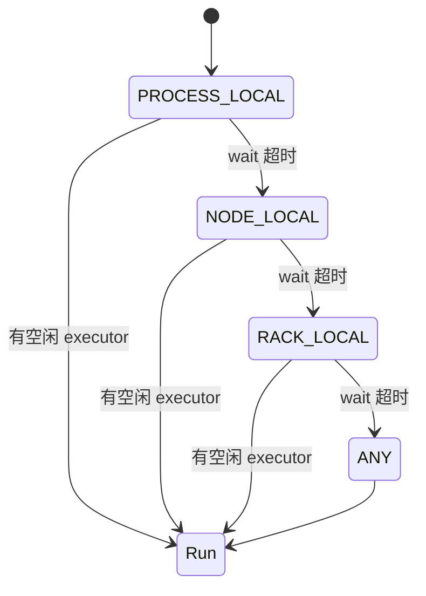

Spark 调优主要是调整 Spark 的配置和 Spark 代码的执行逻辑，不过日常最先碰到的还是配置，所以这里将配置和调优放在一起。

当然，由于 Spark 过于庞大（Hadoop、Kafka 也都这样），一次性梳理配置是很让人懵逼的一件事，况且一开始显然也不能理解 Spark 的所有配置。根据平时需求，将需要用到和学到的配置总结在这里，长期更新。

1. Table of Contents, ordered
{:toc}

# partition

partition 调优先记住一件事：**一个 partition 通常对应一个 task**。partition 太少，core 闲着；partition 太多，调度开销、shuffle 文件、task 数量都会变多。

| 配置 | 作用范围 | 默认/特点 |
|------|----------|-----------|
| `spark.sql.shuffle.partitions` | Spark SQL / DataFrame shuffle 后分区数 | 默认 200 |
| `spark.default.parallelism` | RDD shuffle、`parallelize` 等默认分区数 | 不同情况下取值不同；对 shuffle 操作，通常和父 RDD partition 相关 |

`spark.sql.shuffle.partitions`：Spark SQL shuffle 后的分区数，仅对 Spark SQL 有效（DataFrame）。默认 200。

`spark.default.parallelism`：仅处理 RDD 时生效，RDD 转换（shuffle、parallelize）之后的分区数。默认在不同情况下取值条件不同，对于 shuffle（`reduceByKey`、`join`）操作，是 shuffle 前父 RDD 的最大 partition 值。

所以 RDD shuffle 之后，partition 只多不少呗。如果导致 partition 过多、task 过多，建议设个更小的值。官方建议 2-3 倍 CPU cores。

- [Spark tuning：Level of Parallelism](https://spark.apache.org/docs/latest/tuning.html#level-of-parallelism)
- [Spark 配置参数说明](https://www.cnblogs.com/wrencai/p/4231966.html)
- [Spark 参数总结](https://www.cnblogs.com/itboys/p/10960614.html)
- [spark.sql.shuffle.partitions 和 spark.default.parallelism 的区别](https://stackoverflow.com/questions/45704156/what-is-the-difference-between-spark-sql-shuffle-partitions-and-spark-default-pa)

另外，由于一个 partition 一个 task，如果 cores 大于 partitions，会有很多 cores 闲置下来。参考：[Stack Overflow 讨论](https://stackoverflow.com/a/52414244/7676237)。

# memory

Java 对象在内存中占的空间大概是 raw data field 内容的 2-5 倍，因为：

- object header：16 bytes 左右，包含指向对象 class 的指针。
- String 在 JVM 里使用 UTF-16 编码，所以一个 char 就是 2 byte。
- 指针，比如对象里对其他对象的引用，一个指针 8 byte。像 HashMap、LinkedList 等有很多指针。
- primitive 类型经常被存储为 boxed 类型，比如 Integer。

Spark 的 memory 用于两处：执行代码和存储（cache）。二者共享一块内存区域。

Spark 的内存首先分为两部分：Execution + Storage，默认占 60%（`spark.memory.fraction = 0.6`），剩下的用于 user data structure、internal metadata in Spark 等。

Storage 默认占用该区域的一半（`spark.memory.storageFraction = 0.5`），且如果 Execution 不需要那么多内存，Storage 最多能全占了。当 Execution 需要内存时，可以 evict Storage，但 Storage 不能低于 0.5。所以 Storage 占 0.5-1.0，Execution 最多占 0.5。

关键配置：

- `spark.memory.fraction`
- `spark.memory.storageFraction`

如果 cache RDD 需要的内存过大，但又不想放在磁盘上，建议使用 `MEMORY_ONLY_SER`，配合 Kryo 序列化。体积会比 Java 序列化小很多，速度也快很多。

参考：[Spark tuning 文档](http://spark.apache.org/docs/latest/tuning.html)。

# scheduling

## data locality

当数据和处理数据的代码不在同一个 node 上，要么将 data 发到 code 所在的 node，要么将 code 发到 data 所在的 node。由于 Spark 从 HDFS 读的都是大数据，所以将代码发到数据所在节点更好一些。

按照数据的本地化级别，分为五类：

| Locality Level | 说明 |
|----------------|------|
| `PROCESS_LOCAL` | 数据和 task 在同一个进程（同一个 JVM）中，比如数据已经 cache 在该 node 中 |
| `NODE_LOCAL` | 数据就在启动 task 的 node 上；**可以是在该 node 的磁盘上，也可以是 cache 在该 node 的另一个 process 中** |
| `NO_PREF` | 数据从哪里访问都一样，不需要位置优先，**比如数据库的数据** |
| `RACK_LOCAL` | 数据和启动 task 的 node 在同一机架上 |
| `ANY` | 不在同一机架上 |

Spark 默认用满足最高级别 data locality 的 node 去启动 task。但是如果有待处理数据的 executor 都在忙，此时没法直接在该 executor 上启动 task。Spark 会等一下这个 executor，如果还不空闲，再使用次级 data locality 在其他 executor 上启动 task。

`spark.locality.wait`：启动一个数据本地化任务时，在退而求其次、到一个不那么本地的节点上启动任务之前，所等待的时间。默认是 3s。

Spark 启动任务时会先按照最高级别数据本地化分配 node，以求获得最高的数据读取速度。如果等待 `spark.locality.wait` 后还没有等到可用 node，就降为下一级别请求 node 发起任务。分别用 `spark.locality.wait.process`、`spark.locality.wait.node`、`spark.locality.wait.rack` 作为超时时间，它们默认都是 `spark.locality.wait`。

存在的问题：如果一个 executor 执行了远多于其他 executor 的任务，该 executor 的 task 的 Locality Level 都是 `PROCESS_LOCAL` 级别，且其他 executor 闲置、该 executor 的结束时间影响整体时间，说明 `spark.locality.wait` 设置得不太合理（是不是手动调大了），过于强调数据本地化，导致 task 分布不均。这时候可以调小 `spark.locality.wait`，甚至设为 0。

参考：[Stack Overflow 关于 locality wait 的讨论](https://stackoverflow.com/a/27019275/7676237)。
