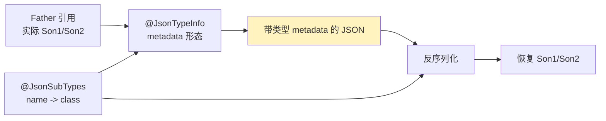
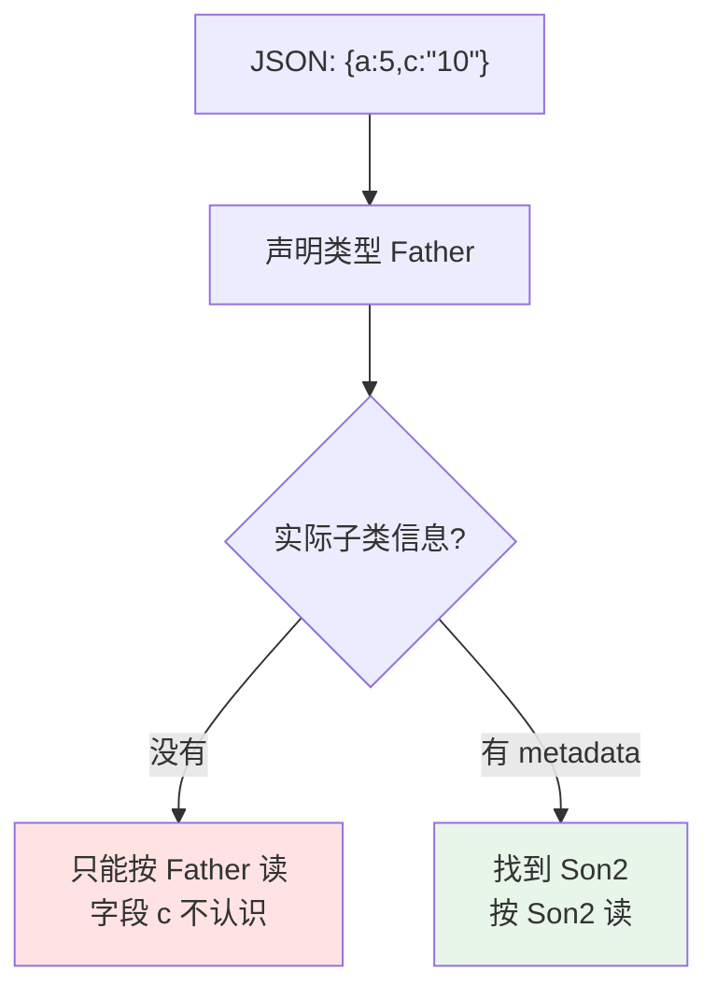

使用 JSON 序列化对象是一个很常见的方式。和其他字节方式序列化框架 protobuf、Avro、Java 自带序列化相比，JSON 一个显而易见的好处就是可读性。

1. Table of Contents, ordered
{:toc}

JSON 序列化可以使用的依赖有很多，比如 fastjson，最常用的应该还是 Jackson。Jackson 有很多强大的定制功能，比如通过注解决定哪些字段需要序列化、序列化顺序、别名等等，具体可以参考：[Jackson annotations guide](https://www.baeldung.com/jackson-annotations)。

这里主要从前一段看到的 fastjson 例子，聊聊 JSON 对多态的序列化。

# 多态

在将一个对象序列化为 JSON 时，如果对象的某属性涉及多态，需要加一些额外信息，用来指示该字段实际是哪个子类型。否则，无法将其反序列化为正确的子类型。

比如 fastjson 是在字段前加上 `@type`，指示该字段实际的子类型：

```json
{
  "@type": "com.hollis.lab.fastjson.test.Store",
  "fruit": {
    "@type": "com.hollis.lab.fastjson.test.Apple",
    "price": 0.5
  },
  "name": "Hollis"
}
```

参考：[fastjson 的一些序列化](https://hollis.blog.csdn.net/article/details/107150646)。

这么做可能有些地方让你感到奇怪：fastjson 序列化出来的 JSON 岂不是改变原有对象的内容了？它加了额外的东西。

# Jackson

先看看另一个更流行的 JSON 序列化框架 Jackson 怎么搞。

其实 Jackson 类似，不过功能更灵活一些，可以使用注解自定义这些额外信息的行为。一般使用 Jackson 序列化多态一定要用到两个注解：

- `@JsonTypeInfo`：类型信息怎么写进 JSON。
- `@JsonSubTypes`：哪些子类型可用，以及它们在 JSON 里叫什么。



## `@JsonTypeInfo`

> Annotation used for configuring details of if and how type information is used with JSON serialization and deserialization, to preserve information about actual class of Object instances. This is necessarily for polymorphic types, and may also be needed to link abstract declared types and matching concrete implementation.

主要用来配置序列化为 JSON 时，如何保留对象的实际 class 信息。对于多态类型，必须配置。

主要配置三个属性：

- `use`：序列化时用什么格式保存 metadata。
- `include`：如果将 metadata 包含入 JSON，用哪种方式。
- `property`：如果将 metadata 以 property 的形式包含入 JSON，property 叫什么名字。

比如：

```java
@JsonTypeInfo(use = JsonTypeInfo.Id.NAME, include = JsonTypeInfo.As.PROPERTY, property = "custom-type-name")
@JsonSubTypes(value = {
        @JsonSubTypes.Type(value = Son1.class, name = "FirstSon"),
        @JsonSubTypes.Type(value = Son2.class, name = "SecondSon")
})
```

生成（代码见后面，Father 是父类，Son1 和 Son2 是两个子类）：

```json
{"list":[{"custom-type-name":"SecondSon","a":5,"c":"10"},{"custom-type-name":"FirstSon","a":5,"b":0}]}
```

metadata（即类信息）以 property 的形式存入 JSON（`include = JsonTypeInfo.As.PROPERTY`），property 的 value 使用逻辑名字（`use = JsonTypeInfo.Id.NAME`），即 `JsonSubTypes` 里定义的类的别名 `SecondSon` / `FirstSon`，property 的 key 则自定义为 `custom-type-name`（`property = "custom-type-name"`）。

如果 `use = JsonTypeInfo.Id.CLASS`，会使用 class 类名作为 metadata 的 value，序列化为：

```json
{"list":[{"custom-type-name":"example.jackson.Family$Son2","a":5,"c":"10"},{"custom-type-name":"example.jackson.Family$Son1","a":5,"b":0}]}
```

不过**使用 class name 会使代码的可移植性变差**。比如代码修改包名后，再按照 JSON 里的 metadata 反序列化，会发现找不到类。

`include = JsonTypeInfo.As.WRAPPER_OBJECT` 或者 `include = JsonTypeInfo.As.WRAPPER_ARRAY` 无非是修改保存 metadata 的格式，分别为：

```json
{"list":[{"SecondSon":{"a":5,"c":"10"}},{"FirstSon":{"a":5,"b":0}}]}
```

或者：

```json
{"list":[["SecondSon",{"a":5,"c":"10"}],["FirstSon",{"a":5,"b":0}]]}
```

此时由于 field 直接作为 value，key 直接使用 `use = JsonTypeInfo.Id.NAME`，即类的别名 `SecondSon` / `FirstSon`，所以自定义的 property key `custom-type-name` 不再被需要。

几种组合大概这样对比：

| 配置 | JSON 形态 | 可读性 | 可移植性 |
|------|-----------|--------|----------|
| `Id.NAME + As.PROPERTY` | `{"custom-type-name":"SecondSon", ...}` | 好 | 好，需要维护逻辑名 |
| `Id.CLASS + As.PROPERTY` | `{"custom-type-name":"example.Family$Son2", ...}` | 一般 | 差，依赖包名/类名 |
| `Id.NAME + WRAPPER_OBJECT` | `{"SecondSon": {...}}` | 还行 | 好 |
| `Id.NAME + WRAPPER_ARRAY` | `["SecondSon", {...}]` | 一般 | 好 |

## `@JsonSubTypes`

> Annotation used with JsonTypeInfo to indicate sub-types of serializable polymorphic types, and to associate logical names used within JSON content (which is more portable than using physical Java class names).

这个注解和 `JsonTypeInfo` 一起用，用来指示子类序列化入 JSON 里的逻辑名。

它的 Type 子类有两个属性，可以定义一个类的别名：

- `value`：给哪个子类起名字。
- `name`：起啥名字。

```java
@JsonTypeInfo(use = JsonTypeInfo.Id.NAME, include = JsonTypeInfo.As.PROPERTY, property = "custom-type-name")
@JsonSubTypes(value = {
        @JsonSubTypes.Type(value = Son1.class, name = "FirstSon"),
        @JsonSubTypes.Type(value = Son2.class, name = "SecondSon")
})
```

再看一开始的注解，就很清晰了：

1. `JsonSubTypes`：两个子类类型会被序列化入 JSON，一个是 `Son1.class`，序列化后的名字叫 `FirstSon`，另一个同理。
2. `JsonTypeInfo`：以 property 的形式保存序列化前的子类 metadata，记录的是名字（`use = JsonTypeInfo.Id.NAME`），自定义 property 的 key 为 `custom-type-name`。

结合起来就是：

```json
{"list":[{"custom-type-name":"SecondSon","a":5,"c":"10"},{"custom-type-name":"FirstSon","a":5,"b":0}]}
```

这样就知道 list 有两个对象：第一个是 `SecondSon`，其类为 `Son2.class`；第二个是 `FirstSon`，其类为 `Son1.class`。

我觉得使用 `NAME + PROPERTY` 是 Jackson 比较好的序列化多态方式，也方便移植。

# 必须记录的多态类型

回到一开始的问题：从 JSON 角度来看，就好像对象除了 `a`、`c`，还有一个 `custom-type-name` 属性。如果直接看 JSON，这种新增 metadata 的行为岂不是会让人产生误会？

先反过来想，如果不加 metadata 会怎样？

不加多态信息也能直接序列化，且不带 metadata：

```json
{"list":[{"a":5,"c":"10"},{"a":5,"b":0}]}
```

这的确是原汁原味的对象内容！但是反序列化时，发现反序列化不回来了：

```text
Exception in thread "main" com.fasterxml.jackson.databind.exc.UnrecognizedPropertyException: Unrecognized field "c" (class example.jackson.Family$Father), not marked as ignorable (one known property: "a"])
 at [Source: (String)"{"list":[{"a":5,"c":"10"},{"a":5,"b":0}]}"; line: 1, column: 22] (through reference chain: example.jackson.Family$D["list"]->java.util.ArrayList[0]->example.jackson.Family$Father["c"])
```

因为序列化时记录的信息不足，导致不知道究竟是哪个子类。



所以说，这个类型信息是必须被记录的。不管使用 `@type`，还是以普通 property 的形式记录，总之都要记下来，然后用相对应的处理 metadata 的反序列化方法将 JSON 反序列化为对象。

但是这样序列化出来的 JSON 看起来会比较奇怪，总感觉不是“纯正的 JSON”。JSON 的好处就是可读，这么搞可读性稍稍下降了一些。JSON 序列化框架使用了一种略微影响可读性的方式完成了对多态的序列化。

其他序列化方式（比如 protobuf、Avro）呢？可想而知，因为它们本身就是序列化为字节，不是给人看的，人们也不关心它们写了啥字节，它们自然想写啥写啥。比如 protobuf 可以用 oneof 指代一个 field，至于这个 field 是 Son1 还是 Son2，肯定通过字节标识出来了，要不然 protobuf 也是不可能反序列化回来的。

所以说，只要人类看不见，就不会逼逼赖赖了 :D

说到这里，不禁想到了 Java 多态本身：运行时，如果一个 Son1 赋值给 Father 的引用，理论上来讲只知道这是一个 Father 对象，实际上它可能是 Son1，也可能是 Son2。那么调用具体方法时，为什么 Java 能准确地调用 Son1 的 override 方法呢？

根据上面序列化的经验，可以猜想 Java 一定像 JSON 序列化一样，将子类型也记录了下来，才能在调用时找到真正的子类型：

1. 每个 `.class` 字节码文件在被 ClassLoader 加载之后，都会在 JVM 中生成一个唯一的 Class 对象，该 Class 类型的对象含有该类的所有信息，比如类名、方法、field、构造函数等。
2. 每一个该类 new 出来的对象，都有一个指向上述 Class 对象的引用。可通过 Object 的 `public final native Class<?> getClass()` 方法获得 Class 对象。
3. 获取到了一个 object 的 Class 对象之后，关于这个 object 的一切类相关信息都可以通过 Class 对象取得。

> 这不是多态的实际实现，但说明了一个对象的实际类型实际上都是可以被检索到的。

所以 Java 也是通过记录所有对象的类信息，以在运行时实时决定该对象类型，并在多态时调用合适的 override 方法。

**因此，解决多态问题的唯一途径就是记录下该对象究竟是哪一个子类型，无论是序列化时的多态还是运行时的多态。**

# 附：示例代码

```java
package example.jackson;

import java.util.ArrayList;
import java.util.List;

import com.fasterxml.jackson.annotation.JsonSubTypes;
import com.fasterxml.jackson.annotation.JsonTypeInfo;
import com.fasterxml.jackson.databind.ObjectMapper;
import lombok.ToString;

/**
 * @author liuhaibo on 2017/11/29
 */
public class Family {

    public static void main(String[] args) throws Exception {
        List<Father> dataList = new ArrayList<>();
        dataList.add(new Son2("10", 5));
        dataList.add(new Son1(8, 5));
        D d = new D();
        d.setList(dataList);

        ObjectMapper mapper = new ObjectMapper();

        String data = mapper.writeValueAsString(d);
        System.out.println(data);
        D result = mapper.readValue(data, D.class);

        System.out.println(result.getList());
    }

    public static class D {
        List<Father> list;

        public List<Father> getList() {
            return list;
        }

        public void setList(List<Father> list) {
            this.list = list;
        }

    }

    @ToString
    @JsonTypeInfo(use = JsonTypeInfo.Id.NAME, include = JsonTypeInfo.As.PROPERTY, property = "custom-type-name")
    @JsonSubTypes(value = {
            @JsonSubTypes.Type(value = Son1.class, name = "FirstSon"),
            @JsonSubTypes.Type(value = Son2.class, name = "SecondSon")
    })
    public static class Father {
        protected int a;

        public Father() {
        }

        public Father(int a) {
            this.a = a;
        }

        public int getA() {
            return a;
        }

        public void setA(int a) {
            this.a = a;
        }

    }

    @ToString(callSuper = true)
    public static class Son1 extends Father {
        public Son1() {
        }

        public Son1(int b, int a) {
            super(a);
        }

        private int b;

        public int getB() {
            return b;
        }

        public void setB(int b) {
            this.b = b;
        }
    }

    @ToString(callSuper = true)
    public static class Son2 extends Father {
        private String c;

        public Son2() {
        }

        public Son2(String c, int a) {
            super(a);
            this.c = c;
        }

        public String getC() {
            return c;
        }

        public void setC(String c) {
            this.c = c;
        }

    }
}
```
