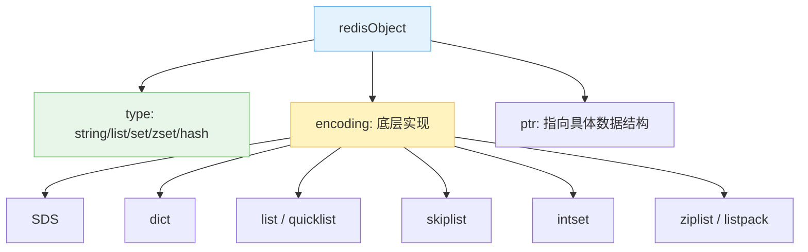
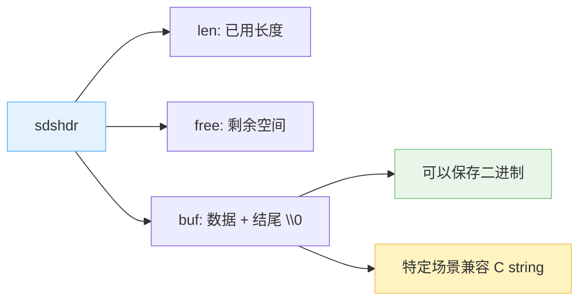
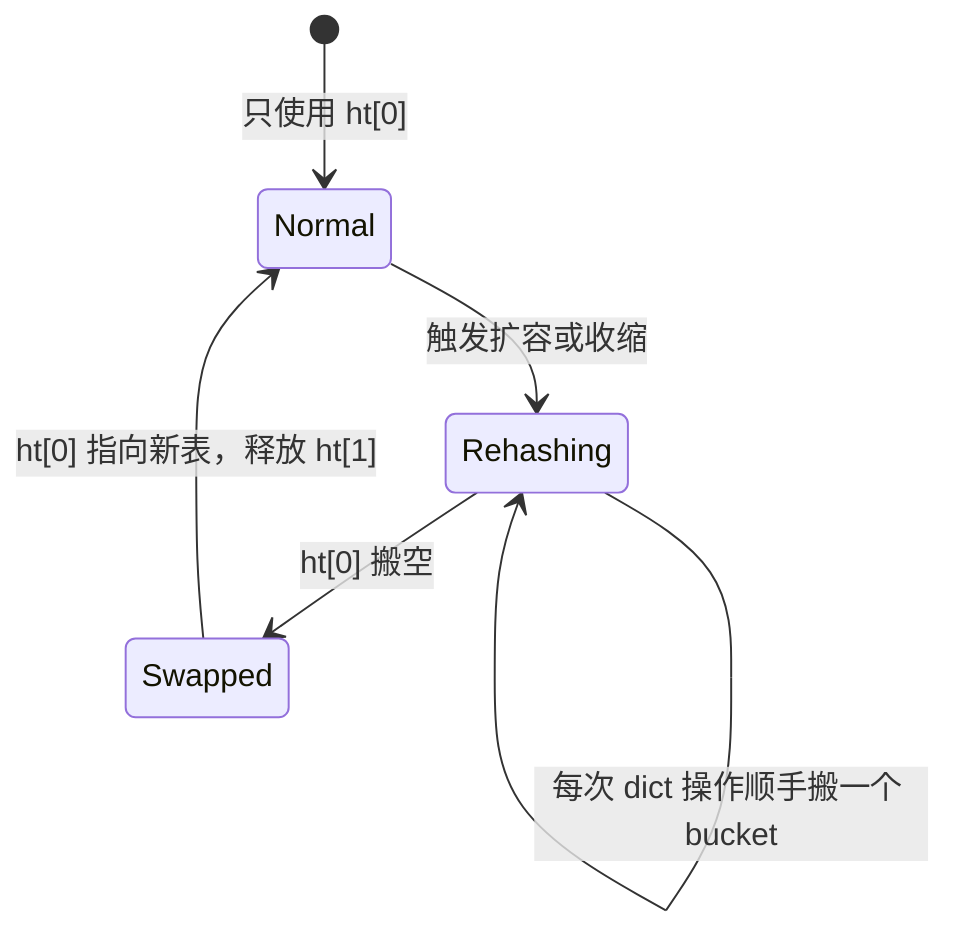
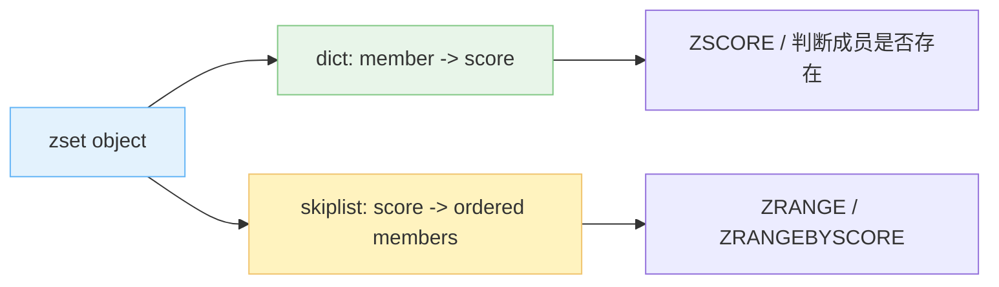

Redis 存储的 kv 都是 object。key 永远是 string，value 可以是 string/list/set/zset/hash。说白了，就是 string、list、set、map，再额外加一个 sorted set。

但 Redis 真正有意思的地方在于：**对外暴露的类型是一层，底层 encoding 又是一层**。同样是 list，小的时候可以用紧凑结构，变大之后可以换成更适合增删的结构。接口没变，底层可以偷偷换轮子，这才是工程味儿。

> 下面会沿用很多经典资料里的老名字，比如 `ziplist`、`linkedlist`。新版本 Redis 对部分 encoding 做过替换，比如 list 常见是 `quicklist`，Redis 7 以后一些小对象从 `ziplist` 换成 `listpack`。这些版本差异不影响本文主线：**Redis object 的 type 和底层 encoding 是两层。**

1. Table of Contents, ordered
{:toc}

# 数据结构

Redis 的五种 object 由一组底层数据结构支撑：



## sds

Redis 的 string 不是简单的 C string，而是自定义的 Simple Dynamic String，简称 SDS。可以把它理解成一个 string wrapper，主要包含：

- `char buf[]`：保存真正的数据；
- `len`：字符串长度；
- `free`：`buf` 中未使用的字节数。

现在分析一下 s、d、s：

- **simple**：确实很 simple，和 C string 相比没多太多东西；
- **dynamic**：扩容时预留空间，后续再追加可能不用重新 `malloc`；缩容时也可以先留着，减少申请和回收空间的频次；
- **string**：兼容 C 的 string 使用习惯。

它的优点：

- 获取字符串长度是 `O(1)`，直接返回 `len`；
- `buf` 末尾总会额外放一个 `'\0'`，不计入 `len`，也不计入 `free`，所以在内容本身不含 `'\0'` 时可以复用 C 字符串函数；
- C string 只能靠 `'\0'` 判断结束，所以不适合保存任意二进制；SDS 靠 `len` 判断长度，`buf` 本质上可以保存字节数组；
- 预分配和惰性释放减少内存分配次数。



## 字符 vs. 字节

关于 SDS 的 `buf` 保存字节，需要说明：

- SDS 有 `len`，所以有保存二进制字节数组的能力，但不代表一定要往里面放二进制；
- SDS 也可以保存普通字符数组；
- **只有保存字符数组且中间没有 `'\0'` 时，才能安全复用 C 的 `str` 函数**，比如 `strcat(sds->buf, "hello")`。

比如用 Jedis 存二进制 key/value：

```java
Jedis jedis = new Jedis();
String id = "hello";
byte[] hello = id.getBytes(StandardCharsets.UTF_16);
byte[] world = "world".getBytes(StandardCharsets.UTF_8);
byte[] exclamation = "!".getBytes(StandardCharsets.UTF_8);

jedis.del(hello);
jedis.rpush(hello, world);
jedis.rpush(hello, exclamation);
for (byte[] array : jedis.lrange(hello, 0, -1)) {
    System.out.println(new String(array, StandardCharsets.UTF_8));
}
```

关键是，**自己存的二进制要自己反序列化**。Redis 不知道你这坨 byte 到底想表达什么。

一开始 key 和 value 全用 UTF-8 byte，`MONITOR` Redis server，会看到：

```java
1610277272.280990 [0 127.0.0.1:59642] "RPUSH" "hello" "world"
1610277273.820139 [0 127.0.0.1:59642] "RPUSH" "hello" "!"
```

Redis 把 UTF-8 内容展示成了 string，就好像我们在 cli 里直接用 string 存储一样：

```java
127.0.0.1:6379> lrange hello 0 -1
1) "world"
2) "!"
```

后来把 key 改成 UTF-16，Redis 展示就变成了字节转义：

```java
1610278078.609975 [0 127.0.0.1:60773] "RPUSH" "\xfe\xff\x00h\x00e\x00l\x00l\x00o" "world"
1610278080.057863 [0 127.0.0.1:60773] "RPUSH" "\xfe\xff\x00h\x00e\x00l\x00l\x00o" "!"
```

查看 key：

```java
127.0.0.1:6379> keys *
1) "a"
2) "\xfe\xff\x00h\x00e\x00l\x00l\x00o"
```

这不一定是 Redis “自动把 UTF-8 byte 转成 string”，更准确地说，是 Redis 的协议展示层发现这段 byte 可以按可读字符串展示，于是就给你展示成了人类能看的样子。换成它看不懂的二进制，就老老实实转义。别太高估 Redis 的语文水平。

## list

C 没有内置 list，所以 Redis 自己定义了 list node 和 list 结构来实现双端链表。老版本资料里常说 `listNode`/`list`，后续 Redis 又把 list 的底层实现优化成了 `quicklist` 一类结构。

这背后的工程目标没变：**小数据尽量省内存，大数据和频繁增删要保证操作效率**。

## dict

Redis 定义了 `dict` 来实现 map，也就是字典。

这个结构和 Java 的 `HashMap` 很像：外层是桶数组，每个桶里通过链表挂多个 entry，hash 冲突时放在同一个桶里。

### 渐进式 rehash

Redis 的 dict 有两个哈希表，通常记为 `ht[0]` 和 `ht[1]`：

- 平时使用 `ht[0]`；
- rehash 时给 `ht[1]` 分配空间；
- 逐步把 `ht[0]` 的 entry 挪到 `ht[1]`；
- 挪完后让 `ht[0]` 指向新表，释放旧表。



Java 在扩容时会把旧 bin 拆成 high/low 两个新 bin，本质也是利用倍增扩容的规律减少重新计算成本。Redis 这里更关键的是“渐进式”三个字。

什么时候 rehash？Java 常见是负载因子到 0.75；Redis 在没有执行 `BGSAVE` 时阈值比较激进，执行后台保存时会更保守。因为后台子进程存在时，父进程大量改内存会触发更多 copy-on-write，内存压力会变大。

渐进式 rehash 的取舍：

- 优点：Redis 主线程不能被一次大 rehash 卡太久，于是把搬迁负担摊到每一次增删改查里；
- 缺点：rehash 期间查找要先查 `ht[0]`，再查 `ht[1]`，一些操作要多走一步。

这就是典型 Redis 风格：宁愿每次多干一点点，也不要某一次把主线程卡成木头。

## skiplist：实现 sorted set

skiplist 是带索引的链表。可以类比词典里的一级目录、二级目录：先通过高层索引快速定位区间，再到低层链表里遍历。总体是空间换时间，把查找元素的复杂度从 `O(N)` 降到期望 `O(logN)`。

Redis 定义了 `zskiplistNode` 和 `zskiplist`。每个 node 里关键内容包括：

- `double score`：排序依据；
- `robj *obj`：成员对象；
- backward 指针；
- 多层 forward 指针。

## intset：实现 set

`intset` 可以理解成一个 int array wrapper，也有 `length` 属性。

它还有一个 `encoding`，标记数组里整数的编码宽度，比如 16 bit、32 bit、64 bit。如果新加入了更大范围的整数，整个 intset 都要升级。这个设计很现实：如果都是小整数，就少占点儿空间；真来了大整数，再升级也不迟。

这就是穷人的无奈，也是工程师的精打细算。

## ziplist：实现 list 和 hash

`ziplist` 也是为了节约内存。如果 list 很短，或者 hash 里的字段和值都比较小，就用紧凑结构保存。

**ziplist 本质上类似 `v1v2v3...vN` 这样把所有值紧凑排列**。为了快速知道存了多少个 value，开头还会记录总字节数、尾部偏移、元素数量等信息。

紧凑结构的好处是省内存、缓存友好；坏处是中间插入删除可能要搬数据。小的时候这不算事，大了就该换 encoding 了。

# object

Object 由以上底层数据结构实现。它的数据结构是 `redisObject`：

- `unsigned type`：标记 object 的对外类型，一共五种：
  - `REDIS_STRING`;
  - `REDIS_LIST`;
  - `REDIS_SET`;
  - `REDIS_ZSET`;
  - `REDIS_HASH`;
- `void *ptr`：指向底层实现数据结构；
- `unsigned encoding`：标记底层具体用哪种数据结构，比如 list 可能是紧凑结构，也可能是链表/quicklist。

Redis 里 key 一定是 string。使用 `TYPE key` 可以查看 key 对应 value 的类型，输出分别是 `string`、`list`、`set`、`zset`、`hash`。

## type 与 encoding

可以把 Redis object 理解成一张路由表：命令先看 type，真正执行时还要看 encoding。

| 对外类型 | 小对象常见 encoding | 大对象常见 encoding | 核心取舍 |
| --- | --- | --- | --- |
| string | int / embstr | raw SDS | 数字和短字符串省内存，长字符串保持通用 |
| list | ziplist / quicklist 小块 | quicklist / linkedlist 语境 | 小列表紧凑，大列表兼顾增删 |
| hash | ziplist / listpack | dict | 小 hash 省内存，大 hash 查找快 |
| set | intset | dict | 小整数集合省内存，通用集合查找快 |
| zset | ziplist / listpack | dict + skiplist | 同时要按成员查 score，又要按 score 排序 |

> 表里的名字会随 Redis 版本变化，思想不会变：**外部类型稳定，内部 encoding 可以按大小和数据形态切换**。

## REDIS_STRING

String 未必就是 SDS 实现：

- `int`：纯数字可以用整数编码；
- `embstr`：专门保存短字符串的优化实现；
- `raw`/SDS：通用字符串。

## REDIS_LIST

老版本资料里常见两类说法：

- `ziplist`：小 list 用紧凑结构；
- `list`/linkedlist：大 list 用双端链表。

后续 Redis 使用 `quicklist` 把链表和紧凑块结合起来，可以理解成“链表节点里放一小段紧凑列表”。这么做就是为了同时要空间效率和两端操作效率。

> 所有 list 命令都以 `L` 或 `R` 开头，分左右，比如 `LPUSH`、`RPOP`。

## REDIS_HASH

Hash 的典型 encoding：

- 紧凑结构：小字典，`k1 v1 k2 v2` 紧凑存放；
- `dict`：大字典。

小 hash 用紧凑结构，超过一定阈值后升级为 dict。阈值可配置，经典默认值里经常能看到 512 这种数字。

> 所有 hash 命令都以 `H` 开头。

## REDIS_SET

Set 的典型 encoding：

- `intset`：小整数集合；
- `dict`：大集合。

它很像 Java 的 `HashSet` 使用 `HashMap` 实现，只用 map 的 key，value 放一个固定对象。Redis 里也是这个味儿，只不过 value 可以是 `NULL`。

> 所有 set 命令都以 `S` 开头。

## REDIS_ZSET

**zset 和 set 相比，多了一个 score，用于排序。** 所以 zset 至少要满足两个能力：

1. 根据 member 快速获取 score；
2. 根据 score 获取某个区间的有序数据。

实现方式：

- 小 zset：使用紧凑结构保存，member 和 score 按 score 顺序排列；
- 大 zset：使用 `dict + skiplist`。

为什么要两个结构？

- `dict`：根据 member 查 score 是 `O(1)`；
- `skiplist`：按 score 排序并支持范围查询，适合 `ZRANGE` 这类操作。



如果只有 dict，范围查询前还要排序，排序最快也要 `O(NlogN)`；如果只有 skiplist，根据 member 找 score 又不够快。所以 Redis 两个都要，空间换时间，简单粗暴但管用。

> 所有 zset 命令都以 `Z` 开头。

## 共享 object

Redis 有点儿像 Java 常量池，会预创建一些共享对象。比如多个 key 对应同一个数值字符串，就可能复用同一个对象。

之所以说“可能”，是因为 **Redis 的共享对象主要用于纯数值字符串**。这么做是为了性能：

- 纯数值字符串比对很快；
- 普通字符串比对是 `O(N)`；
- 更复杂对象由多个值构成，全部比对成本更高。

> 共享对象数量有限，经典配置里常见最多 1w 个整数对象。

## 回收 object

C 不能自动回收垃圾对象，Redis 自己实现了**引用计数**机制：对象被引用时计数加一，引用解除时计数减一，计数为 0 就可以释放。

Java 不使用单纯引用计数做 GC，是因为循环引用会导致垃圾清不掉。Redis 能这么用，是因为 Redis object 之间的关系非常受控，不像一门通用语言那样允许程序员随手 new 一堆对象互相引用。

Redis 是一个工具，不是一个让你自由发挥的对象宇宙。这反而让引用计数变得可控。

## 最后访问时间

`redisObject` 里有 `lru` 字段，标记对象最后一次被访问的时间。使用 `OBJECT IDLETIME` 可以查看，且该命令本身访问对象时不会刷新最后访问时间。

如果服务器开启了 `maxmemory`，且内存淘汰策略是 `volatile-lru` 或 `allkeys-lru`，内存不足时会优先释放更久没访问的对象。

说白了，就是把 Redis 当 cache 用时，需要一个“谁该先滚蛋”的依据。LRU 不神秘，它只是把“最近没人理你”这件事记了下来。
