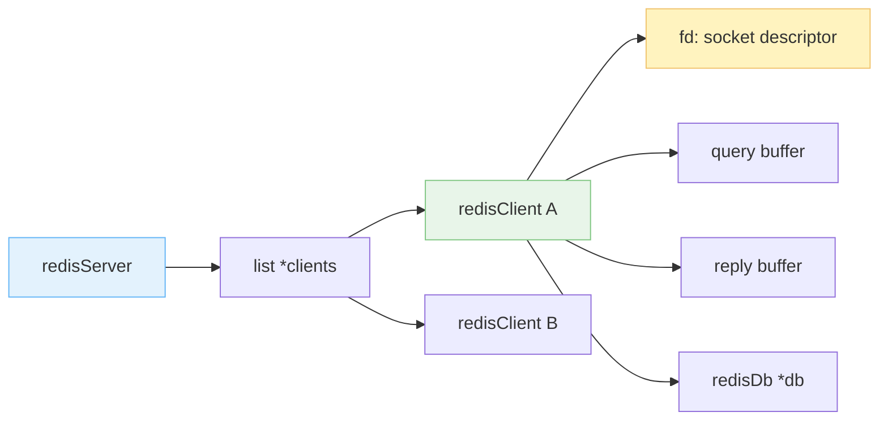
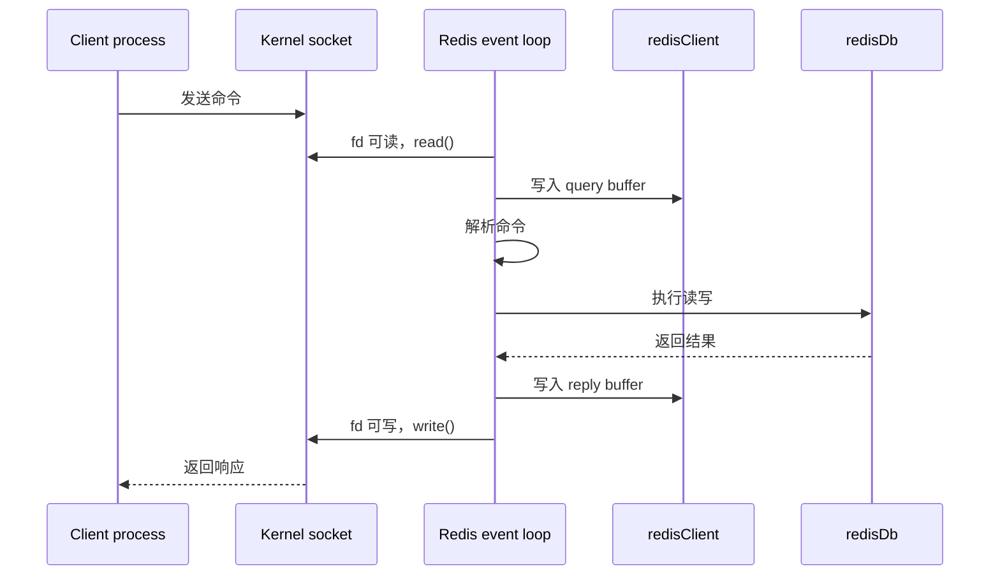
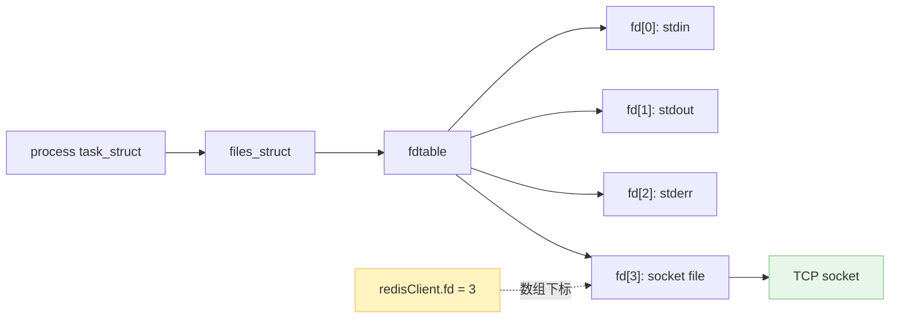

之前总结了 Redis server 的模型架构：它采用 NIO 进行 I/O 多路复用，主线程不断 loop 完成大部分请求处理。那么，client 和 server 具体是如何交互的？

这篇主要抓住一个点：**Redis server 里要有 client 对象，而 client 对象里最关键的字段之一就是 socket 文件描述符 `fd`**。

1. Table of Contents, ordered
{:toc}

# client 在 server 中的数据表示

每个连接到 server 的 client，Redis server 都会为它创建一个对象，保存到 `redisServer` 中。经典源码语境里，这些对象用 `redisClient` 表示。

`redisServer` 中有：

- `list *clients`：保存所有连接到该 server 的 client 对象。

注意这里是 **list 链表**，不是数组。Redis 很喜欢链表这种朴素结构：新增、删除 client 方便，遍历起来也够用。

一个 client 对象里会保存很多信息，比如：

- `int fd`：client 正在使用的 socket 描述符；
- 输入缓冲区：保存 client 发来的命令；
- 输出缓冲区：保存要返回给 client 的结果；
- 当前 DB 指针：记录这个 client 正在使用哪个数据库；
- 订阅、事务、认证等状态。



Redis 的事件循环监听这些 `fd` 上的可读、可写事件：

1. `fd` 可读：读取 socket 数据，放进 client 输入缓冲区；
2. 解析命令：把 RESP 协议解析成 Redis 命令；
3. 执行命令：读写内存数据结构；
4. 生成回复：写入输出缓冲区；
5. `fd` 可写：把输出缓冲区刷回 socket。



# 文件描述符

`redisClient` 中很重要的一个属性是：

- `int fd`：记录 client 正在使用的 socket 描述符。

Socket 也是文件，所以 socket 描述符也是文件描述符，是一个非负整数。

问题来了：文件描述符为什么只是一个数字？数字能表示什么信息？**数字只能表示一个数字，文件那么多信息，一个数字显然装不下。所以它必然类似于一个索引，指向某个记录文件信息的东西。**

Linux 中的进程使用 `struct task_struct` 表示，里面有：

- `struct files_struct *files`：表示该进程打开的所有文件。

`struct files_struct` 里又有：

- `count`：打开文件相关引用计数；
- `struct fdtable *fdt`：文件描述符表。

`struct fdtable` 里关键内容是：

- `int max_fds`：文件描述符最大范围；
- `struct file **fd`：指针数组，每个位置都指向一个 `struct file`。

**文件描述符就是这个数组的下标。** 通过这个数字，进程可以从数组中找到对应的 `struct file`，进而操作真正的文件、socket、pipe 等内核对象。



比如：

- `open` 打开一个文件，返回一个 `int`，这个 `int` 就是文件描述符；
- `read`/`write`/`close` 都需要传入这个 `int`；
- 内核根据文件描述符，从当前进程的 fdtable 中找到对应 `struct file`，再执行操作。

程序打开的普通文件描述符通常从 3 开始。因为：

- `0`：standard input，标准输入，常见是键盘；
- `1`：standard output，标准输出，常见是显示器；
- `2`：standard error，标准错误，常见也是显示器。

所以说，键盘和显示器在 Linux 中也能通过文件抽象处理，没毛病。

## 重定向和管道

文件描述符理解了，重定向和管道也很好理解。

```bash
command < file1.txt
```

这相当于把 `command` 的 `fd 0` 从原来的标准输入换成 `file1.txt`。程序还是从 `0` 读，只是 `0` 这个下标指向的文件变了。

```bash
command1 | command2 | command3
```

管道也是类似思路：`command1` 的标准输出不再指向显示器，而是指向一个 pipe；`command2` 的标准输入也指向这个 pipe。两个进程之间像插了一根管子，直接传送输入输出数据。

这和 Redis client 的 `fd` 是同一套思想：**用户态拿到的只是一个 int，真正的连接、文件、缓冲和状态都在内核结构里**。

# Redis 里的工程含义

把 fd 放回 Redis 里看，链路就清楚了：

- Redis server 用 `list *clients` 管理所有 client；
- 每个 client 用 `fd` 标识自己的 socket；
- 事件循环把 `fd` 注册到 I/O 多路复用器；
- 某个 `fd` 可读或可写时，再找到对应 client 对象；
- client 对象保存缓冲区、DB 指针和状态，Redis 才知道如何继续处理。

所以 `fd` 不是一个孤零零的数字。它是 Redis 用户态对象和 Linux 内核 socket 之间的门牌号。门牌号本身不住人，但没有它你找不到门。

# Ref

- [一篇形象解释文件描述符的文章](https://zhuanlan.zhihu.com/p/105086274)，不过对文件描述符表的表述偏简化；
- [用代码输出文件描述符](https://zhuanlan.zhihu.com/p/160853278)；
- [Linux 文件描述符与文件表关系](https://zhuanlan.zhihu.com/p/34280875)。
