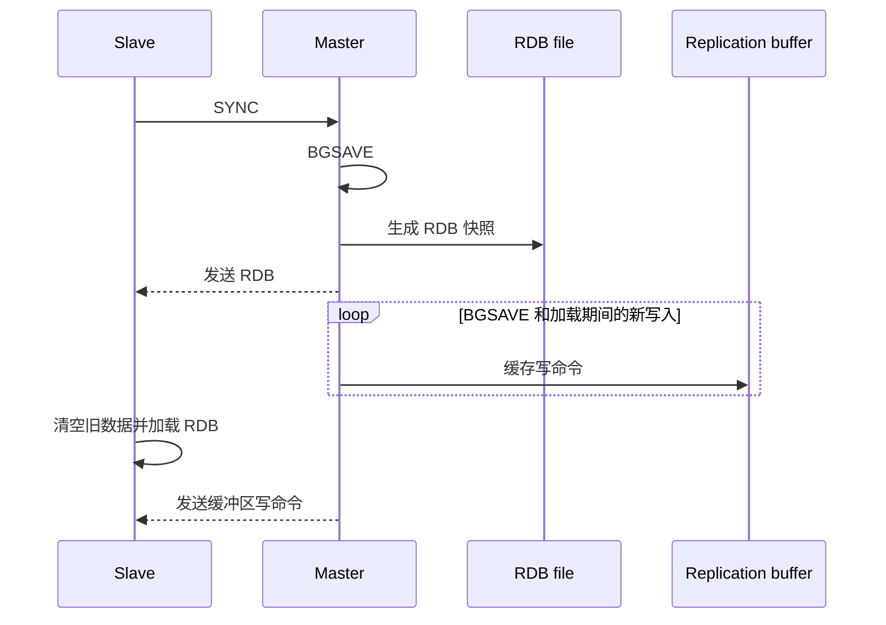
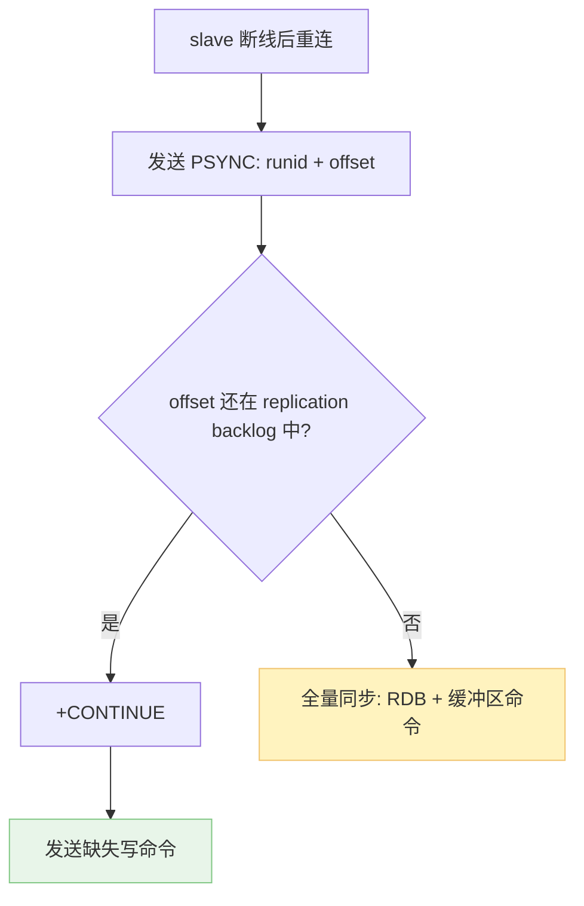
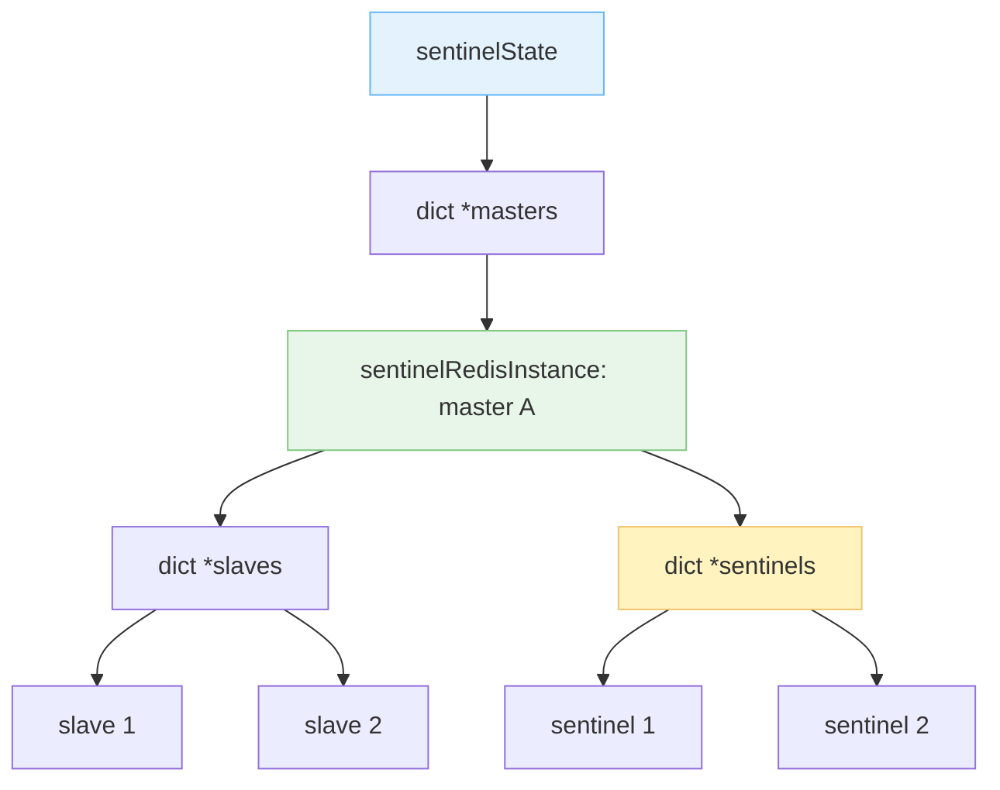
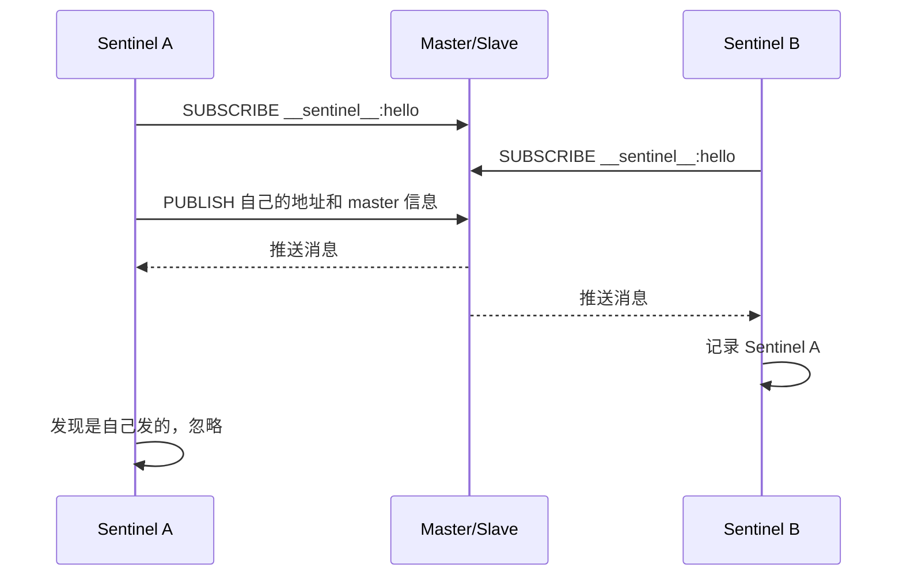
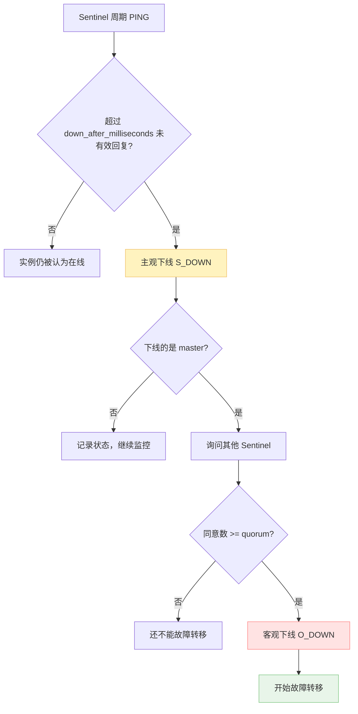
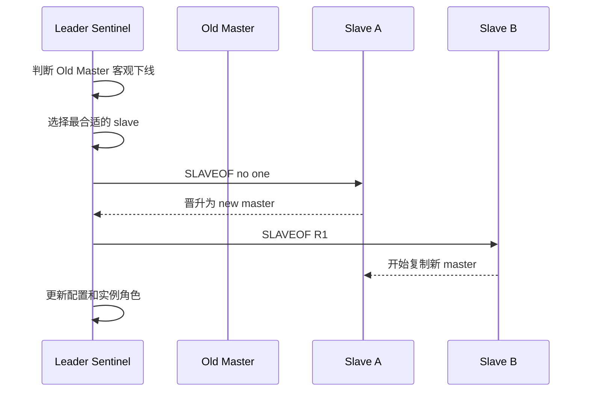
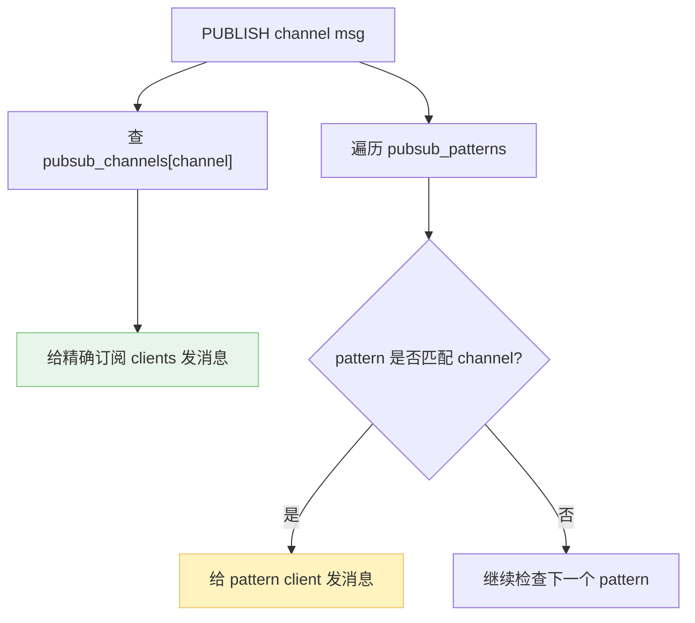

Sentinel 要解决的问题是高可用性（Highly Availability，HA）：一个 Redis 倒下去，千万个 Redis 站起来，不至于系统没有 Redis 可用了。也就是常说的主备。master 宕机时，要有 slave 站出来扛起大旗。

> **Sentinel 本质上也是一个 Redis 进程，不过它不执行普通 Redis 的 DB 功能**，所以启动时不需要载入 AOF 或 RDB。它作为监控者，盯着一个系统里的 master、slave 和其他 Sentinel。

Redis 新文档里更推荐用 replica 这个词，但源码、老配置和很多资料里仍然能看到 slave。下文沿用原文的 master/slave 说法，避免概念来回跳。

1. Table of Contents, ordered
{:toc}

# 复制

一个 HA 系统首先要给 master 配一个或多个 slave。slave 先把 master 数据库中的内容同步过来，拥有和 master 相同的数据。问题是：一个 slave 如何同步 master？

## 首次同步：SYNC

先考虑 slave 第一次同步 master 的场景。master 把自己的内容全都发给 slave，slave 就有了 master 的全部内容，这是一次全量同步。

全量同步要求 slave 给 master 发送 `SYNC` 命令：

1. master 执行 `BGSAVE` 生成一个 RDB 文件；
2. master 把 RDB 文件发送给 slave；
3. `BGSAVE` 和 slave 加载 RDB 都需要时间，这段时间内 master 收到的新写命令会放在缓冲区；
4. slave 加载 RDB 后，master 再把缓冲区里的写命令发给 slave。

这样 slave 就完全同步 master 了。

接下来呢？

- 简单粗暴：周期性像上面一样不停全量同步。如果数据库很大，这种同步间隔不能太短；但间隔太长，master 挂了之后，slave 就会丢很多数据；
- 命令传播：第一次全量同步之后，master 每次修改数据库，都把写命令也发给 slave，slave 实时跟上 master。

> 第一种方式也不是完全没优点，它代码简单。在原有同步代码上加个周期任务，基本就能跑。但显然只适合初期工期紧任务重的版本，后期就要优化成命令传播。不然每次都全量同步，像搬家一样同步个不停，谁受得了。

## 断线同步

如果一个 slave 因为网络断线，后来又重新连上，应该怎么和 master 同步？

简单粗暴的做法是把它当成初次同步，再来一遍全量同步。好处是不用新加太多逻辑；缺点也很明显：slave 缺的只是掉线期间那段写命令，没必要重新搬整个数据库。

增量同步需要两样东西：

1. 从哪里开始增量：要知道上次同步到哪里了，也就是复制偏移量 **replication offset**；
2. 增哪些量：要保存最近一段写命令历史，也就是复制积压缓冲区 **replication backlog**。

从 Redis 2.8 开始，slave 可以给 master 发送 `PSYNC`（partial sync）进行部分重同步：

1. master 判断 slave 提供的 offset 是否还在 backlog 范围内；
2. 如果还在，master 回复 `+CONTINUE`；
3. master 发送掉线期间缺失的写命令；
4. 如果不在，就只能退化成全量同步。

> `PSYNC` 也可以触发全量同步。如果 `replication backlog` 设置得不够大，slave 掉线太久，缺失写命令装不下，就得全量重来。

## `REPLCONF ACK <replication_offset>`

slave 每秒发送一次 `REPLCONF ACK <replication_offset>`，主要有两个作用：

1. 心跳检测：告诉 master “我还活着”；
2. 展示同步进度：master 发现某个 slave 的 offset 落后，就知道它还没收到最新写命令。

这不是一句普通的 ACK，它把“活着”和“同步到哪儿了”一起汇报了。Redis 很喜欢这种一条消息干两件事的设计。

# Sentinel

Sentinel 使用 `struct sentinelState` 表示自己的状态，其中关键属性是：

- `dict *masters`：这个 Sentinel 监视的多个 master。key 是 master name，value 是 `struct sentinelRedisInstance`。

一个 Sentinel 系统中有三类 Redis instance：

- Sentinel；
- master；
- slave。

Redis 使用 `struct sentinelRedisInstance` 这一种结构表示三者。也就是说，它们在 Sentinel 眼里都是“被观察的实例”，只是角色不同。

`sentinelRedisInstance` 中一些关键属性：

- `addr`：`struct sentinelAddr`，包含 ip 和 port；
- `name`；
- `runid`；
- `down_after_period`：无响应多少 ms 后被判断为主观下线；
- `quorum`：判断该 master 客观下线的最小投票数；
- `dict *slaves`：该 master 的所有 slave；
- `dict *sentinels`：监视该 master 的所有 Sentinel。

有点儿像树状结构：`sentinelState` 里含有各个 master，每个 master 下面挂着它的 slaves 和 sentinels，分别保存各个 Redis 实例的信息。

## Sentinel 从配置解析 masters 信息

Sentinel 从配置文件里的 `SENTINEL monitor ...` 等配置项读取所有 master 配置，创建 master 实例，并把监控参数设置到对应的 master 实例上。

配置文件只告诉 Sentinel “你至少要盯住这些 master”。至于 slave 和其他 Sentinel，则要靠后续自动发现。

## Sentinel 通过 master 找到 slave

Sentinel 每 10s 给 master 发送 `INFO` 命令，获取 master 信息。从 `INFO replication` 里可以解析出这个 master 的所有 slave，再把它们设置到 master 的 `dict *slaves` 属性里。

## Sentinel 从 slave 处获取信息

Sentinel 从 master 获取 slave 地址后，会和 slave 建立连接。同样每 10s 发送 `INFO`，获取 slave 信息，比如：

- 它的 master 是谁；
- 当前 replication offset 到哪儿了；
- 优先级、延迟等故障转移会用到的信息。

## Sentinel 通过频道发现其他 Sentinel

Sentinel 发现新的 master/slave 时，会和它们建立两个连接：

- 命令连接：收发命令，比如 `INFO`、`PING`；
- 订阅连接：订阅 master/slave 的 `__sentinel__:hello` channel。

发现其他 Sentinel 的过程：

1. Sentinel 每 2s 向所有已连接的 master/slave 的 `__sentinel__:hello` channel 发送消息，报上自己的 ip、port、runid，以及它对 master 的认知；
2. 其他 Sentinel 也订阅了这个 channel，于是收到消息，知道“还有别的 Sentinel 在监控同一个 master”；
3. 收到消息后，把对方记录到该 master 的 `dict *sentinels` 中；
4. 自己也会收到自己发的消息，识别出来后忽略。

## Sentinel 和 Sentinel 建立命令连接

发现其他 Sentinel 后，Sentinel 之间会建立命令连接，后续可以直接交流，比如询问某个 master 是否下线。

不需要再创建订阅连接，因为订阅连接的作用是“发现彼此”。发现完了，后续直接命令连接就行。

## Sentinel 连接一切

所以，在一个 Sentinel 系统中，Sentinel 和万物互联：

1. Sentinel 从配置文件知道 master，和 master 建立命令连接、订阅连接；
2. Sentinel 从 master 的 `INFO` 知道 slave，和 slave 建立命令连接、订阅连接；
3. Sentinel 从 `__sentinel__:hello` 频道知道其他 Sentinel，和它们建立命令连接。

这样，所有 Sentinel、master、slave 就连起来了。

> 只是所有 Sentinel 和任意 master、任意 slave、任意 Sentinel 都连起来；master 之间不互联，master 只和自己的 slave 连接，slave 之间也不互联。

# Redis 下线

Sentinel 每 1s 向所有 master、slave、Sentinel 发送 `PING`。如果连续 `down_after_milliseconds` 内没有收到有效回复，就会做下线判断。

下线分两层：

- **主观下线**：某个 Sentinel 自己觉得这个实例挂了；
- **客观下线**：如果下线的是 master，Sentinel 会询问其他 Sentinel 是否也认为它挂了。达到 `quorum` 个 Sentinel 都这么认为，才认为 master 客观下线。

**客观下线就是大家都觉得你挂了。** 紧接着 Sentinel 们会帮它们选个新的 master，再带领它们一起上线。

# 翻身农奴把歌唱

原来可以偷懒说“Sentinel 随机选一个 slave，让它变 master”。但真实机制没这么随便。毕竟这是故障转移，不是抽盲盒。

完整过程大致是：

1. Sentinel 们先选出一个负责本次故障转移的 leader Sentinel；
2. leader Sentinel 从 master 的 slaves 里挑一个最适合晋升的 slave；
3. 给它发送 `SLAVEOF no one`，让它变成 master；
4. 让其他 slave 执行 `SLAVEOF <new-master-ip> <new-master-port>`，改为复制新 master；
5. 更新配置，把旧 master 标记为新 master 的 slave。旧 master 如果以后恢复，也要乖乖当 slave。

选择 slave 时通常会考虑：

- slave 是否在线、是否健康；
- `slave-priority`，优先级太低甚至为 0 的不会被选；
- replication offset，谁数据更新，谁更适合当新 master；
- runid 等稳定排序字段，用来打破平局。

这样，一个 master 倒下去，一个 slave 翻身把歌唱。只不过它不是随机翻身，是 Sentinel 按规则把它扶上去的。

# 订阅发布

Sentinel 的自动发现用到了 Redis pub/sub，所以顺手把 Redis 订阅发布也捋一下。

## 订阅退订

Redis 支持订阅发布：client 可以订阅 Redis 的一个 channel。当 Redis 的这个 channel 收到消息后，会向所有订阅该 channel 的 client 发送消息。

普通订阅的实现很简单：

1. client 向 Redis 订阅某个 channel；
2. Redis 创建或更新 `dict *pubsub_channels`；
3. 以 channel 为 key，以订阅这个 channel 的 client 链表为 value。

命令对应关系：

- `SUBSCRIBE`：向 Redis 注册订阅信息，也就是从 dict 里找到 channel，给它的 value 加一个 client 节点；
- `UNSUBSCRIBE`：从链表里删掉这个 client。

Redis 还支持模糊订阅，用类似通配符的规则订阅多个 channel。实现也相当粗暴：

1. 再搞一个 `list *pubsub_patterns`；
2. 每个节点记录一个 client 和它的 pattern。

命令对应关系：

- `PSUBSCRIBE`：pattern subscribe，给链表加节点；
- `PUNSUBSCRIBE`：从链表删节点。

## 发布

因为订阅信息分散在两个属性里，发布时也要访问两个地方：

1. 从 `pubsub_channels` dict 里找出该 channel 对应的 client 链表，遍历发送；
2. 遍历 `pubsub_patterns` 链表，检查每一个 pattern 是否匹配该 channel，匹配就发送。

相关命令：

- `PUBLISH`：向某 channel 发布消息；
- `PUBSUB CHANNELS <pattern>`：返回全部或符合 pattern 的 channel；
- `PUBSUB NUMSUB <channel1> <channel2> ...`：返回这些 channel 的订阅者数量。

# 小结

Sentinel 的机制链路可以压成一句话：

**复制保证 slave 有数据，Sentinel 发现并监控所有实例，下线判断保证不是一个 Sentinel 自嗨，故障转移把最合适的 slave 晋升为 master。**

它没有让 Redis 变成分布式强一致数据库。它解决的是更朴素也更常见的问题：master 挂了之后，系统别跟着一起躺平。
