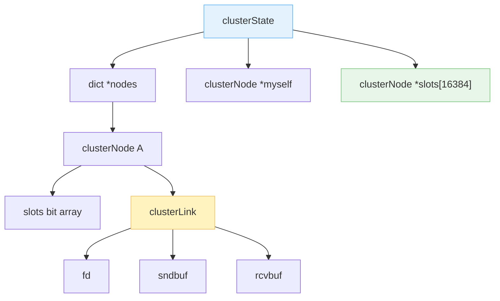
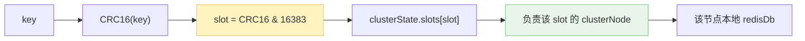
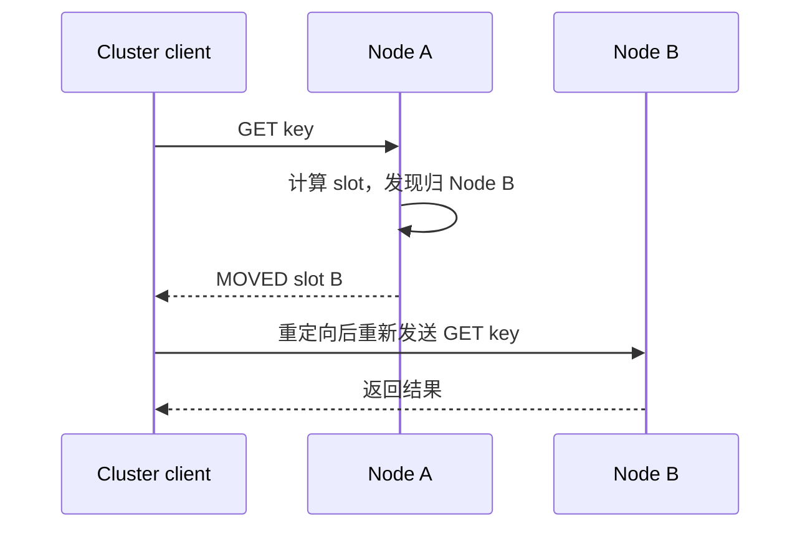
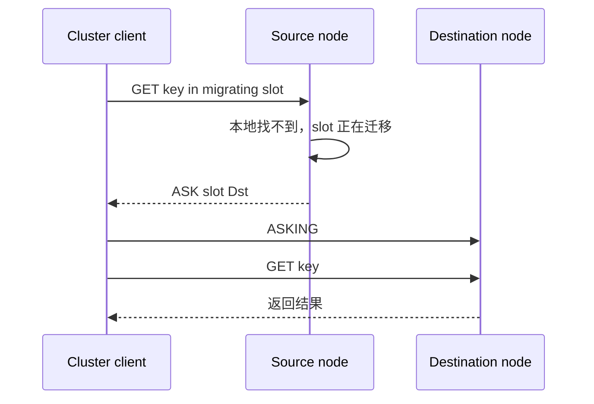
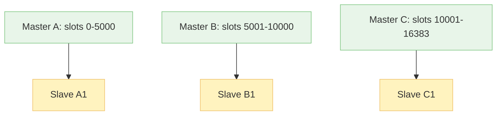
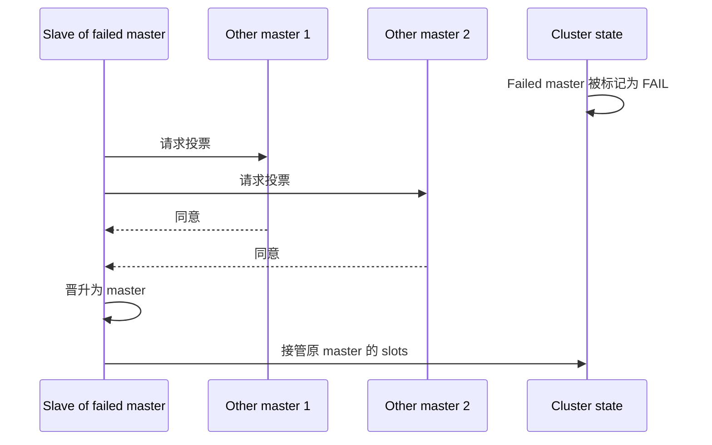

一台机器的内存是有限的，在上面部署的 Redis 能存储的内容自然也是有限的。如果内容过多，就要使用分布式数据库，把内容分摊到一堆 Redis 里，这就是 Redis Cluster。

> Sentinel 也是一堆 Redis，但它是为了高可用搞的主备，不同 Redis 保存的内容基本相同。Cluster 是为了分片，不同 master 保存不同 slot。它俩不是一个东西，别一看到“一堆 Redis”就混成一锅粥。

1. Table of Contents, ordered
{:toc}

# node

Cluster 由一堆节点组成。什么样的 Redis 才能成为集群节点？

## 节点模式

**节点必须是运行集群模式的 Redis，由 `redis.conf` 里的 `cluster-enabled yes` 指定**。

```bash
cluster-enabled yes
```

不开启这个配置，Redis 就只是普通单机实例，识别不了 cluster 相关命令。

## 节点启动

建议创建不同文件夹，保存不同 Redis 节点的配置，然后**分别从各自的文件夹启动 Redis**。

这个“分别从自己的目录启动”很重要，因为 Redis 启动时会在 current working directory 生成额外文件，比如 `nodes.conf`，记录当前集群节点信息。

比如：

```bash
win-pichu@DESKTOP-T467619 ~/Utils/redis/redis-6.0.9/confs $ tree
.
└── cluster
    ├── 2222
    │   ├── appendonly.aof
    │   ├── nodes.conf
    │   └── redis.conf
    └── 2223
        ├── appendonly.aof
        ├── nodes.conf
        └── redis.conf

3 directories, 6 files
```

其中 `nodes.conf` 和 `appendonly.aof` 分别是开启 cluster mode 和 AOF 持久化之后生成的文件。

如果启动完一台 Redis 后还要在同一个目录下启动另一台 Redis，Redis 会发现当前目录已经存在 `nodes.conf`，然后报错：

```text
Sorry, the cluster configuration file nodes.conf is already used by a different Redis Cluster node.
Please make sure that different nodes use different cluster configuration files.
```

这不是 Redis 娇气，是它真的需要每个节点有自己的身份文件。不然两个节点共用一本户口本，后面全乱了。

## 节点连接

client 使用 `-c` 选项以 cluster 模式连上一台 Redis，然后发送：

```bash
CLUSTER MEET <host> <port>
```

这个命令可以让当前 Redis 和 `<host>:<port>` 指定的 Redis 互相认识，组成一个两个节点的 cluster。

> 不用 `-c` 启动 client，某些 cluster 命令也能发出去。但这种 client 识别不了 server 返回的 `MOVED` 等重定向响应，只会把响应直接打印出来，而不会自动跳到正确节点。

Redis server 本身要开启 `cluster-enabled`，否则不能识别 cluster 指令：

```bash
127.0.0.1:6379> cluster meet 127.0.0.1 1111
(error) ERR This instance has cluster support disabled
```

`CLUSTER NODES` 可以显示 cluster 的所有 node，内容基本就是 `nodes.conf` 里的信息。

# cluster 数据结构

Redis Cluster 使用 `struct clusterState` 表示集群状态，关键属性包括：

- `dict *nodes`：集群里所有节点，key 为节点 name，value 为 `clusterNode`；
- `clusterNode *myself`：指向自己的指针。每个节点都记录所有 `clusterNode`，所以必须知道哪个是自己；
- `size`：至少处理着一个 slot 的节点数量，也就是逻辑上活着并负责数据的节点数量；
- `clusterNode *slots[16384]`：slot 到 node 的映射。

Redis Cluster 使用 `struct clusterNode` 表示节点状态，关键属性包括：

- `name`；
- `ctime`：create time；
- `ip`；
- `port`；
- `char slots[16384/8]`：bit array，每个 bit 代表一个 slot，1 表示该 slot 分配给该 node；
- `clusterLink *link`：该节点的连接信息。

`clusterLink` 里又有：

- `int fd`：TCP socket 描述符；
- `sds sndbuf`：send buffer；
- `sds rcvbuf`：receive buffer；
- `clusterNode *node`：这个 link 对应的节点。



> Redis server 可能保存 `redisClient`，里面也有缓冲区、fd 等，是和 client 交互用的；Redis server 在 cluster mode 下还保存 `clusterNode.clusterLink`，里面的缓冲区、fd 等是和其他 node 交互用的。

和 Sentinel 对比一下，整体数据结构挺像：state 是总体，里面有一个 dict 存所有 node/instance。区别是 Cluster 还必须保存 slot 到 node 的映射，因为它要解决分片。

# slot

Slot 是 Cluster 的核心，涉及：

- slot 分配；
- 分片 sharding；
- slot 转移；
- 请求重定向。

Redis Cluster 把数据库分为 16384 个 slot，也就是 `2^14` 个桶。key 分配到哪个 slot，使用的是 CRC16，而不是普通 hashmap 那种扩容 rehash。

计算方式可以理解为：

```text
slot = CRC16(key) & 16383
```

这里是 `& 16383`，也就是 `2^14 - 1`，不是 `& 2^14`。因为 16384 个 slot 的编号范围是 `0..16383`。

和普通 hashmap 相比：

- 优点：**slot 总数恒定，不需要 rehash**；
- 缺点：很容易算出 key 属于哪个 slot，但还要知道这个 slot 在哪个 node 上。

Redis Cluster 必须让全部 16384 个 slot 都被负责，否则 cluster 不可用。缺了一块数据，自然不能假装自己完整。



## ADDSLOTS

`CLUSTER ADDSLOTS <slot1> <slot2> ...` 可以给 server 指派新的 slot。

连续的 slot 可以在工具层面批量指定，但 Redis 命令本身最终表达的是一批 slot 编号。

**只有 16384 个 slot 全部分配完毕，整个 cluster 才正常上线。** 可以使用 `CLUSTER INFO` 查看集群 status，使用 `CLUSTER NODES` 查看各个 node 绑定的 slot 情况。

## 数据结构

`clusterNode` 里有：

- `char slots[16384/8]`：每个 bit 代表一个 slot，1 表示该 slot 分配给该 node。

`clusterState` 则记录整个集群 slot 的分配情况：

- `clusterNode *slots[16384]`：指针数组，每个位置指向负责这个 slot 的 node。

有了这两个属性：

- 根据 node 查它负责哪些 slot：看 node 自己的 bit array；
- 根据 slot 查 node：直接访问 `clusterState.slots[slot]`。

都是 `O(1)` 级别的查询。空间换时间呀，Redis 又开始熟悉的套路了。

## 寻找 slot

寻找 slot 在哪个 node 里分两步：

1. 计算 key 所在 slot：`CLUSTER KEYSLOT <key>`；
2. 查 `clusterState.slots[slot]`，找到负责该 slot 的 node。

Redis server 收到一条命令：

1. 如果 slot 就在自己这里，直接操作；
2. 如果 slot 在别的节点，返回 `MOVED <slot> <ip:port>`，告诉 client 去那个节点执行。



不使用 cluster 模式（`-c`）启动的 client 识别不了 `MOVED`，会直接把这条响应输出出来，而不是自动重定向。

## `CLUSTER GETKEYSINSLOT <slot> <count>`

这个命令返回某个 slot 中最多 `count` 个 key。

实现上，每一个 kv 除了存进 DB 的 dict，还会存进一个 `zskiplist *slots_to_keys`。跳表的 score 是 slot number，节点保存 key。相当于给整个 DB 里的 key 按 slot number 建了一个有序索引。

> 涉及 dict 的 range 操作，Redis 就用跳表先排序。和 zset 的实现一个套路。

## sharding

因为 slot 个数恒定，Redis Cluster 的 sharding 操作比普通 hashmap rehash 简单：只要把 slot 从一个节点挪到另一个节点。

但迁移是有过程的。如果正在迁移一个 slot，请求来了怎么办？这就涉及 `ASK`。

`MOVED` 和 `ASK` 格式类似，但含义不同：

- `MOVED`：这个 slot 已经不归我了，你以后都去那个节点；
- `ASK`：这个 slot 正在迁移，我不确定这个 key 是否已经挪过去了，你临时去问一下目标节点。



目标节点正在导入 slot 时，来了对应 key 的指令怎么办？

- 正在导入的 slot 还不算自己的正式 slot，所以普通请求可能返回 `MOVED`；
- 只有请求先发送 `ASKING`，说明是源节点让 client 临时过来的，目标节点才会在正在导入的 slot 中查找。

Redis 怎么知道自己是不是在迁移？因为迁移过程中，Redis 会在 `clusterState` 里记录当前正在迁移和导入的 slot。

> Redis 知道的事情多，因为它创建的数据结构多呀。听起来像废话，但源码里真就是这么朴素。

# HA

Cluster 也有主备，这点有点儿像 Sentinel。所以 Cluster 中也存在 master 和 slave。

`clusterNode` 里有：

- `clusterNode *slaveof`：如果我是 slave，指向我的 master；
- `clusterNode **slaves`：如果我是 master，指向我所有的 slaves。



如果某个 master 挂了，它的 slave 会发起故障转移，争取成为新的 master。这个过程和 Sentinel 有点像，也需要其他 master 投票。

大致链路：

1. Cluster 节点之间通过 gossip 和心跳发现某个 master 疑似下线；
2. 足够多的 master 确认后，该 master 被标记为 fail；
3. 这个 master 的 slave 发起选举；
4. 其他 master 投票；
5. 得票成功的 slave 晋升为 master，接管原 master 的 slot。



这里原文最后一句应该是“slave 会取代它成为 master”，不是成为 slave。农奴都翻身了，不能又给按回去了。

# 小结

Redis Cluster 的核心机制可以压成三条：

- **slot 是分片单位**：key 先算 slot，再找负责 slot 的 node；
- **client 要理解重定向**：`MOVED` 是长期搬家，`ASK` 是迁移期间临时问路；
- **Cluster 自带主备故障转移**：某个 master 挂了，它的 slave 可以接管对应 slot。

Sentinel 解决的是“同一份数据谁来当 master”；Cluster 解决的是“数据太多怎么拆到多个 master 上”。一个管 HA，一个管 sharding，Cluster 自己又顺手带了一部分 HA。Redis 这套东西看起来分叉很多，抓住 slot 和角色之后就没那么乱了。
