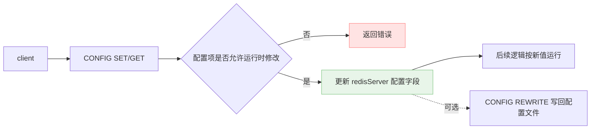
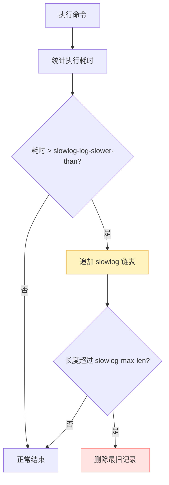
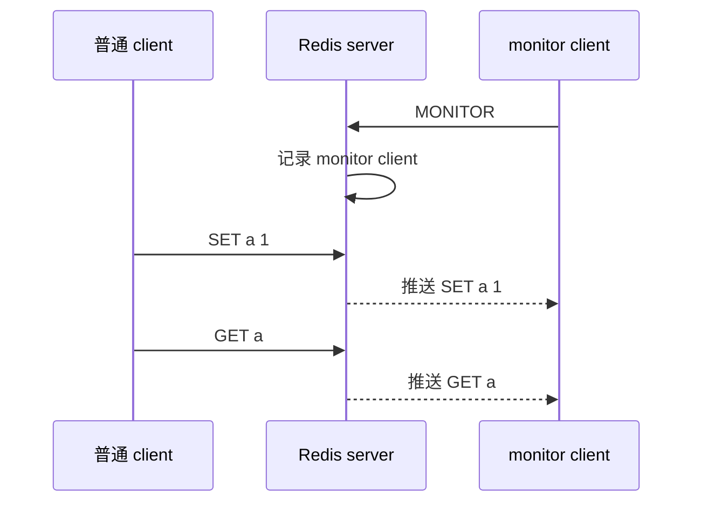

Redis 其他值得一提的小功能。它们看起来零散，但背后的思路很统一：**运行时配置改状态，慢日志用内存链表记事件，monitor 用 client 列表广播命令**。

1. Table of Contents, ordered
{:toc}

# runtime config

可以用 `CONFIG SET <key> <value>` 进行 runtime 配置：

```bash
CONFIG SET slowlog-log-slower-than 10000
```

也可以用 `CONFIG GET <key>` 查看：

```bash
CONFIG GET slowlog-*
```

它的本质不是魔法，就是把配置项映射到 `redisServer` 里的字段。能运行时改的配置，Redis 收到命令后就校验参数、更新内存里的配置值；不能运行时改的配置，就不会让你通过 `CONFIG SET` 瞎折腾。

如果希望把运行时修改写回配置文件，还要看具体版本和配置项是否支持 `CONFIG REWRITE`。否则进程重启之后，内存里的修改就没了。



# slowlog

Redis 和 MySQL 一样，也有慢查询日志。

在 `redis.conf` 里可以配置：

```bash
slowlog-log-slower-than <microseconds>
slowlog-max-len <number>
```

注意第一个配置的单位是**微秒**，不是毫秒。这个地方很容易顺手写错，毕竟平时说慢查询都喜欢说“多少毫秒”。Redis 偏不，它用微秒，嗯，很 Redis。

- `slowlog-log-slower-than`：执行时间超过多少微秒的命令会被记录；
- `slowlog-max-len`：最多保存多少条慢日志。

实际实现上，Redis 在 `redisServer` 里用链表保存符合条件的 command，**默认不持久化**。也就是说，slowlog 是诊断用的内存结构，不是审计日志。

常用命令：

```bash
SLOWLOG LEN
SLOWLOG GET
SLOWLOG RESET
```

这里原来容易写成 `SLOTLOG RESET`，但正确命令是 `SLOWLOG RESET`。Redis 没有一个慢 slot 日志在那儿等着我们召唤。



工程含义也很简单：

- slowlog 记录的是**命令执行时间**，不包含排队等待、网络传输这些时间；
- 它保存在内存里，重启就没了；
- 它适合定位“哪个命令本身慢”，不适合当完整请求链路追踪。

# monitor

`MONITOR` 可以把一个 client 变成当前 server 的 monitor，实时打印 server 收到的命令。

实现也很简单，和 pub-sub、listener 的味道一样：

1. client 执行 `MONITOR`；
2. Redis 把这个 client 放进 monitors 列表；
3. server 每收到一条命令，就遍历 monitors，把命令文本发给它们。



`MONITOR` 很适合临时观察“到底谁在打这个 Redis”，但它不是免费午餐：

- 命令很多时，monitor client 会收到大量输出；
- Redis 需要额外把命令推给 monitor client；
- 线上使用要谨慎，尤其是高流量实例。

# 小结

这几个功能都不大，但能看到 Redis 一贯的实现风格：

- 能用已有 server 字段表达的，就直接更新字段；
- 能用链表保存的，就先放内存链表；
- 能通过 client 列表广播的，就遍历 client 发送。

功能小，不代表没用。很多线上排障时候，`CONFIG GET`、`SLOWLOG GET`、`MONITOR` 比复杂工具还快。只不过 `MONITOR` 这种工具要轻拿轻放，不然排障的人也可能变成新的故障源。
