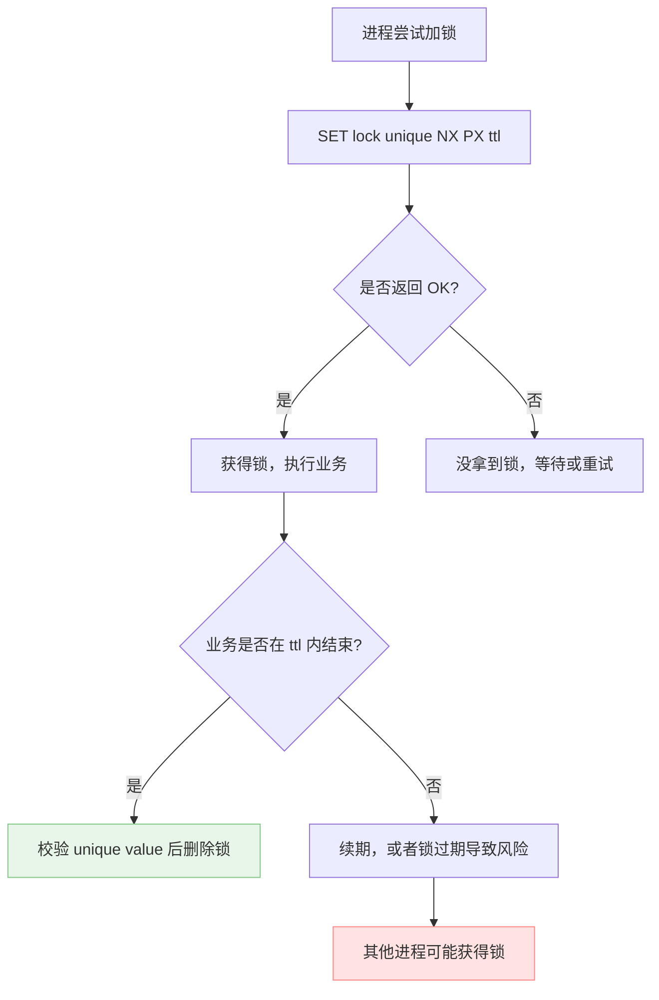
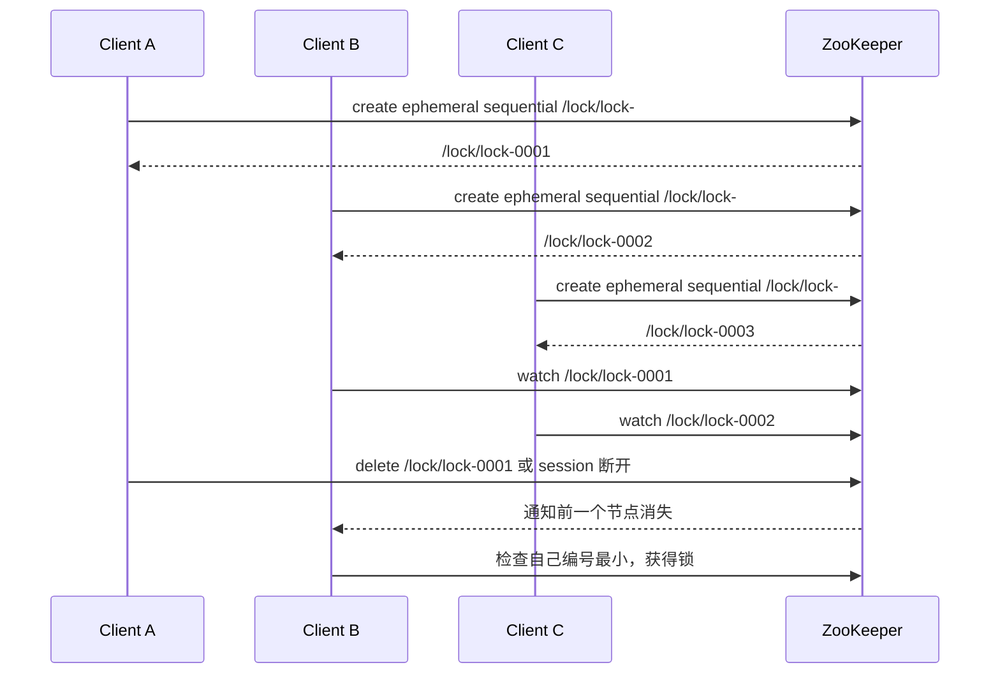
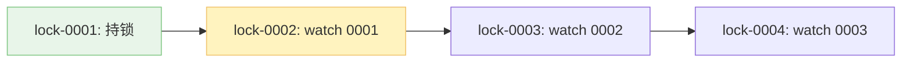

Redis 常被用来实现分布式锁。分布式锁和并发编程里的锁理念一致，区别是：并发锁协调同一进程里的多个线程，分布式锁协调多个进程、多个机器、甚至多个网络分区里的参与者。

这句话说完就知道了：**分布式锁真正麻烦的不是“怎么抢锁”，而是“拿锁的人消失了怎么办”。**

1. Table of Contents, ordered
{:toc}

# 分布式锁

逻辑上，分布式锁和非分布式锁是一样的：拿到锁的人干活，访问唯一资源；其他人不得干涉。

多个进程之间的分布式锁可以有很多种实现。比如：一个进程创建一个文件，创建成功就算拿到锁，可以访问临界资源；其他进程创建同名文件时发现文件已存在，创建失败，相当于没拿到锁。

这类实现的共同点是：**所有竞争者都去争夺同一个外部可见的“标记”**。谁成功创建这个标记，谁就拿到锁。

# Redis 分布式锁

之所以拿 Redis 做分布式锁，是因为 Redis 用起来相当方便，部署启动方便，`set`/`get` 也方便。

最朴素的想法是：当一个 key 不存在时，`set` 一个 key/value 成功，就认为拿到锁；处理完互斥操作后把 key 删除。

这个操作必须是原子的。Redis 提供过 `SETNX`：

```bash
SETNX key value
```

正常情况下，一个分布式锁就这么实现了。一般这个 value 最好能唯一标识进程或请求。

`SETNX` 的命令说明见 Redis 官方文档：[SETNX](https://redis.io/commands/setnx)。

## 进程锁 vs. 线程锁

进程间分布式锁和线程锁相比，有个很大的不同点：持有锁的进程可能崩掉，**更常见的是网络异常，导致节点掉线了**。其他进程还要继续工作，但掉线进程设置的锁继续存在，其他进程将永远不能获得锁。

线程间的锁一般不太需要考虑这些：

- 线程很少单独“崩掉之后锁还留在那儿”，通常是整个进程直接挂；
- 同一进程里的线程之间不存在某个线程“网络异常导致掉线”的情况；
- JVM 进程都挂了，进程内的锁自然也没了。

所以 Redis 分布式锁真正困难的地方，是处理进程异常结束、网络异常、执行超时这些特殊情况。

## 过期时间和原子性

进程都崩了，还怎么进行后处理把锁删掉？一般能想到的就是给 key 设置一个过期时间。

这基于一个假设：正常情况下一个操作用不了这么久。如果这么久 key 还在，可以理解为进程崩了或掉线了，key 到时间自动过期。

但这又衍生出两个问题：

1. `set if not exist` 和设置过期时间必须是一个原子操作；
2. 如果业务还没执行完，锁到期自动删除，其他进程就能进来，互斥被破坏。

Redis 后来把 `SET` 命令升级得更完整，可以一条命令完成“仅不存在时设置 + 设置过期时间”：

```bash
SET lock_key unique_value NX PX 30000
```

含义是：

- `NX`：not exist，key 不存在时才 set；
- `PX 30000`：设置 30000ms 过期时间；
- `unique_value`：唯一标识当前持锁者，后面释放锁时要用。

`SET` 命令说明见官方文档：[SET](https://redis.io/commands/set)。



## 为什么 value 要唯一

如果锁只是一个 key，没有唯一 value，会出现误删锁的问题：

1. 进程 A 拿到锁，业务执行太久，锁过期；
2. 进程 B 拿到同一个锁；
3. 进程 A 终于执行完，直接 `DEL lock_key`；
4. A 把 B 的锁删了。

所以 value 必须唯一标识持锁者。释放锁时要先判断 value 是不是自己的，再删除。

这个判断和删除也必须原子完成，否则又会出 race condition。常见做法是用 Lua：

```lua
if redis.call("GET", KEYS[1]) == ARGV[1] then
    return redis.call("DEL", KEYS[1])
else
    return 0
end
```

这段脚本表达的就是：**只有锁还是我的，我才能删。**

## 续期问题

如果特殊情况下到时间了还没有执行完怎么办？key 到时间自动删除，其他进程就可以介入。

一种做法是开一个守护线程，发现业务还没结束且锁快过期了，就重设过期时间，也就是俗称“续一波”。

但续期并不是银弹：

- 持锁进程可能 STW、卡死、网络断开，续期线程也可能来不及；
- 续期太激进，会让异常锁更难释放；
- 续期太保守，又可能保护不住长任务。

所以，用 Redis 实现分布式锁，应对异常情况相当麻烦。它能做，而且很多场景能做得够用；但你必须知道自己在和哪些失败模式做交易。

# ZooKeeper 分布式锁

Redis 分布式锁不够漂亮，核心原因是：**出现异常时，进程不在了，锁可能还在**。ZooKeeper 恰好能很漂亮地解决这个痛点，所以分布式锁常用 ZooKeeper 来搞。

## znode

ZooKeeper 是树状结构，像一个文件系统。节点称为 znode，常见有四种：

- persistent znode：持久节点，创建后一直存在，除非手动删除；
- persistent sequential znode：持久顺序节点，在同一个父节点下创建子节点时，ZooKeeper 自动编号，先创建的编号更小；
- ephemeral znode：临时节点，创建后存在，**client session 断开后自动删除**；
- ephemeral sequential znode：临时顺序节点，自动编号，同时 session 断开后自动删除。

**ZooKeeper 分布式锁用的是临时顺序节点**，主要利用两个特性：

- ephemeral：client 进程崩溃、掉线，session 结束后节点自动删除，解决 Redis 锁“人没了锁还在”的痛点；
- sequential：ZooKeeper 自动给节点编号，从小到大天然形成获取锁的顺序。

## 获取锁逻辑

ZooKeeper 获取锁的逻辑：

1. 创建一个 parent znode，比如 `/locks/my-lock`；
2. 所有进程在它下面创建临时顺序子 znode；
3. 判断自己是不是编号最小的 znode；
4. 是的话获得锁；
5. 不是的话，监听自己的前一个 znode；
6. 前一个 znode 消失时，收到 watch 通知，再检查自己是否成为最小节点。



> **每一个节点等待前一个节点，形成一个等待队列**。AQS 也是这个味道：[AQS：显式锁的深层原理]()。

ZooKeeper 不同于 Redis，不是大家都去“创建相同名称的 node，创建成功就是获得锁，不成功就是没获得锁”。它是每个人都创建自己的顺序 node，然后按编号排队。

所以 **ZooKeeper client 不需要自旋抢锁**，只需要注册一个 watch 监听自己的前一个节点即可。前一个没了，自己再检查是否轮到自己。



# Redis vs. ZooKeeper

ZooKeeper 比 Redis 优秀的地方：

- **异常处理**：ephemeral znode 绑定 session，client 崩溃或掉线后节点自动删除。这点 ZooKeeper 比 Redis 自然太多；
- **降低锁竞争**：顺序节点已经安排了锁获取顺序，每个节点等前一个节点通知即可；
- **避免自旋**：Redis client 常见做法是反复尝试 `SET NX`，竞争激烈时会加剧 Redis 压力；ZooKeeper 主要靠 watch 通知。

Redis 也有优点：

- 性能高，`SET` 很快；
- 部署和使用简单；
- 对“允许短时间锁失效风险、业务可幂等兜底”的场景足够方便；
- 对已有 Redis 基础设施的系统，接入成本低。

| 维度 | Redis 锁 | ZooKeeper 锁 |
| --- | --- | --- |
| 加锁方式 | `SET key value NX PX ttl` | 创建临时顺序 znode |
| 异常释放 | 依赖 TTL，可能需要续期 | session 断开后临时节点自动删除 |
| 等待方式 | 常见是重试、自旋或 sleep 后重试 | watch 前一个节点 |
| 竞争压力 | 高竞争下会反复打 Redis | 每个节点只盯前驱，竞争更平滑 |
| 使用成本 | 低，部署简单 | 更重，但语义更适合协调 |

总体来讲，在“严肃分布式协调”这件事上，ZooKeeper 更成熟；在“我就想快速做一个够用的业务锁”这件事上，Redis 很方便。

关键是别骗自己：Redis 分布式锁不是普通本地锁换个存储介质那么简单。网络、过期、续期、误删、进程暂停，每一个都可能出来整活。

# Ref

两篇很不错的文章：

- [Redis 分布式锁](https://mp.weixin.qq.com/s/8fdBKAyHZrfHmSajXT_dnA)；
- [ZooKeeper 分布式锁](https://mp.weixin.qq.com/s/u8QDlrDj3Rl1YjY4TyKMCA)。
