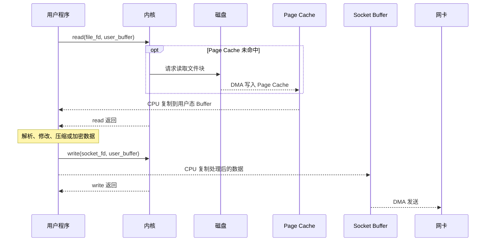
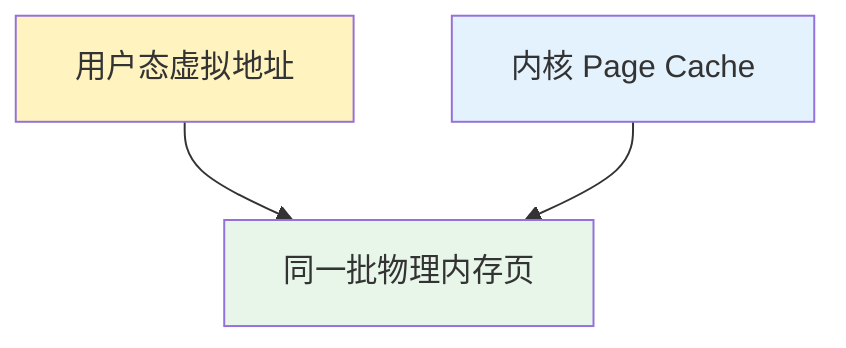
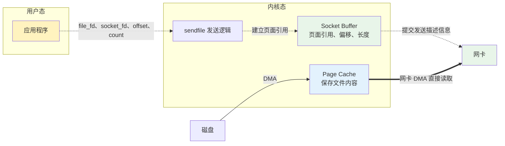
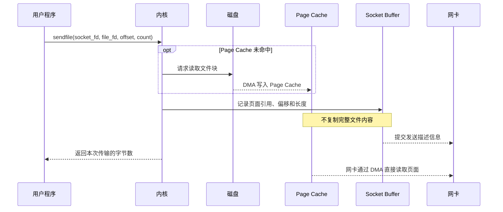

汇总一下总结过的IO/NIO/AIO相关。

1. Table of Contents, ordered
{:toc}

看一篇就够了[从阻塞IO到IO多路复用到异步IO]()，其他篇都成了补充。

IO模型：
- Blocking IO: [Java IO]()；
- BIO服务器实现: [（一）How Tomcat Works - 原始Web服务器]()；
- Non-Blocking IO: [Java NIO]()；
- BIO和NIO的形象类比: [Http Server线程模型：NIO vs. BIO]()；
- Java NIO所使用的os的底层机制：[epoll]()；
- NIO和异步Servlet，其实这个异步和异步IO思想都是类似的，毕竟都是异步: [Servlet - NIO & Async]()；
- Asynchronous IO: [AIO]()；

读写时的编码问题：
- 字符集：[Unicode & UTF-n]()；

后续如果还有关于IO的，继续更新到这里。

# 零拷贝：为“只搬运、不处理”选择专用路径

理解零拷贝之前，必须先分清两个不同的 I/O 场景。**传统 `read` + `write` 不是需要修复的错误，零拷贝也不是它的通用替代品；它们分别服务于不同需求。**

## 场景一：数据需要进入用户态处理

大多数程序读取文件，是为了真正使用其中的数据。例如：

- 图片服务读取原图，加水印后再发送；
- 压缩程序读取文件，压缩后写回磁盘；
- 服务端读取数据，解析、过滤或加密后发给客户端。

```c
read(file_fd, buffer, size);
// 应用在这里解析或修改数据
write(socket_fd, buffer, size);
```

数据必须进入用户态，因为业务逻辑就在用户程序中。此时用户态 Buffer 不是多余的中转站，而是加工数据的“车间”；处理前后的内容甚至可能完全不同。

### 正常读写的数据流

以“读取文件、处理内容、再通过网络发送”为例，完整数据流如下：


这里的用户态 Buffer 承担了真实工作：应用从中读取原始数据，并把处理结果交给内核发送。两次 CPU 复制是通用 I/O 模型为应用处理数据提供的必要路径。

### 正常读写的时序



在这个场景里，`read` 把数据交给应用，`write` 把应用的处理结果交回内核，职责划分合理，并不存在需要消除的“无效中转”。

## 场景二：数据只需要原样搬运

另一类任务不关心文件内容，只想把数据从一个 I/O 端点原样送到另一个端点，例如 Web 服务器发送静态文件、文件下载服务返回视频，或者消息系统把落盘日志发送给消费者。

假设服务器要发送一个 1 GB 的视频。应用不解码、不压缩、不修改它，只需要完成“从文件到网络”的传输。如果仍然套用刚才的通用路径，数据依然会经过 Page Cache、用户态 Buffer 和 Socket Buffer。

### 最关键的类比：先收快递，再原样寄出去

把应用程序想象成“我”，把文件数据想象成一件快递：

- `read`：快递员先把包裹从中转站送到我家，我签收；
- 应用处理：我拆开包裹，修改、加工或者重新包装；
- `write`：我再联系另一位快递员，把处理后的包裹寄出去。

如果我确实要拆包加工，那么“先收再寄”完全合理。但静态文件发送的情况是：**我收到包裹后根本不拆，甚至不看一眼，马上把完全相同的包裹交给下一位快递员。**

> `read + write` 相当于“我先收快递，再亲手原样寄出去”；零拷贝则是“我只下达转寄指令，让中转站直接把包裹交给下一段运输”。

只有后一种场景里，“送到我家”才是没有意义的绕路。对应到计算机中，文件没有在用户态被处理，却仍被复制给用户程序，再从用户程序复制回内核。

如果发送 1 GB 文件，CPU 要完成两次完整的数据搬运：

1. Page Cache → 用户态 Buffer：复制 1 GB；
2. 用户态 Buffer → Socket Buffer：再复制 1 GB。

**只有在“只搬运、不处理”的前提下，这两次 CPU 复制才没有业务价值，零拷贝才有意义。**

对照上面的正常时序，可以明确找出三处优化空间：

1. **应用处理可以省掉**：应用既不读取内容，也不产生新的结果；
2. **Page Cache → 用户态 Buffer 可以省掉**：没有处理逻辑，就不必为应用复制一份数据；
3. **用户态 Buffer → Socket Buffer 可以继续省掉**：既然用户态没有新结果，内核可以让网卡引用已有的 Page Cache 页面。

与此同时，原来的 `read` 和 `write` 也可以合并成一次“把文件直接发到 Socket”的意图表达。数据仍要从磁盘进入内存、再从内存进入网卡；省掉的是用户态中转以及 CPU 对完整文件内容的重复搬运。

因此，问题不是“传统 I/O 为什么这么低效”，而是：

> **当任务从“读取并处理数据”变成“只转发数据”时，还有没有必要继续走为数据处理设计的通用路径？**

零拷贝给出的答案是：应用既然不处理数据，就应该选择能表达“直接搬运”意图的专用接口，让操作系统有机会跳过用户态中转。

## 为什么不能让所有 I/O 默认走零拷贝

操作系统无法自行猜测应用是否要修改数据。`read` 和 `write` 面向所有程序，所以必须把数据交给用户态；只有应用明确选择“我不处理内容，请直接传输”的专用接口，内核才能放心跳过用户态。**场景不同，向操作系统表达的意图不同，适合的技术方案也不同。**

同时，普通程序不能直接控制磁盘和网卡，否则一个进程就可能读取别人的文件、破坏其他连接，甚至让硬件进入错误状态。设备必须由内核管理。

因此真正的难点是：

> **既保留用户态和内核态的权限隔离，又让“不修改数据”的应用跳过无意义的中转。**

除此之外，文件在内存里通常分散在多个物理页中，发送期间还要保证这些页面不会被提前回收。网卡必须知道每段数据的地址和长度，内核还要跟踪发送进度和页面生命周期。零拷贝不是简单地“少写一行代码”，而是由操作系统和硬件共同完成安全的直接传输。

## 可以怎样减少这段绕路

现在目标已经明确：文件不需要处理，就尽量不要把内容复制到用户态，再从用户态复制回来。沿着这个目标，可以有两种不同力度的优化。

第一种做法比较保守：应用仍然保留访问文件内容的能力，但不再通过 `read` 制造一份独立的用户态副本。这就是 `mmap + write`。

第二种做法更彻底：既然应用完全不读取文件内容，那就连 `write` 也不必由应用衔接，直接把整个传输任务交给内核。这就是 `sendfile`。

下面先看第一种做法如何省掉一次复制，再看第二种做法如何让应用彻底退出中转。

### 方案 A：`mmap + write`

`mmap` 的一般用途，是**把文件映射进进程的虚拟地址空间**，让程序像访问内存一样访问文件。它并不是专门为网络发送设计的，文件随机读取、共享内存和持久化映射等场景也会使用它。

把它用于文件发送时，可以用 `mmap` 代替 `read`：

```c
void *address = mmap(/* 映射文件 */);
write(socket_fd, address, size);
```

普通 `read` 会把 Page Cache 中的数据复制到一块独立的用户态 Buffer。`mmap` 换了一个思路：**不把快递真正送到你家，而是给你一个可以直接访问中转站货架的窗口。**

用户虚拟地址和内核中的 Page Cache 可以映射到同一批物理内存页：



这样就省掉了“Page Cache → 用户态 Buffer”的复制。不过，应用仍要调用 `write`，通常还要把文件内容复制到 Socket Buffer：

```text
磁盘 → Page Cache → Socket Buffer → 网卡
```

所以“`mmap` 让数据完全不经过用户态”并不准确。更准确的说法是：**没有生成一份独立的用户态数据副本，但应用仍可通过用户态虚拟地址访问 Page Cache。**

### 方案 B：`sendfile`

`mmap + write` 虽然少复制了一次，但应用仍然要参与发送。`sendfile` 选择了更直接的接口：应用不接触文件内容，只把“从哪里搬到哪里”告诉内核。

```c
sendfile(socket_fd, file_fd, &offset, count);
```

应用只提供源文件、目标 Socket、起始位置和长度，真正的传输留在内核中完成。[Linux `sendfile(2)` 手册](https://man7.org/linux/man-pages/man2/sendfile.2.html)也明确说明，它比 `read` + `write` 更高效的原因，正是数据不必来回经过用户空间。

用快递类比，`sendfile` 相当于提交一张转寄单：

```text
把 file_fd 从 offset 开始的 count 字节，直接发给 socket_fd。
```

普通方式需要 `read`、`write` 两次系统调用，也就是四次用户态/内核态模式切换；`sendfile` 只需要进入和离开内核各一次。这里常说的“上下文切换”，更准确地讲主要是**用户态与内核态之间的模式切换**，不一定发生了进程调度。

`sendfile` 首先保证的是“应用退出中转”。至于内核是否还要把 Page Cache 中的数据复制到 Socket Buffer，则取决于操作系统、文件类型、Socket 和硬件支持。

因此，`mmap + write` 和 `sendfile` 是应用可以选择的两条传输路径，并不是前后相接的步骤。选择 `sendfile` 时，应用不需要先调用 `mmap`。

### `sendfile` 的进一步优化：Socket 只保存“提货单”

某些实现仍会在内核中完成一次“Page Cache → Socket Buffer”的完整数据复制。这已经避开了用户态，但 CPU 仍然要搬一次 1 GB 文件。

在支持相应零拷贝能力的路径中，**Socket Buffer 不保存货物本身，只保存提货单。**这张“提货单”记录相关内存页的引用、偏移和长度。支持 scatter-gather DMA 等能力的网卡可以根据描述信息，直接从多个 Page Cache 页面收集数据。

这项优化发生在内核和网卡内部，应用看到的调用仍然只有一次 `sendfile`。

用货运过程来理解：快递站不再要求中心货场复制一份货物到自己的仓库，而是给货车一张提货单。货车按照地址直接到中心货场装货。

至此，CPU 不再搬运完整的文件内容，只负责维护页面引用、提交发送描述信息和处理完成通知。

## 完整零拷贝的数据流

前面比较了 `mmap + write` 和 `sendfile` 两套方案。下面只展开其中的方案 B，看看 **`sendfile` 在内核与硬件支持下走完整零拷贝路径**时，控制信息和文件内容分别怎样移动。

### 零拷贝示意图



虚线表示控制信息和页面引用，粗实线才是文件内容的实际路径。应用只下达命令，数据不会进入用户态 Buffer，也不会在 Socket Buffer 中复制出完整副本。

### 零拷贝时序图



这张图表达的是职责和数据流，不要求网卡在 `sendfile` 返回前已经把所有数据发到对端。系统调用返回通常只代表内核已经接收或推进了这次传输。

## “零”指的是哪一次拷贝

最终的数据仍然需要移动：

```text
磁盘 ──DMA──> Page Cache ──网卡 DMA──> 网卡
```

所以“零拷贝”并不是数据原地不动，而是：

> **文件内容不再由 CPU 在用户态 Buffer、Page Cache 和 Socket Buffer 之间来回复制。**

磁盘到内存、内存到网卡的 DMA 搬运依然存在。如果文件已经在 Page Cache 中，本次请求甚至不必重新从磁盘读取。

先从应用选择的接口看。这张表限定在“把文件原样发送到 Socket”这一个共同场景，它是在横向比较方案，不是在描述执行顺序：

| 应用选择的路径 | 应用是否接触文件内容 | 应用主要调用 | CPU 完整复制文件内容 |
|---|---|---|---:|
| `read + write` | 读取到独立用户 Buffer | `read`、`write` | 2 次 |
| `mmap + write` | 通过映射地址访问 Page Cache | `mmap`、`write` | 1 次 |
| `sendfile` | 不接触，只声明传输意图 | `sendfile` | 0 或 1 次，取决于底层路径 |

再单独看 `sendfile` 的内核实现。下面两种情况对应用暴露的都是同一个 `sendfile` 调用：

| `sendfile` 底层路径 | Socket Buffer 保存什么 | CPU 完整复制文件内容 |
|---|---|---:|
| 仍需内核复制 | 一份文件数据 | 1 次 |
| 支持完整零拷贝 | 页面引用、偏移和长度 | 0 次 |

这也说明，`mmap + write = sendfile` 只能当作理解意图的简写，二者并不等价：

- `mmap` 解决的是“不要再创建独立的用户态副本”；
- `sendfile` 解决的是“应用不要再亲自 `read` 后 `write`”；
- 零拷贝是最终的优化目标，`sendfile` 是操作系统可能用来实现它的机制之一。

有些资料会把 `mmap` 也归入广义的“零拷贝技术”，因为它确实消除了一次数据复制；但在本文严格讨论的“文件到 Socket 不发生 CPU 内容复制”意义上，`mmap + write` 仍然不是完整零拷贝。

## Java 中对应什么

Java NIO 的 `FileChannel#transferTo` 可以把文件内容传输到另一个 Channel。它表达的同样是“从文件直接传给目标”的意图，底层操作系统可以把它优化为从文件系统缓存到目标 Channel 的直接传输。[Oracle 的 `FileChannel` 文档](https://docs.oracle.com/en/java/javase/21/docs/api/java.base/java/nio/channels/FileChannel.html)特意使用了“potentially”——它**有机会**走高效路径，而不是在所有操作系统、所有目标 Channel 上都保证零拷贝。

Java Direct Buffer、`mmap` 和零拷贝也不是同一件事：

- Direct Buffer 是用户空间的堆外内存，主要减少 JVM Heap 与本地 I/O 缓冲区之间的额外转换或复制；
- `MappedByteBuffer` 对应内存映射，让用户地址访问文件映射页面；
- `FileChannel#transferTo` 表达文件到目标 Channel 的直接传输意图，最接近这里讨论的 `sendfile`。

如果应用必须修改、压缩或加密文件内容，数据本来就需要经过处理逻辑，便不能直接套用这条最简单的零拷贝路径。零拷贝真正适合的是**数据只需要从一个 I/O 端点原样搬到另一个端点**的场景。

回到最初的货运类比：

> **零拷贝不是货物不运输了，而是取消“先送到你家，再从你家寄出去”这段没有意义的中转。**
