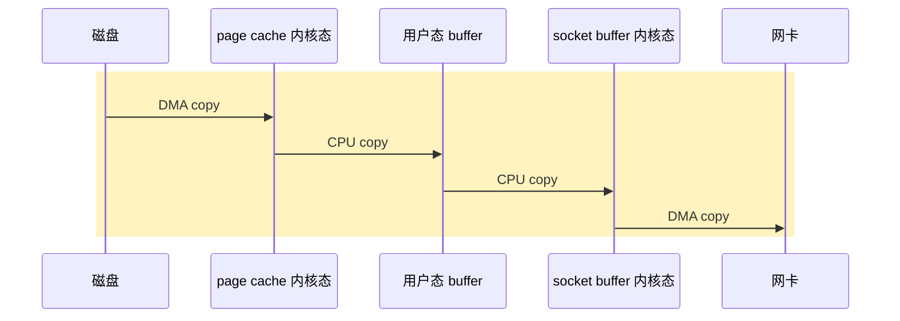
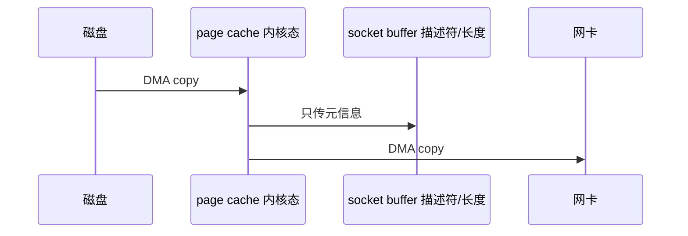

汇总一下总结过的IO/NIO/AIO相关。

1. Table of Contents, ordered
{:toc}

看一篇就够了[从阻塞IO到IO多路复用到异步IO]()，其他篇都成了补充。

IO模型：
- Blocking IO: [Java IO]()；
- BIO服务器实现: [（一）How Tomcat Works - 原始Web服务器]()；
- Non-Blocking IO: [Java NIO]()；
- BIO和NIO的形象类比: [Http Server线程模型：NIO vs. BIO]()；
- Java NIO所使用的os的底层机制：[epoll]()；
- NIO和异步Servlet，其实这个异步和异步IO思想都是类似的，毕竟都是异步: [Servlet - NIO & Async]()；
- Asynchronous IO: [AIO]()；

读写时的编码问题：
- 字符集：[Unicode & UTF-n]()；

后续如果还有关于IO的，继续更新到这里。

# 零拷贝
关于零拷贝的：
- [小林 coding：零拷贝详解](https://www.cnblogs.com/xiaolincoding/p/13719610.html)

普通文件传输，调用read、write系统调用：
1. 磁盘 -> 内核缓冲区（**其实就是page cache**）。由DMA操作；
2. 内核缓冲区 -> 用户内存。由cpu操作；
3. 用户内存 -> socket缓冲区（其实还是内核缓冲区）。由cpu操作；
4. socket缓冲区 -> 网卡。由DMA操作。

数据经历三层：
1. **磁盘、网卡上的数据，可认为都是在介质上**；
2. 内核态；
3. 用户态；

**之所以要发生内核态和用户态的切换，因为用户没有权限直接操作网卡、磁盘**。

但问题在于：**传输文件，用户又不修改文件，为什么要把文件copy到用户态呢**？

开销：四次切换、四次数据拷贝。



这就是普通`read` + `write`的问题：文件只是路过用户态，应用程序并没有改它，却要多走一趟用户态。很像快递明明从仓库发到隔壁站点，非得先让你拿回家签收再拿去寄，仪式感拉满，效率稀碎。

## mmap - 数据不经过用户态
**之前内存里存了两遍数据：先到内核态，再到用户态，在内存里存在了两次**。

解决方案：使用mmap取代read，直接把内核缓冲区映射到用户缓冲区。**怎么映射？其实就是内核态的逻辑地址，和用户态的逻辑地址，用的是同一个物理地址**。二者“重叠”了，那么你有数据了，就是我有数据了。

这样一来，**用户调用write的时候，实际是操作内存里的数据到socket缓冲区，实际上是“内核缓冲区到内核缓冲区”的过程，数据完全不经过用户态了**。

开销：四次切换，三次数据拷贝。

### java direct memory
- [一个关于 Java direct memory 的回答](https://www.zhihu.com/question/376317973/answer/1052239674)

Java的direct memory和mmap干的还不一样。**java读文件要拷贝更多次（wtf）**：
1. 磁盘 -> 内核态；
2. 内核态 -> 用户态（其实是堆外内存）；
3. 堆外内存拷贝到heap；

direct memory优化的是第三步，直接读堆外内存，不用再搞到jvm里了。

> 当我们要读文件的时候，首先由内核态负责将数据从磁盘读到内核态里，再从内核态拷贝到我们用户态弄内存里，c程序里操作的也就是这部分用户态的内存。说完c我们再说说Java，jvm启动的时候会在用户态申请一块内存，申请的这块内存中有一部分会被称为堆，一般我我们申请的对象就会放在这个堆上，堆上的对象是受gc管理的。那么除了堆内的内存，其他的内存都被称为对外内存。在堆外内存中如果我们是通过Java的directbuffer申请的，那么这块内存其实也是间接受gc管理的，而如果我们通过jni直接调用c函数申请一块堆外内存，那么这块内存就只能我们自己手动管理了。当我们在Java中发起一个文件读操作会发生什么呢？首先内核会将数据从磁盘读到内存，再从内核拷贝到用户态的堆外内存(这部分是jvm实现)，然后再将数据从堆外拷贝到堆内。拷贝到堆内其实就是我们在Java中自己手动申请的byte数组中。

## sendfile - write也不用了
但是调用write会产生一次用户态到内核态、再产生一次内核态到用户态之间的上下文切换。

**既然用户完全不修改数据，read完（mmap）接下来就是write，那不如这两个方法二合一得了，四次切换变成两次切换**：
```bash
mmap + write = sendfile
```

开销：两次切换、三次数据拷贝。

## zero copy - 内核态不再copy到内核态
内核态copy到socket缓冲区，**实际就是内核态往内核态拷**，好蠢啊……

所以零拷贝就是：**只把文件描述符和数据长度copy到socket缓冲区，实际数据直接从内核态copy到网卡**。

开销：两次切换、两次数据拷贝。



所谓“零拷贝”不是说没有任何拷贝，磁盘到内存、内存到网卡这些硬件搬运还在。它强调的是**不再把文件内容拷到用户态，也不再在内核态里傻乎乎复制一份真实数据**。

从四次切换、四次数据拷贝，减少到了两次切换和两次数据拷贝。所以零拷贝看起来至少提升一倍的性能。

**Java的`FileChannel#transferTo`就是零拷贝**！kafka就用了transferTo，从一个channel直接传递数据到另一个channel。

> This method is potentially much more efficient than a simple loop that reads from this channel and writes to the target channel. Many operating systems can transfer bytes directly from the filesystem cache to the target channel without actually copying them.
