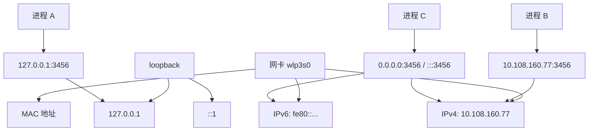
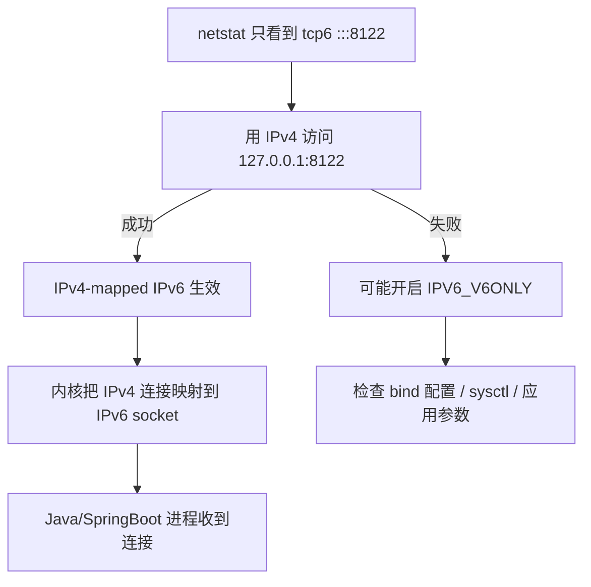

部署一个springboot服务，绑定8122端口。通过netstat查看，发现只有ipv6地址被绑定了：
```bash
⚡ netstat -anp | grep :8122
(Not all processes could be identified, non-owned process info
 will not be shown, you would have to be root to see it all.)
tcp6       0      0 :::8122                 :::*                    LISTEN      137833/java
```
但实际上通过ipv4也能访问8122端口。

这是为什么？
- 猜想一：~~不同ip相同端口的请求可以互通~~？
- 猜想二：还是说ipv4的请求被转发给了ipv6？

1. Table of Contents, ordered
{:toc}

# prerequisite - NIC
Network Interface Card

没联网的时候，每个网卡只有一个mac地址。比如下面的有线网卡enp2s0和无线网卡wlp3s0：
```bash
2: enp2s0: <NO-CARRIER,BROADCAST,MULTICAST,UP> mtu 1500 qdisc pfifo_fast state DOWN group default qlen 1000
    link/ether f4:8e:38:f2:06:4c brd ff:ff:ff:ff:ff:ff
3: wlp3s0: <NO-CARRIER,BROADCAST,MULTICAST,UP> mtu 1500 qdisc noqueue state DOWN group default qlen 1000
    link/ether 5a:b6:fa:69:d0:4c brd ff:ff:ff:ff:ff:ff permaddr 3c:f8:62:da:51:15
```

无线网卡联网之后，有一个ipv4地址，有一个ipv6地址（和ipv4一样，一般分到的ipv6地址是fc/fd/fe开头的，也是私有地址）：
```bash
2: enp2s0: <NO-CARRIER,BROADCAST,MULTICAST,UP> mtu 1500 qdisc pfifo_fast state DOWN group default qlen 1000
    link/ether f4:8e:38:f2:06:4c brd ff:ff:ff:ff:ff:ff
3: wlp3s0: <BROADCAST,MULTICAST,UP,LOWER_UP> mtu 1500 qdisc noqueue state UP group default qlen 1000
    link/ether 3c:f8:62:da:51:15 brd ff:ff:ff:ff:ff:ff
    inet 10.236.112.97/19 brd 10.236.127.255 scope global dynamic noprefixroute wlp3s0
       valid_lft 431994sec preferred_lft 431994sec
    inet6 fe80::4d1d:d8d9:e463:27cc/64 scope link noprefixroute 
       valid_lft forever preferred_lft forever
```

- [网卡、IP 和 MAC 的一篇基础介绍](https://cloud.tencent.com/developer/article/1468099)

网卡有单栈（ipv4-only，ipv6-only）和双栈（nic dual stack）

双栈网卡就是两种协议都能支持的网卡。
- [Juniper: IPv6 dual stack](https://www.juniper.net/documentation/us/en/software/junos/is-is/topics/concept/ipv6-dual-stack-understanding.html)

双栈网卡如果两种协议都能支持，用哪种？有以下决策方式：
- The dual-stacked device can interoperate equally with IPv4 devices, IPv6 devices, and other dual-stacked devices. When both devices are dual stacked, the two devices agree on which IP version to use；
- The transition is driven by DNS. If a dual-stacked device queries the name of a destination and DNS gives it an IPv4 address (a DNS A Record), it sends IPv4 packets. If DNS responds with an IPv6 address (a DNS AAAA Record), it sends IPv6 packets；

# prerequisite - ip的一些写法

## 未定义地址
代表任何地址。
- ipv6：`0:0:0:0:0:0:0:0`。由于ipv6任意连续两个0都可以简写为`::`，所以全零可以缩写为`::`；
- ipv4：`0.0.0.0`，ipv4没有简写。

某个ipv6的写法`:::80`其实可以分成两部分：
1. `::`指的是全0的ipv6；
2. `:80`指端口为80。

二者加起来，指的是任意ipv6地址的80端口。

## loop地址
- ipv6：`0:0:0:0:0:0:0:1`，根据缩写规则，前7个零可以简写，最终简写为`::1`；
- ipv4：`127.0.0.1`。同样没有简写。

查看WSL里的hosts：
```bash
% cat /etc/hosts
# This file was automatically generated by WSL. To stop automatic generation of this file, add the following entry to /etc/wsl.conf:
# [network]
# generateHosts = false
127.0.0.1       localhost
127.0.1.1       win10Home.localdomain   win10Home

192.168.1.107   host.docker.internal
192.168.1.107   gateway.docker.internal
127.0.0.1       kubernetes.docker.internal

# The following lines are desirable for IPv6 capable hosts
::1     ip6-localhost ip6-loopback
fe00::0 ip6-localnet
ff00::0 ip6-mcastprefix
ff02::1 ip6-allnodes
ff02::2 ip6-allrouters
```
可以看到ipv4的loop域名是`localhost`，ipv6的loop域名是`ip6-localhost`。

# ip和port的关系
先来验证一下猜想一：~~不同ip相同端口的请求究竟能不能互通~~

测试机器有两个ip：
- localhost loop地址：ipv4为`127.0.0.1/8`，对应ipv6为`::1/128`；
- 内网ip：`10.108.160.77/24`，对应ipv6为`fe80::6e92:bfff:fe6a:d3a/64`；



先把直觉立住：**端口不是全机器唯一地飘在空气里，socket至少要看IP + port**。同一个端口绑在不同IP上，可以是不同socket；绑到`0.0.0.0`或`::`，才是“这个地址族里的所有本地地址都算我的”。

## 访问同一机器的不同ip是否是等效的
使用netcat监听`localhost:3456`（其实就是监听`127.0.0.1:3456`）：
```bash
% nc -v -l localhost 3456
Ncat: Version 7.50 ( https://nmap.org/ncat )
Ncat: Listening on 127.0.0.1:3456
```
绑定显示`127.0.0.1:3456`：
```bash
> netstat -anp | grep :3456
(Not all processes could be identified, non-owned process info
 will not be shown, you would have to be root to see it all.)
tcp        0      0 127.0.0.1:3456          0.0.0.0:*               LISTEN      9672/nc
```
尝试使用内网ip连接3456端口，失败：
```bash
% nc -v -z 10.108.160.77 3456
Ncat: Version 7.50 ( https://nmap.org/ncat )
Ncat: Connection refused.
```
**说明不同ip实际上就是对应不同的网卡，访问一个ip不等于访问另一个ip**。监听localhost的3456的服务并不能通过10.108.160.77收到请求。

此时只能通过127.0.0.1:3456连接到这个nc server process。

## 不同ip可以绑定同一个端口吗
再起一个netcat服务，监听10.108.160.77:3456：
```bash
% nc -v -l 10.108.160.77 3456
Ncat: Version 7.50 ( https://nmap.org/ncat )
Ncat: Listening on 10.108.160.77:3456
```
成功。

查看端口绑定：
```bash
> netstat -anp | grep :3456
(Not all processes could be identified, non-owned process info
 will not be shown, you would have to be root to see it all.)
tcp        0      0 10.108.160.77:3456      0.0.0.0:*               LISTEN      10808/nc
tcp        0      0 127.0.0.1:3456          0.0.0.0:*               LISTEN      9672/nc
```
此时有两个netcat进程分别监听不同ip的3456端口。

**说明不同IP可以绑定同一个端口。ip+port二者共同组成一个socket，确定一个服务进程的位置。**

- [SegmentFault 上关于同端口不同 IP 绑定的回答](https://segmentfault.com/q/1010000016970247/a-1020000016970972)

## 所有ip均绑定同一端口
关闭上面两个进程，不指定某一ip，使用nc监听所有ip的3456端口：
```bash
% nc -v -l 3456
Ncat: Version 7.50 ( https://nmap.org/ncat )
Ncat: Listening on :::3456
Ncat: Listening on 0.0.0.0:3456
```
绑定显示tcp4和tcp6的所有ip都绑定了3456端口：
```bash
% netstat -anp | grep :3456
(Not all processes could be identified, non-owned process info
 will not be shown, you would have to be root to see it all.)
tcp        0      0 0.0.0.0:3456            0.0.0.0:*               LISTEN      82931/nc
tcp6       0      0 :::3456                 :::*                    LISTEN      82931/nc
```
此时可以通过任意ip的3456端口连接到这个nc server process。

## 只绑定ipv6，通过ipv4访问
需要使用bsd版本的netcat：
```bash
▶ nc -6 -l -v 3456    
Listening on :: 3456
```
查看绑定情况，只有tcp6：
```bash
$ netstat -anp | grep :3456
(Not all processes could be identified, non-owned process info
 will not be shown, you would have to be root to see it all.)
tcp6       0      0 :::3456                 :::*                    LISTEN      7655/nc
```
通过网卡的ipv6访问netcat server：
```bash
$ nc -6 -v -z fe80::6e92:bfff:fe6a:d3a%wlp3s0 3456
Connection to fe80::6e92:bfff:fe6a:d3a%wlp3s0 3456 port [tcp/*] succeeded!
```
符合预期。

> 使用ipv6的时候还需要指定网卡名称：[Unix StackExchange 的说明](https://unix.stackexchange.com/a/136473/283488)。

还能通过ipv6 loop ip访问：
```bash
$ nc -6 -v -z ::1 3456   
Connection to ::1 3456 port [tcp/*] succeeded!
```

但是竟然也能通过ipv4地址访问：
```bash
nc -4 -v -z 127.0.0.1 3456
Connection to 127.0.0.1 3456 port [tcp/*] succeeded!
```
这是为什么？springboot也是只显示绑定了ipv6，却能通过ipv4访问，看来道理是一样的。

# ip映射
- [ServerFault: IPv4 mapped IPv6 socket](https://serverfault.com/a/755784/801099)
- [Apache httpd: binding IPv6 and IPv4 sockets](http://httpd.apache.org/docs/2.0/bind.html#ipv6)

通过上述文档可以看到，确实是只绑定了ipv6，但是linux默认会做ipv4映射，所有监听ipv6某端口的程序，也会收到ipv4该端口的连接请求。



所以一开始看到`tcp6 :::8122`不用慌，它不必然代表“只能IPv6访问”。`netstat`只是把绑定对象显示出来，**IPv4会不会被这个IPv6 socket接住，还要看内核的v4-mapped行为有没有开启**。

所以，linux上有的显示只绑定了ipv6，有的显示ipv6和ipv4都绑定了，就不足为奇了：
- [Linux 下 tcp6 监听表现的一篇记录](https://www.cnblogs.com/wlzjdm/p/8684202.html)

但有的显示绑定ipv6，实际也只能通过ipv6访问，是因为关了ipv4映射。

究竟有没有关ipv4映射，这一点通过netstat并不能看出来，**netstat只是忠实地显示出了程序绑定了ip而已**。
