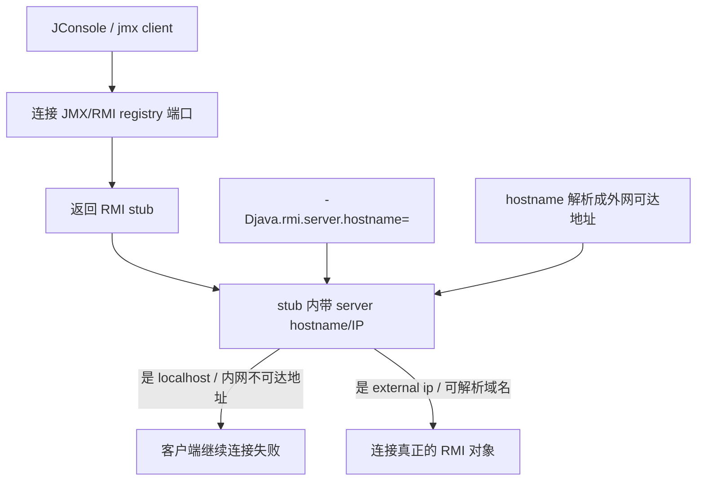

在有公网ip的服务器上，部署一个Java服务，开启jmx端口，但是却不能通过公网ip访问。为什么呢？

1. Table of Contents, ordered
{:toc}

# 方法一：java.rmi.server.hostname
查到的第一种解决方式：使用`java.rmi.server.hostname`参数手动绑定到外网ip：
- [Oracle RMI properties: java.rmi.server.hostname](https://docs.oracle.com/javase/8/docs/technotes/guides/rmi/javarmiproperties.html)
- [Stack Overflow: JMX remote hostname 配置](https://stackoverflow.com/a/11988590/7676237)
- [Stack Overflow: 指定 JMX/RMI hostname](https://stackoverflow.com/a/39345042/7676237)

即：
```bash
-Djava.rmi.server.hostname=<external ip>
```

# 方法二：修改hostname为外网ip
远程访问，就是得设定hostname：
- [一篇 JMX 远程连接配置记录](https://segmentfault.com/a/1190000016636787)
- [Java RMI things to remember](https://www.mscharhag.com/java/java-rmi-things-to-remember)

一整篇都在讨论这个问题，我猜是
- [Stack Overflow: remote JMX connection](https://stackoverflow.com/questions/834581/remote-jmx-connection/11654322)

按照这个人说的把hostname改成ip而非loop ip后，无需再指定`java.rmi.server.hostname`参数也能远程访问jmx：
- [Stack Overflow: 修改 hostname 后 JMX 可访问](https://stackoverflow.com/a/27245447/7676237)

修改hostname为ip：
```bash
sudo hostname <external ip>
```

所以猜想：其实jmx默认是绑定到hostname上的。所以要么让hostname是外网可用的ip，要么让jmx不绑定到默认的hostname上，使用参数手动指定一个。



这里最坑的点是：**JMX不是只连一次端口就完事儿，RMI会把服务端地址塞进返回的stub里**。所以端口能通不代表最终能连上；如果stub里写的是`localhost`或者一台客户端根本到不了的内网名，客户端就会一脸懵逼地去连一个错误地址。

