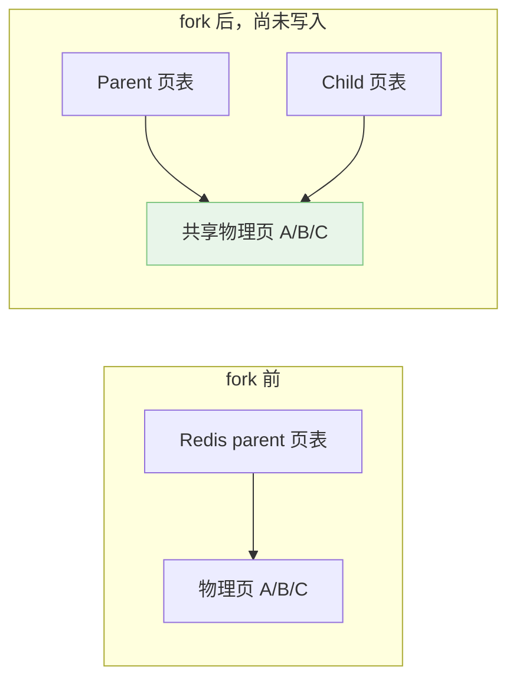
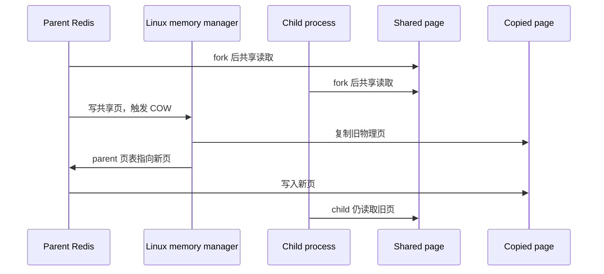
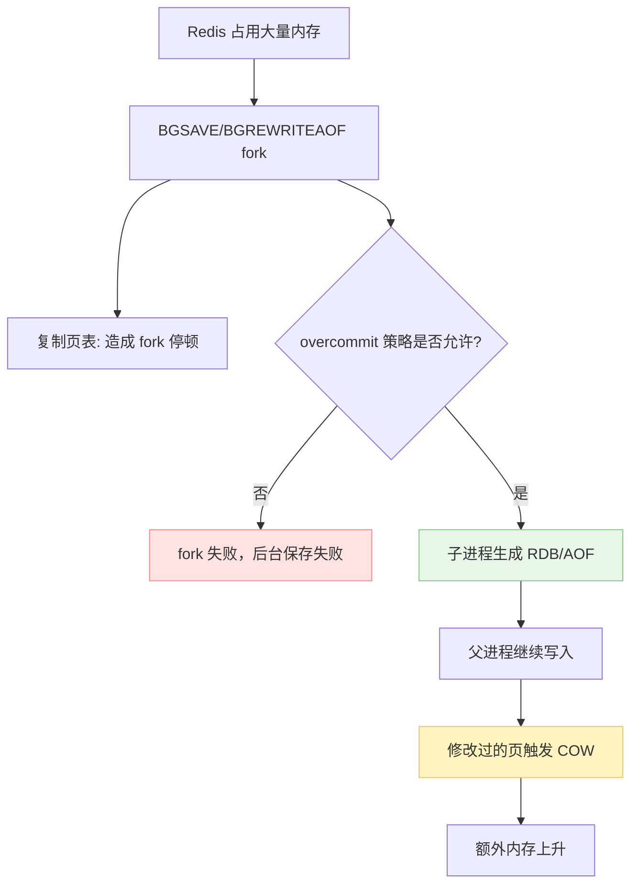

Redis 进程的 `fork()` 并不会立刻导致 Redis 内存占用翻倍，但它确实会让大内存 Redis 暴露出 Linux 内存承诺和 copy-on-write 的问题。

这篇就是为了回答那个看起来很吓人的问题：**Redis 一大，后台保存是不是就 fork 不出来了？**

1. Table of Contents, ordered
{:toc}

# Redis and Linux `fork()`

`fork()` 在 parent process 里返回 child process 的 pid，在 child process 里返回 0，如果失败返回 -1。

Redis 的 `BGSAVE`、`BGREWRITEAOF` 都会用到 `fork()`。主进程 fork 出一个子进程，让子进程去写 RDB 或重写 AOF，主进程继续处理请求。

于是问题来了：

> 父进程是 Redis，内存里放着一大坨 DB。`fork()` 出来的子进程逻辑上几乎是父进程的 copy。那岂不是意味着部署 Redis 的机器内存使用量不能超过一半，不然就没空间复制出子进程？

直接说结论：

- **不会因为 `fork()` 立刻把 Redis 内存复制一份，所以常驻内存不会马上 double**；
- **但在某些 Linux overcommit 策略下，内核会评估最坏情况的内存承诺，Redis 太大时 `fork()` 仍然可能失败**；
- **fork 之后父进程继续写数据，会触发 copy-on-write，写得越多，额外内存消耗越多**。

所以原问题的恐惧不是凭空来的，只是“内存马上翻倍”这个理解太粗暴。

## 老式 fork 和现代 fork

上古 Unix 的 `fork()` 实现，确实会让子进程复制一遍父进程的地址空间。父进程大，子进程就跟着大，简单但非常贵。

现代操作系统不会傻傻复制整份物理内存。它会复制必要的进程结构和页表，让父子进程一开始指向同一批物理页。

从 OS 视角看，内存是一页页管理的，页表记录虚拟地址到物理页的映射。`fork()` 后：

- 父进程有自己的页表；
- 子进程复制一份页表；
- 两份页表一开始指向同样的物理页；
- 这些页被标记成只读或 COW 相关状态。



也就是说，**fork 的主要成本是复制页表和创建子进程结构，而不是复制全部物理内存**。

Linux `fork(2)` 手册的 NOTES 里也说明了这一点：[fork 使用 copy-on-write pages](https://man7.org/linux/man-pages/man2/fork.2.html#NOTES)。

## copy-on-write

新的问题来了：父子进程逻辑上应该有各自独立的内存空间。如果实现上共享物理页，怎么保证它们互不影响？

答案是 copy-on-write，写时复制。

流程是：

1. `fork()` 后父子进程先共享物理页；
2. 谁要写某个共享页，就触发 page fault；
3. 内核复制这一页；
4. 写入方的页表指向新复制出来的页；
5. 未修改的页继续共享。



通过 COW，逻辑上父子进程的内存空间彼此独立；实现上，没被修改的页继续共享，不会白白复制。

这也解释了 Redis 为什么可以让子进程做 RDB/AOF 重写：子进程看到的是 `fork()` 那一刻的 DB 视图，父进程后续继续处理请求。父进程写过的页会被复制，子进程仍然读旧页去生成快照。

## Redis 为什么仍然怕大内存 fork

既然 COW 不会立刻复制全部内存，那 Redis 大内存实例是不是就完全没事？

没那么美。

第一，`fork()` 本身要复制页表。Redis 内存越大，页表越大，fork 卡顿越明显。虽然不是复制数据页，但主线程仍然会被 fork 这一下暂停一段时间。大实例上，这个停顿可以明显到让人骂街。

第二，fork 后如果父进程写入很多数据，会触发大量 COW。子进程写 RDB/AOF 期间，父进程修改过的页都可能额外复制一份。写流量越大，额外内存越高。

第三，Linux overcommit 策略会影响 `fork()` 是否允许发生。Redis 启动时常见 warning 就和它有关。

## overcommit_memory

Linux 有一个配置：

```bash
sysctl vm.overcommit_memory=1
```

它控制内核如何处理内存 overcommit。Redis 官方管理建议里也要求设置这个值：[Redis administration: overcommit memory](https://redis.io/docs/latest/operate/oss_and_stack/management/admin/)。

如果不配置，Redis server 启动时可能报 warning：

```text
462:M 12 Jan 2021 02:09:50.804 # WARNING overcommit_memory is set to 0! Background save may fail under low memory condition.
```

`vm.overcommit_memory=1` 的意思可以粗略理解成：在内存真正耗尽之前，内核允许更乐观地分配内存承诺。这样 Redis 执行 `BGSAVE` 或 `BGREWRITEAOF` 时，不会因为内核过于保守地估算最坏情况而直接 fork 失败。

这不是说“内存可以无限用”。如果 COW 后真的把物理内存吃光了，系统一样会出问题。它解决的是：**fork 那一刻别因为理论最坏情况直接拒绝 Redis**。

## 那机器内存到底能不能超过一半？

原来的直觉是：Redis 占用超过 50%，fork 最坏情况下还要再来一份，所以会失败。

更精确地说：

- 如果 Linux overcommit 策略保守，内核可能认为子进程最坏需要和父进程一样多的内存承诺，于是 Redis 占用很高时 fork 可能失败；
- 如果设置 `vm.overcommit_memory=1`，fork 更容易成功；
- fork 成功后，实际额外内存取决于子进程运行期间父进程改了多少页；
- Redis 写入越频繁，COW 额外内存越多；
- Redis 实例越大，fork 页表复制和 COW 风险越值得关注。

所以不能简单说“部署 Redis 的机器内存使用量绝对不能超过一半”。但如果不理解 COW 和 overcommit，大内存 Redis 的后台保存确实可能突然给你表演一个失败。



# 工程含义

Redis 强烈建议配置 `vm.overcommit_memory=1`，不是因为它矫情，而是因为后台保存、AOF 重写都依赖 `fork()`。如果内核在 fork 时直接拒绝，Redis 的持久化和重写就不稳定，用户当然要骂街。

大内存 Redis 还要注意：

- 避免单实例过大，实例越大 fork 停顿和页表复制越明显；
- 关注 `BGSAVE`/`BGREWRITEAOF` 期间的写流量，写得越多 COW 越多；
- 监控后台保存失败、fork 耗时、内存峰值；
- 该拆实例就拆实例，不要把所有鸡蛋都塞进一个 Redis 进程里。

Redis 的 fork 问题不是“fork 会不会复制全部内存”这么简单，而是三件事叠在一起：页表复制、COW 额外页、overcommit 策略。理解这三层，`BGSAVE` 的很多奇怪 warning 就不再神秘了。

## Ref

- [Linux fork(2) NOTES](https://man7.org/linux/man-pages/man2/fork.2.html#NOTES)；
- [Understanding Redis background memory usage](https://engineering.zalando.com/posts/2019/05/understanding-redis-background-memory-usage.html)。
