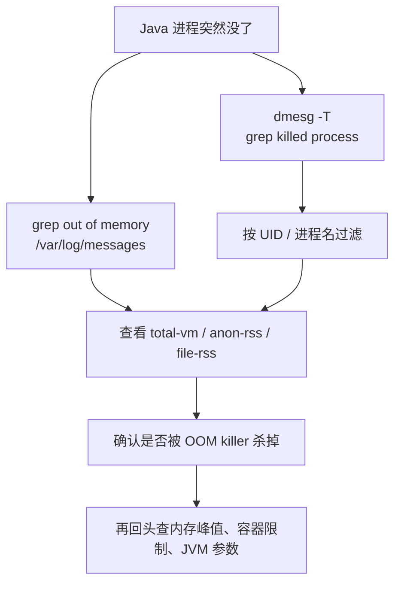

系统内存不足，防止耗尽，直接杀掉占内存最大的进程。详见：`linux/mm/oom_kill.c`。

1. Table of Contents, ordered
{:toc}

# /var/log/messages
可以从系统日志里查到：
```bash
$ grep -i "out of memory" /var/log/messages

Mar 11 19:42:19 th013 kernel: Out of memory: Kill process 26044 (java) score 49 or sacrifice child
Mar 11 19:42:19 th013 kernel: Killed process 26044 (java) total-vm:36223404kB, anon-rss:6966396kB, file-rss:40kB
```
# dmesg
```bash
$ dmesg -T | grep -i "out of memory"
```
一样的。`-T`是使用人类可读的时间戳。

想看看被kill掉的进程，可以使用：
```bash
$ dmesg -T | grep -i "killed process"
```

想看看自己的进程有没有被kill掉，用自己的uid去grep就行：
```bash
$ dmesg -T | grep -i `id -u liuhaibo`

[Thu Sep  9 02:25:07 2021] Killed process 94063 (java), UID 4375, total-vm:53544756kB, anon-rss:17819464kB, file-rss:0kB, shmem-rss:0kB
```

- total-vm: total virtual memory. 进程使用的总的虚拟内存。
- rss（htop里的RES）: resident set size. 驻留集大小。驻留集是指进程已装入内存的页面的集合。
- anon-rss: anonymous rss. 匿名驻留集。比如malloc出来的就是匿名的。
- file-rss: 映射到设备和文件上的内存页面。
- shmem-rss: 大概是shared memory rss?

> 字段解释参考：[一篇 OOM killer 日志字段说明](https://blog.csdn.net/qq_41961459/article/details/119179200)。

查看自己的id：
```bash
± % id liuhaibo
uid=4375(liuhaibo) gid=500(kaiwoo) groups=500(kaiwoo)
```
也可以通过id查看人：
```bash
± % id 4375
uid=4375(liuhaibo) gid=500(kaiwoo) groups=500(kaiwoo)
```



排查时先别急着怀疑应用自己优雅退出了。进程直接没了，日志里又看到`Killed process`，那基本就是内核亲自动手。它不会问你愿不愿意，甚至懒得给Java一个抛异常的机会，主打一个干脆。

> After `klogd` is running, `dmesg` will show only the most recent kernel messages (because the ring buffer is a fixed size and so can only hold so much), without timestamps or other information, while `/var/log/messages` will retain logs according to how `logrotate` is configured and include timestamping (which will be slightly inaccurate for initial boot messages because `dmesg` doesn't have them, so the time `klogd` started is used for all messages read from the kernel buffer).
>
> [Unix StackExchange: dmesg 和 /var/log/messages 的区别](https://unix.stackexchange.com/questions/35851/whats-the-difference-of-dmesg-output-and-var-log-messages)

dmesg会把log记录到ring buffer里，当klogd或者syslogd启动之后，dmesg会把log交给他们，他们会落地到/var/log/messages里。

所以dmesg主要用于启动前期，klogd还没启动的时候，查看日志。

dmesg的日志没有时间戳，且buffer空间不太大，所以随着系统的运行，肯定只能记住最近的log，早期的都被覆盖了。

看起来logrotate记录了系统日志的落地方式：
```bash
liuhaibo@th013: /disk1/liuhaibo/youdao/coursenaive/running dynamic-wp!
$ ll /var/log | grep messages                                                                                                                                                                           [12:41:09]
-rwxr-xr-x  1 root         kaiwoo 5.8M Mar 12 12:41 messages
-rwxr-xr-x  1 root         kaiwoo 8.3M Feb 16 03:31 messages-20200216
-rwxr-xr-x  1 root         kaiwoo 9.6M Feb 23 03:34 messages-20200223
-rwxr-xr-x  1 root         kaiwoo 9.8M Mar  1 03:45 messages-20200301
-rwxr-xr-x  1 root         kaiwoo  11M Mar  9 03:44 messages-20200309
```
