理解 Spring MVC 请求处理，不能只盯着 `@Controller`。一个 HTTP 请求先进入 TCP server，再被 Tomcat 解析成 servlet 请求，最后才进入 `DispatcherServlet` 的世界。本文受到 SegmentFault 上一组 Spring MVC 源码文章的启发，沿着这条链路把请求处理全流程重新串起来：

- [Spring MVC 源码系列一](https://segmentfault.com/a/1190000021137583)
- [Spring MVC 源码系列二](https://segmentfault.com/a/1190000021168133)
- [Spring MVC 源码系列三](https://segmentfault.com/a/1190000021177809)
- [Spring MVC 源码系列四](https://segmentfault.com/a/1190000021177945)

把spring mvc处理请求的全流程梳理一下：
1. tcp服务器；
2. 基于tcp服务器构建tomcat，使用servlet处理请求；
3. spring使用`DispatcherServlet`处理请求；

基本把tcp -> http -> tomcat -> spring mvc的链条打通了。

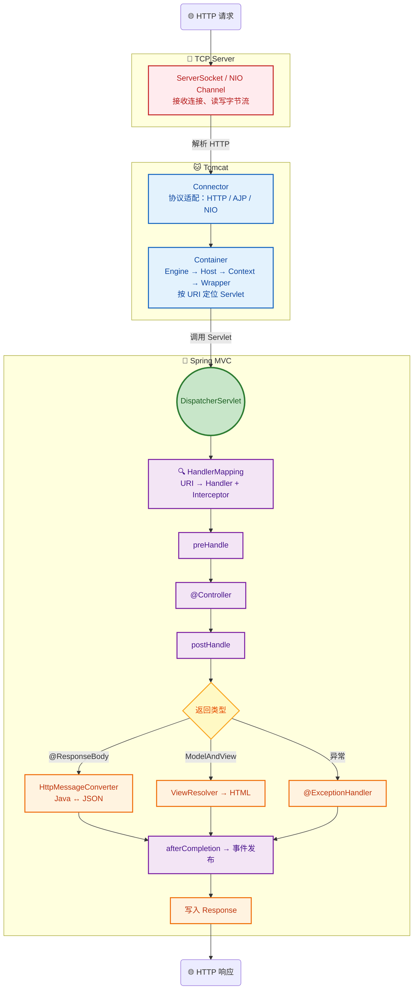
```mermaid
flowchart TB
    Request("🌐 HTTP 请求") --> Socket

    subgraph TCP["  🔌 TCP Server  "]
        Socket["ServerSocket / NIO Channel<br/>接收连接、读写字节流"]
    end

    Socket -->|"解析 HTTP"| Connector

    subgraph Tomcat["  🐱 Tomcat  "]
        Connector["Connector<br/>协议适配：HTTP / AJP / NIO"]
        Container["Container<br/>Engine → Host → Context → Wrapper<br/>按 URI 定位 Servlet"]
        Connector --> Container
    end

    Container -->|"调用 Servlet"| DS

    subgraph SpringMVC["  🍃 Spring MVC  "]
        direction TB
        DS(("DispatcherServlet"))
        DS --> HM["🔍 HandlerMapping<br/>URI → Handler + Interceptor"]
        HM --> Pre["preHandle"]
        Pre --> Ctrl["@Controller"]
        Ctrl --> Post["postHandle"]
        Post --> Result{"返回类型"}
        Result -->|"@ResponseBody"| Json["HttpMessageConverter<br/>Java ↔ JSON"]
        Result -->|ModelAndView| View["ViewResolver → HTML"]
        Result -->|异常| ExH["@ExceptionHandler"]
        Json --> After["afterCompletion → 事件发布"]
        View --> After
        ExH --> After
        After --> Out["写入 Response"]
    end

    Out --> Response("🌐 HTTP 响应")

    classDef tcp fill:#ffebee,stroke:#c62828,stroke-width:2px,color:#b71c1c
    classDef tomcat fill:#e3f2fd,stroke:#1565c0,stroke-width:2px,color:#0d47a1
    classDef entry fill:#c8e6c9,stroke:#2e7d32,stroke-width:3px,color:#1b5e20
    classDef chain fill:#f3e5f5,stroke:#7b1fa2,stroke-width:2px,color:#4a148c
    classDef result fill:#fff3e0,stroke:#ef6c00,stroke-width:2px,color:#bf360c
    classDef decision fill:#fff9c4,stroke:#f9a825,stroke-width:2px,color:#e65100

    class Socket tcp
    class Connector,Container tomcat
    class DS entry
    class HM,Ctrl chain
    class Pre,Post,After chain
    class Json,View,ExH,Out result
    class Result decision
```

1. Table of Contents, ordered
{:toc}

文章按层次推进：先看 TCP 和 Tomcat 如何把请求接到 `Servlet`，再看 Spring MVC 如何把自己登记成那一个 `Servlet`，以及请求进来之后 `doDispatch` 怎样分叉到 Controller、JSON、页面或异常。每一层都拆成「用户大概怎么写」和「框架从哪一截接到它」。

# TCP server
[（一）How Tomcat Works - 原始Web服务器]()，介绍了一个原始的TCP服务器的构建方式。

[从阻塞IO到IO多路复用到异步IO]()则介绍了请求从网卡到达TCP服务器的过程。上述原始的tcp服务器使用的还是BIO。

## 框架如何调用：`handle`

这一层几乎没有框架可藏。`main` 自己 `accept`、自己读字节、自己写回去。

**用户大概怎么写**

```java
byte[] handle(byte[] raw) {
    return "hello".getBytes();
}
```

**框架从 main 起怎么接到它**

先看成一条线程从头跑到尾。调用关系最清楚：`accept` 到了，立刻读、立刻 `handle`、立刻写回去。

```java
public static void main(String[] args) throws Exception {
    ServerSocket server = new ServerSocket(8080);
    while (true) {
        Socket conn = server.accept();
        byte[] raw = readAll(conn);
        byte[] body = handle(raw);   // 调到上面那一小截
        conn.getOutputStream().write(httpResponse(body));
        conn.close();
    }
}
```

这样写，一个连接没处理完，循环回不到下一次 `accept`，下一个客户端只能在 backlog 里排队。正经一点，接连接和处理拆开——听端口的线程接完就丢进线程池，自己回去再 `accept`：

```java
public static void main(String[] args) throws Exception {
    ServerSocket server = new ServerSocket(8080);
    ExecutorService executor = Executors.newCachedThreadPool();
    while (true) {
        Socket conn = server.accept();
        executor.execute(() -> serve(conn));
    }
}

void serve(Socket conn) {
    byte[] raw = readAll(conn);
    byte[] body = handle(raw);   // 仍是用户那一小截，只是换到 worker 上跑
    conn.getOutputStream().write(httpResponse(body));
    conn.close();
}
```

用户代码还是 `handle`。多出来的只是：谁去 `accept`、谁去跑 `handle`。请求怎么拆成 HTTP，这一层仍然自己管。后面每一层框架，都是把这里的某一截收走，只留给用户一个更小的入口。

两条路差在「接连接」和「处理」是不是同一条线程：

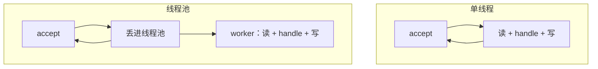
```mermaid
flowchart TD
    subgraph serial["单线程"]
        a1["accept"] --> h1["读 + handle + 写"]
        h1 --> a1
    end
    subgraph pooled["线程池"]
        a2["accept"] --> pool["丢进线程池"]
        pool --> a2
        pool --> w["worker：读 + handle + 写"]
    end
```

# Tomcat
Tomcat使用原始的web服务器接收tcp请求，然后构建了一套servlet规范处理请求。

- [（二）How Tomcat Works - 原始`Servlet`服务器]()介绍了何谓servlet；
- [（三）How Tomcat Works - Tomcat连接器`Connector`]()和[（四）How Tomcat Works - Tomcat servlet容器`Container`]()拆解了tomcat：
    + 前者介绍了tomcat怎么接收并解析请求的；
    + 后者介绍了请求是怎么在tomcat的体系里游走的；

请求进了容器，按四层往下找，最后落到某一个 `Servlet`：

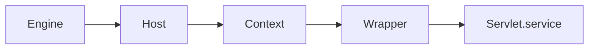
```mermaid
flowchart LR
    engine["Engine"] --> host["Host"]
    host --> ctx["Context"]
    ctx --> wrapper["Wrapper"]
    wrapper --> servlet["Servlet.service"]
```

从现在起，开发者只要按照业务逻辑写个servlet，扔到tomcat下面，就可以处理http请求了。

## 框架如何调用：`Servlet`

Tomcat 把上一层的 `accept` 和 HTTP 解析收走了。用户不再写套接字，只写 `Servlet`。

**用户大概怎么写**

```java
public class HelloServlet extends HttpServlet {
    @Override
    protected void doGet(HttpServletRequest req, HttpServletResponse resp) {
        resp.getWriter().write("hello");
    }
}
// web.xml: /hello -> HelloServlet
```

**框架从 main 起怎么接到它**

先看成和上一层单线程示意一样的循环，只多了「按 URI 找 `Servlet`、调用 `service`」：

```java
public static void main(String[] args) {
    tomcat.start(); // 读 web.xml，把 /hello → HelloServlet 登记进映射表，开始听 8080
}

while (true) {
    Socket conn = serverSocket.accept();
    Request req = parseHttp(conn);
    Servlet servlet = lookup(req.getURI());  // /hello → HelloServlet
    servlet.service(req, resp);              // HttpServlet → 用户的 doGet
    write(conn, resp);
}
```

调用关系已经清楚，但 `accept` 和 `doGet` 抢同一条线程：一个请求没处理完，下一个连接只能排队。正经的 Tomcat 把接连接和处理拆开——`Connector` 接完立刻丢进线程池，自己回去再 `accept`：

```java
public static void main(String[] args) {
    tomcat.start();
}

while (true) {
    Socket conn = serverSocket.accept();
    executor.execute(() -> handle(conn));  // BIO 时代是 HttpProcessor 线程
}

void handle(Socket conn) {
    Request req = parseHttp(conn);
    Servlet servlet = lookup(req.getURI());
    servlet.service(req, resp);  // 用户的 doGet 跑在 worker 上
    write(conn, resp);
}

Servlet lookup(String uri) {
    for (Mapping m : servletMappings) {
        if (match(m.pattern, uri)) {
            return m.servlet;
        }
    }
    return defaultServlet; // 静态资源，或 404
}
```

`lookup` 自己也有分叉：URI 对得上就进用户的 `doGet`，对不上就走默认 `Servlet` 或 404。

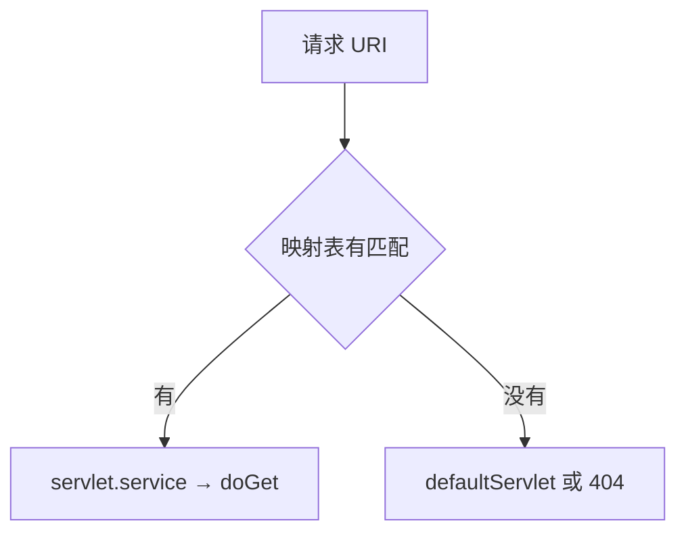
```mermaid
flowchart TD
    uri["请求 URI"] --> matched{"映射表有匹配"}
    matched -->|有| svc["servlet.service → doGet"]
    matched -->|没有| fallback["defaultServlet 或 404"]
```

今天默认的 NIO `Connector` 还多了一条 `Poller` 做就绪通知，但接到用户代码的仍是 worker。后面几层都默认这个多线程版本：`service` 已经在 worker 上。

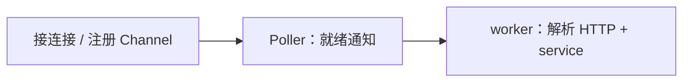
```mermaid
flowchart LR
    acc["接连接 / 注册 Channel"] --> poller["Poller：就绪通知"]
    poller --> worker["worker：解析 HTTP + service"]
```

用户只看见 `doGet`。从 `main` 到 `doGet` 中间多了 `start`、`accept`、丢进线程池、解析 HTTP、按 URI `lookup`。`lookup` 发生在 Tomcat 的 `Container` 里：URI 对上哪个 `Wrapper`，就调哪个 `Servlet`。

问题又来了：**如果系统简单，总共没有几个接口，每个接口对应一个servlet，那就写几个servlet扔到tomcat里，再配置一下servlet的映射关系就行了**。如果系统复杂，那就要写一堆servlet，然而一堆servlet都配置到web.xml里，非常混乱。

所以，SpringMVC来了。

# Spring MVC
> Spring使用容器构建了一个自己的世界，使得开发者在这个世界里组装代码非常简单。

spring mvc基于spring，要处理http请求。它选择继续站在前人的肩膀上：**把自己搞成一个servlet，依托于Tomcat存在**。

现在SpringMVC告诉开发者：你们连servlet都不用写了，把自己的业务逻辑嵌在我的servlet里就行了。这个servlet就是`DispatcherServlet`。开发者只需要在spring mvc的世界里写`@Controller`就可以了——以后大家不用写tomcat的servlet、listener、filter，来写我的`@Service`、`@Controller`吧！

他们都活在由`DispatcherServlet`构建的王国里。怎么做到的，分两步。

# SpringMVC如何做的
## 世界分为两步
原本servlet协议就把servlet容器和开发者做的工作拆分成了两步。有了`DispatcherServlet`之后，这两步依然没变：
1. tomcat调用`DispatcherServlet`；
2. 开发者完全活在`DispatcherServlet`的世界；

## 第一步：Tomcat发现`DispatcherServlet`
### web.xml
Tomcat怎么发现servlet？将servlet配置在该web app的`web.xml`里。

`DispatcherServlet`作为servlet，也不例外：

```xml
<servlet>
    <servlet-name>mvc</servlet-name>
    <servlet-class>org.springframework.web.servlet.DispatcherServlet</servlet-class>
    <init-param>
        <param-name>contextConfigLocation</param-name>
        <param-value>classpath:mvc-servlet.xml</param-value>
    </init-param>
    <load-on-startup>1</load-on-startup>
</servlet>
<servlet-mapping>
    <servlet-name>mvc</servlet-name>
    <url-pattern>/api</url-pattern>
</servlet-mapping>
```

### annotation
**从`Servlet` 3.0起（spring 4.0支持`Servlet` 3.0），可以不再使用web.xml了**。servlet规范推出了一套支持annotation的配置逻辑：tomcat会查找`javax.servlet.ServletContainerInitializer`的实现类，它可以直接配置servlet。**所以找到它就相当于找到了web.xml**。

> 为了用annotation配置，原来web.xml里有的tag都有了对应的annotation，比如现在可以用`@WebServlet`来配置一个servlet了。

spring按照`Servlet` 3.0规范，实现了一个`ServletContainerInitializer`的实现类，`SpringServletContainerInitializer`！tomcat按照servlet协议的约定，会调用这个初始化类。

spring使用这个初始化类把mvc相关的组件都初始化起来：**`SpringServletContainerInitializer`会调用`WebApplicationInitializer#onStartup`的实现类，把初始化的任务交给它。后者真正负责配置servlet**。

> 它的名字非常精准：initialize web application。**而在`onStartup`方法里，`DispatcherServlet`就被创建并注册了**！

**没有了web.xml，用户要怎么自定义一些web app相关的配置**？在自己的`SpringServletContainerInitializer`搞定这些。所以理论上我们只要写一个`WebApplicationInitializer`就行了！当然不需要完全重写，spring已经有了抽象类`AbstractAnnotationConfigDispatcherServletInitializer`，它在实现了`WebApplicationInitializer`的同时，还为用户暴露了几个配置接口:
- 通过覆写`getRootConfigClasses`，把自己app里的spring配置类（业务层配置）告诉spring，由它注册到容器`AnnotationConfigWebApplicationContext`里（**业务层spring容器**）；
- 通过覆写`getServletConfigClasses`，**把配置放到一个新的`AnnotationConfigWebApplicationContext`里，这个web application context会被用来创建`DispatcherServlet`**。所以这里放的配置一般就是mvc相关的，比如`WebMvcConfigurer`实现类，以覆盖默认的mvc行为（**web层spring容器**）；
- 通过覆写`getServletMappings`，**配置`DispatcherServlet`这个唯一servlet映射的url**；

> 这里涉及到两个spring容器：**业务层spring容器和web层spring容器，且二者是父子容器——web层spring容器是业务层spring容器的子容器，所以业务bean访问不到web bean，但反之可以**。他们的具体实现类都是`AnnotationConfigWebApplicationContext`。

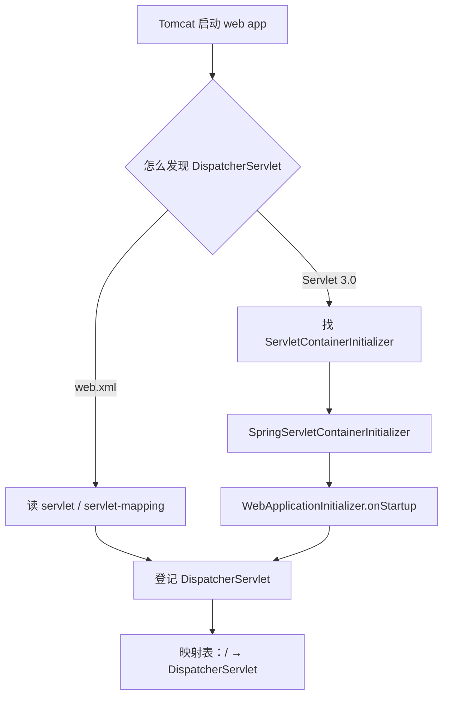
```mermaid
flowchart TB
    boot["Tomcat 启动 web app"] --> mode{"怎么发现 DispatcherServlet"}
    mode -->|web.xml| xml["读 servlet / servlet-mapping"]
    mode -->|"Servlet 3.0"| sci["找 ServletContainerInitializer"]
    sci --> ssi["SpringServletContainerInitializer"]
    ssi --> wai["WebApplicationInitializer.onStartup"]
    xml --> reg["登记 DispatcherServlet"]
    wai --> reg
    reg --> ready["映射表：/ → DispatcherServlet"]
```

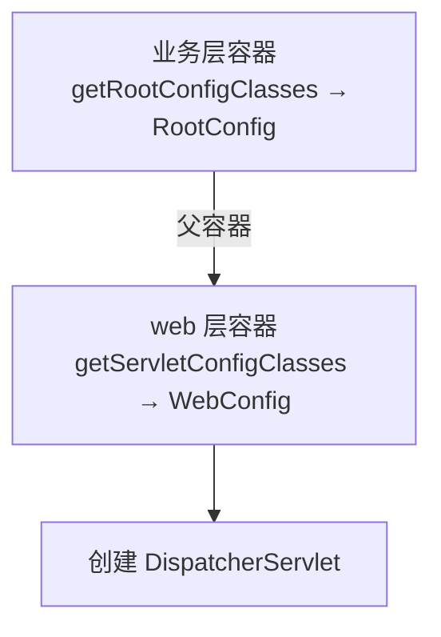
```mermaid
flowchart TB
    root["业务层容器<br/>getRootConfigClasses → RootConfig"]
    web["web 层容器<br/>getServletConfigClasses → WebConfig"]
    root -->|"父容器"| web
    web --> ds["创建 DispatcherServlet"]
```

所以我们只要写个类 extends `AbstractAnnotationConfigDispatcherServletInitializer`，按照需求覆写上面的几个方法就行了。

**用户大概怎么写**

```java
public class SpitterWebInitializer extends AbstractAnnotationConfigDispatcherServletInitializer {

    @Override
    protected Class<?>[] getRootConfigClasses() {
        return new Class<?>[] { RootConfig.class };
    }

    @Override
    protected Class<?>[] getServletConfigClasses() {
        return new Class<?>[] { WebConfig.class };
    }

    @Override
    protected String[] getServletMappings() {
        return new String[] { "/" };
    }
}
```

在自己写的配置类里，用户按照自己的需求，进行不同程度的自定义配置：
- 自定义一些配置，比如：把哪个uri映射到`DispatcherServlet`上（一般是`/`）；
- 业务逻辑相关的配置写在了`RootConfig`类里；
- web相关的配置写在了`WebConfig`里。

**框架从 main 起怎么接到它**

接连接沿用上一节的多线程版本：`Connector` `accept` 之后丢进 worker。启动时，框架把这一个 `Servlet` 登记进 Tomcat 的映射表；请求来了，`lookup` 找到的几乎总是它。

```java
public static void main(String[] args) {
    tomcat.start();
    // 启动时找到 WebApplicationInitializer，调 onStartup：
    // ctx.addServlet("dispatcher", new DispatcherServlet(...)).addMapping("/");
}

while (true) {
    Socket conn = serverSocket.accept();
    executor.execute(() -> handle(conn));  // 仍是 Tomcat 的 worker
}

void handle(Socket conn) {
    Request req = parseHttp(conn);
    Servlet servlet = lookup(req.getURI()); // "/" → DispatcherServlet，不再是用户 Servlet
    servlet.service(req, resp);             // 进入 doDispatch
    write(conn, resp);
}
```

用户从此不用写 `Servlet`。`main` 还是 Tomcat 的；`lookup` 找到的变成框架的 `DispatcherServlet`。下一步才轮到 `@Controller`。

## 第二步：`DispatcherServlet`处理（分发）请求
现在，**因为该web app只有一个servlet，并且默认映射到`/`，所以所有打到该web app的请求，都交给`DispatcherServlet`处理**。

现在知道它为什么叫`DispatcherServlet`了——所有的请求都交给它处理，它再把请求dispatch出去！分发给谁？分发给开发者熟悉的`@Controller`。

> 现在假定的场景还是传统的 Tomcat 部署。Spring 应用依旧需要打成 war 包放到 Tomcat 下面，由 Tomcat 配置该 web app 的 [context path](https://stackoverflow.com/a/40671177/7676237)。
>
> 而在 Spring Boot 里，使用的是内嵌 Tomcat 容器，所以 Spring Boot 可以给 Tomcat 配置 [context path](https://www.baeldung.com/spring-boot-context-path)。
>
> **spring boot怎么做到的？日后再探究：spring boot embedded tomcat**

`DispatcherServlet` 的这一模式，又被称作 [Front Controller](https://en.wikipedia.org/wiki/Front_controller)，早期 Java BluePrints 也有对 [Front Controller pattern](https://web.archive.org/web/20120419115929/http://java.sun.com/blueprints/patterns/FrontController.html) 的说明。

用户写的是 `@Controller` 里的方法。框架从同一个 `main` 走进来，多绕一圈 `doDispatch` 再调到它。

**用户大概怎么写**

```java
@Controller
public class UserController {
    @GetMapping("/users")
    public List<User> listUsers() {
        return userService.findAll();
    }
}
```

**框架从 main 起怎么接到它**

```java
public static void main(String[] args) {
    tomcat.start(); // 登记 DispatcherServlet，并扫 @RequestMapping 建表
}

while (true) {
    Socket conn = serverSocket.accept();
    executor.execute(() -> handle(conn));
}

void handle(Socket conn) {
    Request req = parseHttp(conn);
    Servlet servlet = lookup(req.getURI()); // DispatcherServlet
    servlet.service(req, resp);             // HttpServlet → doDispatch
    write(conn, resp);
}

void doDispatch(Request req, Response resp) {
    HandlerExecutionChain chain = getHandler(req); // lookup：URI → listUsers
    if (chain == null) {
        send404(resp);
        return;
    }
    for (HandlerInterceptor i : chain.getInterceptors()) {
        if (!i.preHandle(req, resp, chain.getHandler())) return;
    }
    ModelAndView mv = adapter.handle(req, resp, chain.getHandler()); // 反射调用 listUsers()
    for (HandlerInterceptor i : chain.getInterceptors()) {
        i.postHandle(req, resp, chain.getHandler(), mv);
    }
    render(mv, req, resp);
}
```

`getHandler` 就是这一层的 `lookup`：不是找 `Servlet`，是找 `@RequestMapping` 方法。`adapter.handle` 才真正进到用户代码。下面把 `doDispatch` 里的分叉拆开。

# `DispatcherServlet`
**`DispatcherServlet`按照什么标准把请求dispatch给controller**？

先列一下 `DispatcherServlet` 处理请求的流程：

1. `HandlerMapping`：按 URI 找到 `HandlerExecutionChain`（handler + interceptor）；
2. `preHandle`；
3. 调用 Controller，并转换返回值（REST → JSON，或拆出 `ModelAndView`）；
4. `postHandle`；
5. 处理结果：异常，或渲染 view；
6. `afterCompletion`；
7. 发布 `ServletRequestHandledEvent`。

这些步骤不在一条直线上。找不到 handler、拦截器返回 false、REST 已写 body、要渲染页面、中途抛异常，会走不同岔路：

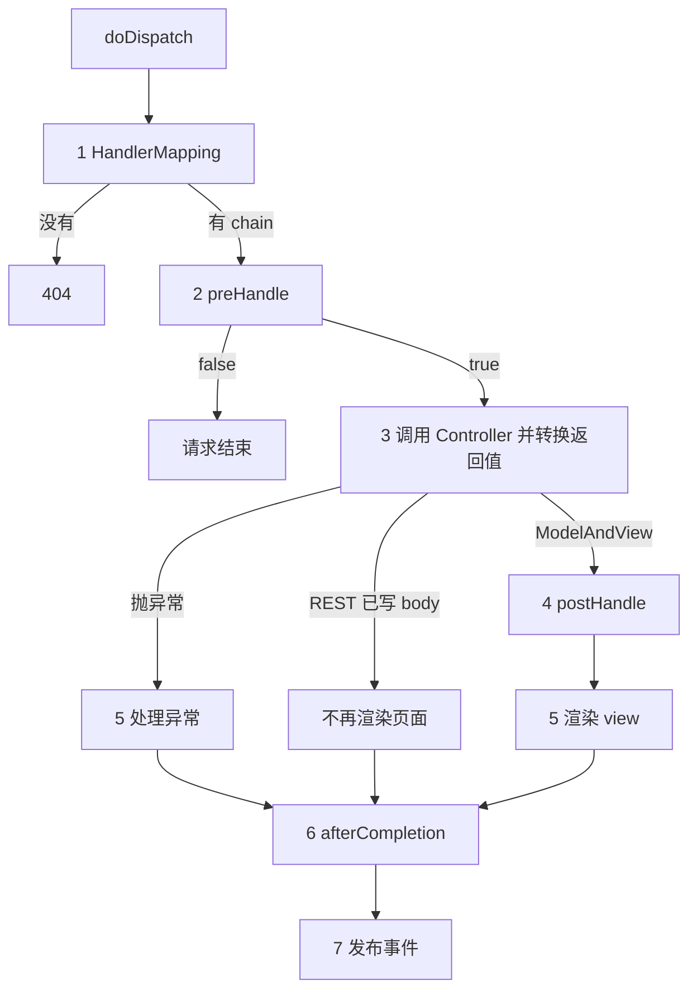
```mermaid
flowchart TD
    startDispatch["doDispatch"] --> mapHandler["1 HandlerMapping"]
    mapHandler -->|没有| notFound["404"]
    mapHandler -->|有 chain| preHandle["2 preHandle"]
    preHandle -->|false| stopEarly["请求结束"]
    preHandle -->|true| invokeCtrl["3 调用 Controller 并转换返回值"]
    invokeCtrl -->|抛异常| resolveEx["5 处理异常"]
    invokeCtrl -->|REST 已写 body| skipView["不再渲染页面"]
    invokeCtrl -->|ModelAndView| postHandle["4 postHandle"]
    postHandle --> renderView["5 渲染 view"]
    resolveEx --> afterDone["6 afterCompletion"]
    skipView --> afterDone
    renderView --> afterDone
    afterDone --> publishEvent["7 发布事件"]
```

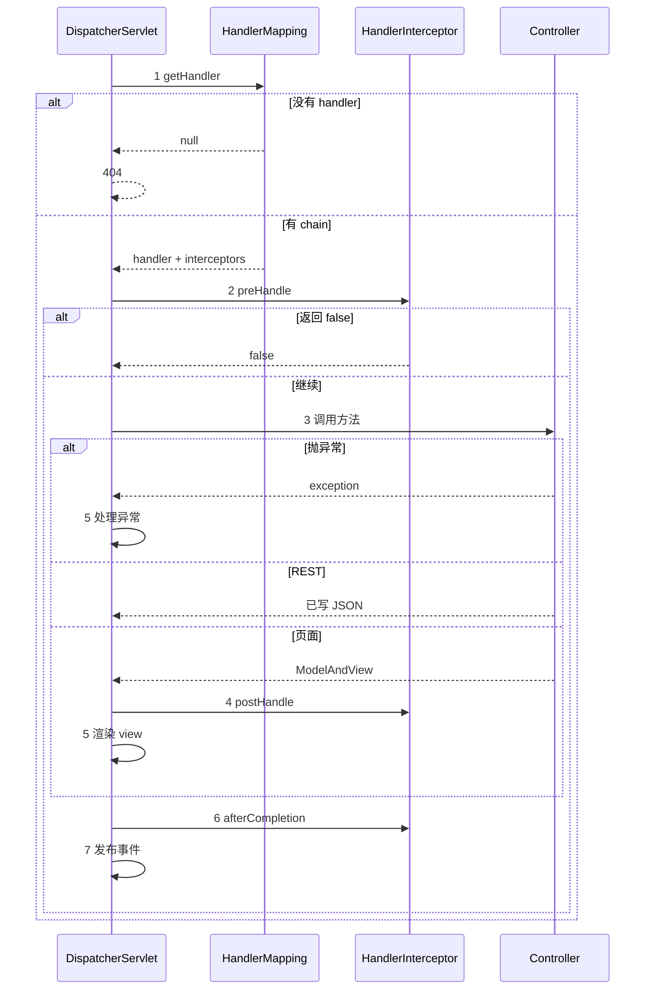
```mermaid
sequenceDiagram
    participant DS as DispatcherServlet
    participant HM as HandlerMapping
    participant HI as HandlerInterceptor
    participant Ctrl as Controller

    DS->>HM: 1 getHandler
    alt 没有 handler
        HM-->>DS: null
        DS-->>DS: 404
    else 有 chain
        HM-->>DS: handler + interceptors
        DS->>HI: 2 preHandle
        alt 返回 false
            HI-->>DS: false
        else 继续
            DS->>Ctrl: 3 调用方法
            alt 抛异常
                Ctrl-->>DS: exception
                DS->>DS: 5 处理异常
            else REST
                Ctrl-->>DS: 已写 JSON
            else 页面
                Ctrl-->>DS: ModelAndView
                DS->>HI: 4 postHandle
                DS->>DS: 5 渲染 view
            end
            DS->>HI: 6 afterCompletion
            DS->>DS: 7 发布事件
        end
    end
```

`Servlet#service`是处理servlet请求的标准入口。`DispatcherServlet`继承了`HttpServlet`。上面归纳的处理流程，都在`DispatcherServlet#doDispatch`方法里。

> 早期 Spring 文档也描述了 [`DispatcherServlet` 的核心角色](https://docs.spring.io/spring-framework/docs/3.0.0.M4/spring-framework-reference/html/ch15s02.html)。

**`DispatcherServlet`的核心就是handler，通过handler处理请求**：
1. handler mapping，苦苦求索就为找到handler；
2. handler interceptor：**依托于handler**，设置了handler interceptor，做一些前置后置操作。

## `HandlerMapping`：全靠uri找到handler chain
handler mapping通过请求的uri找到对应的handler execution chain。从它接口的唯一方法就能看出：
- `HandlerExecutionChain getHandler(HttpServletRequest request)`：根据request（的uri）找到chain。

## 框架如何调用：按 URI 找方法

和 Tomcat 的 `lookup` 是同一类事情，只是登记的对象从 `Servlet` 换成了 Controller 方法。

**用户大概怎么写**

```java
@Controller
public class UserController {
    @GetMapping("/users")
    public List<User> listUsers() {
        return userService.findAll();
    }
}
```

**框架从 main 起怎么接到它**

```java
public static void main(String[] args) {
    tomcat.start();
    // 启动时扫所有 @Controller，把 @RequestMapping 登记进表
    detectHandlerMethods();
}

void detectHandlerMethods() {
    for (Object bean : beansWithAnnotation(Controller.class)) {
        for (Method m : bean.getClass().getMethods()) {
            RequestMapping mapping = findMapping(m); // @GetMapping("/users")
            if (mapping != null) {
                registry.put(mapping.path(), mapping.method(), new HandlerMethod(bean, m));
            }
        }
    }
}

// 请求进来之后，doDispatch 里的 getHandler：
HandlerExecutionChain getHandler(Request req) {
    for (HandlerMapping mapping : handlerMappings) {
        HandlerMethod handler = mapping.lookup(req.getURI(), req.getMethod());
        if (handler != null) {
            return new HandlerExecutionChain(handler, selectInterceptors(req));
        }
    }
    return null; // 没有匹配，后面 404
}
```

`RequestMappingHandlerMapping` 干的就是这张表。用户只写 `@GetMapping("/users")`；`main` 启动时把方法登记进去，请求来了再用 URI 把 `listUsers` 找出来。

> **Tomcat在`Context`内部是根据uri映射servlet的。现在`DispatcherServlet`把所有收来的请求也按照uri映射到相应的Controller**。所以spring先用`DispatcherServlet`让开发者不再直接写servlet，抢了tomcat的风光，再使用和tomcat类似的逻辑，分发请求给controller。tomcat已气晕_(¦3」∠)_

Spring默认可能已经注册好了以下`HandlerMapping`：
- `RequestMappingHandlerMapping`：**根据`@Controller`上的`@RequestMapping`映射请求**；
- `BeanNameUrlHandlerMapping`
- `RouterFunctionMapping`
- `SimpleUrlHandlerMapping`
- `WelcomePageHandlerMapping`

大家基本都在写`@Controller`，所以`RequestMappingHandlerMapping`就能根据request里的uri，找到`@Controller`。

handler execution chain由两部分组成：
1. `HandlerMethod`：**它就是handler**。其实就是`@Controller`里的映射到相关uri的方法。根据uri找到它；
2. `HandlerInterceptor`：请求拦截器。**也是根据uri判断该interceptor应不应该处理这个请求**！

这一步，把所有跟这个uri相关的handler和interceptor都收集起来了，组装成了execution chain。请求接下来就要由这个chain处理。

> spring web mvc默认可能有2个handler interceptor：`ConversionServiceExposingInterceptor`和`ResourceUrlProviderExposingInterceptor`。

如果没找到相应的handler呢？根据配置，要么抛异常`NoHandlerFoundException`，要么返回404。总之，请求结束了。

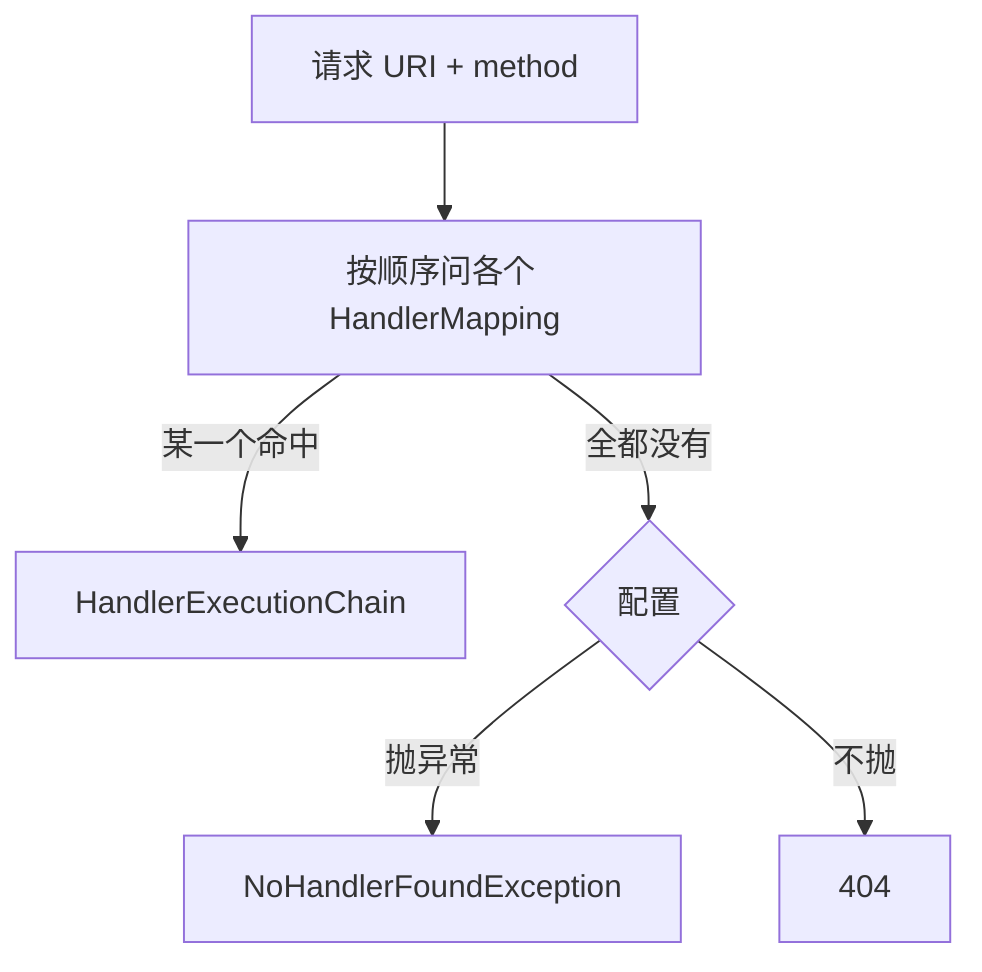
```mermaid
flowchart TD
    req["请求 URI + method"] --> m1["按顺序问各个 HandlerMapping"]
    m1 -->|某一个命中| chain["HandlerExecutionChain"]
    m1 -->|全都没有| miss{"配置"}
    miss -->|抛异常| nh["NoHandlerFoundException"]
    miss -->|不抛| nf["404"]
```

## `HandlerExecutionChain`：处理请求
之所以叫chain，因为它是handler和一堆interceptor的组合。请求要按照顺序从链上通过：
1. `HandlerInterceptor#preHandle`：**如果返回false，请求直接gg，return**；
2. `HandlerMethod`：**反射调用Controller的相关方法**，得到业务逻辑的结果；
    + **返回结果转换：如果是restful，Java对象转json**。见下文；
3. `HandlerInterceptor#postHandle`：后处理，在渲染view之前；
4. 处理结果：可能是异常，也可能是`ModelAndView`：非restful，见下文；
5. `HandlerInterceptor#afterCompletion`：完成后处理；

handler interceptor其实挺好记：
1. `preHandle`在handle之前；
2. `postHandle`在handle之后，处理结果（渲染view、处理exception）之前；
3. `afterCompletion`在处理结果（渲染view、处理exception）之后。毕竟都搞完了才叫completion。

链上不是一条直线。`preHandle` 返回 false、Controller 抛异常、REST 已经写完 body、手里拿着 `ModelAndView`，后面走的路都不一样：

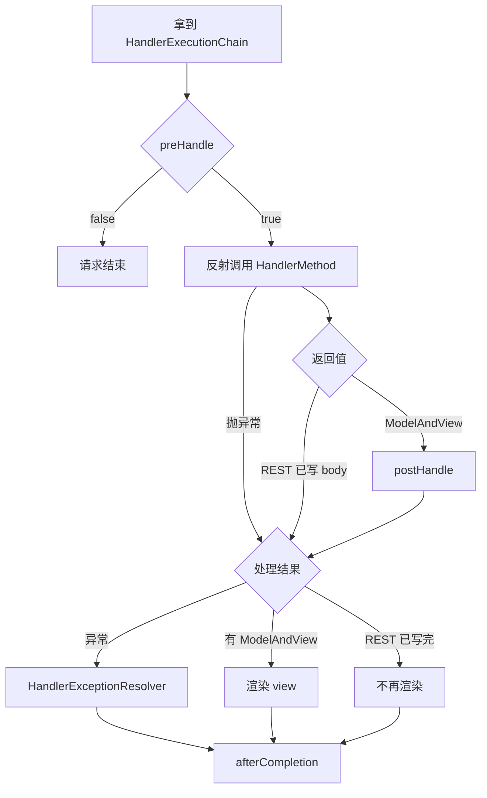
```mermaid
flowchart TD
    gotChain["拿到 HandlerExecutionChain"] --> pre{"preHandle"}
    pre -->|false| stopEarly["请求结束"]
    pre -->|true| invoke["反射调用 HandlerMethod"]
    invoke -->|抛异常| result{"处理结果"}
    invoke --> conv{"返回值"}
    conv -->|REST 已写 body| result
    conv -->|ModelAndView| post["postHandle"]
    post --> result
    result -->|异常| ex["HandlerExceptionResolver"]
    result -->|有 ModelAndView| view["渲染 view"]
    result -->|REST 已写完| skip["不再渲染"]
    ex --> afterH["afterCompletion"]
    view --> afterH
    skip --> afterH
```

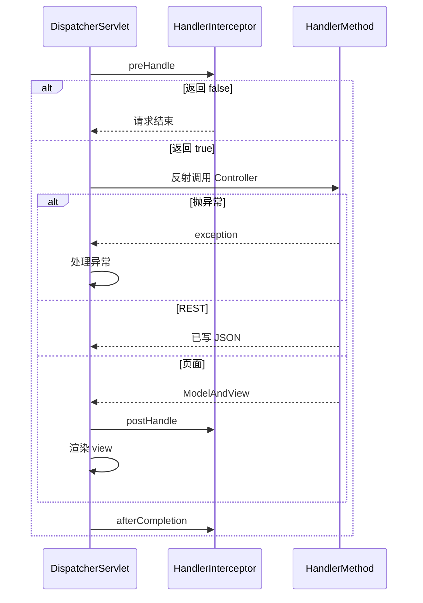
```mermaid
sequenceDiagram
    participant DS as DispatcherServlet
    participant HI as HandlerInterceptor
    participant HM as HandlerMethod

    DS->>HI: preHandle
    alt 返回 false
        HI-->>DS: 请求结束
    else 返回 true
        DS->>HM: 反射调用 Controller
        alt 抛异常
            HM-->>DS: exception
            DS->>DS: 处理异常
        else REST
            HM-->>DS: 已写 JSON
        else 页面
            HM-->>DS: ModelAndView
            DS->>HI: postHandle
            DS->>DS: 渲染 view
        end
        DS->>HI: afterCompletion
    end
```

### 返回结果转换：`HandlerMethodReturnValueHandler`
我们的业务逻辑处理完请求之后，会产生不同的返回值。比如：
- 返回void；
- 返回Java对象；
- 返回`ModelAndView`；

`HandlerMethodReturnValueHandler`专门根据相应的return value，做一些处理。
- `boolean supportsReturnType(MethodParameter returnType)`：是否能处理这种类型；
- `void handleReturnValue`：处理返回值；

返回值不是一种。谁认领、认领之后做不做渲染，在这里就分叉了：

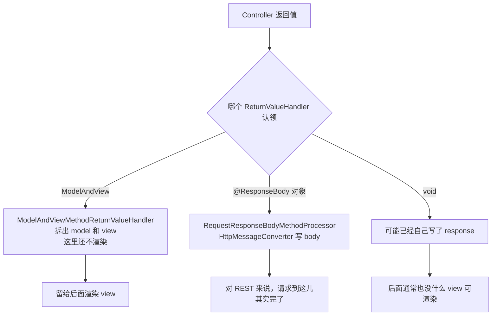
```mermaid
flowchart TD
    ret["Controller 返回值"] --> pick{"哪个 ReturnValueHandler 认领"}
    pick -->|ModelAndView| mav["ModelAndViewMethodReturnValueHandler<br/>拆出 model 和 view<br/>这里还不渲染"]
    pick -->|"@ResponseBody 对象"| body["RequestResponseBodyMethodProcessor<br/>HttpMessageConverter 写 body"]
    pick -->|void| none["可能已经自己写了 response"]
    body --> done["对 REST 来说，请求到这儿其实完了"]
    mav --> later["留给后面渲染 view"]
    none --> maybe["后面通常也没什么 view 可渲染"]
```

#### `ModelAndViewMethodReturnValueHandler`：转换为`ModelAndView`（网页）
> **只是转换，并不是渲染view。渲染view在最后。**

比如`ModelAndViewMethodReturnValueHandler`专门处理返回`ModelAndView`的controller返回的数据。它的`supportsReturnType`的实现：

```java
@Override
public boolean supportsReturnType(MethodParameter returnType) {
    return ModelAndView.class.isAssignableFrom(returnType.getParameterType());
}
```
而它的处理方式就是从`ModelAndView`里获取model和view。

> **注意：这里并不是渲染view**。

#### `RequestResponseBodyMethodProcessor`：转换为json/xml（`@RequestBody`，restful）
> **对于restful，到这儿整个请求其实就是处理完了。后面没它事儿了。**

如果是restful，最终会使用`RequestResponseBodyMethodProcessor`处理返回的数据：
> **Resolves method arguments annotated with `@RequestBody` and handles return values from methods annotated with `@ResponseBody` by reading and writing to the body of the request or response with an `HttpMessageConverter`**.

其实就是使用各种`HttpMessageConverter`转换Java对象为json/xml等：[RESTful - `HttpMessageConverter`]()。

**它的view为null，所以也不需要model**。

> 注意：**如果返回值已经是string了，就不处理body了。所以rest controller如果返回string，并不是把string object给序列化为json，而是直接返回string。**

然后就按照content type、`Accept` types、produce types开始转换，**最后写body。其实就是往response的outputstream里写数据**，和[（一）How Tomcat Works - 原始Web服务器]()并没有本质区别。

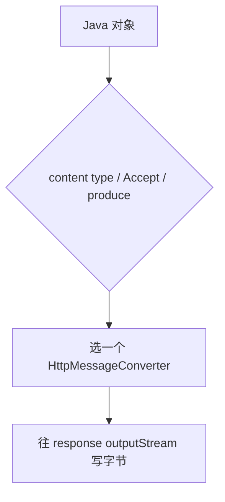
```mermaid
flowchart TD
    obj["Java 对象"] --> ctype{"content type / Accept / produce"}
    ctype --> conv["选一个 HttpMessageConverter"]
    conv --> writeBody["往 response outputStream 写字节"]
```

## 处理结果
结果就三种：
1. 有异常，处理异常；
2. 有 model and view，渲染 view；
3. **以上两个都没有。它可能是 REST，因为 REST 不返回 view。但是 REST 在 handle 的时候已经被转换成 JSON 了。这里不需要再处理了**。

handle 之后看手里还剩什么，三条岔路在这里才真正分开：

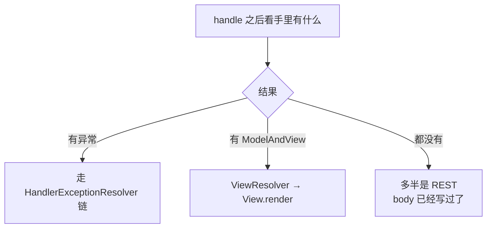
```mermaid
flowchart TD
    afterHandle["handle 之后看手里有什么"] --> whichResult{"结果"}
    whichResult -->|有异常| exPath["走 HandlerExceptionResolver 链"]
    whichResult -->|有 ModelAndView| viewPath["ViewResolver → View.render"]
    whichResult -->|都没有| restPath["多半是 REST<br/>body 已经写过了"]
```

### 处理异常
如果`DispatcherServlet`处理请求的过程中有异常，spring会对其拦截，并进行处理。

**所谓拦截，就是try catch住`DispatcherServlet`整个处理的流程，获取exception**。

接下来就是怎么处理这个exception的问题。

#### `HandlerExceptionResolver`：处理异常
spring默认会注册下面三种resolver（顺序）：
- **`ExceptionHandlerExceptionResolver`：使用`@ExceptionHandler`对应的方法处理异常**；
- `ResponseStatusExceptionResolver`：使用`@ResponseStatus`对应的方法处理异常。缺点是只能处理status code，没法设置body；
- `DefaultHandlerExceptionResolver`：把[Spring定义的异常和status code](https://docs.spring.io/spring-framework/docs/3.2.x/spring-framework-reference/html/mvc.html#mvc-ann-rest-spring-mvc-exceptions)进行映射。同样，缺点是设置不了body。**如果不定义任何异常处理器，用的就是这个**；

**当使用`@ExceptionHandler`全局处理异常时，`ExceptionHandlerExceptionResolver`是会被用到的异常处理器。**

三种 resolver 按顺序问下去，谁认领谁处理：

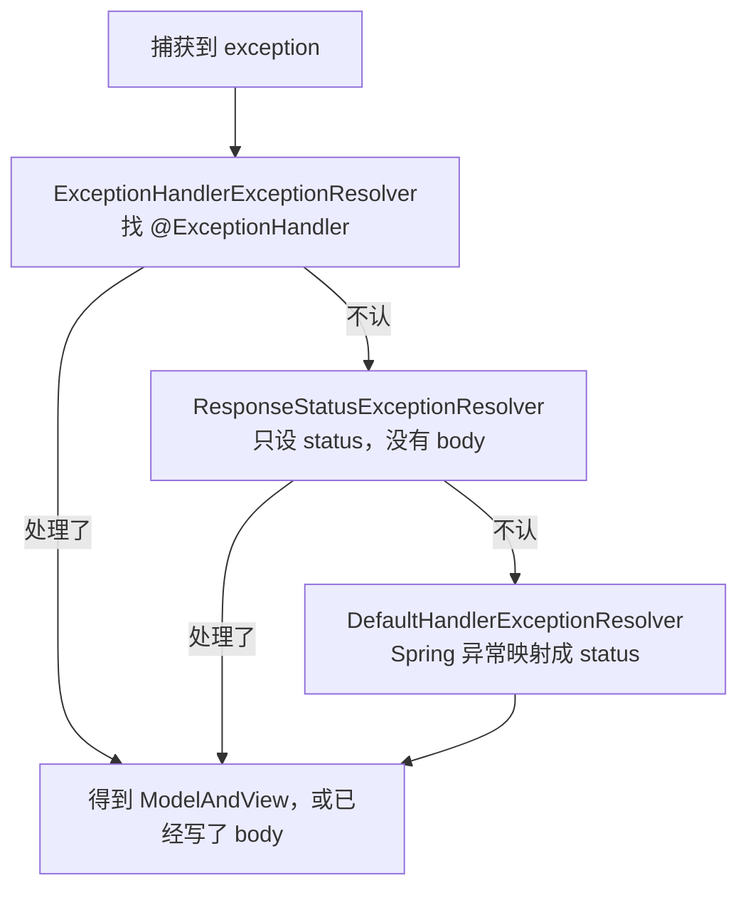
```mermaid
flowchart TD
    caught["捕获到 exception"] --> r1["ExceptionHandlerExceptionResolver<br/>找 @ExceptionHandler"]
    r1 -->|处理了| out["得到 ModelAndView，或已经写了 body"]
    r1 -->|不认| r2["ResponseStatusExceptionResolver<br/>只设 status，没有 body"]
    r2 -->|处理了| out
    r2 -->|不认| r3["DefaultHandlerExceptionResolver<br/>Spring 异常映射成 status"]
    r3 --> out
```

#### `@ExceptionHandler`：定义异常返回的header和body
`@ExceptionHandler`非常灵活，可以给被注解的方法设置非常灵活的参数：
- exception；
- request、response；

等等。

还可以设置非常灵活的返回值：
- `ModelAndView`/`Model`/`View`；
- String；
- `@ResponseBody`：to set the response content. The return value will be converted to the response stream using message converters；
- `HttpEntity<?>`/`ResponseEntity<?>`：to set response headers and content；
- void：if the method handles the response itself (by writing the response content directly, declaring an argument of type `ServletResponse` / `HttpServletResponse` for that purpose)；

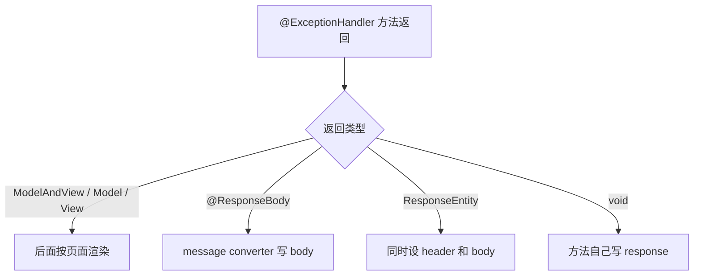
```mermaid
flowchart TD
    eh["@ExceptionHandler 方法返回"] --> t{"返回类型"}
    t -->|ModelAndView / Model / View| page["后面按页面渲染"]
    t -->|"@ResponseBody"| json["message converter 写 body"]
    t -->|ResponseEntity| hdr["同时设 header 和 body"]
    t -->|void| self["方法自己写 response"]
```

**所以`@ExceptionHandler`和`@ResponseStatus`相比，最大的优势在于定义header和body**。

> 强烈建议看看它的Javadoc！
>
> 相似地，标记了`@RequestMapping`的方法也有[很多参数类型](https://docs.spring.io/spring-framework/docs/3.2.x/spring-framework-reference/html/mvc.html#mvc-ann-methods)可以设置，[很多种类型](https://docs.spring.io/spring-framework/docs/3.2.x/spring-framework-reference/html/mvc.html#mvc-ann-return-types)可以作为返回值。和`@ExceptionHandler`类似。

它的劣势在于定义在`@Controller`时，只能被该Controller独有。**而`@ControllerAdvice` + `@ExceptionHandler`则可以让后者在所有Controller内共享，作为全局的exception处理器**！

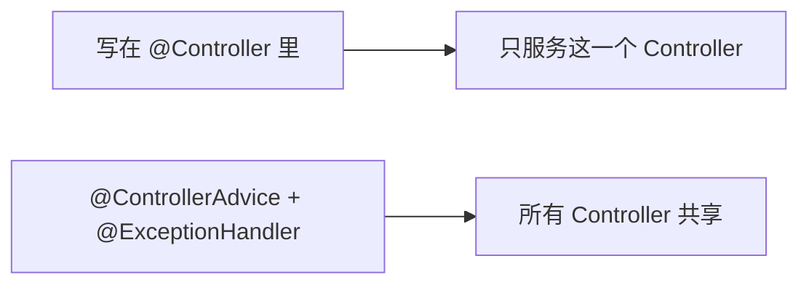
```mermaid
flowchart LR
    local["写在 @Controller 里"] --> one["只服务这一个 Controller"]
    global["@ControllerAdvice + @ExceptionHandler"] --> allCtrl["所有 Controller 共享"]
```

> **`@ControllerAdvice`的Javadoc**：Specialization of `@Component` for classes that declare `@ExceptionHandler`, `@InitBinder`, or `@ModelAttribute` methods to be shared across multiple `@Controller` classes.

比如下面这个示例，`@ControllerAdvice`和`@ExceptionHandler`组合使用，甚至还加了`@ResponseStatus`：

```java
@ControllerAdvice
public class GlobalExceptionHandler {

    /**
     * 想序列化它为 json，必须加 {@link Data}
     */
    @ExceptionHandler(UserNotFoundException.class)
    @ResponseStatus(HttpStatus.NOT_FOUND)
    public @ResponseBody ErrorResponse userNotFound(
            UserNotFoundException e, HttpServletResponse response) {
        response.setHeader("no-user-id", e.getMessage());
        return new ErrorResponse(11111, e.getMessage());
    }
}
```

`@ExceptionHandler`默认被上述`ExceptionHandlerExceptionResolver`持有，它会负责发现所有的`@ExceptionHandler`：

```java
private void initExceptionHandlerAdviceCache() {
    if (getApplicationContext() == null) {
        return;
    }

    // 1. 从 ApplicationContext 找到所有 @ControllerAdvice
    List<ControllerAdviceBean> adviceBeans =
            ControllerAdviceBean.findAnnotatedBeans(getApplicationContext());
    for (ControllerAdviceBean adviceBean : adviceBeans) {
        Class<?> beanType = adviceBean.getBeanType();
        if (beanType == null) {
            throw new IllegalStateException(
                    "Unresolvable type for ControllerAdviceBean: " + adviceBean);
        }
        ExceptionHandlerMethodResolver resolver =
                new ExceptionHandlerMethodResolver(beanType);
        if (resolver.hasExceptionMappings()) {
            // 2. 把 @ExceptionHandler 登记进 cache
            this.exceptionHandlerAdviceCache.put(adviceBean, resolver);
        }
        if (ResponseBodyAdvice.class.isAssignableFrom(beanType)) {
            // 3. 再把能写 @ResponseBody 的 advice 记下来
            this.responseBodyAdvice.add(adviceBean);
        }
    }
}
```

1. 它会从`ApplicationContext`里找到所有的`@ControllerAdvice` bean；
2. 然后把`@ExceptionHandler`找出来；
3. 再把返回`@ResponseBody`的找出来；

最后用这些handler处理异常。

参阅：[Spring 处理 REST 异常](https://www.baeldung.com/exception-handling-for-rest-with-spring)、[`HandlerExceptionResolver`](https://www.baeldung.com/spring-dispatcherservlet#handlerExceptionResolver) 和 [`DispatcherServlet` 处理流程](https://www.baeldung.com/spring-dispatcherservlet)。

### `ModelAndView`：如果需要返回view
如果不是restful，返回的是model and view，就要开始渲染html了。

#### model & view
- `Model`：**一些数据，用来渲染view的参数。可以理解为map**；
- `View`：**参数化的用来渲染网页的模板**。比如thymeleaf的模板；
- `ModelAndView`：就是为了让方法一次return俩值……both model and view。This class merely holds both to make it possible for a controller to return both model and view in a single return value。`ModelAndView`里面的view之所以用`Object`不用`View`，因为放的是：`View` instance or view name String；

参阅：[Spring MVC 中 Model、ModelMap 和 `ModelAndView` 的区别](https://www.baeldung.com/spring-mvc-model-model-map-model-view)。

view 槽里放的可能是实例，也可能只是个名字，渲染路径因此分叉：

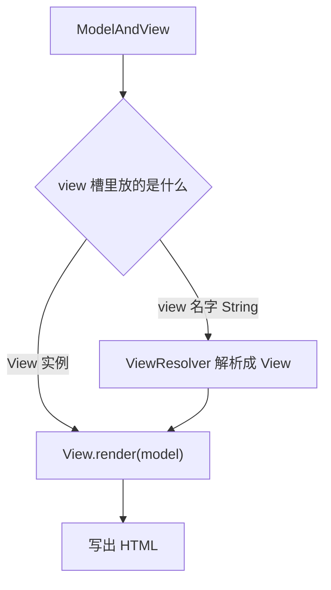
```mermaid
flowchart TD
    mav["ModelAndView"] --> vtype{"view 槽里放的是什么"}
    vtype -->|View 实例| render["View.render(model)"]
    vtype -->|view 名字 String| vr["ViewResolver 解析成 View"]
    vr --> render
    render --> html["写出 HTML"]
```

调用`View#render`方法，交给特定框架渲染html就好。而`View`的`render`方法，第一个参数代表model，实际定义的是个map，暴露了model的本质。

> view resolver & view: 本质还是后端渲染。现在前后端分离了，正常的系统都不需要这俩了。

### ~~restful？~~
不需要处理这个结果。handle后就转过了。

### `HandlerInterceptor#afterCompletion`
view都渲染完了，请求确实处理完了。

## 发布事件
终于处理完了请求，可喜可乐！怎么着也得庆祝一下不是？所以最后还不忘再发布一个`ServletRequestHandledEvent`。参见[Spring - bean的容器]()里对容器事件的介绍。

> 其实发布事件的代码在`DispatcherServlet`的父类`FrameworkServlet`里。

# 框架的本质
程序的执行永远是线性的。每一层都在 `main` 这条线上，收走上一层的细节，只给用户留一个入口。

## 框架如何调用：从 Socket 到 Controller

把上面几层叠回一条线。用户始终只写最里面那一小截；`main` 还在最外面。

**用户大概怎么写**

```java
@Controller
public class UserController {
    @GetMapping("/users")
    public List<User> listUsers() {
        return userService.findAll();
    }
}
```

**框架从 main 起怎么接到它**

```java
public static void main(String[] args) {
    tomcat.start(); // 或 Spring Boot 把 Tomcat 嵌进来
}

while (true) {
    Socket conn = serverSocket.accept();
    executor.execute(() -> handle(conn));  // worker 上才跑 Servlet / Controller
}

void handle(Socket conn) {
    Request req = parseHttp(conn);
    Servlet servlet = lookup(req.uri);             // 通常就是 DispatcherServlet
    servlet.service(req, resp);                    // → doDispatch
    HandlerExecutionChain chain = getHandler(req); // URI → listUsers
    invoke(chain.handler);                         // 用户的 listUsers()
    write(conn, resp);
}
```

1. Java提供的框架是main函数：开发者在main函数里写代码就行了；
2. Tomcat在main里启动，然后构造了`Connector`、`Container`（`Engine`/`Host`/`Context`/`Wrapper`），提供的是servlet接口：开发者只要写servlet扔到tomcat里就行了；
3. Spring在main里启动，构造的是spring application context：开发者只要在里面写bean就行了；
4. SpringMVC由Tomcat调用，构造了`DispatcherServlet`：开发者只要在`DispatcherServlet`里写Controller就行了；

所以框架的本质就是在线性运行的main函数里，把你引到它的世界，并让大家爱上这个世界，在此停留。至于原本main那条线上要做的事情，不需要再管了。

不管了，就简单了。但是如果不知道还有外面的那条线，被框架蒙蔽在它所构建的世界里，就永远是个被一叶障目的开发者，不见泰山。有了框架：可以免去写那些东西了，但不代表不需要知道外面的世界。

**而现实是，框架经常是堆叠的**。比如spring web mvc基于tomcat而存在，所以开发者所在的spring web mvc的世界外还有一个tomcat的世界。这是一个套娃的世界，如果开发者对此没有感知，请求报错的时候将会非常迷茫。

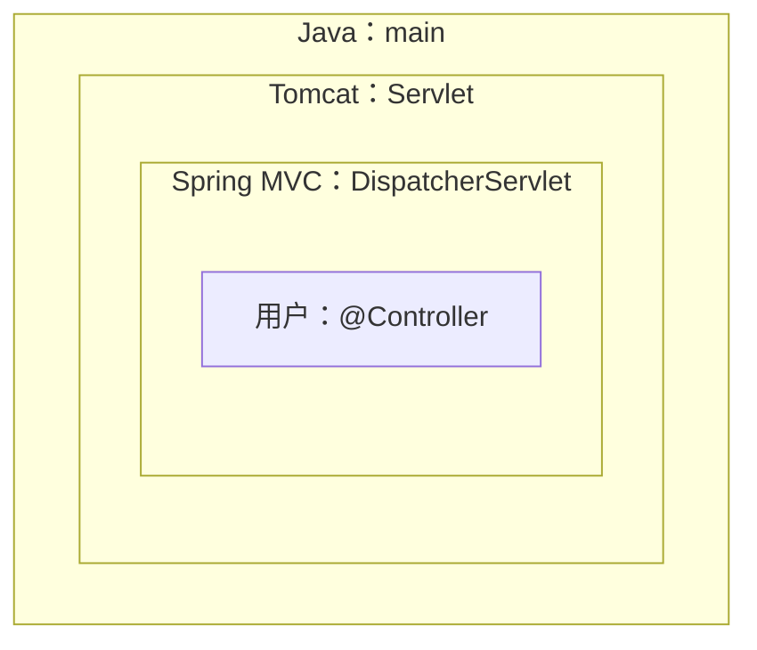
```mermaid
flowchart TB
    subgraph javaWorld["Java：main"]
        subgraph tomcatWorld["Tomcat：Servlet"]
            subgraph springWorld["Spring MVC：DispatcherServlet"]
                userBox["用户：@Controller"]
            end
        end
    end
```

> 所以tomcat和spring mvc可以共存：context path设为/xxx/，这样所有非xxx的请求会依然使用tomcat，/xxx/开头的请求才会进入spring mvc。

```mermaid
flowchart TD
    req["进来的请求"] --> ctxPath{"context path 对得上"}
    ctxPath -->|不对| tomcatOnly["仍走 Tomcat 自己的 Servlet"]
    ctxPath -->|对上 /xxx/| mvc["进入 DispatcherServlet"]
```

在`DispatcherServlet`之前，spring也有参与，比如：`javax.servlet.Filter`接口spring也继承了。所以在进入servlet之前也调用了spring的filter。用的还挺多的，包括spring security。可以再学学filter接口。

```mermaid
flowchart LR
    req2["请求"] --> filters["Filter 链<br/>例如 Spring Security"]
    filters --> ds2["DispatcherServlet"]
```

还有一个好玩儿的东西：spring处理请求的时候，把request#attribute当做临时传参的地方了。不过接下来会立刻擦掉：

```java
@Override
protected HandlerMethod getHandlerInternal(HttpServletRequest request) throws Exception {
    request.removeAttribute(PRODUCIBLE_MEDIA_TYPES_ATTRIBUTE);
    try {
        return super.getHandlerInternal(request);
    } finally {
        ProducesRequestCondition.clearMediaTypesAttribute(request);
    }
}
```
finally语句，确保一定擦掉。不让用户看见。233，小动作。
