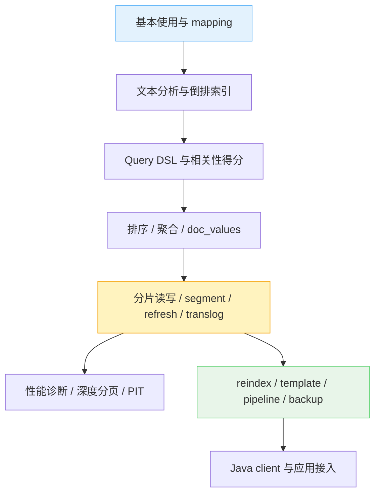

时间过得真快，转眼搞elasticsearch小半年了。这半年对es有了不少理解，同时一些地方和之前学习的innodb、redis等作对照，又有了不少更加深入的理解。

以[Elasticsearch: 权威指南](https://www.elastic.co/guide/cn/elasticsearch/guide/current/index.html)为基础，加上其他资料，汇总一下对es的学习流程。

大致分为以下部分。先看能不能用，再看为什么这么用，最后再折腾性能、运维和客户端：

- es基本使用：[Elasticsearch：basic]()；
- es搜索的原理、highlight：[Elasticsearch：search]()；
- 正排索引`doc_values`：[Elasticsearch：sort、aggregation]()；
- 聚合：[Elasticsearch：aggregation]()；
- reindex和task：[Elasticsearch：alias、reindex、task]()；
- es对关系型数据的支持，同时也介绍了全局序数：[Elasticsearch：关系型文档]()；
- es底层的分片、查询、数据提交：[Elasticsearch：分片读写]()；
- 调优、jvm内存、ssd、分页：[Elasticsearch：performance]()；
- 配置集群，集群部署：[Elasticsearch：集群配置]()；
- index default template：[Elasticsearch：default index template]()；
- pipeline：[Elasticsearch：pipeline]()；
- `_source`、`store`、`doc_values`、`index`，search：[Elasticsearch：_source store doc_values]()；
- 备份：[Elasticsearch：backup]()；
- java客户端：[Elasticsearch：client]()；
- 遍历、翻页、search_after、pit、track_total_hits：[Elasticsearch：遍历索引]()；
- 分片扩容和数据重分配：[Elasticsearch：数据重分配]()；
- runtime field：[Elasticsearch：runtime field]()；
- 自定义得分：[Elasticsearch：自定义得分]()。
