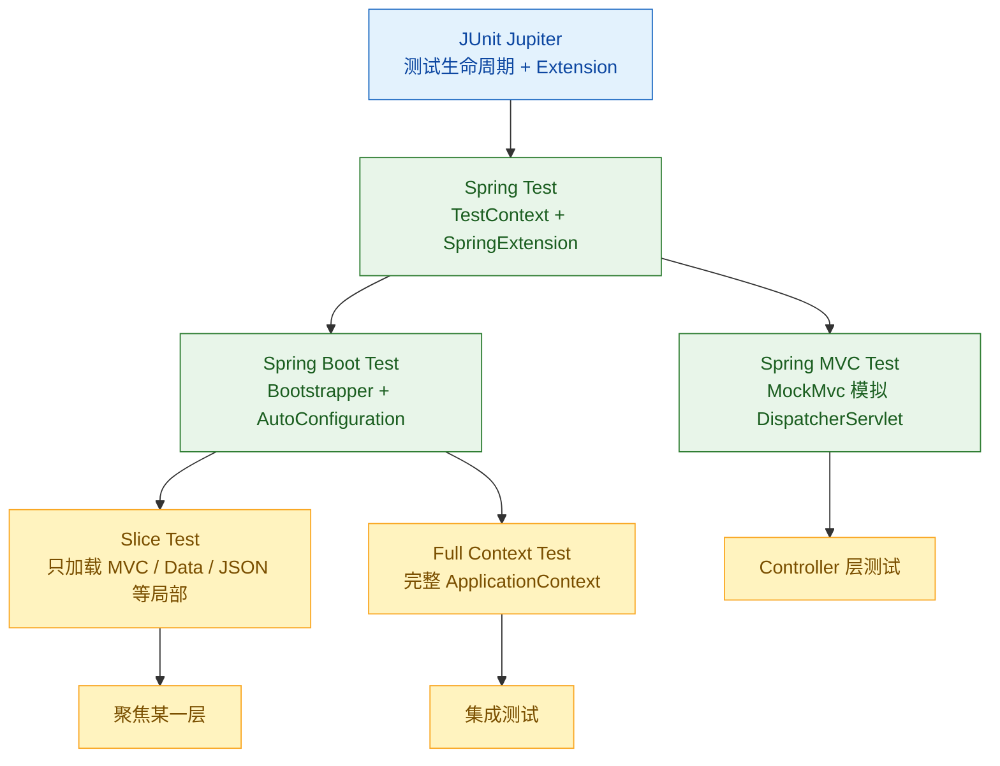

Spring 测试体系可以按依赖层次理解：JUnit Jupiter 提供测试生命周期和扩展点，Spring Test 接入 Jupiter 并创建 `ApplicationContext`，MockMvc 在不启动真实 server 的情况下执行 Spring MVC，Spring Boot Test 再叠加自己的 bootstrapper、自动配置和 slice test。

1. Table of Contents, ordered
{:toc}

这几篇文章的关系可以先看成一层层往上叠的测试能力：

# Junit Jupiter
[JUnit Jupiter]()是梦开始的地方。提供了`@ExtendWith`，让其他基于Jupiter的框架拥有拓展能力——主要是通过jupiter测试生命周期提供的回调，在test执行前维护框架自己的对象、注入对象，在执行后销毁对象。

# Spring Test
[spring-test]()借助jupiter的`@ExtendWith`，提供了`SpringExtension`：**读取自己关心的注解比如`@ContextConfiguration`，控制spring容器的启动和销毁**。在测试开始之前（beforeAll）构建了自己的`TestContext`，启动`ApplicationContext`，维护需要的bean，并给test class注入相关bean。

测试的时候可以直接使用`@ExtendWith(SpringExtension.class)`，也可以使用`@SpringJUnitConfig`。

spring test还提供了`@BootstrapWith`拓展，能够让基于spring test的框架（springboot：正是在下）用自己的`TestContextBootstrapper`启动context。

## `TestContext` framework
[Spring Test - Spring TestContext Framework]()是spring test的核心架构。

## `MockMvc`
[Spring Mvc Test - MockMvc]()是测试spring mvc层的重要方法。

## client

# SpringBoot Test
[spring-boot-test]()借助spring test的`@BootstrapWith`，提供了自己的`TestContextBootstrapper`接口实现`SpringBootTestContextBootstrapper`：以自己的方式搜集配置类和配置文件，启动context。

测试的时候一般不直接用`@BootstrapWith(SpringBootTestContextBootstrapper.class)`，经常使用继承它的一些注解，比如`@SpringBootTest`、`@WebMvcTest`等。
