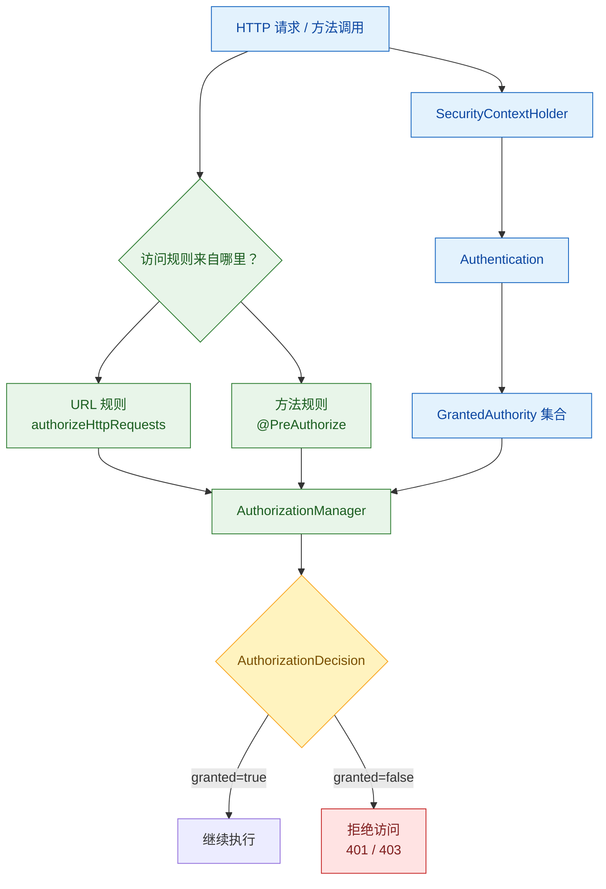

Spring Security 主要解决三个问题：
- Authentication：认证。谁在访问；
- Authorization：权限。某用户能不能访问；
- Protection：防止一些常见的攻击；

Authentication 的验证方式可以很多，但目标都是一致的：得到一个可信的`Authentication`。更准确地说，用户名和密码只是认证前的凭据，**认证成功后真正要长期使用的是`Authentication`里的 authorities**。有了这些权限信息，Spring Security 才能对 URL 或方法执行鉴权。

1. Table of Contents, ordered
{:toc}

文章的主线是：**认证负责把权限放进`Authentication`，鉴权负责取出这些权限并判断当前资源能不能访问**。

鉴权流程可以压缩成一句话：从`SecurityContextHolder`拿当前用户权限，再和 URL 或方法上的规则比对。



# Authorization 中的核心概念
[Authorization](https://docs.spring.io/spring-security/reference/servlet/authorization/architecture.html)的主要概念大概有三部分：
1. 怎么表示权限；
2. 怎么设置权限；
3. 谁来鉴权；

## 何谓权限
权限包含在`Authentication`里（所以由`AuthenticationManager`在设置`Authentication`的时候设置）：
```java
Collection<? extends GrantedAuthority> getAuthorities();
```
而`GrantedAuthority`就是简单地用string代表权限：
```java
String getAuthority();
```
**所以说白了，权限就是string**。

在[Spring Security - Authentication]()中介绍了一个很重要的概念：role 和普通 authority 没有本质区别，role 是从 authority 里分出来的约定概念。谈及 role 时，它默认会加上`ROLE_`前缀。比如设置一个 role `pikachu`，实际相当于添加了一个`ROLE_pikachu` authority。

## 权限配置
[配置权限的方式多种多样](https://docs.spring.io/spring-security/reference/servlet/authorization/expression-based.html)，给方法配置权限最常使用的是 SpEL：`@PreAuthorize("hasAnyAuthority('admin', 'pikachu')")`。

方法要求的权限来自`@PreAuthorize`注解。当前用户实际拥有的权限从哪里取？从`SecurityContextHolder`里的`Authentication`取。[Spring Security - 架构]()已经介绍过，`SecurityContextHolder`默认使用`ThreadLocal`存储，所以同一请求线程中全局可获取：
```java
	static final Supplier<Authentication> AUTHENTICATION_SUPPLIER = () -> {
		Authentication authentication = SecurityContextHolder.getContext().getAuthentication();
		if (authentication == null) {
			throw new AuthenticationCredentialsNotFoundException(
					"An Authentication object was not found in the SecurityContext");
		}
		return authentication;
	};
```

最后，[spring security注解相关的权限配置需要手动开启](https://docs.spring.io/spring-security/reference/servlet/authorization/method-security.html)，使用`@EnableGlobalMethodSecurity`或更新的`@EnableMethodSecurity`。

## 谁来鉴权 - `AuthorizationManager`
`AccessDecisionManager`会获取`Authentication`里的权限，用于鉴权。spring更推荐使用`AuthorizationManager`（主要应该是它支持泛型，待判断的对象不必用object表示）。感觉语义上和`AccessDecisionManager`差不太多，都是返回是否鉴权通过。

接口很简单，返回一个鉴权结果`AuthorizationDecision`：
```java
	/**
	 * Determines if access is granted for a specific authentication and object.
	 * @param authentication the {@link Supplier} of the {@link Authentication} to check
	 * @param object the {@link T} object to check
	 * @return an {@link AuthorizationDecision} or null if no decision could be made
	 */
	@Nullable
	AuthorizationDecision check(Supplier<Authentication> authentication, T object);
```

`AuthorizationManager`有很多实现，`RequestMatcherDelegatingAuthorizationManager`是其中一个，用来判断一个http请求是否符合待校验的权限。它也只是一个代理实现，实际会委托给一堆`AuthorizationManager`，每个`AuthorizationManager`绑定一个`RequestMatcher`，如果当前http请求符合matcher，就使用这个`AuthorizationManager`鉴权。

常用的配置权限的方式是`@PreAuthorize`，所以spring security使用spring aop创建了两个method增强：
- `AuthorizationManagerBeforeMethodInterceptor`
- `AuthorizationManagerAfterMethodInterceptor`

提供对`@PreAuthorize`注解的支持。

其实就是调用方法之前先使用`AuthorizationManager`校验一下`@PreAuthorize`注解的那个方法的权限和http里的权限是否符合。这里用到的鉴权manager是`PreAuthorizeAuthorizationManager`，它提供了对“方法相关的鉴权”的支持（`public final class PreAuthorizeAuthorizationManager implements AuthorizationManager<MethodInvocation>`）

# 层级权限 role hierarchy
[权限一般存在层级概念](https://docs.spring.io/spring-security/reference/servlet/authorization/architecture.html#authz-hierarchical-roles)，比如admin一般都有普通user的权限。为了让user权限的方法也支持admin权限，实现的时候，
1. 要么所有可以用user权限的方法都标上admin权限（太累了）；
2. 要么直接给admin赋予user权限，这样所有可以用user权限的方法，admin自动就能访问了；

`RoleHierarchy`就是为后者准备的。它就一个方法：
```java
Collection<? extends GrantedAuthority> getReachableGrantedAuthorities(
			Collection<? extends GrantedAuthority> authorities);
```
传入一个role（就是string），返回一个role数组，代表该角色拥有的所有角色权限。比如：
- 传入admin权限，返回admin、user，代表admin同时拥有user权限；
- 传入user权限，只返回user，代表user权限不包含更低级的权限；

`RoleHierarchy`的一个实现是`RoleHierarchyImpl`。允许传入这种格式的role层级：`ROLE_A > ROLE_B > ROLE_C`（实现的时候用大于号split字符串，解析为token），a包含b和c，b包含c。**也可以使用`\n`拼接字符串，指定多条角色包含关系。**

> `RoleHierarchyImpl`对传入的string的处理方式就是：先按照`\n`把string分成好几条链，再逐一解析合并每一条链。

`AuthorizationManager`实际使用`RoleVoter`鉴权。`RoleHierarchyVoter`是`RoleVoter`的子类，获取权限的时候，使用`RoleHierarchy`获取（一串儿）权限。

`RoleVoter`的权限获取，只能获取权限本身：
```java
	Collection<? extends GrantedAuthority> extractAuthorities(Authentication authentication) {
		return authentication.getAuthorities();
	}
```
`RoleHierarchyVoter`的权限获取，**可以取得本权限加上所有低层级的权限**：
```java
	@Override
	Collection<? extends GrantedAuthority> extractAuthorities(Authentication authentication) {
		return this.roleHierarchy.getReachableGrantedAuthorities(authentication.getAuthorities());
	}
```

所以我们配置一个自定义的`RoleHierarchyVoter`就行了。可以写成一条链，也可以像下面一样写成四条链：
```java
@Bean
AccessDecisionVoter hierarchyVoter() {
    RoleHierarchy hierarchy = new RoleHierarchyImpl();
    hierarchy.setHierarchy("ROLE_ADMIN > ROLE_STAFF\n" +
            "ROLE_STAFF > ROLE_USER\n" +
            "ROLE_USER > ROLE_GUEST");
    return new RoleHierarchyVoter(hierarchy);
}
```

# `AuthorizationFilter`
[security filter chain上有一个filter是`AuthorizationFilter`](https://docs.spring.io/spring-security/reference/servlet/authorization/authorize-http-requests.html)，它提供了对url权限的校验。可以通过`HttpSecurity#authorizeHttpRequests`自定义配置修改默认行为：
```java
@Bean
SecurityFilterChain web(HttpSecurity http) throws AuthenticationException {
    http
        .authorizeHttpRequests((authorize) -> authorize
            .anyRequest().authenticated();
        )
        // ...

    return http.build();
}
```

它决定filter chain要不要执行下去的方式非常简单：就看`AuthorizationManager`返回的`AuthorizationDecision`是否通过，通过则继续：


用到的`AuthorizationManager`是`RequestMatcherDelegatingAuthorizationManager`。

这个manager我们也可以自己配置：
```java
@Bean
SecurityFilterChain web(HttpSecurity http, AuthorizationManager<RequestAuthorizationContext> access)
        throws AuthenticationException {
    http
        .authorizeHttpRequests((authorize) -> authorize
            .anyRequest().access(access)
        )
        // ...

    return http.build();
}

@Bean
AuthorizationManager<RequestAuthorizationContext> requestMatcherAuthorizationManager(HandlerMappingIntrospector introspector) {
    MvcRequestMatcher.Builder mvcMatcherBuilder = new MvcRequestMatcher.Builder(introspector);
    RequestMatcher permitAll =
            new AndRequestMatcher(
                    mvcMatcherBuilder.pattern("/resources/**"),
                    mvcMatcherBuilder.pattern("/signup"),
                    mvcMatcherBuilder.pattern("/about"));
    RequestMatcher admin = mvcMatcherBuilder.pattern("/admin/**");
    RequestMatcher db = mvcMatcherBuilder.pattern("/db/**");
    RequestMatcher any = AnyRequestMatcher.INSTANCE;
    AuthorizationManager<HttpServletRequest> manager = RequestMatcherDelegatingAuthorizationManager.builder()
            .add(permitAll, (context) -> new AuthorizationDecision(true))
            .add(admin, AuthorityAuthorizationManager.hasRole("ADMIN"))
            .add(db, AuthorityAuthorizationManager.hasRole("DBA"))
            .add(any, new AuthenticatedAuthorizationManager())
            .build();
    return (context) -> manager.check(context.getRequest());
}
```

# 感想
鉴权并不关心`SecurityContextHolder`里的`Authentication`来自 form、basic、remember-me 还是自定义 token filter。它只关心当前`Authentication`包含哪些 authorities，以及这些 authorities 是否满足当前资源的访问规则。认证和鉴权的职责边界在这里非常清楚。
