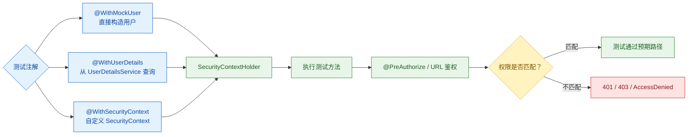

Spring Security Test 不只是测试工具，它也能反向帮助理解 Spring Security 的本质。很多复杂认证流程在测试里会被压缩成一个动作：直接构造或注入`SecurityContext`。

1. Table of Contents, ordered
{:toc}

文章的主线是：**业务测试通常不需要真的走完整登录流程，只需要让待测代码在执行时看到符合预期的`Authentication`**。

Spring Security Test 的几个注解，本质上都是为了在测试方法执行前准备好`SecurityContext`：



# 依赖
springboot test似乎没有spring security test相关的starter包，所以要直接加入spring-security-test：
```java
        <dependency>
            <groupId>org.springframework.boot</groupId>
            <artifactId>spring-boot-starter-test</artifactId>
            <scope>test</scope>
        </dependency>
        <dependency>
            <groupId>org.springframework.security</groupId>
            <artifactId>spring-security-test</artifactId>
            <scope>test</scope>
        </dependency>
```

# 本质
[Spring Security Test 支持直接注入权限](https://docs.spring.io/spring-security/reference/servlet/test/method.html)，为后续鉴权铺平道路。

> 注入用户也是为了获取它的权限，所以本质还是为了注入权限。

在[Spring Security - Authentication]()中介绍过，spring security主要的两大块内容是：
1. 认证；
2. 鉴权；

**而认证的本质就是往`SecurityContextHolder`放一个authentication**。spring security test深刻地揭示了这一点。

# 注入权限
spring security基于spring test，设置了一个listener：`WithSecurityContextTestExecutionListener`。**这个插件会读取注解里的用户权限信息，直接写入`SecurityContextHolder`**。

> ensures that our tests are run with the correct user. It does this by populating the `SecurityContextHolder` prior to running our tests.

## `@WithMockUser`
**使用`@WithMockUser`可以直接往`SecurityContextHolder`填充一个`UsernamePasswordAuthenticationToken`类型的`Authentication`**。

> The User will have the username of "user", the password "password", and a single GrantedAuthority named "ROLE_USER" is used.

**这个user的名字不重要，甚至它都不需要真实存在，我们要的仅仅是它的权限**。比如：
- `ROLE_USER`和`foobar`权限：`@WithMockUser(authorities = {"ROLE_USER", "foobar"})`
- 或者通过role设置`ROLE_USER`和`ROLE_foobar`权限：`@WithMockUser(roles = {"USER", "foobar"})`

可以标注在方法上，也可以标注在类上。

如果用的比较多，甚至可以搞个alias注解，需要的时候直接标注`@AdminAuthorityUser`：
```java
/**
 * 拥有admin权限的用户
 *
 * @author liuhaibo on 2022/12/28
 */
@Retention(RetentionPolicy.RUNTIME)
@WithMockUser(authorities = {"admin", "foobar"})
public @interface AdminAuthorityUser {
}
```

## `@WithUserDetails`
如果系统里的authentication的principal需要是某个特定类型，此时`@WithMockUser`就mock不了了。一般情况下，**系统实现特殊的principal类型的时候，使用特定的`UserDetailsService`创建user，返回user。此时的user一般同时实现`UserDetails`和自定义的类型**。

> The custom principal is often returned by a custom `UserDetailsService` that returns an object that implements both `UserDetails` and the custom type.

> `UserDetailsService`的作用是根据username找到user，此时的user是真实存在（database、ldap、in-memory等）的user。

`@WithUserDetails`支持指定自定义`UserDetailsService` bean，查询user，获取`UserDetails`：
- `@WithUserDetails(value="customUsername", userDetailsServiceBeanName="myUserDetailsService")`

所以这里的user必须是真实存在的数据，不然会查找不到`UserDetails`。`@WithMockUser`则不需要user真实存在。

## `@WithSecurityContext`
更进一步，如果需要更细粒度的控制，可以使用`@WithSecurityContext`直接mock `SecurityContext`。

# 示例
```java
@RestController
@RequestMapping("/")
public class FrontPageController {

    @GetMapping("/haha")
    @PreAuthorize("hasAnyAuthority('ROLE_USER')")
    public String hahaGreeting() {
        SecurityContext context = SecurityContextHolder.getContext();
        return "haha, " + context.getAuthentication();
    }
}
```
**为了让基于方法的`@PreAuthorize`生效，必须使用`@EnableMethodSecurity`开启它，否则写了也没用。**

测试代码：
```java
@WebMvcTest(controllers = FrontPageController.class)
@Import(MultipleSecurityFilterChainConfig.class)
public class FrontPageControllerTest {

    @Autowired
    private MockMvc mockMvc;

    private static final String url = "/wtf/haha";

    @Test
    public void noAuthority() throws Exception {
        MockHttpServletResponse response = mockMvc.perform(
                MockMvcRequestBuilders.get(url).contextPath("/wtf")
        ).andReturn().getResponse();

        Assertions.assertThat(response.getStatus()).isEqualTo(HttpStatus.UNAUTHORIZED.value());
    }

    @WithMockUser(authorities = {"ROLE_USER", "foobar"})
    @Test
    public void withAuthority() throws Exception {
        MockHttpServletResponse response = mockMvc.perform(
                MockMvcRequestBuilders.get(url).contextPath("/wtf")
        ).andReturn().getResponse();

        Assertions.assertThat(response.getStatus()).isEqualTo(HttpStatus.OK.value());
        Assertions.assertThat(response.getContentAsString()).contains("ROLE_USER");
    }

    @WithMockUser(roles = {"USER", "foobar"})
    @Test
    public void withRole() throws Exception {
        MockHttpServletResponse response = mockMvc.perform(
                MockMvcRequestBuilders.get(url).contextPath("/wtf")
        ).andReturn().getResponse();

        Assertions.assertThat(response.getStatus()).isEqualTo(HttpStatus.OK.value());
        Assertions.assertThat(response.getContentAsString()).contains("ROLE_USER");
    }

    @WithMockUser(authorities = {"foobar"})
    @Test
    public void wrongAuthority() throws Exception {
        MockHttpServletResponse response = mockMvc.perform(
                MockMvcRequestBuilders.get(url).contextPath("/wtf")
        ).andReturn().getResponse();

        Assertions.assertThat(response.getStatus()).isEqualTo(HttpStatus.FORBIDDEN.value());
    }
}
```
有几点需要注意：
1. **[`MockMvc`]()需要手动设置context path，所以即使代码修改了默认context path，测试的时候最好也不要用context path。它不读取properties里的context path设置**，无论是`@WebMvcTest`还是`@SpringBootTest` + `@AutoConfigureMockMvc`；
2. `@WebMvcTest`不会加载自定义的spring security `MultipleSecurityFilterChainConfig`配置，但是它里面写了`@EnableMethodSecurity`。所以为了让`@PreAuthorize`生效，需要把它import进来：`@Import(MultipleSecurityFilterChainConfig.class)`；

更多样例可以参考：
- [Spring Security Integration Tests](https://www.baeldung.com/spring-security-integration-tests)

# 感想
测试框架往往是框架本身的精简版，去其枝叶，返璞归真。Spring Security Test 直接把`Authentication`放进`SecurityContextHolder`，这反而清楚揭示了认证和鉴权之间的关系：测试可以跳过“怎么登录”，但不能跳过“当前用户是谁、拥有哪些权限”。
