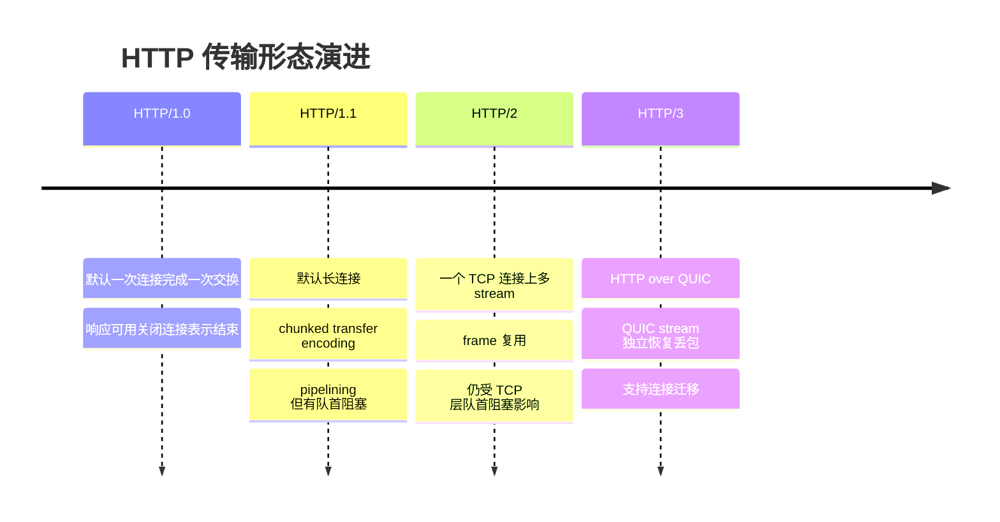
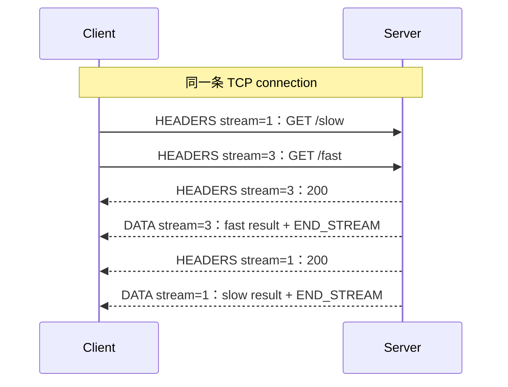

HTTP 是应用层协议，定义的是 method、status code、header、cache 等语义；这些语义如何编码、又由什么传输协议承载，则取决于具体 HTTP 版本。HTTP/1.1 和 HTTP/2 通常运行在 TCP 上，HTTP/3 则运行在 QUIC 上，而 QUIC 的 packet 由 UDP datagram 承载。

所以更准确的问题不是“能不能把现有 HTTP 原封不动地换到 UDP 上”，而是：**能不能保留 HTTP 语义，同时为它设计一种更适合 Web 的传输方式？**HTTP/3 给出的答案就是 QUIC。

> [透明多级分流系统-传输链路](https://icyfenix.cn/architect-perspective/general-architecture/diversion-system/transmission-optimization.html)

1. Table of Contents, ordered
{:toc}



# HTTP 为什么长期使用 TCP

**一件事情看久了，就容易把它当成理所当然。**TCP 为 HTTP/1.x 和 HTTP/2 提供了浏览器真正需要的能力：可靠传输、按序交付、拥塞控制和双向 byte stream。应用不必自己处理丢包、重复、乱序，代价是建立和维护连接需要状态：

1. TCP 三次握手至少消耗一个网络往返时间（RTT），实际是几毫秒还是几百毫秒取决于距离和网络质量；HTTPS 还需要协商 TLS，不过 TLS 1.3 和 session resumption 已经显著减少了额外往返；
2. 新连接的拥塞窗口通常从较保守的值开始，不能一上来就占满全部带宽；
3. TCP 对上层只提供一条可靠、有序的 byte stream。可靠和有序非常省心，但也意味着中间缺一个 byte 时，后面的 byte 暂时不能交给 HTTP。

这不代表“TCP 不适合 HTTP”，而是说：**短连接会反复支付握手和慢启动成本，HTTP 应尽量复用已经建立的连接。**HTTP/1.1 的持久连接、HTTP/2 的多路复用以及 HTTP/3 的 QUIC，都是沿着这条主线演进的。

> 所谓 TCP “连接”仍然是两端共同维护的一组协议状态，不是一根真实存在的管子。三次握手只能说明当时双方能够通信，不能保证 server 下一秒不会故障；可靠传输也不是“永远成功”，而是成功时按序、无重复地交付，失败时明确报错。

## HTTP/1.x 时代的前端 trick

HTTP/1.x 很难在一条连接上高效并发大量请求。为了少建连接又尽量提高并行度，前端曾大量使用工程 trick：

1. 把多张小图片拼成一张 sprite，减少 request 数量；代价是修改一张小图也可能让整张 sprite 缓存失效；
2. 合并 JavaScript、CSS 或 API 请求，减少 request 数量；代价是更新粒度变粗，最慢的子任务还可能拖住整个组合结果；
3. 把资源拆到多个域名（domain sharding），绕过浏览器对同一 origin 的 HTTP/1.x 连接数限制；代价是增加 DNS、TCP、TLS 和服务器连接成本。

这些技巧都在交换成本。HTTP/2 把并发能力放进协议本身后，很多为了“减少请求数”而存在的技巧就不再是默认最优解。

## “HTTP over UDP”不能直接替换

UDP 只负责一封一封地发送 datagram，不承诺送达、不承诺顺序、也不负责拥塞控制。把 HTTP/1.1 文本直接塞进 UDP 并不能自动得到可用的通用 HTTP：报文过大如何拆分、丢包如何恢复、顺序如何重组、连接如何加密和迁移，都需要新的规则。

HTTP/3 并不是“HTTP/2 去掉 TCP 后直接裸跑 UDP”，而是：

```text
HTTP/1.1、HTTP/2：HTTP → TCP → IP
HTTP/3：          HTTP → QUIC → UDP → IP
```

QUIC 在 UDP 之上重新提供可靠传输、拥塞控制、TLS 加密和多 stream，只是它不再受 TCP 单一 byte stream 的结构限制。详细原理放到后面的 HTTP/3 部分。

## UPnP：UDP 上的是 HTTP-like discovery，不是完整 HTTP

UPnP（Universal Plug and Play）常用于局域网中的设备发现与控制。这里很容易被“HTTPMU/HTTPU”这些历史名称误导：**UPnP 不是整体运行在 UDP 上。**

按照 [UPnP Device Architecture 2.0](https://openconnectivity.org/upnp-specs/UPnP-arch-DeviceArchitecture-v2.0-20200417.pdf)：

- 设备发现协议 SSDP 使用 UDP multicast/unicast；它借用了 HTTP/1.1 的 start-line 和 header 格式，但规范明确说明它不是完整 HTTP/1.1，有自己的处理规则；
- 发现设备后，description、control 和常规 eventing 等步骤仍会使用 HTTP/TCP；
- multicast discovery 天生可能丢包，所以通过重复发送、定期公告和消息过期等方式达到“最终还能发现”的效果，而不是假设局域网绝不会丢包。

例如 control point 用 UDP multicast 发送 `M-SEARCH`，设备再用 UDP unicast 回复。这里选择 UDP 是因为 discovery 需要一对多 multicast，而 TCP 面向点到点连接，不提供这种语义；但这不能推出“UPnP 不可能使用 TCP”。

这个例子真正说明的是：**上层协议会根据需求选择并约束传输层。**需要 multicast 且能容忍偶发丢包的 discovery 可以使用 UDP；需要可靠交付的 description 和 control 则使用 HTTP/TCP。传输层对业务语义提供抽象，但不是可以无条件互换的插头。

# HTTP/1.x：复用连接之后的新问题

[HTTP/1.0（RFC 1945）](https://www.rfc-editor.org/rfc/rfc1945.html)的标准模型是一条 TCP connection 完成一组 request/response 后关闭。一些实现后来通过 `Connection: keep-alive` 实验性地支持持久连接，但兼容性并不好。到了 [HTTP/1.1](https://www.rfc-editor.org/rfc/rfc9112.html#section-9.3)，持久连接才成为默认行为：除非一方明确发送 `Connection: close`，否则同一条连接可以继续承载后续 message。

长连接的收益是复用已经完成握手、已经“热起来”的 TCP connection。浏览器在 HTTP/1.x 下通常会为同一 origin（scheme、host、port 的组合）建立若干条并行连接；常见上限是 6 左右，但这是浏览器实现策略，不是 HTTP 标准写死的数字。

连接不再用完即关，就必须回答两个问题：

1. 连续 message 的边界在哪里？
2. 一条连接上如果同时有多个 request，哪个 response 属于哪个 request？

## 问题一：如何确定 message body 的边界

HTTP/1.x 是文本 header 加可选 body。header 以空行结束，但 body 不能总靠“读到 TCP connection 关闭”为止，否则连接就无法复用。

先看最常见的三种 framing：

| 方式 | receiver 如何知道 body 结束 | 能否继续复用连接 |
| --- | --- | --- |
| `Content-Length: N` | 精确读取 N byte | 可以 |
| `Transfer-Encoding: chunked` | 逐块读取，直到长度为 0 的 last-chunk | 可以，仅 HTTP/1.1 |
| close-delimited | 一直读取到对端关闭连接 | 不可以 |

实际规则还会考虑 method 和 status code，例如 `HEAD` response、`204`、`304` 本来就没有 message body；这里只聚焦有 body 的普通 response。完整优先级见 [RFC 9112 6.3](https://www.rfc-editor.org/rfc/rfc9112.html#section-6.3)。

HTTP/1.0 request 如果包含 body，必须提供有效的 `Content-Length`；response 没有长度时则可以关闭连接表示结束。request 不能用“关闭连接”表示 body 结束，因为关闭后 server 就没有连接可以回 response 了。

`Content-Length` 的限制是 sender 必须在发送 header 时已经知道最终字节数。例如 server 收到 `Accept-Encoding: gzip` 后现场压缩资源，并希望边压缩边发送：header 发送时，压缩后的总大小可能还不知道。HTTP/1.0 并非完全不能处理它，但只能二选一：

- 先把全部内容压缩并缓冲，算出 `Content-Length` 后再发送，延迟高且占内存；
- 边压缩边发送，最后通过关闭 connection 表示结束，但失去本次连接的复用能力。

HTTP/1.1 的 chunked transfer encoding 正是为了在**不知道最终总长度**时，仍能边生成边发送并保留长连接。

## `Transfer-Encoding: chunked` 逐字节解析

先区分两个长得很像的概念：

- `Content-Encoding: gzip` 描述 representation data 如何压缩成 content；解压后才是原始 representation；
- `Transfer-Encoding: chunked` 描述 content 在这条 HTTP/1.1 message 中如何编码为线上 message body；去掉 chunk 边界后才得到 content。

二者可以同时存在：先生成并 gzip 压缩内容，再把压缩后的 byte 分成 chunk 发送。

[RFC 9112 7.1](https://www.rfc-editor.org/rfc/rfc9112.html#section-7.1)的语法可以先简化成：

```text
chunked-body = 若干个普通 chunk + 一个长度为 0 的 last-chunk + 可选 trailer + 空行
普通 chunk   = chunk-size + CRLF + chunk-data + CRLF
```

`chunk-size` 是十六进制数，表示紧随其后的 `chunk-data` 有多少个 **byte**；`CRLF` 是回车 `\r` 加换行 `\n`，共两个 byte。注意：长度行后的 CRLF 和 data 后面的 CRLF 是 transfer coding 的协议边界，不属于应用 content；但 data 自己完全可以包含 CRLF，此时它们当然要计入 `chunk-size`。

把原例补成完整 response。代码块把不可见的 CRLF 显式写成 `\r\n`：

```http
HTTP/1.1 200 OK\r\n
Content-Type: text/plain\r\n
Transfer-Encoding: chunked\r\n
\r\n
4\r\n
Wiki\r\n
6\r\n
pedia \r\n
E\r\n
in \r\n
\r\n
chunks.\r\n
0\r\n
\r\n
```

最后一个 header 后的 `\r\n\r\n` 表示“结束这一行，再用一个空行结束 header section”。从 `4\r\n` 开始才是 chunked message body，可以把每个 chunk 连成一行观察：

```text
4\r\nWiki\r\n
6\r\npedia \r\n
E\r\nin \r\n\r\nchunks.\r\n
0\r\n\r\n
```

逐块解析如下，其中 `␠` 专门表示肉眼不易看见的空格：

1. 读到 `4\r\n`：`0x4` = 4，精确读取 4 byte `Wiki`，再消费一个协议 CRLF；
2. 读到 `6\r\n`：`0x6` = 6，精确读取 6 byte `pedia␠`，再消费一个协议 CRLF；
3. 读到 `E\r\n`：`0xE` = 14，读取 `in␠`（3）+ 正文 CRLF（2）+ 正文 CRLF（2）+ `chunks.`（7），再消费一个协议 CRLF；
4. 读到 `0\r\n`：size 为 0，不读取 data；继续读取可选 trailer，遇到空行后 chunked message body 结束。

第三块最绕：它的 data 里真的包含两个 CRLF，所以 `3 + 2 + 2 + 7 = 14 = 0xE`。`chunks.` 后面还有一个 CRLF，但那是第三个 chunk 的协议结束符，不计入 `E`。decoder 去掉 size 和协议边界后，最终 content 的精确 byte 序列是：

```text
Wikipedia␠in␠\r\n\r\nchunks.
```

把 CRLF 渲染为真正的换行才是：

```text
Wikipedia in 

chunks.
```

decoder 的工作非常机械：

```text
content = 空
循环：
    N = 读取一行，去掉 CRLF，并把 N 按十六进制解析
    如果 N == 0：退出循环
    content += 精确读取 N byte
    再消费一个 CRLF，确认本 chunk 结束
读取可选 trailer，直到空行
```

最后再强调两件事：

1. chunk 是 **HTTP/1.1 的 message framing**，不是 TCP packet。一个 chunk 可以跨多个 TCP packet，多个 chunk 也可以合进一个 TCP packet；一次 `read()` 返回多少 byte 与 chunk 边界没有必然关系；
2. receiver 完成 dechunk 后，上层应用通常只看到连续 content，不会看到原始 chunk 边界。HTTP/2 和 HTTP/3 有自己的 frame，不使用 `Transfer-Encoding: chunked`。

所以 chunked 解决的核心问题是：sender 不需要承诺整个 content 的总长度，只需承诺“当前 chunk 有多长”；receiver 读到 `0` chunk 就知道本条 message 结束，TCP connection 仍然可以留给下一条 message。

## 问题二：request 和 response 如何关联

HTTP/1.x response 没有 Request ID。不开 pipelining 时，client 在一条 connection 上发送 Request A，等 Response A 完整结束后再发送 Request B，自然不会认错。

HTTP/1.1 pipelining 允许 client 不等 response 就连续发送多个 request：

```text
Client → Server：Request A、Request B、Request C
Server → Client：Response A、Response B、Response C
```

server 可以并行处理安全 method 的 request，但 [RFC 9112 9.3.2](https://www.rfc-editor.org/rfc/rfc9112.html#section-9.3.2)要求 response 必须按照收到 request 的顺序发送。client 因而可以用 FIFO 关联：第一条 response 属于第一条 request，第二条属于第二条 request。

问题是：如果 A 很慢，即使 B、C 已经处理完，server 也不能先把 Response B、C 发出来，否则 client 无法判断归属。这就是 **HTTP/1.1 transaction-level head-of-line blocking（队首阻塞）**。


再加上中间代理兼容和失败重试等问题，浏览器实践中并没有广泛启用 pipelining，而是通过多条 HTTP/1.1 connection 获得并发。HTTP/2 的 Stream ID 才从协议层真正解除这条 FIFO 约束。

# HTTP/2：一条 TCP connection 上的多个 stream

HTTP/1.1 pipelining 必须按 request 顺序返回 response，因为线上没有额外标识，client 只能用 FIFO 关联。HTTP/2 则把 message 编码成二进制 **frame（帧）**。所有 frame 都以固定 9 byte header 开始，其中包括长度、类型、flags 和 31 bit 可用的 Stream ID：

```text
+---------------+------+-------+----------+
| Length 3 byte | Type | Flags | Stream ID|
+---------------+------+-------+----------+
|              Frame Payload              |
+-----------------------------------------+
```

常见 frame 类型包括：

- `HEADERS`：编码 request 或 response 的 header；
- `DATA`：承载 request 或 response 的 body；
- `RST_STREAM`：取消单个 stream；
- `WINDOW_UPDATE`：更新流量控制窗口；
- `SETTINGS`、`PING`、`GOAWAY`：管理整条 connection。

Stream ID `0` 保留给 connection 级 frame；client 主动创建的 stream 使用奇数 ID，server 为 server push 创建的 stream 使用偶数 ID。浏览器发起的普通 request 因而常见 `1、3、5……`，不是 `1、2、3……`。

## Stream ID 同时完成分流和 request/response 关联

[RFC 9113 8.1](https://www.rfc-editor.org/rfc/rfc9113.html#section-8.1)规定，一次普通 HTTP request/response exchange 完整占用一个 stream：

```text
Stream 1 = Request A + Response A
Stream 3 = Request B + Response B
Stream 5 = Request C + Response C
```

Request A 的 `HEADERS`、可选 `DATA`，以及 Response A 的 `HEADERS`、`DATA` 都带 `Stream ID = 1`。client 收到 frame 后按 Stream ID 分拣，就知道它属于哪次 exchange。

因此 HTTP/2 协议层没有另一套“Request ID”。**Stream ID 既是 connection 内的逻辑 channel number，也是这组 request/response 的关联标识。**应用层的 JSON 或 RPC 当然还能定义自己的 request ID，但 HTTP/2 multiplexing 不依赖它。

## “任意顺序”到底乱在哪里

假设 client 先请求慢接口，再请求快接口：



后发的 Request B 确实可以先收到完整 Response B。所谓“任意顺序”最好换成两个更准确的说法：

1. **不同 stream 的完成顺序彼此独立**：stream 3 可以先于 stream 1 完成；
2. **不同 stream 的 frame 可以交错**：connection 上可以依次出现 `HEADERS(1)`、`HEADERS(3)`、`DATA(3)`、`DATA(1)`、`DATA(3)`。

但这不等于所有 frame 都能随便乱序。[RFC 9113 5.1](https://www.rfc-editor.org/rfc/rfc9113.html#section-5.1)明确说明 frame 的发送顺序有语义，receiver 按接收顺序处理：

- **跨 stream 可以交错**，Stream ID 负责把 frame 分拣回各自的 exchange；
- **同一 stream、同一方向内仍然有序**，`HEADERS` 和各个 `DATA` 的先后不能任意打乱；
- 一个普通 stream 从开始到关闭只服务一组 request/response，不会在流内再复用 N 组 exchange；
- stream 是双向的，request body 尚未发送完时，server 在协议上也可以开始发送 response；两个方向能在时间上重叠，但每个方向自己的 byte 顺序仍然保持。

例如 connection 上可以观察到：

```text
HEADERS(stream=1)  Request A
HEADERS(stream=3)  Request B
HEADERS(stream=3)  Response B
DATA   (stream=3)  B1
HEADERS(stream=1)  Response A
DATA   (stream=1)  A1
DATA   (stream=3)  B2 + END_STREAM
DATA   (stream=1)  A2 + END_STREAM
```

从整条 connection 看，A、B 的 frame 交错在一起；分别筛选 `stream=1` 和 `stream=3` 后，每条 stream 内仍是一组按协议顺序解释的 exchange。

## Stream 像逻辑 TCP 连接，但不是 TCP 连接

“把一个实际连接当 N 个逻辑连接使用”是理解 multiplexing 的好起点。每个 stream 有自己的 ID、状态和 stream-level flow-control window，也可以单独结束或通过 `RST_STREAM` 取消，不必关闭其他 stream。

但这些 stream 仍然共享：

- 同一个 TCP socket；
- HTTPS 场景下的同一个 TLS connection；
- 同一套 TCP 拥塞控制；
- HTTP/2 的 connection-level flow-control window；
- 同一个有序 TCP byte stream。

所以 stream 更像“同一根管道中贴了不同编号的逻辑通道”，而不是 N 根真正独立的管道。

## 为什么 HTTP/2 通常不再为并发建立多条连接

假设页面需要 HTML、CSS、JavaScript、图片和字体。HTTP/1.1 为了并发，常见做法是：

```text
TCP connection 1：HTML → CSS
TCP connection 2：JavaScript → 图片
TCP connection 3：字体
```

HTTP/2 则可以：

```text
一条 TCP connection
├── Stream 1：HTML
├── Stream 3：CSS
├── Stream 5：JavaScript
├── Stream 7：图片
└── Stream 9：字体
```

这就是 **multiplexing：把多个独立 stream 的 frame 复用到一条实际 connection 上。**CSS 虽然后请求，却可以先完成；浏览器不再主要依靠多建 TCP connection 获得 HTTP 并发。

[RFC 9113 9.1](https://www.rfc-editor.org/rfc/rfc9113.html#section-9.1)建议 client 对同一个 host + port 配置不要建立超过一条 HTTP/2 connection。因此“一般只维持一条”是正确的理解，但不是永远只能一条：连接故障、更换 TLS key、不同 client certificate 等情况仍可建立替代或额外连接。反过来，在证书和 server authority 都允许时，一条 HTTP/2 connection 甚至可以合并服务多个 origin（connection coalescing）。

## HTTP/2 解决了哪一层 HOL blocking

HTTP/2 解除了 HTTP/1.1 的 response FIFO：慢 stream 1 不再阻止快 stream 3 的 response frame 被发送。这解决的是 **HTTP transaction 层的队首阻塞**。

但所有 stream 最后仍被序列化进同一条 TCP byte stream。假设某个 TCP segment 丢失，而更晚的 segment 已经到达：TCP receiver 可以先把后者放进重组缓冲区，也可以通过 SACK 告知 sender 哪些区间已经收到；但在中间缺口补齐前，TCP 不能把后续 byte 交给 HTTP/2。于是这些 byte 里即便装的是其他 stream 的完整 frame，也一起等待。

```text
TCP byte stream：...[丢失的一段]...[Stream 3 frame]...[Stream 5 frame]...
                              ↑ 缺口补齐前，后面的 byte 不能交给 HTTP/2
```

需要纠正一个常见误解：**已经收到的后续 TCP segment 通常不需要全部重传。**现代 TCP 的 selective acknowledgment 可以让 sender 主要补发缺失区间。问题不在“全部重传”，而在 TCP 必须按序向上层交付，这就是 TCP-level HOL blocking。

因此不能笼统地说 HTTP/2 一定比 HTTP/1.1 快，也不能说传大文件就大概率更慢：

- 页面由许多资源组成时，multiplexing、HPACK header compression 和连接复用通常能明显减少排队与握手成本；
- 单个大文件没有多少并发可复用，多路复用收益自然较小，但 HTTP/2 并不会因此天然变慢；
- 丢包率、RTT、拥塞控制、server 实现、资源优先级和代理质量都会影响最终结果；
- 多条 HTTP/1.1 TCP connection 有时能获得更大的合计初始拥塞窗口，但也会带来更多握手、状态和相互竞争，不能只看连接数量判断快慢。

## 实战：系统代理可用，Cursor Agent 为什么仍然发不出消息

这里先区分两个容易混在一起的能力：

- **Multiplexing**：一条 HTTP/2 connection 同时承载多个 stream；
- **Bidirectional streaming**：同一个 stream 有 client → server 和 server → client 两个方向，双方可以持续发送 DATA frame。

前者解决“多个 request 如何并发”，后者解决“一次长时间交互如何双向增量传输”。Cursor 官方[网络配置文档](https://prod.cursor.com/docs/enterprise/network-configuration)说明，实时 Chat 和 Agent 默认使用 HTTP/2 bidirectional streaming。用户消息、模型 token、工具调用、工具结果和状态更新不必等整段 body 生成完再一次性交付。

这也带来了一个容易被普通连通性检查掩盖的工程条件：**client 和 server 之间的路径必须保留长连接和流式传输语义。**能访问 server，只证明路径可达；能完成普通 HTTP request，也不代表代理能够实时转发双向 stream。

### 现象与第一层判断

一次实际故障中，macOS 已经开启 HTTP、HTTPS 和 SOCKS 系统代理，地址都是 `127.0.0.1:10080`；Cursor 的 `http.proxySupport` 也处于开启状态。但 Agent 发送消息后长时间没有响应，看起来像消息根本没有发出去。

先用系统命令确认代理配置：

```bash
scutil --proxy
```

再检查 Cursor 的连接，可以看到其网络服务确实与本地代理端口建立了 TCP connection。通过代理和绕过代理访问 Cursor API，也都能收到正常的 HTTP response。这些证据排除了“系统代理没开”“代理端口不可达”和“Cursor 完全访问不了 server”，但还没有验证**增量数据是否会被及时转发**。

### 关键证据：只有流式检查失败

Cursor 内置 Network Diagnostics 的结果把问题进一步缩小：

| 检查项 | 结果 | 能证明什么 |
| --- | --- | --- |
| DNS、SSL、API、Ping | 通过 | 域名解析、TLS 和普通请求均可用 |
| Chat | 失败：流式响应被代理缓冲 | server 发出的增量事件没有及时到达 client |
| Agent | 失败：HTTP/2 代理不支持双向流 | 同一 stream 上的双向持续通信无法正常工作 |

所以 UI 中的“发不出去”并不一定发生在发送阶段。消息可能已经到达 server，只是 client 一直收不到首个响应事件或确认，界面便持续等待；代理如果最后一次性吐出缓冲区，看起来就会像卡很久后突然出现整段回答。

```mermaid
sequenceDiagram
    participant C as Cursor
    participant P as 系统代理
    participant S as Cursor Server

    rect rgb(70, 35, 45)
        Note over C,S: HTTP/2 双向流失败
        C->>P: 打开 stream，发送用户消息
        P->>S: 转发请求
        S-->>P: token / 状态 / 工具调用增量
        Note over P: 缓冲、降级，或无法保持双向 stream
        C->>P: 工具结果 / 心跳 frame
        Note over C: 长时间收不到首个事件，看起来像“没发出去”
    end

    rect rgb(35, 60, 45)
        Note over C,S: 切换 HTTP/1.1 SSE 后
        C->>P: 普通 HTTP 请求
        P->>S: 转发请求
        S-->>P: SSE 事件流
        P-->>C: 逐条转发事件
        Note over C: token 和状态持续出现
    end
```



代理之所以会产生这种差异，是因为普通 HTTPS request/response 和 HTTP/2 双向 streaming 对中间设备的要求不同：

1. 普通请求只要完成一次 request/response 即可，代理晚一点交付完整 response，功能上仍可能“成功”；
2. 流式请求要求代理收到一部分数据就立刻转发，不能等 body 完整或缓冲区攒满；
3. HTTP/2 双向流要求两个方向能持续传输，并正确处理长时间运行的 stream、流量控制和 timeout；
4. HTTPS 代理如果只是 `CONNECT` tunnel，通常只转发加密 byte；如果它进行 TLS 解密检查，就会终止 client 侧 TLS，再创建一条 server 侧 TLS/HTTP connection。两侧可以使用不同 HTTP 版本和不同 Stream ID，代理不必原样保留 frame，但必须保留“数据到一部分就及时向另一侧交付”的语义；
5. 某些代理会降级协议、缓冲 response，或只覆盖普通 HTTP/2 request/response 路径，没有正确支持 bidirectional streaming。

因此，`curl https://api.example.com` 返回 `200` 只是基础连通测试，无法验证 streaming。真正的测试应该持续发送多段数据，并观察响应是否也按预期间隔逐段返回。Cursor 的[网络配置文档](https://prod.cursor.com/docs/enterprise/network-configuration)也分别提供了 HTTP/1.1 SSE 和 HTTP/2 双向流测试：预期每秒出现一次输出；如果 5 秒后一次性出现，说明代理正在缓冲。

### 解决：降级传输形态，不是关闭 HTTPS

这个案例发生时，最直接、也最适合做 A/B 验证的兼容方案是：

1. 打开 `Cursor Settings -> Network`；
2. 将 `HTTP Compatibility Mode` 从 `HTTP/2` 改成 `HTTP/1.1`；
3. 重新加载或重启 Cursor；
4. 再运行 Network Diagnostics，确认 Chat 和 Agent 都通过。

切换后，Cursor 使用更容易穿过传统代理的 HTTP/1.1 SSE 模式。SSE 的主要数据方向是 server 持续向 client 推送 event；client 有新的消息或工具结果时，可以另发 request。它没有 HTTP/2 在同一 stream 上双向增量传输那么灵活，却更符合大量代理已经实现成熟的 HTTP/1.1 处理路径。

Cursor 当前文档还说明，新版本在 HTTP/2 bidirectional streaming 失败时会自动 fallback 到 HTTP/1.1 SSE。自动 fallback 如果没有触发、版本较旧，或者想明确验证是不是 HTTP/2 路径导致的问题，仍可以在存在该设置的版本中手动切换 compatibility mode。

这里的“降级”只是改变 HTTPS 内部 HTTP 消息的承载方式，**不是关闭 TLS 加密**。HTTP/1.1 和 HTTP/2 都可以运行在 TLS 之上，安全性和协议版本不能简单画等号。

切换到 HTTP/1.1 并重新诊断后，原本失败的 Chat 和 Agent 检查全部通过，形成了完整的 A/B 验证链：

```text
HTTP/2：基础连通通过，流式检查失败
HTTP/1.1：基础连通通过，流式检查也通过
```

这比“重启之后碰巧好了”更能锁定根因：**故障点是代理路径对 streaming 的实现，而不是 DNS、账号、server 可达性或系统代理开关。**更彻底的方案是让代理对 Cursor 域名关闭 response buffering 和不兼容的 TLS inspection，或者升级为真正支持 HTTP/2 bidirectional streaming 和长连接的实现；无法改造代理时，HTTP/1.1 SSE fallback 是客户端规避方案。

### 别把代理卡流和模型慢混为一谈

本次排查中还有一条 Agent 请求最终成功，但首个 token 等了约 59 秒，其中模型提供方自身生成首 token 就用了约 51 秒。它说明“长时间没字”还可能来自 server 或模型排队，而不是代理。

两类问题可以这样区分：

- 基础检查通过，但 Chat/Agent streaming 检查失败：优先排查代理缓冲和协议兼容；
- streaming 检查通过，但日志显示 server/provider 的 time to first token 很长：优先判断模型负载或推理速度；
- DNS、TLS 或普通 API 已经失败：先解决更底层的解析、证书、路由或认证问题。

这个案例不代表“HTTP/2 multiplexing 失败了”，直接失败的是 bidirectional streaming 这条数据路径。但两者都依赖 HTTP/2 的 frame/stream 模型，也共同说明：**协议功能越丰富，中间代理就越不能只以“最终能返回 200”为兼容标准；它还必须保留实时传输语义。**

## 总结
HTTP/2 的核心变化可以总结为：

- 二进制 frame 提供清晰、可扩展的 message framing；
- HPACK 压缩 header field，减少重复 header 的体积；
- 一条 connection 上建立多个 stream，实现真正的 request multiplexing；
- Stream ID 既标识逻辑 stream，也关联这一组 request/response；
- 不同 stream 可以交错且完成顺序独立，但同一 stream、同一方向仍然有序；
- client 通常只需维持一条 host + port 配置相同的 connection，而不是像 HTTP/1.1 那样用多条 connection 换并发；
- 解决了 HTTP transaction 层的 HOL blocking，但仍然受 TCP byte stream 的 HOL blocking 影响；
- server push 是协议提供的可选能力，但主流浏览器实践中并未得到广泛采用，不能把它当作 HTTP/2 的主要现实收益；
- 普通 HTTPS 可达不代表 HTTP/2 bidirectional streaming 可用，中间代理还必须正确处理长连接和增量转发。

# HTTP/3：用 QUIC 取代 TCP，而不是放弃可靠传输

HTTP/2 已经在 HTTP 层实现了 multiplexing，问题出在它把所有 stream 又装进同一条 TCP byte stream。TCP 某处出现缺口时，后面的 byte 都不能向上交付，于是逻辑上互不相关的 HTTP/2 stream 仍会一起等待。

要消除这种**跨 stream 的传输层 HOL blocking**，不能只修改 HTTP/2 frame；需要底层传输协议本身就认识 stream。QUIC 正是这样的传输协议，[RFC 9000](https://www.rfc-editor.org/rfc/rfc9000.html)将其定义为 UDP-based multiplexed and secure transport。IETF 规范直接称它为 QUIC，并没有把它定义成必须展开的英文缩写。

```text
HTTP/2：HTTP stream ─┐
                     ├→ HTTP/2 frame → 一条 TCP byte stream → IP
          其他 stream ─┘

HTTP/3：一次 HTTP exchange → 一条 QUIC stream ─┐
             其他 exchange → 另一条 QUIC stream ├→ QUIC packet → UDP → IP
                                                ┘
```

## QUIC 也是传输协议，为什么还能基于 UDP

这里容易产生一个疑问：TCP、UDP 和 QUIC 都提供传输能力，为什么 QUIC 还能“运行在 UDP 之上”？关键是，**“传输层协议”描述的是它向上层提供什么能力，并不表示网络报文只能机械地放进一个固定插槽。一个协议完全可以借另一个协议的报文作为封装和部署载体。**

从应用写出一段 HTTP/3 数据，到它真正进入网络，大致经历：

```text
HTTP/3 数据
    ↓
QUIC 加上 Stream ID、offset、packet number 等信息，并完成加密
    ↓
QUIC packet 被放进 UDP datagram 的 payload
    ↓
操作系统添加 UDP header、IP header，再交给网卡发送
```

因此，线上看到的嵌套关系是：

```text
IP packet
└── UDP header + UDP payload
    └── QUIC packet
        └── QUIC frame / stream data
```

在这套组合里，UDP 主要提供一个很薄、但非常实用的外壳：

- 用 port 把收到的 datagram 分发给正确的进程；
- 保留 datagram 的边界，让 QUIC 一次收到一个完整的 UDP payload；
- 复用操作系统已有的 UDP socket，以及互联网中 NAT、防火墙等设备已经普遍支持的 UDP 转发路径。

真正决定“如何可靠传输”的则是 QUIC。它自己处理丢包检测、重传、拥塞控制、流量控制、加密和多 stream，所以从 HTTP/3 的视角看，QUIC 才是提供完整传输服务的协议；UDP 更像 QUIC 为了在现有互联网中容易部署而借用的承载外壳。

为什么不把 QUIC 放在 TCP 上？因为 TCP 只向上提供一条可靠、有序的 byte stream。QUIC 的所有逻辑 stream 如果先被装进这条 byte stream，任何一个 TCP byte 缺失都会阻止其后的 byte 交付，刚想解决的跨 stream HOL blocking 就又回来了。

为什么不直接运行在 IP 上？理论上可以为 IP 定义一种新协议号，但那通常需要操作系统内核支持，应用也难以直接使用；沿途的 NAT、防火墙和其他网络设备还未必认识、放行这种新协议。封装进 UDP 后，QUIC 可以主要在用户空间迭代，并沿用已经广泛部署的 UDP 基础设施。

所以最准确的理解是：**QUIC 在功能和对应用提供的抽象上属于传输协议，同时在实际封装上把 QUIC packet 放进 UDP datagram；两者并不矛盾。**

## QUIC 仍然可靠，只是按 stream 独立交付

“使用 UDP”不等于“应用只能接受丢包”。UDP 在这里提供跨操作系统和网络设备都容易部署的 datagram 接口，QUIC 自己实现：

- 丢包检测和重传；
- 每条 stream 内的可靠、有序 byte 交付；
- connection-level 和 stream-level flow control；
- congestion control；
- 基于 TLS 1.3 的加密与认证；
- 多个单向或双向 stream。

所以不是 HTTP/3 自己重传，也不是 HTTP/3 放弃可靠性：**QUIC 是传输层，可靠传输由 QUIC 提供，HTTP/3 负责把 HTTP 语义映射到 QUIC stream。**

[RFC 9114 4.1](https://www.rfc-editor.org/rfc/rfc9114.html#section-4.1)规定，一条普通 HTTP/3 request 使用一条 client-initiated bidirectional QUIC stream，final response 在同一条 stream 上返回。这个模型和 HTTP/2 的“一组 request/response 占一个 stream”相似，但 HTTP/3 的 stream 已经下沉到传输层。

## 丢包时，为什么其他 stream 可以继续

假设一个 QUIC packet 丢失，其中只携带 Stream 1 的数据；后续 packet 携带 Stream 3：

```text
Packet 10：Stream 1 data  ← 丢失，Stream 1 等待恢复
Packet 11：Stream 3 data  ← 已收到，Stream 3 可以继续交付
```

QUIC frame 带有 Stream ID 和 stream 内的 offset。receiver 能把 Packet 11 的数据直接交给 Stream 3，不必为了补齐 Stream 1 而扣住它。[RFC 9000 13.3](https://www.rfc-editor.org/rfc/rfc9000.html#section-13.3)也明确指出：丢包只会阻塞该 packet 中包含数据的 stream，其他 stream 可以继续进展。

这里仍有两个边界：

1. 如果一个丢失的 QUIC packet 同时携带 Stream 1 和 Stream 3 的数据，这两条 stream 都要等待各自缺失的部分；
2. 多个 stream 仍共享 connection 的拥塞控制。丢包会降低整条 connection 的发送速率，因而可能间接影响所有 stream；QUIC 消除的是“必须等另一个 stream 补齐 byte 才能交付”的 HOL blocking，不是消除丢包的一切影响。

## Connection ID 与网络迁移

TCP connection 通常由 source/destination IP 和 port 组成的 4-tuple 标识。手机从 Wi-Fi 切到蜂窝网络后，本地 IP 或 port 变化，原 TCP connection 通常无法直接延续。

QUIC 使用独立的 Connection ID，让 connection 不必绑定固定的 IP/port。[RFC 9000 9](https://www.rfc-editor.org/rfc/rfc9000.html#section-9)规定，endpoint 地址发生变化时可以进行 connection migration：client 从新地址发送 packet，双方通过 `PATH_CHALLENGE` / `PATH_RESPONSE` 验证新路径，成功后继续使用原有 QUIC connection 状态。

这不是“断开后只把旧 ID 再发一次”那么简单：迁移必须验证新路径、防止地址伪造，并为新路径重新评估 RTT 和 congestion control。但和从头建立 TCP + TLS + HTTP connection 相比，它确实更适合移动网络切换。

Google 的早期 QUIC 实践为标准化积累了经验；IETF 在 2021 年发布 QUIC transport 的 RFC 9000，2022 年发布 HTTP/3 的 RFC 9114。HTTP/3 最重要的变化可以浓缩成一句话：**HTTP/2 在应用层做多 stream，HTTP/3 让底层 QUIC 也理解多 stream，从而避免 TCP 单一 byte stream 造成的跨流队首阻塞。**

# 感想
HTTP over QUIC over UDP，不知道当初学 HTTP 的时候有没有想过这个问题。似乎我从不曾想过，大概是学艺不精，在看到 HTTP + TCP 独领风骚的时候，甚至丧失了质疑的能力。

再者，HTTP/2 在 2015 年标准化时，我正忙于学习计算机网络，那时候完全没注意到这些东西；IETF QUIC 和 HTTP/3 在 2021、2022 年相继成为 RFC 时，也只觉得是“把 TCP 换成 UDP”，没有真正看到中间还有 QUIC 这一整层传输协议。想来想去，只有知识积累到一定程度，才知道一个新协议究竟在解决哪一层问题。顺便再立个 flag，等着迎接未来的 HTTP 演进，到时候不会再错过了。

> HTTP 这个很久没大改的东西，怎么一到我这儿就开始加速迭代了……Java 也是……嫌我学得快？

最后继续感慨一下[《凤凰架构》](https://icyfenix.cn/)这本书太强了，讲起东西来高屋建瓴，来龙去脉历史渊源介绍得清清楚楚，学起来非常自然。而之前 HTTP 各个版本碎片化的知识快把我看懵了 :(

> 书籍是人类进步的阶梯，哪怕自己没有思考的能力，也可以围观一下别人思考的结果。看多了，变强了，知识底蕴丰厚了，自己自然也能思考起来了。
