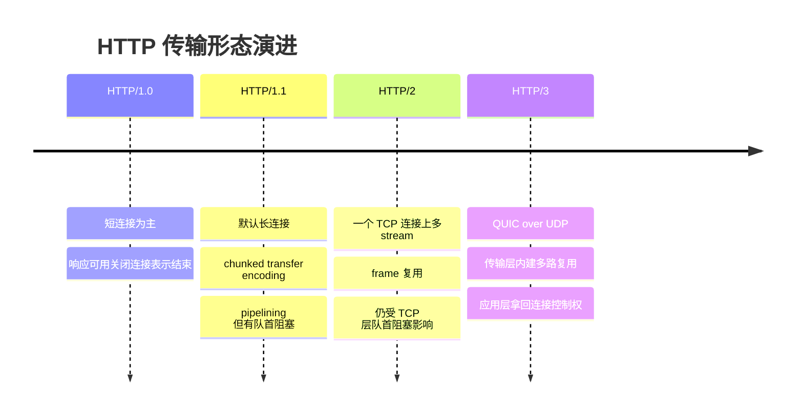

既然应用层基于传输层构建，那么http协议的底层就不必非得是tcp协议。能基于别的协议比如udp实现http吗？

> [透明多级分流系统-传输链路](https://icyfenix.cn/architect-perspective/general-architecture/diversion-system/transmission-optimization.html)

1. Table of Contents, ordered
{:toc}



# 现状
**一件事情看久了，就以为是理所当然的了**。人人都知道http是基于tcp的，这个世界上http+tcp在网络世界里是一种统治级的存在，那么**tcp真的适合http吗**？并不：
1. 从我们在网页上停留的时间可以知道，http传输对象的主要特征是：时间短、资源小、切换快；
2. 而tcp恰恰是一种与http的使用场景相悖的设计：
    1. **三次握手建立一个连接，大约需要百毫秒之后才能传输数据**；
    2. **慢启动，传输一段时间之后才开始加速**；

所以**tcp的设计理念和http的使用场景其实是有些相悖的：只有在长时间的尺度下，tcp建立连接的高昂成本才可以忽略不计，稳定性和可靠性的优势才能显现出来**。http基于tcp固然获得了稳定可靠的优势，但tcp并不完全适合http。

> 所谓“连接”，不过是个逻辑概念。client先告诉server我要给你发送数据，server同意，三次以后，才开始发，这样的话就认为往server的port上发的数据有人接收，是谓“连接”。这只是“二者之间仿佛有个连接”，但实际上，三次握手之后server依然可能挂掉，此时发过去的数据依然没人收。

## trick
既然tcp不完全适合http的使用场景，人们（尤其是和http关联最密切的前端）只好使用一些trick来基于tcp的特点优化http的性能——比如想尽办法复用连接，以减少tcp连接数，减少三次握手的次数：
1. 请求时将多张图片合并为一张sprite图：缺点是即使修改了一张小图，客户端缓存也会失效；
2. 合并多个异步请求：缺点是最慢的那个请求会影响所有请求的返回时间；

> trick之所以叫trick，是因为当用trick去解决一个问题时，会带来另一个问题，只能两害相权取其轻。否则它就不叫trick，而是一种标准的技术规范。**而这实际上意味着技术根基出了问题**。

## udp？
那http能基于udp吗？毕竟udp没有那么多连接开销。**可以，但与此同时，http便失去了tcp带来的稳定可靠的优势，就要在应用层面自己解决这些问题了。实际上http3就是这么干的，http3需要在应用层支持重传的问题。**

当然**如果根本不需要考虑丢包的问题（或者根本不在乎丢包的问题），直接用http+udp完全没有问题**，应用层也不需要改动，就用现在的http。最常见的例子是)UPnP（Universal Plug and Play，通用即插即用）。

[UPnP](https://en.wikipedia.org/wiki/Universal_Plug_and_Play)的使用场景是**家庭局域网**，用于接入家庭网络的设备（pc、打印机、wifi、小米插头、网关等）之间自动发现，即插即拔，完全不需要配置。

upnp有两类角色，很像client和server：UPnP control points (CPs) are devices which use UPnP protocols to control UPnP controlled devices (CDs)。CP使用http over udp通过多播（multicast，又称HTTPMU）给局域网发消息，收到消息的CD通过http over udp通过单播（unicast，又称HTTPU）回复消息。

> 不过httpmu和httpu的说法都过时了，已经并入upnp规范了。

upnp不能用于稍微大点儿的局域网（比如公司局域网），因为它不断通过httpmu发现设备，如果局域网内设备过多，就会太“聒噪”（chatty），消耗太多网络资源。

> UPnP is generally regarded as unsuitable for deployment in business settings for reasons of economy, complexity, and consistency: **the multicast foundation makes it chatty**, consuming too many network resources on networks with a large population of devices.

**也正因为它的使用场景是超小型的家庭局域网，网路本身相对可靠，所以基于udp发送http报文也是可以的，很少会丢包。**


## 总结
**tomcat等servlet容器在实现http协议的时候，直接底层用的就是tcp，根本就没有考虑udp，我们在使用的时候也不可能选择配置udp，最多配置一下tcp的端口等tcp相关的信息**。所以大家才会觉得http+tcp好像理所当然。

> 正如servlet也不是和http协议绑定的，但因为常用的是http，所以servlet常指http servlet。

假设tomcat提供了基于udp的http实现呢？

upnp的实现基于udp，而且**它根本不可能基于tcp，因为[tcp无法进行multicast](https://networkengineering.stackexchange.com/questions/16170/is-multicast-possible-in-tcp)**，而upnp协议里是需要multicast的。所以，**虽然传输层协议对应用层来说应该是透明的，但因为传输层协议之间并不像接口的不同实现一样可以完全相互取代，最终应用层的协议的特征（比如upnp的multicast功能）必须考虑底层所使用的协议**。

# HTTP1
http本身也考虑了连接开销的问题，所以http1.0就支持长连接（keep-alive），到了http1.1里长连接就成了默认行为。

长连接的本质：让客户端对同一个域名长期持有一个或多个不会用完即断开的tcp连接。

> 对同一个域名，现代浏览器一般只允许6个并发请求。

连接不关了，也带来了新的问题：
1. 怎么判断多个请求之间或者响应之间的分界？
2. 怎么判断哪个响应对应哪个请求？

## 多个连续请求/响应的分界
在不开启长连接的时候（一个请求+一个响应）：
1. 请求通过header里的`Content-Length`指定一个请求的结束；
2. **响应通过header里的`Content-Length`或者直接关闭tcp连接代表一个响应的结束**；

在[rfc1945 7.2](https://www.ietf.org/rfc/rfc1945)中规定，请求必须有length：
> HTTP/1.0 requests containing an
   entity body must include a valid Content-Length header field.

在7.2.2中规定，响应可以用length，也可以靠直接关闭连接表明结束：
> When an Entity-Body is included with a message, the length of that
   body may be determined in one of two ways. If a Content-Length header
   field is present, its value in bytes represents the length of the
   Entity-Body. Otherwise, the body length is determined by the closing
   of the connection by the server.

同时特意强调了，**request不能通过关闭流来表明自己结束了**，不然server会一脸懵逼：老哥我怎么把响应给你？
> Closing the connection cannot be used to indicate the end of a
   request body, since it leaves no possibility for the server to send
   back a response.

所以根据规定可以看出，通过`Content-Length`可以解决这一问题。但有些场景并不能提前知道content的length到底是多少，比如**即时压缩（on-the-fly compression）**：资源并没有提前压缩好放在server上，而是server在收到header为`Accept-Encoding: gzip`的request后，当场在内存中对资源进行压缩，“边压缩边发送”响应给client（`Content-Encoding: gzip`）。这样的话，server也不知道最终压缩完的content会有多大。**所以长连接和即时压缩在http1.0里是冲突的，只能开启一个**！

> 更早的时候，server性能比较差，为了同时支持请求压缩和不压缩资源的request，必须预压缩一份gz文件提前放到服务器上，所以又叫静态预压缩（static precompression）。那个时候length是可以提前知道的。

http1.1引入了**分块传输编码（chunked transfer encoding）**来解决这个问题：在header里声明`Transfer-Encoding: chunked`，之后就可以把body“一块一块”发给对方。块与块之间以本块内容的长度开始（十六进制），以空行结束。**最后一块的长度恒为0，代表没有了**。

[Wikipedia举的例子](https://en.wikipedia.org/wiki/Chunked_transfer_encoding)：
```bash
4\r\n        (bytes to send)
Wiki\r\n     (data)
6\r\n        (bytes to send)
pedia \r\n   (data)
E\r\n        (bytes to send)
in \r\n
\r\n
chunks.\r\n  (data)
0\r\n        (final byte - 0)
\r\n         (end message)
```
每一块分别是：
1. Wiki
2. pedia空格
3. in空格空行空行chunks.
4. 一个表明了长度为0的块

合起来内容就是：
```bash
Wikipedia in 

chunks.
```

所以**http1.1通过分块传输解决了即时压缩和长连接并存的问题**。

## 请求和响应的对应关系
http1.0虽然可以开启长连接，但是请求和响应必须一来一回，再一来一回，太慢了。http1.1引入了http pipelining，可以在连接上发一堆请求，再收一堆请求。请求与请求、响应与响应之间的分隔问题虽然解决了，该怎么判断哪个响应对应哪个请求呢？方案也很简单，第一个返回的响应就对应第一个请求。client维护一个FIFO队列，记录下当前在途的请求。server也维护一个FIFO队列。第一个返回的response一定对应队首的request。之后client第一个request出队，继续等下一个。

这么做最典型的问题就是**队首阻塞（head of line blocking）**：如果第一个请求不返回，后面的请求一定不会返回。但实际上后面的请求和之前的请求消耗的服务器资源未必相同，也许先被并发处理完了。**但是这种方案严格要求返回顺序，所以第一个不返回，后面的都不能返回**。


http2解决了该问题。

# HTTP2
**队首阻塞的根本原因是在http1中，请求是http传输的最小单位。在http2中，最小单位变成了帧（frame），一个frame可以用来表示各种数据**，比如：
- headers
- body
- 控制标识
    + 打开流
    + 关闭流

**流（stream）和连接（connection）一样，都只是逻辑上的概念。每个帧都带一个流id，来标记这些帧属于同一个数据流。因此，从逻辑上可以认为一个http连接上存在多个stream**。client可以以任意顺序收发帧，然后按照每个帧的流id重组出不同的request或response。因此说，http2能够**多路复用（multiplexing）**。

**有了多路复用，http2就可以只对每个域名维持一个tcp连接，并以任意顺序传输request/response的数据**。因此，client就不需要通过并发建立连接的方式来实现并发请求：
1. server端tcp连接数变少，压力变小；
2. client端无需刻意压缩合并多个请求，不再需要trick。浏览器也不用限制一个域名最多并发开6个连接；

> 纠正技术本身的缺陷之后，便不再需要trick。

http2通过多个stream实现了多路复用，加快了并发处理的速度，因此选择只和每个域名维持一个长连接，抛弃了http1时靠创建多个长连接带来的并发能力。**绝大部分情况下，http2一个长连接加上本身的多路复用能力，传输速度可以超过http1的多个长连接**。

但是注意这里的“以任意顺序传输request/response”指的是**从http层**来看，先发出的请求不一定要先收到response，没有了head of line的问题。但是**在传输层**，因为用了tcp协议，先发出去的tcp包如果没到，后发出去的tcp包即使被收到了，依然不能用，需要等到先发出的tcp包到达。这也是一种head of line blocking。而且，一旦先发出去的tcp包最终被认为丢了，连已经收到的后发的tcp包都要被重新发送。

**所以http2只解决了http层面的HOL blocking，没有解决tcp层面的HOL blocking。**

> **wikipedia称[tcp为另一种形式的head of line blocking**](https://en.wikipedia.org/wiki/HTTP)，这个观点确实很高屋建瓴了：to avoid the occasional (very rare) problem of TCP/IP connection congestion that can temporarily block or slow down the data flow of all its streams (another form of "head of line blocking").
>
> [甚至称之为设计缺陷（design flaw）](https://en.wikipedia.org/wiki/HTTP/2#TCP_head-of-line_blocking)：Although the design of HTTP/2 effectively addresses **the HTTP-transaction-level head-of-line blocking（http层面的HOL blocking，和我想的一样:D）** problem by allowing multiple concurrent HTTP transactions, **all those transactions are multiplexed over a single TCP connection, meaning that any packet-level head-of-line blocking（数据包层面的HOL blocking） of the TCP stream simultaneously blocks all transactions being accessed via that connection**. This head-of-line blocking in HTTP/2 is now widely regarded as a design flaw, and much of the effort behind QUIC and HTTP/3 has been devoted to reduce head-of-line blocking issues.
>
> tcp在这里确实成设计缺陷了……

**因此和http1相比，http2更适合传输多个小资源：因为小的request/response能更高效利用multiplexing**（大的不可分割的任务更不利于并发执行）。而传输多个大文件的话，http2大概率比http1慢：
1. http1能开多个连接，并发下载。而http2只有一个连接；
2. 最主要的原因：tcp HOL blocking降低了http层面多路复用的效率；

所以在[这个“HTTP/2 is the future of the Web, and it is here!”](https://http2.akamai.com/demo)的例子里，http2比http1快很多，主要原因就是请求的是多个小文件，多路复用效果明显。

## 实战：系统代理可用，Cursor Agent 为什么仍然发不出消息

多路复用不只用来并发下载静态资源，也适合 AI Agent 这种持续交互。一次 Agent 任务可能同时传输用户消息、模型 token、工具调用、工具结果、状态更新和心跳。Cursor 默认使用 **HTTP/2 双向流**承载这些事件：连接建立后，client 和 server 都能继续在同一个 stream 上发送 frame，不必每发生一个事件就重新建立一次请求。

这也带来了一个容易被普通连通性检查掩盖的工程条件：**client 和 server 之间的每个中间设备，都必须保留长连接和流式传输语义**。能访问服务器，只证明路径可达；能完成普通 HTTP 请求，也不代表代理能够实时转发双向 stream。

### 现象与第一层判断

一次实际故障中，macOS 已经开启 HTTP、HTTPS 和 SOCKS 系统代理，地址都是 `127.0.0.1:10080`；Cursor 的 `http.proxySupport` 也处于开启状态。但 Agent 发送消息后长时间没有响应，看起来像消息根本没有发出去。

先用系统命令确认代理配置：

```bash
scutil --proxy
```

再检查 Cursor 的连接，可以看到其网络服务确实与本地代理端口建立了 TCP 连接。通过代理和绕过代理访问 Cursor API，也都能收到正常的 HTTP 响应。这些证据排除了“系统代理没开”“代理端口不可达”和“Cursor 完全访问不了服务器”，但还没有验证**流式响应是否会被逐帧转发**。

### 关键证据：只有流式检查失败

Cursor 内置 Network Diagnostics 的结果把问题进一步缩小：

| 检查项 | 结果 | 能证明什么 |
| --- | --- | --- |
| DNS、SSL、API、Ping | 通过 | 域名解析、TLS 和普通请求均可用 |
| Chat | 失败：流式响应被代理缓冲 | server 发出的增量事件没有及时到达 client |
| Agent | 失败：HTTP/2 代理不支持双向流 | 同一 stream 上的双向持续通信无法正常工作 |

所以 UI 中的“发不出去”并不一定发生在发送阶段。消息可能已经到达 server，只是 client 一直收不到首个响应事件或确认，界面便持续等待；代理如果最后一次性吐出缓冲区，看起来就会像卡很久后突然出现整段回答。

```mermaid
sequenceDiagram
    participant C as Cursor
    participant P as 系统代理
    participant S as Cursor Server

    rect rgb(70, 35, 45)
        Note over C,S: HTTP/2 双向流失败
        C->>P: 打开 stream，发送用户消息
        P->>S: 转发请求
        S-->>P: token / 状态 / 工具调用 frame
        Note over P: 缓冲、降级，或无法保持双向 stream
        C->>P: 工具结果 / 心跳 frame
        Note over C: 长时间收不到首个事件，看起来像“没发出去”
    end

    rect rgb(35, 60, 45)
        Note over C,S: 切换 HTTP/1.1 SSE 后
        C->>P: 普通 HTTP 请求
        P->>S: 转发请求
        S-->>P: SSE 事件流
        P-->>C: 逐条转发事件
        Note over C: token 和状态持续出现
    end
```



代理之所以会产生这种差异，是因为普通 HTTPS 转发和 HTTP/2 双向流对中间设备的要求不同：

1. 普通请求只要完成一次 request/response 即可，代理晚一点交付完整 response，功能上仍可能“成功”；
2. 流式请求要求代理收到一部分数据就立刻转发，不能等 body 完整或缓冲区攒满；
3. HTTP/2 双向流还要求两个方向能同时持续传输 frame，并长期维护 connection、stream ID、流量控制和心跳状态；
4. 如果代理进行 TLS 解密检查，它还要重新建立上游 TLS/HTTP 连接。这个过程中可能降级协议、缓冲内容，或者只实现普通 HTTP/2 request/response，没有完整支持双向 streaming。

因此，`curl https://api.example.com` 返回 `200` 只是基础连通测试，无法验证 streaming。真正的测试应该持续发送多段数据，并观察响应是否也按预期间隔逐段返回。Cursor 的[网络配置文档](https://prod.cursor.com/docs/enterprise/network-configuration)也分别提供了 HTTP/1.1 SSE 和 HTTP/2 双向流测试：预期每秒出现一次输出；如果 5 秒后一次性出现，说明代理正在缓冲。

### 解决：降级传输形态，不是关闭 HTTPS

这个案例的兼容方案是：

1. 打开 `Cursor Settings -> Network`；
2. 将 `HTTP Compatibility Mode` 从 `HTTP/2` 改成 `HTTP/1.1`；
3. 重新加载或重启 Cursor；
4. 再运行 Network Diagnostics，确认 Chat 和 Agent 都通过。

切换后，Cursor 使用更容易穿过传统代理的 HTTP/1.1 SSE 模式。SSE 的主要数据方向是 server 持续向 client 推送事件；client 有新的消息或工具结果时，可以另发普通请求。它没有 HTTP/2 在同一 stream 上双向交换 frame 那么灵活，却更符合大量代理已经实现成熟的 HTTP/1.1 处理路径。

这里的“降级”只是改变 HTTPS 内部 HTTP 消息的承载方式，**不是关闭 TLS 加密**。HTTP/1.1 和 HTTP/2 都可以运行在 TLS 之上，安全性和协议版本不能简单画等号。

切换到 HTTP/1.1 并重新诊断后，原本失败的 Chat 和 Agent 检查全部通过，形成了完整的 A/B 验证链：

```text
HTTP/2：基础连通通过，流式检查失败
HTTP/1.1：基础连通通过，流式检查也通过
```

这比“重启之后碰巧好了”更能锁定根因：**故障点是代理对流式协议的实现，而不是 DNS、账号、服务器可达性或系统代理开关。**更彻底的方案是让代理对 Cursor 域名关闭响应缓冲和不兼容的 TLS 检查，或者升级为真正支持 HTTP/2 双向流、长连接和心跳的实现；无法改造代理时，HTTP/1.1 compatibility mode 是更稳妥的客户端规避方案。

### 别把代理卡流和模型慢混为一谈

本次排查中还有一条 Agent 请求最终成功，但首个 token 等了约 59 秒，其中模型提供方自身生成首 token 就用了约 51 秒。它说明“长时间没字”还可能来自 server 或模型排队，而不是代理。

两类问题可以这样区分：

- 基础检查通过，但 Chat/Agent streaming 检查失败：优先排查代理缓冲和协议兼容；
- streaming 检查通过，但日志显示 server/provider 的 time to first token 很长：优先判断模型负载或推理速度；
- DNS、TLS 或普通 API 已经失败：先解决更底层的解析、证书、路由或认证问题。

这个案例给 HTTP/2 多路复用补上了工程上的另一面：**一条连接承载更多并发流，减少了连接成本，也让这条连接和沿途代理的正确性变得更关键。**HTTP/2 的优势成立，需要中间网络设备不破坏 frame、stream 和实时转发语义。

## 总结
http2的优点可以总结如下：
- 用压缩的二进制表示http headers，相比文本节约了不少空间（很多http请求的header已经要比body大很多了）；
- 和一个域名之间只使用1个长连接，而不是2-8个；
- 多路复用，**一定程度上**解决head of line blocking（因为tcp可靠传输机制本身就可看做另一种HOL blocking，这一点只要基于tcp协议就无法避免，所以说“一定程度上解决了”）；
- server push：[Servlet - NIO & Async]()；
- 工程代价是中间代理必须正确支持长连接、frame 多路复用和流式转发；普通 HTTPS 可达不代表 HTTP/2 双向流可用；

# HTTP3
http2之所以更快，是因为多路复用更适合http协议的使用场景了：请求多个短小资源。而tcp的HOL blocking则极大地干扰了http2的多路复用能力。如何避免？那就不使用tcp！udp：正是在下！

> [HOL blocking](https://en.wikipedia.org/wiki/Head-of-line_blocking): If multiple independent higher-level messages are encapsulated and multiplexed onto a single reliable byte stream, then head-of-line blocking can cause **processing of a fully-received message that was sent later to wait for delivery of a message that was sent earlier**. This affects, for example, HTTP/2, which frames multiple request–response pairs onto a single stream; **HTTP/3, which has an application-layer framing design and uses datagram rather than stream transport, avoids this problem.**

于是Google设计了基于udp的**QUIC（quick udp internet connection），快速udp网络连接**，提交给了IETF，最终IETF推出了**http3，http over quic**。

> google有能力推出，因为它在client端有chrome和android，在市场上有巨大的份额，可以让自己的server（youtube.com、google.com）和client端同时加入对http3的支持。

既然底层是udp，传输层不负责可靠传输，那就只能由应用层来做这件事了，由http3自己来控制失败重传。*

> tcp HOL blocking虽然影响http2 multiplexing，但是同时带来的好处就是可靠传输。既然http3弃用tcp以避免HOL blocking，那也同时把可靠传输的优点拒之门外了。

另外http3针对当前移动设备盛行的局面做了一些专门的支持，比如网络切换：如果是tcp协议，所有连接都会超时断开，之后再重建连接。**quic则用连接标识符标记连接（而不是ip地址），当网络环境切换导致连接断开后，client把连接标识符重新发给server即可使用新的ip重用已有连接**。

# 感想
http over udp，不知道当初学http的时候有没有想过这个问题。似乎我从不曾想过这个问题，大概是学艺不精，在看到http+tcp独领风骚的时候，甚至丧失了质疑的能力。

再者，2015年google将quic提交ietf的时候（同时http2正式推出），我正忙于学习计算机网络，那时候完全没注意到这些东西。2018年http3的概念正式推出的时候，也是刚毕业忙于适应新工作，也没有注意到这些东西。想来想去，只有强大了才能有所感触，只有闲下来了才能有所思考。好在http3在2022年才正式推出，现在了解还不算晚。顺便再立个flag，等着迎接http4吧，到时候不会再错过了。

> http这个二十年没动过的东西，怎么一到我这儿就开始疯狂迭代了……Java也是……嫌我学的快？

最后继续感慨一下[《凤凰架构》](https://icyfenix.cn/)这本书太强了，讲起东西来高屋建瓴，来龙去脉历史渊源介绍的清清楚楚，学起来非常自然。而之前http各个版本碎片化的知识快把我看懵逼了:(

> 书籍是人类进步的阶梯，哪怕自己没有思考的能力，也可以围观一下别人思考的结果。看多了，变强了，知识底蕴丰厚了，自己自然也能思考起来了。
