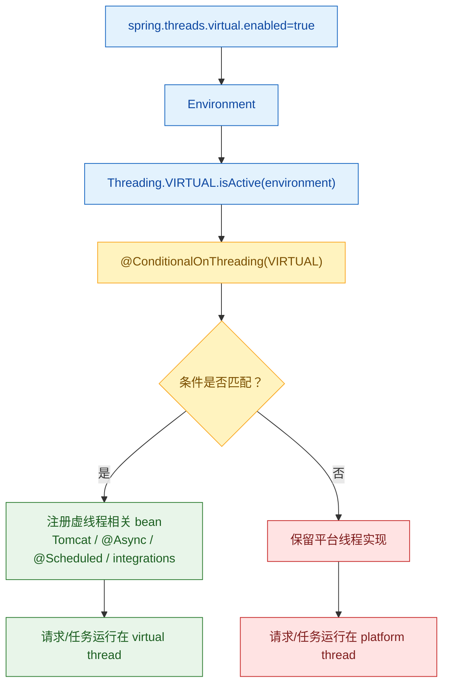

Spring Boot 3.2 开始，可以通过 `spring.threads.virtual.enabled: true` 为许多组件开启虚线程支持，包括：
- Tomcat will use virtual threads for HTTP request processing. This means that your application code that is handling a web request, such as a method in a controller, will run on a virtual thread.
- When calling `@Async` methods, Spring MVC’s asynchronous request processing, and Spring WebFlux’s blocking execution support will now utilize virtual threads
- Methods marked with `@Scheduled` will be run on a virtual thread
- Also, some specific integrations will work on virtual threads like RabbitMQ/Kafka listeners, and Spring Data Redis/Apache pulsar-related integrations...

这些能力看起来像一个全局开关，但落到实现上，仍然是 Spring Boot 擅长的自动配置和条件注解：环境里启用了虚线程，匹配虚线程条件的配置类或 bean 才会生效。

1. Table of Contents, ordered
{:toc}

本文先看 `spring.threads.virtual.enabled` 如何映射到 `Threading`，再看 `@ConditionalOnThreading` 如何复用 Spring 的 `@Conditional` 机制，最后用 Redis 和 Tomcat 两个配置例子说明 Spring Boot 是怎样把普通线程实现替换成虚线程实现的。

虚线程支持看起来是一个开关，但实现上仍然走 Spring Boot 的条件装配：



# 配置：`Threading`
设置`spring.threads.virtual.enabled: true`，控制的是springboot 3.2引入的`Threading` enum：
```java
/**
 * Threading of the application.
 *
 * @author Moritz Halbritter
 * @since 3.2.0
 */
public enum Threading {

	/**
	 * Platform threads. Active if virtual threads are not active.
	 */
	PLATFORM {

		@Override
		public boolean isActive(Environment environment) {
			return !VIRTUAL.isActive(environment);
		}

	},
	/**
	 * Virtual threads. Active if {@code spring.threads.virtual.enabled} is {@code true}
	 * and running on Java 21 or later.
	 */
	VIRTUAL {

		@Override
		public boolean isActive(Environment environment) {
			return environment.getProperty("spring.threads.virtual.enabled", boolean.class, false)
					&& JavaVersion.getJavaVersion().isEqualOrNewerThan(JavaVersion.TWENTY_ONE);
		}

	};

	/**
	 * Determines whether the threading is active.
	 * @param environment the environment
	 * @return whether the threading is active
	 */
	public abstract boolean isActive(Environment environment);

}
```
此时`VIRTUAL#isActive`会是true，`PLATFORM#isActive`则是false。

该方法在`OnThreadingCondition`里被调用：
```java
/**
 * {@link Condition} that checks for a required {@link Threading}.
 *
 * @author Moritz Halbritter
 * @see ConditionalOnThreading
 */
class OnThreadingCondition extends SpringBootCondition {

	@Override
	public ConditionOutcome getMatchOutcome(ConditionContext context, AnnotatedTypeMetadata metadata) {
		Map<String, Object> attributes = metadata.getAnnotationAttributes(ConditionalOnThreading.class.getName());
		Threading threading = (Threading) attributes.get("value");
		return getMatchOutcome(context.getEnvironment(), threading);
	}

	private ConditionOutcome getMatchOutcome(Environment environment, Threading threading) {
		String name = threading.name();
		ConditionMessage.Builder message = ConditionMessage.forCondition(ConditionalOnThreading.class);
		if (threading.isActive(environment)) {
			return ConditionOutcome.match(message.foundExactly(name));
		}
		return ConditionOutcome.noMatch(message.didNotFind(name).atAll());
	}

}
```
由[@Conditional]()可知，**`Condition`类用于搭配`@Conditional`注解**，所以`OnThreadingCondition`类其实是为了和`@Conditional`注解一起构建出新的注解`@ConditionalOnThreading`：
```java
/**
 * {@link Conditional @Conditional} that matches when the specified threading is active.
 *
 * @author Moritz Halbritter
 * @since 3.2.0
 */
@Target({ ElementType.TYPE, ElementType.METHOD })
@Retention(RetentionPolicy.RUNTIME)
@Documented
@Conditional(OnThreadingCondition.class)
public @interface ConditionalOnThreading {

	/**
	 * The {@link Threading threading} that must be active.
	 * @return the expected threading
	 */
	Threading value();

}
```
它接受的参数是`Threading`。

> **注解的名字叫conditional on什么，接受的参数就是什么！**

所以想对某个配置开启只有虚线程的条件注解，只需要在其上添加`@ConditionalOnThreading(Threading.VIRTUAL)`即可。

# 条件注解：`@ConditionalOnThreading(Threading.VIRTUAL)`
比如jedis，如果使用os线程，就创建一个普通的connection factory：
```java
	@Bean
	@ConditionalOnThreading(Threading.PLATFORM)
	JedisConnectionFactory redisConnectionFactory(
			ObjectProvider<JedisClientConfigurationBuilderCustomizer> builderCustomizers) {
		return createJedisConnectionFactory(builderCustomizers);
	}
```
如果开启虚线程，connection factory就使用自定义的executor，这个executor在创建线程时，使用的是虚线程：
```java
	@Bean
	@ConditionalOnThreading(Threading.VIRTUAL)
	JedisConnectionFactory redisConnectionFactoryVirtualThreads(
			ObjectProvider<JedisClientConfigurationBuilderCustomizer> builderCustomizers) {
		JedisConnectionFactory factory = createJedisConnectionFactory(builderCustomizers);
		SimpleAsyncTaskExecutor executor = new SimpleAsyncTaskExecutor("redis-");
		executor.setVirtualThreads(true);
		factory.setExecutor(executor);
		return factory;
	}
```
**只是苦了springboot，原本的一份自动配置现在变成了两份**，很多支持虚线程的组件，配置都要翻倍了……

也有不是两份配置的。比如tomcat的虚线程处理http请求，其实是创建一个自定义的customizer：
```java
		@Bean
		@ConditionalOnThreading(Threading.VIRTUAL)
		TomcatVirtualThreadsWebServerFactoryCustomizer tomcatVirtualThreadsProtocolHandlerCustomizer() {
			return new TomcatVirtualThreadsWebServerFactoryCustomizer();
		}
```
该customizer会配置web server factory使用virtual thread executor：
```java
/**
 * Activates {@link VirtualThreadExecutor} on {@link ProtocolHandler Tomcat's protocol
 * handler}.
 *
 * @author Moritz Halbritter
 * @since 3.2.0
 */
public class TomcatVirtualThreadsWebServerFactoryCustomizer
		implements WebServerFactoryCustomizer<ConfigurableTomcatWebServerFactory>, Ordered {

	@Override
	public void customize(ConfigurableTomcatWebServerFactory factory) {
		factory.addProtocolHandlerCustomizers(
				(protocolHandler) -> protocolHandler.setExecutor(new VirtualThreadExecutor("tomcat-handler-")));
	}

	@Override
	public int getOrder() {
		return TomcatWebServerFactoryCustomizer.ORDER + 1;
	}

}
```
该executor是tomcat提供的用于支持Java21的组件。

# 正向梳理
再正向梳理一遍 Spring Boot 对虚线程的条件注解支持流程：
1. 需要一个`@ConditionOn线程类型`注解：传入虚线程，就构造虚线程bean；传入os线程，就构造os线程bean：
    1. 注解的名字就叫`@ConditionalOnThreading`吧；
    2. 能配置的值没有使用string，而是使用了自定义对象`Threading`。`Threading`支持从当前环境变量读取配置，看看配置的到底是什么线程类型；
2. 为`@ConditionalOnThreading`创建出一个`OnThreadingCondition`，它的任务是从`@ConditionalOnThreading`读取`Threading`配置，并判断当前环境变量配置是否符合该`Threading`参数：
    1. 如果符合就返回true，代表可以创建该bean
    2. 否则返回false

之后就可以在可以支持不同线程类型的配置上加上相关条件注解了。

# 感想
虚线程支持并不是在底层偷偷替换所有线程池，而是通过条件自动配置逐个组件接入。这样做需要维护平台线程和虚线程两套配置，但换来的好处是行为清晰：哪个组件支持虚线程、如何启用、如何回退，都能从自动配置代码里追踪出来。
