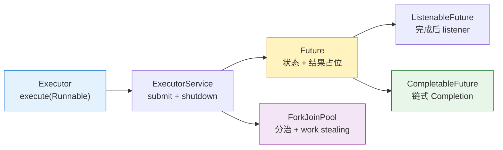

关于异步执行的所有：

1. 介绍`Executor`：[线程执行器（Executor）和线程池]()
2. 介绍`Future`和`ExecutorService`（主要是submit），因为它执行任务用的还是`Executor#execute`：[线程执行服务：`ExecutorService`]()
3. 介绍`ListenableFuture`，因为它依托于`FutureTask`在执行完任务后的回调机制，回调其他listener：[guava ListenableFuture]()
4. 介绍`CompletableFuture`，因为它就是封装后带listener的任务，只不过任务不再显式提交：[CompletableFuture]()
5. 介绍`ForkJoinPool`：[ForkJoinPool]()
