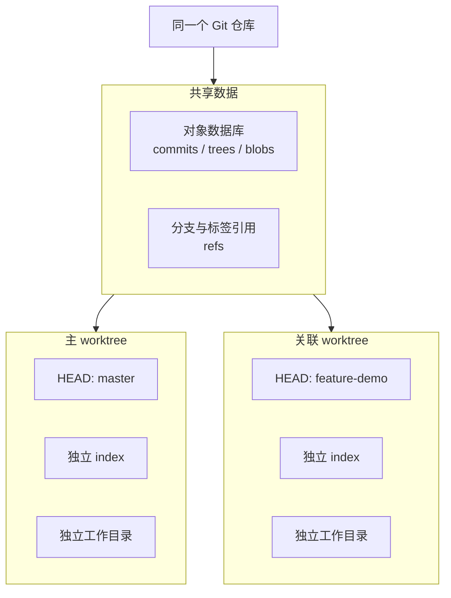
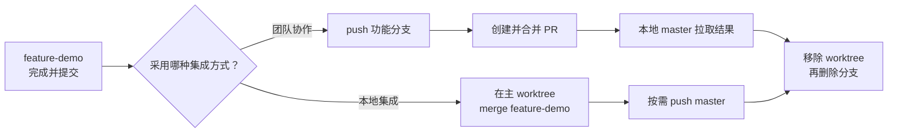

## 核心

**`git worktree` 解决的是“同时在多个目录检出不同分支”的问题，不负责推送分支、创建 Pull Request 或把功能分支合并回 `master`。** 开发完成后，仍然要选择远程 PR 或本地 `git merge` 完成集成，最后再分别清理 worktree、分支和远程分支。

本文整理自一次空仓库中的本地实操，并根据 Git 官方的 [`git-worktree`](https://git-scm.com/docs/git-worktree)、[`git-merge`](https://git-scm.com/docs/git-merge) 与 [`git-push`](https://git-scm.com/docs/git-push) 文档补全了后续流程。原始实验很好地展示了 worktree 的基本操作，但空仓库触发的 `orphan` 分支属于特殊情况，不能代表日常项目的默认行为。

下文沿用原始实验中的默认分支名 `master`；如果仓库使用 `main`，替换命令中的分支名即可。

1. Table of Contents, ordered
{:toc}

## Worktree 把“切换分支”变成“切换目录”

普通 Git 工作流通常在一个目录里反复执行 `git switch`。如果当前修改尚未提交，切换分支前还可能需要提交或 `git stash`。Worktree 则允许同一个仓库同时拥有多个工作目录，每个目录检出不同的分支。



多个 worktree **共享 Git 对象和分支引用**，但各自拥有独立的工作目录、`HEAD` 和暂存区。因此，在功能目录里产生的未提交修改不会出现在主目录中；一旦提交，所有 worktree 又都能立即看到对应的 commit 和分支引用。

需要先区分三个容易混在一起的对象：

- **worktree** 是本地工作目录，可以创建和删除；
- **branch** 是指向 commit 的引用，删除 worktree 不会自动删除分支；
- **Pull Request** 是 GitHub、GitLab 等托管平台提供的协作流程，Git 本身不会因为创建了 worktree 而自动生成 PR。

Git 通常也不允许同一个本地分支同时被两个 worktree 检出。这项保护可以避免两个目录同时修改同一分支而造成混乱。

## 从零创建并使用一个 worktree

### 查看现有 worktree

```bash
$ git worktree list
/Users/puppylpg/Codes/claude/gitworktree  0000000 [master]
```

初始状态只有主 worktree，它位于 `gitworktree` 目录并指向 `master`。这里显示 `0000000`，是因为实验仓库还没有任何 commit，`master` 只是一个尚未诞生的分支（unborn branch）。

### 创建新目录和新分支

```bash
$ git worktree add ../gitworktree-feature -b feature-demo
没有可用的源分支，将基于 '--orphan' 选项进行推断
准备工作区（新分支 'feature-demo'）
```

这条命令同时完成两件事：

1. 创建本地分支 `feature-demo`；
2. 创建关联 worktree `../gitworktree-feature`，并在其中检出该分支。

再次查看，可以看到两个目录分别关联两个分支：

```bash
$ git worktree list
/Users/puppylpg/Codes/claude/gitworktree          0000000 [master]
/Users/puppylpg/Codes/claude/gitworktree-feature  0000000 [feature-demo]
```

在日常项目中，`master` 通常已经存在 commit。为了明确新分支从哪里开始，更推荐写出起点：

```bash
git worktree add -b feature-demo ../gitworktree-feature master
```

若要检出已经存在、且尚未被其他 worktree 占用的分支，则不使用 `-b`：

```bash
git worktree add ../gitworktree-feature feature-demo
```

### 在新 worktree 中独立开发

进入新目录后，提交方式与普通仓库完全相同：

```bash
$ cd ../gitworktree-feature
$ echo "# Feature Demo" > README.md
$ git add README.md
$ git commit -m "Add README for feature demo"
[feature-demo（根提交） e30fbc5] Add README for feature demo
 1 file changed, 1 insertion(+), 0 deletions(-)
 create mode 100644 README.md
```

此时 `feature-demo` 已经指向新 commit，而空的 `master` 仍没有 commit：

```bash
$ git worktree list
/Users/puppylpg/Codes/claude/gitworktree          0000000 [master]
/Users/puppylpg/Codes/claude/gitworktree-feature  e30fbc5 [feature-demo]
```

这里的 commit 只存在于本地共享仓库中。**没有执行 `git push`，远程仓库就看不到它；没有在托管平台创建 PR，也就不会凭空出现 PR。**

## 开发完成后有两条集成路径

Worktree 与代码如何进入 `master` 没有绑定关系。团队协作通常走远程 PR；个人仓库或本地实验也可以直接合并。



### 路径一：推送分支并创建 PR

先在功能 worktree 中确认修改已经提交，然后显式推送分支：

```bash
cd ../gitworktree-feature
git status
git push -u origin feature-demo
```

`-u` 会把本地 `feature-demo` 与远程 `origin/feature-demo` 建立跟踪关系。推送成功后，还需要在 GitHub、GitLab 等平台上创建 PR；也可以使用平台对应的 CLI。**`git worktree add` 和 `git push` 都不会自动创建 PR。**

PR 合并后，回到检出 `master` 的主 worktree，同步远程结果：

```bash
cd ../gitworktree
git pull --ff-only origin master
```

确认代码和测试结果没有问题后，再清理本地工作目录与分支：

```bash
git worktree remove ../gitworktree-feature
git branch -d feature-demo
```

许多托管平台可以在 PR 合并后自动删除远程功能分支。如果没有自动删除，可以手动执行：

```bash
git push origin --delete feature-demo
```

如果 PR 使用了 **squash merge** 或 **rebase merge**，远程 `master` 中的 commit ID 会与本地功能分支不同。即使改动已经进入 `master`，`git branch -d feature-demo` 仍可能因为无法确认祖先关系而拒绝删除。此时应先核对 PR 状态和最终代码，再明确使用：

```bash
git branch -D feature-demo
```

### 路径二：在本地合并回 master

本地合并要在检出 `master` 的主 worktree 中执行。功能分支可以继续被另一个 worktree 检出，不妨碍 `master` 合并它；但功能目录中的修改必须先提交。

```bash
# 在功能 worktree 中确认工作区干净
cd ../gitworktree-feature
git status

# 回到主 worktree，先同步 master
cd ../gitworktree
git pull --ff-only origin master

# 将本地功能分支合并进当前的 master
git merge feature-demo
```

如果 `master` 在功能开发期间没有产生新 commit，默认合并通常会直接 **fast-forward**（只把 `master` 指针前移）。如果两个分支都继续开发，Git 会尝试创建 merge commit；出现冲突时，解决文件冲突并 `git add` 后执行 `git merge --continue`，或者用 `git merge --abort` 放弃本次合并。

不同项目也可以主动约束历史形态：

```bash
# 只接受线性历史；无法 fast-forward 时直接失败
git merge --ff-only feature-demo

# 即使可以 fast-forward，也保留一个明确的 merge commit
git merge --no-ff feature-demo
```

合并后应先运行项目测试。若还要把结果发布到远程，并且仓库允许直接更新 `master`，再执行：

```bash
git push origin master
```

受保护的 `master` 往往禁止直接推送，这类仓库应使用前面的 PR 流程。确认合并结果安全后，按“先 worktree、后分支”的顺序清理：

```bash
git worktree remove ../gitworktree-feature
git branch -d feature-demo
```

原始实验中的 `master` 是空分支，而 `feature-demo` 上的第一个 commit 是根提交。在这种特殊状态下，从主 worktree 执行 `git merge feature-demo` 可以让 `master` 直接指向该根提交。为了避免让 `orphan`、unborn branch 等边缘概念干扰对 worktree 的理解，实际练习时最好先在 `master` 创建一次初始提交，再创建功能 worktree。

## 删除 worktree 不等于删除开发成果

`git worktree remove` 删除的是关联工作目录及其管理信息，不会自动删除其中检出的分支，更不会撤销已经产生的 commit。

```bash
git worktree remove ../gitworktree-feature
```

Git 默认只允许删除干净的 worktree。如果目录中还有未提交修改或未跟踪文件，命令会拒绝执行。虽然可以使用 `--force`，但这可能直接丢失尚未保存的文件，因此应先检查：

```bash
git -C ../gitworktree-feature status
```

另一个常见误区是直接使用文件管理器或 `rm` 删除 worktree 目录。这样会留下仓库内部的管理记录，应使用下面的命令清理失效引用：

```bash
git worktree prune
```

正常情况下优先使用 `git worktree remove`，`prune` 主要用于目录已被手动删除后的善后。对于位于移动硬盘或临时断开的网络盘中的 worktree，可以使用 `git worktree lock <路径>` 防止它被误判为失效；重新可用后再执行 `git worktree unlock <路径>`。

## 常用命令与适用场景

| 命令 | 作用 |
| --- | --- |
| `git worktree list` | 列出主 worktree 和所有关联 worktree |
| `git worktree add -b <分支> <路径> <起点>` | 从指定 commit 或分支创建新分支和 worktree |
| `git worktree add <路径> <已有分支>` | 在新 worktree 中检出已有分支 |
| `git worktree remove <路径>` | 移除干净的关联 worktree |
| `git worktree prune` | 清理工作目录已经消失的失效管理记录 |
| `git worktree lock <路径>` | 防止 worktree 被移动、删除或自动清理 |
| `git worktree unlock <路径>` | 解除锁定 |

Worktree 最适合需要**同时保留多个工作现场**的场景：

1. 开发新功能时，为紧急修复创建独立的 hotfix 目录；
2. 在一个目录运行耗时测试，同时在另一个目录继续开发；
3. 同时维护多个长期分支，避免频繁切换和反复安装依赖；
4. 并排比较两个分支的行为或构建产物。

相比重复 `git clone`，worktree 共享对象数据库，创建更快、占用空间更少，所有目录也能立即看到本地分支引用的变化。代价是这些目录并非彼此完全独立：删除分支、重写历史或执行清理命令时，必须意识到其他 worktree 也连接着同一个仓库。

## 评价

### 写得好的地方

原始记录保留了 `git worktree list`、`add`、提交和 `remove` 的真实输出，用很短的路径展示了“一个仓库、两个目录、两个分支”的直观效果。它还准确抓住了并行开发、紧急修复和对比测试等典型场景，也指出了 worktree 相比多次 clone 在空间和创建速度上的优势。

### 可以改进的地方

原始记录在提交功能分支后直接进入 worktree 清理，缺少“开发成果如何进入 `master`”这一段完整生命周期，容易让读者误以为新分支会自动推送或产生 PR。实际上，本地分支、远程分支、PR 和 worktree 是四个相互关联但彼此独立的对象，必须分别操作。

此外，空仓库触发的 `orphan` 行为会让第一次接触 worktree 的读者同时面对根提交和未诞生分支等额外概念。保留这段输出有助于解释原实验，但常规教程应以已有初始提交的仓库为主线，再把空仓库作为边界情况说明。清理部分也应明确 `remove` 不删除分支、脏 worktree 默认无法移除，以及 squash/rebase 合并后 `git branch -d` 可能拒绝删除等实际风险。
