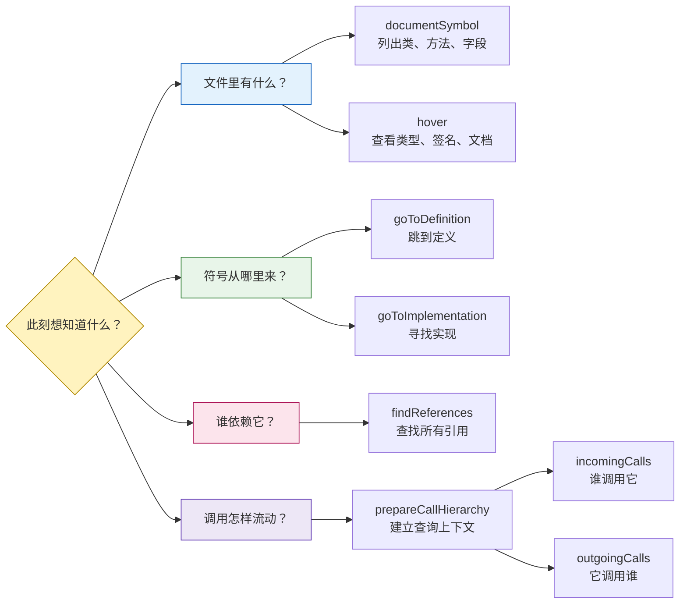
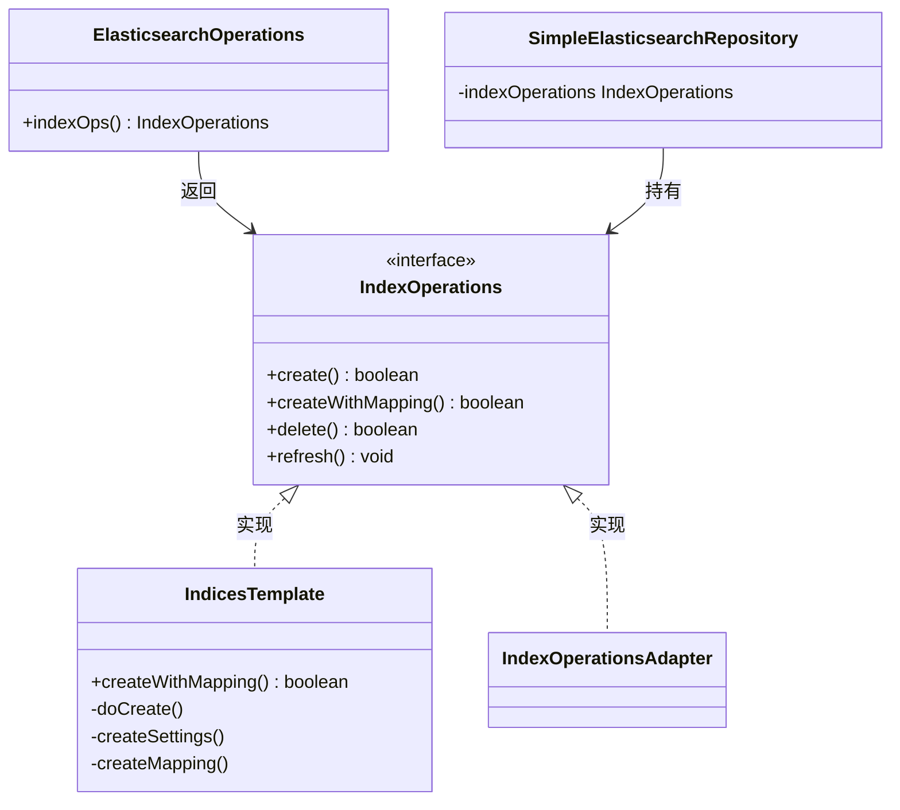
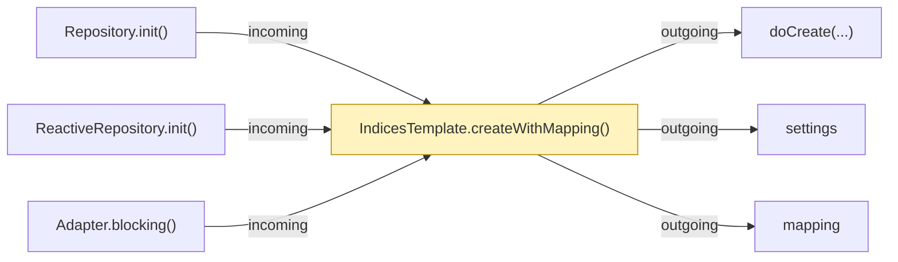
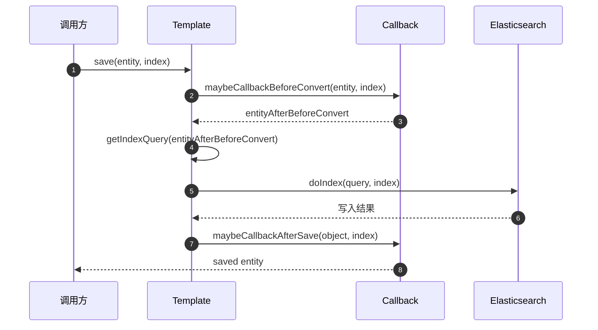
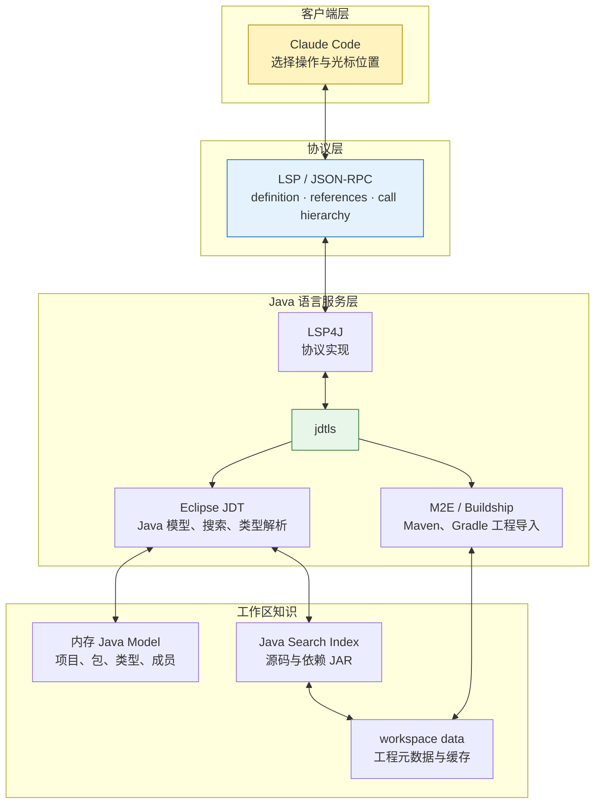
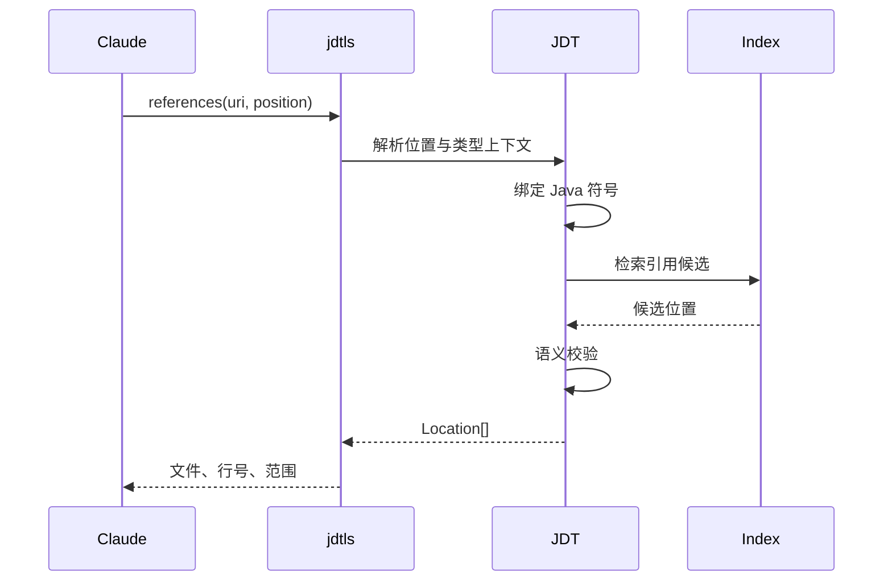
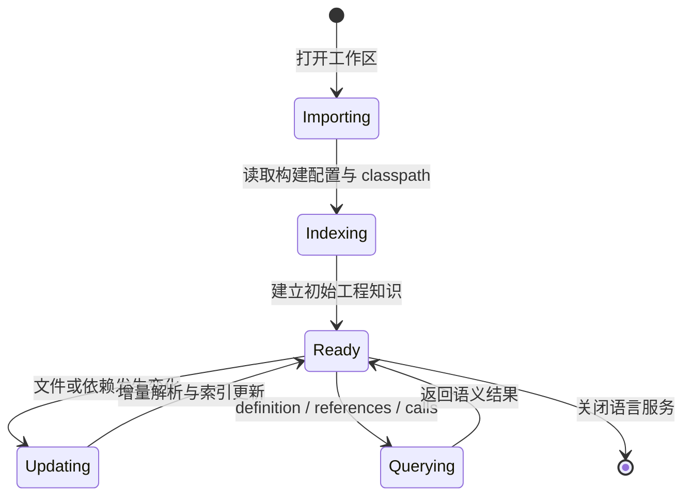
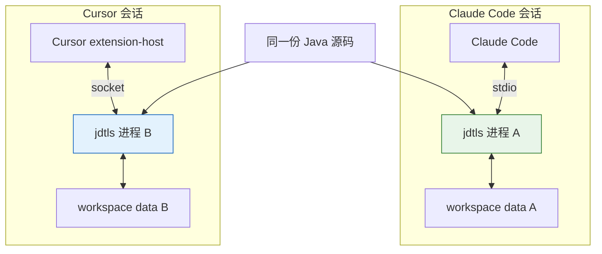

面对一个陌生 Java 仓库，真正费时间的通常不是“打开文件”，而是回答这些问题：

- 这个接口有哪些实现？
- 改掉这个方法会影响谁？
- 一次 `save()` 最终经过哪些步骤？
- 两个同名方法里，我看到的 `save` 到底指哪一个？

文本搜索只能告诉你“这几个字符出现在哪里”；LSP 能告诉你“**这个符号**定义在哪里、由谁实现、被谁引用、调用了谁”。本文用 Spring Data Elasticsearch 做一次完整实测：先把 Claude Code 的 8 种 LSP 操作放进一张地图，再用两个真实类走完代码导航，最后拆开 jdtls，看看这些结果究竟从哪里来。

> 一句话结论：**Claude Code 负责提问，jdtls 负责理解 Java；LSP 是两者之间的标准通信协议。**

1. Table of Contents, ordered
{:toc}

# 先建立地图：8 种操作到底在回答什么

不要把 8 个操作背成一串命令。它们本质上只回答四类问题：



这张图也给出了阅读陌生代码的自然顺序：

1. 用 `documentSymbol` 看轮廓，不要一上来逐行读；
2. 用 `goToDefinition` / `goToImplementation` 找到真正干活的代码；
3. 用 `findReferences` 和 `incomingCalls` 判断改动影响；
4. 用 `outgoingCalls` 沿着执行方向继续下钻。

# 演示一：从一个接口看懂整张关系网

先选结构简单的 `IndexOperations`。它是 Spring Data Elasticsearch 的索引管理接口，包含创建、删除、刷新、映射和别名等操作。

## 第一步：用符号树代替滚动阅读

```text
documentSymbol — IndexOperations.java

IndexOperations
├── create(): boolean
├── create(Map): boolean
├── createWithMapping(): boolean
├── delete(): boolean
├── exists(): boolean
├── refresh(): void
├── createMapping(): Document
├── putMapping(Document): boolean
├── getMapping(): Map
└── alias(AliasActions): boolean
    ...共 15+ 个方法
```

`documentSymbol` 像一张文件目录：先隐藏方法体，只暴露类、字段和方法的层级。对于几百上千行的类，这通常比从第一行开始读更有效。

接着把光标放到 `createWithMapping()` 上执行 `hover`：

> `boolean createWithMapping()` — Create an index with the settings and mapping defined for the entity this `IndexOperations` is bound to.

不用跳走，就能看到完整签名与 Javadoc。**`documentSymbol` 负责广度，`hover` 负责原地补充细节。**

## 第二步：从接口跳到定义与实现

| 光标位置 | 操作 | 返回结果 |
| --- | --- | --- |
| `Document` 类型 | `goToDefinition` | `core.document.Document` |
| `IndexOperations` 接口 | `goToImplementation` | `IndicesTemplate`、`IndexOperationsAdapter` |

此时我们已经从“一个接口文件”扩展出一张类型关系图：



`goToDefinition` 与 `goToImplementation` 看起来只差一个词，方向却完全不同：

| 操作 | 方向 | 典型问题 |
| --- | --- | --- |
| `goToDefinition` | 使用处 → 定义处 | “这个类型或方法是谁声明的？” |
| `goToImplementation` | 抽象类型 → 具体实现 | “接口背后真正执行的是哪几个类？” |

## 第三步：从类型关系进入依赖关系

对接口执行 `findReferences`，结果同时覆盖三种使用方式：

- `ElasticsearchOperations.indexOps()`：作为方法返回类型；
- `SimpleElasticsearchRepository`：作为字段类型；
- `IndexOperationsAdapter`：作为父接口。

这一步回答的是“**哪些位置使用了这个符号**”，它比实现关系更宽：方法签名、字段声明、继承关系和普通表达式引用都可能出现。

接着把焦点放到实现方法 `IndicesTemplate.createWithMapping()` 上，调用层级会给出两个相反方向：



- `incomingCalls` 从目标方法向左看：**谁会走到这里**；
- `outgoingCalls` 从目标方法向右看：**这里接下来会调用谁**；
- `prepareCallHierarchy` 是调用层级协议的准备步骤，先把当前位置解析成可查询的调用项，再分别向上或向下展开。

一张图就把业务语义带了出来：Repository 初始化会触发 `createWithMapping()`，而它继续创建 settings、mapping 并最终建索引。

# 演示二：在 875 行核心类上看 LSP 的价值

小接口适合认识操作，大类才能体现导航效率。`AbstractElasticsearchTemplate` 是 875 行的核心抽象基类，包含保存、查询、删除、更新和 Point in Time 等 30 多个方法。

| 观察项 | LSP 结果 | 读者得到什么 |
| --- | ---: | --- |
| 文件轮廓 | 5 个字段、2 个构造器、30+ 个方法 | 不读方法体也能先定位入口 |
| 类型引用 | 12 处 | 快速判断抽象类的覆盖范围 |
| `save(T)` 调用方 | Repository 的 `save` / `saveAll` | 找到生产流量入口 |
| `save(T, IndexCoordinates)` 下游 | 4 个关键调用 | 还原完整保存生命周期 |

## 向上看：谁把流量送进 save

`incomingCalls` 显示，`SimpleElasticsearchRepository.save(S)` 与 `saveAll(Iterable<S>)` 都会进入 `AbstractElasticsearchTemplate.save(T)`。

如果准备修改 `save(T)`，这就是第一批需要检查的生产调用方。`findReferences` 会给出更广的符号使用面，`incomingCalls` 则专注于“哪些方法实际调用了它”。

## 向下看：一次保存经历什么

对重载方法 `save(T, IndexCoordinates)` 执行 `outgoingCalls`，得到四个关键步骤：



原始的四行方法名只是“清单”；时序图进一步表达了**执行顺序、参与者和中间数据**：

> `before-callback → 构建 IndexQuery → 写入 Elasticsearch → after-callback`

这正是可视化应该承担的任务：不是把文字换成方框，而是显露文字列表里不直观的关系。

# 为什么 LSP 比 grep 更懂代码

假设仓库里同时存在这些内容：

```java
repository.save(user);
template.save(document);
log.debug("save finished");
// remember to save metrics
```

搜索文本 `save` 会命中四行；而对 `repository.save(user)` 执行 `findReferences`，目标是类型解析后绑定的**那个方法符号**。字符串、注释和另一个类型的同名方法不会因为“长得一样”就混进结果。

| 能力 | grep / 文本搜索 | LSP |
| --- | --- | --- |
| 判断同名方法是否为同一符号 | 不能 | 能 |
| 理解重载、继承、接口实现 | 不能 | 能 |
| 找注释与字符串 | 能 | 通常不是目标 |
| 无需完整工程配置即可工作 | 能 | 不一定 |
| 速度与适用范围 | 任意文本，简单直接 | 语义查询，依赖语言服务 |

所以它们不是互相替代：

- **找字面量、错误码、配置键**：grep 更直接；
- **找定义、实现、引用与调用关系**：LSP 更精确；
- **工程尚未成功导入，classpath 一团糟**：先用 grep 找线索，再修复语言服务环境。

# jdtls 在背后做了什么

[LSP](https://microsoft.github.io/language-server-protocol/) 只规定客户端和语言服务器如何用 JSON-RPC 通信，并不亲自理解 Java。真正提供 Java 语义的是 [Eclipse JDT Language Server](https://github.com/eclipse-jdtls/eclipse.jdt.ls)，也就是 jdtls。

在本文场景里，各层分工如下：



这里需要纠正一个很容易流传开的简化说法：**jdtls 并不是启动时把整个仓库解析成一棵巨大 AST，再把完整引用图和调用图全部常驻内存。**

更准确的理解是：

- Eclipse JDT 用[内存 Java Model](https://help.eclipse.org/latest/topic/org.eclipse.jdt.doc.isv/guide/jdt_int_model.htm)表示项目、包、类型和成员等结构；
- Java Search 为源码与依赖 JAR 建立索引，并在资源变化时[后台保持索引更新](https://help.eclipse.org/latest/topic/org.eclipse.jdt.doc.user/concepts/concept-java-search.htm)；
- jdtls 的 `-data` 目录保存工作区相关信息，官方要求不同 workspace 使用独立目录；
- 具体查询仍可能结合当前位置的语法树、类型绑定和索引候选做解析，而不是简单读取一张预先算好的“万能调用图”。

## 一次 references 查询的真实路径

当 Claude Code 在某个方法名上请求 `findReferences`，可以把过程理解为：



查询快，核心不是“LSP 有魔法”，而是**昂贵的工程导入与索引维护被提前做了，单次请求只需围绕已经绑定的符号缩小搜索范围**。

## 8 种操作背后的信息来源

| 操作 | 主要依赖的信息 | 最适合回答 |
| --- | --- | --- |
| `documentSymbol` | 当前编译单元结构、Java Model | 文件里有哪些成员？ |
| `hover` | 类型绑定、签名、Javadoc | 当前位置是什么？ |
| `goToDefinition` | 符号绑定与声明位置 | 它在哪里定义？ |
| `goToImplementation` | 类型层级、Java Search | 谁实现了这个抽象？ |
| `findReferences` | Java Search + 语义校验 | 这个符号在哪里被使用？ |
| `prepareCallHierarchy` | 当前位置的可调用符号 | 能否从这里展开调用层级？ |
| `incomingCalls` | 调用层级分析的反向查询 | 谁调用它？ |
| `outgoingCalls` | 方法体与调用层级分析 | 它调用谁？ |

文件改变后，语言服务器会更新受影响的工作区知识。理想情况下这是增量过程，但影响范围与成本取决于改动类型：修改方法体、调整公开签名、改变依赖或修改构建配置，不是同一个量级。



# Language Server 进程从哪里来

在本次实测环境中，Claude Code 和 Cursor 各自启动了一个 jdtls：

```text
$ ps aux | grep -i "jdt"

PID 24617  PPID=23335 (claude)
└── /opt/homebrew/Cellar/jdtls/1.57.0/...  [stdio]

PID 28798  PPID=28200 (Cursor)
└── ~/.cursor/extensions/redhat.java/...   [Unix socket]
```

关闭 Cursor 中的 Java 项目后，Cursor 的进程消失，Claude Code 对应的进程仍然存在。这个实验说明：**两个客户端并没有共享同一个正在运行的 jdtls。**



这会带来三个直观结果：

- 两个客户端各自承担语言服务的 CPU 与内存开销；
- 一边刚完成的索引预热，不等于另一边也已经就绪；
- 关闭某个客户端或项目，通常只影响它管理的语言服务生命周期。

在当前 Claude Code 的插件机制里，LSP 插件负责声明命令、文件扩展名、通信方式和工作区等配置，语言服务器可执行文件仍需单独安装；官方文档也明确列出了 definition、references、hover 等代码导航能力。具体如何启动，最终取决于所安装的 [LSP 插件配置](https://code.claude.com/docs/en/plugins-reference#lsp-servers)，不要把一次实测的 Homebrew 路径当成所有环境的固定行为。

# 实战速查：遇到问题先选方向

| 你正在做什么 | 第一选择 | 接着做 |
| --- | --- | --- |
| 快速认识一个大文件 | `documentSymbol` | 对关键成员 `hover` |
| 追踪一个外部类型 | `goToDefinition` | 看其 `findReferences` |
| 找接口背后的业务实现 | `goToImplementation` | 对实现方法看 `outgoingCalls` |
| 评估修改方法的影响 | `findReferences` | 再看 `incomingCalls` |
| 还原一条执行链 | `prepareCallHierarchy` | 上查 `incoming`，下查 `outgoing` |
| 排查同名方法误命中 | LSP 语义查询 | 用 grep 补查字符串与配置 |

还要记住 LSP 的边界：

- **反射、字符串拼接、运行时代理**可能让静态调用关系不完整；
- **生成代码尚未生成**时，相关符号可能不存在；
- **classpath 或 Maven / Gradle 导入失败**时，类型绑定会降级或报错；
- `incomingCalls` 表示静态可见的调用关系，不等于完整的生产运行轨迹。

# 结论

这 8 种操作并不是零散功能，而是一套从“看结构”到“追关系”的阅读路径：

> `documentSymbol / hover` 看局部 → `definition / implementation` 找落点 → `references` 看影响面 → `incoming / outgoing calls` 还原调用方向

Claude Code 并不亲自编译和理解 Java。它通过 LSP 把“在这个位置查定义、引用或调用层级”的问题交给 jdtls；jdtls 再依靠 Eclipse JDT 的工程模型、类型解析和搜索索引返回语义结果。

真正值得记住的差异也只有一句：**grep 匹配文字，LSP 追踪符号。**前者适合广撒网，后者适合在类型系统里精确导航。把两者配合起来，读陌生代码库才会既快又稳。
