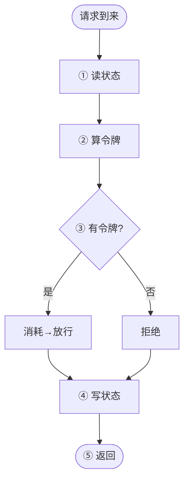
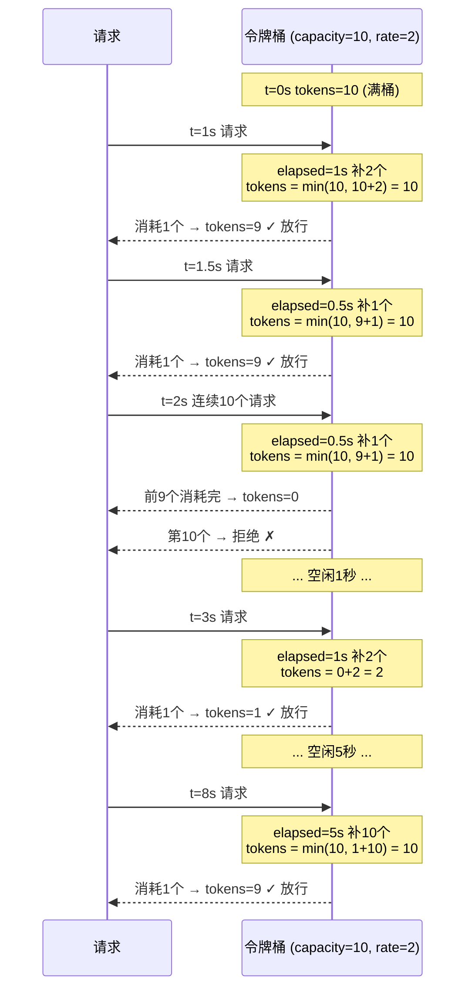

限流是高并发系统的基本防护手段——接口 QPS 再高，下游也扛不住 unlimited 流量。常见算法有固定窗口、滑动窗口、漏桶、令牌桶，其中令牌桶最通用：允许短时突发（桶内有积累），但长期平均速率受限，这正好匹配真实流量模式。

本文从令牌桶的完整工作流讲起，再逐个拆解每个设计决策背后的“为什么”。

1. Table of Contents, ordered
{:toc}

# 令牌桶算法：完整工作流

先放下实现细节，从“一个请求到来时发生什么”看令牌桶的全貌。

**模型**：想象一个桶，以恒定速率往里放令牌，桶有容量上限；每次请求消耗一个令牌，桶空则拒绝。

**四个参数**：

| 参数 | 含义 |
|------|------|
| `capacity` | 桶容量（最大令牌数） |
| `rate` | 令牌填充速率（个/秒） |
| `tokens` | 当前令牌数 |
| `last_refill` | 上次填充时间 |

**一个请求的完整处理流程**：



五步拆解：

1. **读状态**：从 Redis 取出 `tokens`、`last_refill`
2. **算令牌**：`elapsed = now − last_refill`，`tokens = min(capacity, tokens + elapsed × rate)`，`last_refill = now`
3. **判定**：`tokens ≥ cost`？是则消耗令牌放行，否则直接拒绝
4. **写状态**：把 `tokens`、`last_refill` 写回 Redis
5. **返回**：放行/拒绝 + 剩余令牌数

关键在第②步——不是真的有个定时器在持续放令牌，而是**请求到来时，用时间差一次性算出这段时间该补的令牌数**。这叫惰性计算（lazy refill）。

用一个具体例子走一遍。假设 `capacity=10, rate=2`（每秒补 2 个令牌，桶最多 10 个）：



例子中能看到令牌桶的两个核心特性：
- **允许突发**：空闲 5 秒后桶又满了，可以瞬间处理 10 个请求
- **长期限速**：持续高并发下，放行速率不会超过 `rate`（本例中每秒最多 2 个）

整个流程就是这么简单。接下来的问题是：每一步的细节为什么这样设计，而不是别的做法。

# 为什么惰性计算，而不是定时器主动填充

对比两种实现：

**主动填充（定时器）：**

```
每 100ms 执行一次：
  if tokens < capacity:
    tokens += rate * 0.1
```

**惰性填充（请求到来时算）：**

```
请求到来时：
  elapsed = now - last_refill
  tokens = min(capacity, tokens + elapsed * rate)
```

定时器方案有三个问题：

1. **不必要的开销**：QPS=0 时定时器还在空跑，几十万个 key 就是几十万个空转定时器。惰性方案没人来就零开销。

2. **精度与成本的矛盾**：间隔 1s 粒度太粗，间隔 10ms 精度够但开销爆炸。惰性方案的精度天然等于请求到达的时间分辨率，与业务对齐。

3. **分布式环境没法做**：定时器放应用侧，多实例并发写 Redis 又要加锁；放 Redis 侧，Redis 没有原生定时器调度能力。

本质上，令牌数是时间的确定函数 `tokens(now) = min(capacity, tokens(last) + (now - last) * rate)`，请求到来时一个公式就能算出精确值，不需要定时器去近似模拟。**能算出来的东西，就不要用定时器去维护。**

# 为什么需要 Lua

分布式限流用 Redis 存储状态（`tokens`、`last_refill`），但存在竞态问题：

```
请求A: GET tokens → 1      # 还有1个令牌
请求B: GET tokens → 1      # 也认为还有1个
请求A: SET tokens 0        # 消耗掉
请求B: SET tokens 0        # 也消耗掉 → 超发了！
```

Lua 脚本在 Redis 中原子执行——单线程模型保证读取、计算、写入一气呵成，中间不会被其他命令插入。

# 完整 Lua 脚本实现

```lua
-- KEYS[1]: 限流 key
-- ARGV[1]: capacity（桶容量）
-- ARGV[2]: rate（每秒填充令牌数）
-- ARGV[3]: now（当前时间戳，毫秒）
-- ARGV[4]: cost（本次请求消耗令牌数）

local key = KEYS[1]
local capacity = tonumber(ARGV[1])
local rate = tonumber(ARGV[2])
local now = tonumber(ARGV[3])
local cost = tonumber(ARGV[4])

-- 获取当前状态
local tokens = tonumber(redis.call('GET', key .. ':tokens') or capacity)
local last_refill = tonumber(redis.call('GET', key .. ':last_refill') or now)

-- 惰性填充：计算从上次到现在应补充的令牌
local elapsed = math.max(0, now - last_refill) / 1000  -- 毫秒转秒
local refill = elapsed * rate
tokens = math.min(capacity, tokens + refill)

-- 尝试消耗令牌
local allowed = 0
if tokens >= cost then
    tokens = tokens - cost
    allowed = 1
end

-- 写回状态
redis.call('SET', key .. ':tokens', tokens)
redis.call('SET', key .. ':last_refill', now)

-- 设置过期时间，避免冷启动时积累巨量令牌
local ttl = math.ceil(capacity / rate) + 1
redis.call('EXPIRE', key .. ':tokens', ttl)
redis.call('EXPIRE', key .. ':last_refill', ttl)

return { allowed, tokens }
```

调用方式：

```bash
EVALSHA <sha> 1 rate_limit:user:123 10 2 1717833600000 1
# 返回: 1) 是否放行(1/0)  2) 剩余令牌数
```

# 用 Hash 优化存储

上面的脚本用两个独立的 String key 存 `tokens` 和 `last_refill`。更优的做法是用 Redis Hash 把它们塞进一个 key：

```lua
local cache = redis.call('HMGET', key, 'tokens', 'last_time')
local current_tokens = tonumber(cache[1])
local last_time = tonumber(cache[2])

-- ... 计算逻辑同上 ...

redis.call('HMSET', key, 'tokens', new_tokens, 'last_time', now)
redis.call('EXPIRE', key, expire)
```

`HMGET` 是 Hash 多字段读取命令——从 Hash key 中同时读出多个字段值。等价于：

```
HMGET rate_limit:user:123 tokens last_time
→ ["7.5", "1717833600000"]
```

在 Lua 中返回值是数组，`cache[1]` 是 `tokens` 字段，`cache[2]` 是 `last_time` 字段。字段不存在时返回 `false`（Redis 的 nil），`tonumber(nil)` 得到 nil，正好走初始化逻辑。

对比两种存储方式：

| | 两个 String key | 一个 Hash key |
|---|---|---|
| 读取 | 2 次 GET | 1 次 HMGET |
| 写入 | 2 次 SET | 1 次 HMSET |
| 过期 | 需分别 EXPIRE | 1 次 EXPIRE |
| 内存 | Hash 编码更紧凑 | 同左 |

Hash 方案少了一半命令开销，且过期时间只需设置一次，两个字段不会出现一个过期一个没过期的异常状态。

# 冷启动问题

如果 key 不存在，`tokens` 默认设为 `capacity`（满桶）。长时间没人用之后突然来一波流量，会瞬间放行 `capacity` 个请求。应对方式：

- 初始令牌设为 0 或一个较小的值
- key 首次创建时设 `last_refill = now`，不补历史令牌

上面脚本用的是「初始满桶」，可根据业务调整。

TTL 设为 `capacity / rate + 1`，意思是“从空桶到满桶所需时间再多 1 秒”。超过这个时间 key 自然失效，下次再来按新桶算，避免冷启动积累巨量令牌。

# Lua 脚本放在哪里

Lua 脚本不“部署”到 Redis 上，而是由应用侧在每次调用时发送给 Redis 执行。和 SQL 类比——SQL 文件放 `resources/sql/`，Lua 文件放 `resources/lua/`，运行时发给服务端执行。

## 内联字符串（最简单，不推荐生产用）

```java
String script = 
    "local key = KEYS[1] " +
    "local now = tonumber(ARGV[1]) " +
    "return allowed";

Long result = redisTemplate.execute(
    new DefaultRedisScript<>(script, Long.class),
    List.of("rate_limit:user:123"),
    String.valueOf(System.currentTimeMillis()),
    "2", "10", "600"
);
```

脚本藏在代码字符串里，不好读、不好维护、没有语法高亮。

## 独立 .lua 文件（推荐起步方案）

```
src/main/resources/
  └── lua/
      └── rate_limiter.lua
```

```java
@Configuration
public class RedisConfig {

    @Bean
    public DefaultRedisScript<Long> rateLimiterScript() {
        DefaultRedisScript<Long> script = new DefaultRedisScript<>();
        script.setLocation(new ClassPathResource("lua/rate_limiter.lua"));
        script.setResultType(Long.class);
        return script;
    }
}
```

```java
@Autowired
private DefaultRedisScript<Long> rateLimiterScript;

public boolean isAllowed(String key) {
    Long result = redisTemplate.execute(
        rateLimiterScript,
        List.of(key),
        String.valueOf(System.currentTimeMillis()),
        "2", "10", "600"
    );
    return result != null && result == 1L;
}
```

脚本独立文件，有语法高亮，可单独做语法检查。

## EVALSHA 缓存（高并发生产推荐）

每次 `EVAL` 都会把完整脚本传给 Redis，浪费带宽。`EVALSHA` 先用 `SCRIPT LOAD` 注册脚本拿到 SHA1 哈希，后续只传哈希：

```
第一次:  SCRIPT LOAD "lua脚本内容"  →  返回 "a1b2c3..."
后续:    EVALSHA a1b2c3... 1 key arg1 arg2 ...
```

应用侧封装：

```java
@Component
public class RateLimiter {

    private String sha;

    @Autowired
    private RedisTemplate<String, String> redisTemplate;

    @PostConstruct
    public void init() {
        String script = // 读 lua 文件内容
        sha = redisTemplate.scriptLoad(script);
    }

    public boolean isAllowed(String key) {
        try {
            Long result = redisTemplate.execute(
                new DefaultRedisScript<>(sha, Long.class, true),
                List.of(key), ...);
            return result != null && result == 1L;
        } catch (RedisSystemException e) {
            // SHA 失效（Redis 重启过），重新加载
            sha = redisTemplate.scriptLoad(script);
            return isAllowed(key);
        }
    }
}
```

```python
# redis-py 的 RegisterScript 自动处理 SHA 缓存和重载
from redis import Redis

r = Redis()
script = r.register_script(Path("lua/rate_limiter.lua").read_text())
result = script(keys=["rate_limit:user:123"], args=[now_ms, 2, 10, 600])
```

| 方式 | 适用场景 | 要点 |
|------|---------|------|
| 内联字符串 | 快速验证 | 不要用于生产 |
| 独立 .lua 文件 | 一般项目 | 可读性好，推荐起步 |
| EVALSHA 缓存 | 高并发生产 | 省带宽，需处理 SHA 失效重载 |

# 并发怎么变串行

Redis 单线程处理命令（6.0+ 的多线程只管 IO 读写，命令执行仍是单线程）。`EVAL` 执行 Lua 脚本时，Redis 阻塞其他所有命令，直到脚本跑完。100 个并发请求同时到达 Redis，也是排队逐个执行，每个脚本内部的读→算→写不会被中间插入。

等价于在应用侧加了一把全局锁，但不用自己实现锁——没有加锁、解锁、死锁、锁超时这些问题。

代价是所有限流请求都汇入 Redis 这一个瓶颈。如果限流 QPS 极高（比如几十万），Redis 单节点会成为性能天花板。实际场景中限流 QPS 一般远不到这个量级；真到那个量级，可以用**本地限流 + 分布式限流二级缓存**：本地 Guava RateLimiter 先挡一层，漏下来的再走 Redis。

# 与其他限流算法对比

| 算法 | 特点 | 适用场景 |
|------|------|----------|
| 固定窗口 | 简单，但窗口边界有突发（2 倍流量） | 要求不严格 |
| 滑动窗口 | 比固定窗口平滑，但内存开销大 | 中等精度 |
| 漏桶 | 严格匀速输出，无法应对合理突发 | 需要严格匀速 |
| 令牌桶 | 允许突发（桶内有积累），长期速率受限 | **最通用，最推荐** |

令牌桶的优势：允许短时突发，但长期平均速率受限。这正好匹配真实流量模式——偶尔的突发是正常的，不应一刀切拒绝。

# 一句话总结

**令牌桶 = 用时间差惰性计算令牌数；Lua = 保证读-算-写原子性；Redis = 分布式共享状态。** 三者组合，实现简洁、正确、高性能的分布式限流。