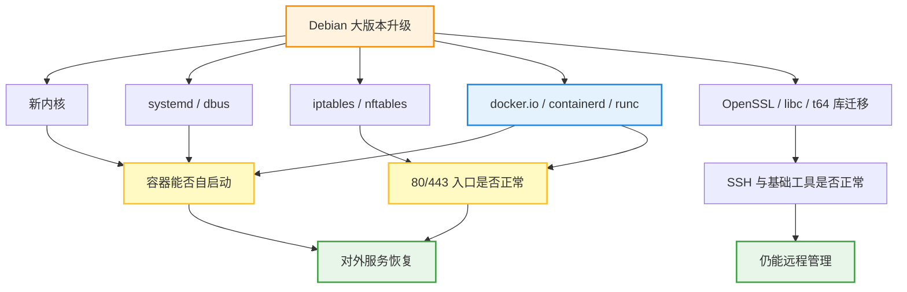

1. Table of Contents, ordered
{:toc}

# 背景与目标

这次升级发生在一台资源不大的 VPS 上：2 核、1GB 内存、22GB 根分区。机器上跑着多个 Docker 服务，包括 `nginx-proxy`、`nginx-proxy-acme`、`memos`、`portainer`、`v2ray`、`dailytxt`、`ttq`、`wedding` 等。对这类机器来说，系统升级最怕的不是某个包版本变化本身，而是升级后 Docker 起不来、容器没恢复、80/443 入口断掉，或者 SSH 失联。

最初目标只是从 Debian 11 bullseye 升到 Debian 12 bookworm。后来又因为需要 Compose v2 的 `docker compose` 指令，继续从 Debian 12 升到 Debian 13 trixie。整个过程没有选择跨版本直跳，而是按 `11 -> 12 -> 13` 分两段做。

这个背景决定了文章要关注的不是“升级命令怎么敲”这么简单，而是升级前如何降低风险、升级中如何处理源和包变化、重启后如何验证业务真的恢复。

# 先看风险在哪里

这台机器的业务入口几乎都压在 Docker 上。Debian 大版本升级会动到内核、systemd、OpenSSH、iptables/nftables、Docker、containerd、runc、OpenSSL 和 libc。任何一层出问题，最后都可能表现为容器没有起来，或者反向代理入口不可用。



所以升级前后真正要盯住的是：

- SSH 还能不能连。
- Docker daemon 是否正常。
- 容器是否全部自动恢复。
- 80/443 是否仍由 `nginx-proxy` 监听。
- `systemctl --failed` 是否为 0。
- apt / dpkg 状态是否干净。

# 为什么先升 12，再升 13

第一次升级时，用户最担心的是 Docker 服务跑不起来。因此当时没有从 Debian 11 直接跳到 Debian 13，而是先升到 Debian 12。理由有三个：

1. Debian 的常规路径是逐版本升级，`11 -> 12 -> 13` 比跨版本跳升更稳。
2. 这台机器上所有对外服务都依赖 Docker，稳定性优先于追新版本。
3. 当时业务容器并不依赖 Compose v2，没有必要为了新工具链立即承担 Docker 大版本变化。

后来继续升 Debian 13，是因为需要使用 Compose v2。升级前确认 Debian 13 官方源里的 `docker-compose` 包已经是 v2，同时 Docker 相关包也会一起进入新版本：

| 包 | Debian 12 | Debian 13 |
| --- | --- | --- |
| `docker-compose` | `1.29.2-3` | `2.26.1-4` |
| `docker.io` | `20.10.24+dfsg1` | `26.1.5+dfsg1` |
| `containerd` | `1.6.20~ds1` | `1.7.24~ds1` |
| `runc` | `1.1.5+ds1` | `1.1.15+ds1` |

这就给出了继续升级的实际收益：不用切到 Docker 官方 apt 源，也能通过 Debian 官方包获得 Compose v2。

# 升级前准备

升级前先做三类检查：版本和源、磁盘和内存、服务状态。

```bash
cat /etc/os-release
uname -a
df -hT / /boot
free -h
systemctl --failed --no-pager
docker ps
docker system df
```

空间是这台机器最现实的限制。`11 -> 12` 前根分区使用率约 82%，可用空间只有 3.8GB；swap 已使用 800MB 左右，但实时 `vmstat` 没有频繁 `si/so`，说明没有明显 swap 抖动。为了给升级留足空间，先清理了 npm、Playwright、Puppeteer、临时构建目录、Docker 未使用镜像和 apt cache，根分区可用空间恢复到约 9GB。

`12 -> 13` 前根分区只剩约 4.8GB。这次没有提前 `docker image prune`，只清理用户级缓存，避免删掉可能用于回滚或重启的镜像。

升级前还处理了两个历史隐患：

- `/etc/network/interfaces` 里曾有不存在的 `eth1` 配置，导致 `networking.service` 失败。
- 宿主机旧 certbot timer 会尝试续期过期证书，且可能和 Docker 的 `nginx-proxy-acme` 抢 80/443。

这两个问题都和业务入口相关。先处理掉它们，可以避免升级后把旧问题误判成新系统故障。

# Debian 11 到 12

先备份 apt 源：

```bash
sudo cp -a /etc/apt/sources.list /etc/apt/sources.list.bak.bullseye-20260610
sudo cp -a /etc/apt/sources.list.d /etc/apt/sources.list.d.bak.bullseye-20260610
```

然后切到 bookworm：

```text
deb http://deb.debian.org/debian bookworm main
deb http://deb.debian.org/debian-security bookworm-security main
deb http://deb.debian.org/debian bookworm-updates main
```

Docker 官方源当时曾临时从 bullseye 调整为 bookworm，避免升级过程混用旧发行版源。升级后确认实际使用的是 Debian 官方 `docker.io`、`containerd`、`runc`、`docker-compose`，没有安装 Docker 官方源里的 `docker-ce` 或 `docker-compose-plugin`，因此最终删除了 Docker 官方源。

升级命令采用两段式：

```bash
sudo apt-get update

sudo env DEBIAN_FRONTEND=noninteractive NEEDRESTART_MODE=a \
  apt-get -y -o Dpkg::Options::='--force-confdef' \
  -o Dpkg::Options::='--force-confold' \
  upgrade --without-new-pkgs

sudo env DEBIAN_FRONTEND=noninteractive NEEDRESTART_MODE=a \
  apt-get -y -o Acquire::Retries=5 \
  -o Dpkg::Options::='--force-confdef' \
  -o Dpkg::Options::='--force-confold' \
  full-upgrade
```

`--force-confold` 的目的，是尽量保留本机已有配置，降低服务配置被包升级覆盖的风险。升级过程中遇到过两次单包下载超时，分别是 `libnet-server-perl` 和 `libzstd1`。处理方式不是改升级策略，而是重试下载，利用 apt 已经缓存的大部分包继续推进。

`full-upgrade` 完成后，系统包层面已经是 Debian 12，但仍然运行旧内核。必须重启后，才能确认新内核和 Docker 服务是否真的正常。

重启后状态是：

```text
Debian: 12.14 bookworm
Kernel: 6.1.0-49-amd64
Docker Client/Server: 20.10.24+dfsg1
systemctl --failed: 0 failed units
```

Docker 容器全部自动恢复。Netdata 初始状态曾是 `health: starting`，等待一会儿后变为 `healthy`。

# Debian 12 到 13

继续升 Debian 13 前，先做模拟：

```bash
sudo apt-get update
sudo apt-get -s full-upgrade
```

模拟结果显示会升级 Docker、OpenSSH、systemd、iptables/nftables，并安装新内核；关键是没有移除 Docker、SSH 或基础网络组件。这个模拟结果很重要，因为这台机器的核心风险不是“升级包很多”，而是“升级过程把远程管理和容器入口拆掉”。

然后备份源并切到 trixie：

```bash
sudo cp -a /etc/apt/sources.list /etc/apt/sources.list.bak.bookworm-to-trixie-20260613-154912
sudo cp -a /etc/apt/sources.list.d /etc/apt/sources.list.d.bak.bookworm-to-trixie-20260613-154912
```

```text
deb http://deb.debian.org/debian trixie main
deb http://deb.debian.org/debian-security trixie-security main
deb http://deb.debian.org/debian trixie-updates main
```

正式升级仍然用同样的两段式。第二段下载约 636MB 包，安装后额外占用约 1.17GB。过程中出现了一些 `t64` 库迁移提示，例如旧 `libssl3`、`libcurl4` 被新 `libssl3t64`、`libcurl4t64` 替换。这是 Debian 13 的 64-bit time_t 迁移，不是失败。

# 重启前后的差异

大版本升级完成后，包版本和运行中的进程状态可能短暂不一致。`12 -> 13` 重启前就出现过这样的状态：

```text
Debian: 13.5 trixie
Running kernel: 6.1.0-49-amd64
Docker Client: 26.1.5+dfsg1
Docker Server: 20.10.24+dfsg1
Docker Compose: 2.26.1-4
```

这个状态看起来有点矛盾，但并不奇怪：用户态包已经升级，Docker CLI 已经是新版本，Compose 也已经是 v2；但是机器还没有重启，内核仍然是旧的，Docker daemon 也还在旧进程里。

重启后才进入最终状态：

```text
Debian: 13.5 trixie
Kernel: 6.12.90+deb13.1-amd64
Docker Client/Server: 26.1.5+dfsg1
Docker Compose: 2.26.1-4
systemctl --failed: 0 failed units
```

Compose v2 验证：

```bash
docker compose version
docker-compose version
```

两者都返回：

```text
Docker Compose version 2.26.1-4
```

容器恢复情况：

```text
v2ray
wedding
ttq
v2ray-new
memos
nginx-proxy
dailytxt
portainer
nginx-proxy-acme
```

80/443 入口也仍然由 Docker 接管：

```text
0.0.0.0:80  -> docker-proxy
0.0.0.0:443 -> docker-proxy
[::]:80     -> docker-proxy
[::]:443    -> docker-proxy
```

# 清理策略

升级后不要马上清理所有“看起来没用”的包。旧内核和旧运行库在刚升级完成时仍有价值：如果新内核或 Docker 26.x 出现问题，可以从 GRUB 高级菜单回退旧内核，或者保留更多诊断余地。

这次 `12 -> 13` 后只实际执行了 apt 下载缓存清理：

```bash
sudo apt-get clean
sudo apt-get -s autoremove
```

`apt autoremove -s` 显示有 99 个旧库和旧 Python/Ruby 包可移除，但没有立即执行真实清理。

清理 apt cache 后空间状态：

```text
/:     22G, used 77%, avail 4.8G
/boot: 546M, used 19%, avail 420M
```

# 从这次升级推出来的经验

这次升级的关键不是某一条命令，而是顺序。

先释放空间，再升级。小 VPS 的磁盘余量太低时，下载包、解包、新内核、initramfs 和触发器都有可能把根分区顶满。

先模拟 `full-upgrade`，再正式升级。模拟的重点不是看“会升级多少包”，而是确认不会移除 SSH、Docker、网络基础包和关键运行时。

逐版本升级，而不是直接跳到终点。`11 -> 12` 先把系统带到 bookworm，确认 Docker 服务能恢复；确认有 Compose v2 需求后，再执行 `12 -> 13`。

Docker VPS 的验收标准不能只看 apt 成功退出。必须验证 daemon、容器、自启动、80/443 入口、failed units、SSH 和 dpkg 状态。

Compose v2 可以直接通过 Debian 13 官方 `docker-compose` 包获得。对这台机器来说，这比重新引入 Docker 官方 apt 源更简单，也少一个混源风险点。

升级后先保留旧内核和旧运行库观察一段时间，再决定是否 `autoremove`。刚升级完成时，回退余地比立刻清爽更重要。

# 参考命令

```bash
cat /etc/os-release
uname -a
apt-cache policy docker-compose docker.io containerd runc
apt-get -s full-upgrade
systemctl --failed --no-pager
docker version
docker compose version
docker ps
ss -ltnp '( sport = :80 or sport = :443 )'
df -hT / /boot
```
