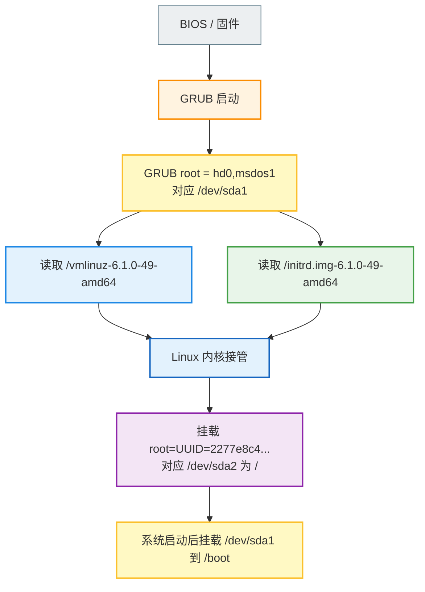
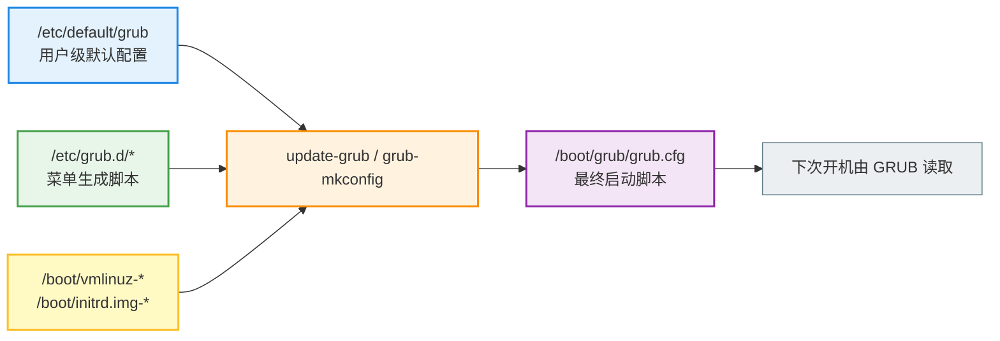
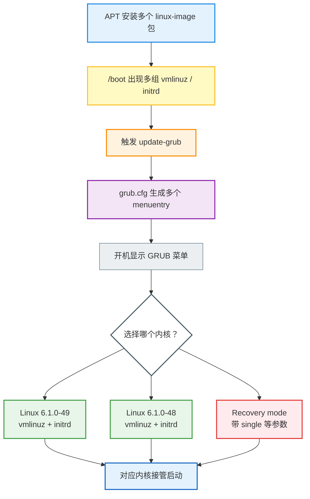

1. Table of Contents, ordered
{:toc}

# 背景与目标

这次对话围绕一个很具体的问题展开：在一台 Debian 机器上，GRUB、Linux 内核、`/boot`、根分区 `/` 之间到底是什么关系。

机器的实际分区很适合作例子：

```text
/dev/sda
├─/dev/sda1  ext3  UUID=08d8246c...  挂载到 /boot
└─/dev/sda2  ext3  UUID=2277e8c4...  挂载到 /
```

也就是说，`/dev/sda1` 是单独的 `/boot` 分区，`/dev/sda2` 才是 Linux 真正运行起来之后的根分区。

# 主要步骤

## 步骤一：先区分 GRUB 的 `/` 和 Linux 的 `/`

最容易混淆的地方在于：GRUB 启动阶段看到的根目录，和 Linux 启动完成后看到的根目录，不是同一个视角。

在 GRUB 眼里，`/dev/sda1` 被当成自己的根，因此内核文件路径是：

```text
/vmlinuz-6.1.0-49-amd64
/initrd.img-6.1.0-49-amd64
```

但在 Linux 系统运行起来之后，`/dev/sda2` 被挂载成 `/`，`/dev/sda1` 又被挂载到 `/boot`，所以同样的文件在 Linux 里看到的是：

```text
/boot/vmlinuz-6.1.0-49-amd64
/boot/initrd.img-6.1.0-49-amd64
```



这也是为什么这个布局初看起来有点绕：启动早期，GRUB 把 `/dev/sda1` 当作自己的 `/`；系统启动完成后，Linux 又把同一个 `/dev/sda1` 挂载到自己的 `/boot` 目录下。这里并不是 `/boot` 和 `/` 互相嵌套，而是 GRUB 阶段和 Linux 阶段对同一块分区使用了不同的路径视角。

## 步骤二：看懂 grub.cfg 里的启动行

这台机器的 GRUB 配置在：

```text
/boot/grub/grub.cfg
```

默认启动项里的关键行是：

```grub
set root='hd0,msdos1'

linux /vmlinuz-6.1.0-49-amd64 root=UUID=2277e8c4-09d7-4c4d-bd96-237e417ff3be ro net.ifnames=0 biosdevname=0 consoleblank=0 consoleblank=0

initrd /initrd.img-6.1.0-49-amd64
```

这里有两个“root”：

| 配置 | 谁使用 | 含义 |
| --- | --- | --- |
| `set root='hd0,msdos1'` | GRUB | 从 `/dev/sda1` 读取内核、initrd、GRUB 文件 |
| `root=UUID=2277e8c4...` | Linux 内核 | 启动后把 `/dev/sda2` 挂载成真正的 `/` |

`vmlinuz-6.1.0-49-amd64` 是真正的 Linux 内核文件；`initrd.img-6.1.0-49-amd64` 不是内核，而是初始内存根文件系统。它负责在早期启动阶段提供驱动、模块和脚本，帮助内核找到并挂载真正的根分区。

## 步骤三：理解为什么系统启动后还要挂载 /boot

从“本次启动已经完成”的角度看，`/boot` 确实大多数时间没用。内核已经加载进内存，GRUB 已经退场。

但系统仍然通常会把 `/dev/sda1` 挂载到 `/boot`，原因是后续维护需要它：

1. 安装或升级内核时，包管理器要写入新的 `vmlinuz-*`、`initrd.img-*`、`System.map-*`、`config-*`。
2. 执行 `update-grub` 或 `grub-mkconfig` 时，要更新 `/boot/grub/grub.cfg`。
3. 保证系统运行时维护的 `/boot`，就是 GRUB 下次启动时真正读取的那块分区。

如果 `/boot` 没挂载，内核包可能把新文件写进根分区 `/dev/sda2` 里的空 `/boot` 目录，而不是写进 `/dev/sda1`。这样 Linux 系统里看着文件有了，GRUB 下次启动却读不到。

## 步骤四：理解 grub.cfg 是生成结果

`/boot/grub/grub.cfg` 不是推荐手写维护的静态文件，而是由系统生成出来的 GRUB 脚本。

它的来源大致是：



安装、升级、删除内核时，Debian 通常会触发 `update-grub`，扫描 `/boot` 里的内核和 initrd，然后重新生成启动菜单。开机时选择某个菜单项，一般不会反过来改写 `grub.cfg`。

## 步骤五：多个内核如何变成多个启动项

如果系统里安装了多个内核，`/boot` 里会有多组文件：

```text
/boot/vmlinuz-6.1.0-47-amd64
/boot/initrd.img-6.1.0-47-amd64
/boot/vmlinuz-6.1.0-48-amd64
/boot/initrd.img-6.1.0-48-amd64
/boot/vmlinuz-6.1.0-49-amd64
/boot/initrd.img-6.1.0-49-amd64
```

`update-grub` 会把它们生成多个菜单项。启动时，GRUB 读取配置，用户选择一个菜单项，GRUB 就加载对应版本的内核和 initrd。



# 核心结论

GRUB 和 Linux 内核的关系可以概括成一句话：**GRUB 负责把内核加载起来，内核负责真正启动系统。**

在这台机器上：

| 对象 | 实际位置 | 作用 |
| --- | --- | --- |
| GRUB 配置 | `/boot/grub/grub.cfg` | 告诉 GRUB 有哪些启动项 |
| 内核文件 | `/boot/vmlinuz-6.1.0-49-amd64` | 真正接管启动的 Linux 内核 |
| initrd | `/boot/initrd.img-6.1.0-49-amd64` | 早期启动用的临时小系统 |
| `/boot` 分区 | `/dev/sda1` | 存放 GRUB、内核、initrd |
| 根分区 `/` | `/dev/sda2` | Linux 启动完成后真正的系统根目录 |

APT 包名和实际文件名也不是一回事。`linux-image-6.1.0-49-amd64` 是内核镜像包，安装出来的启动文件叫 `/boot/vmlinuz-6.1.0-49-amd64`；`linux-headers-6.1.0-49-amd64` 则主要用于编译外部内核模块，不是启动用的内核本体。

# 参考

本文基于本机命令输出整理，关键命令包括：

```bash
lsblk -f /dev/sda
findmnt -no SOURCE,TARGET,FSTYPE / /boot /boot/efi
grep -nE "menuentry|linux|initrd|set root|search --no-floppy" /boot/grub/grub.cfg
ls -lh /boot
```
