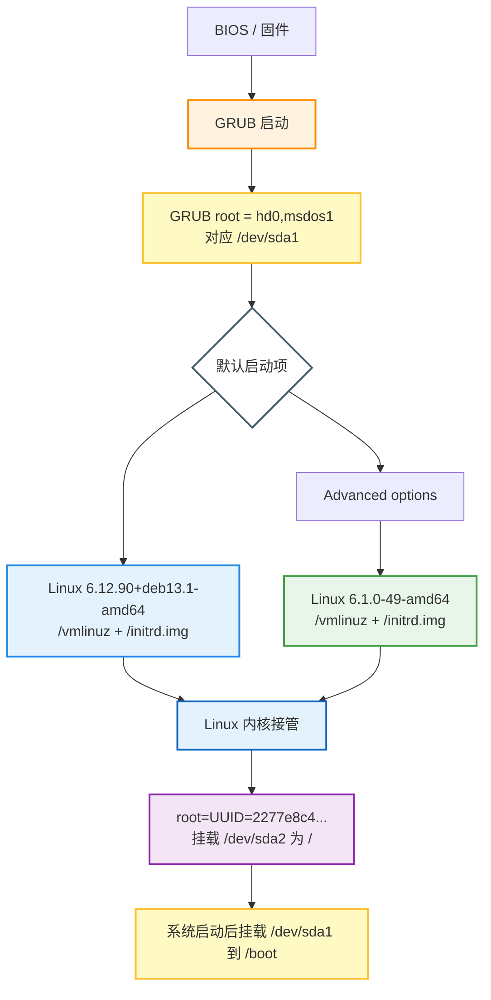
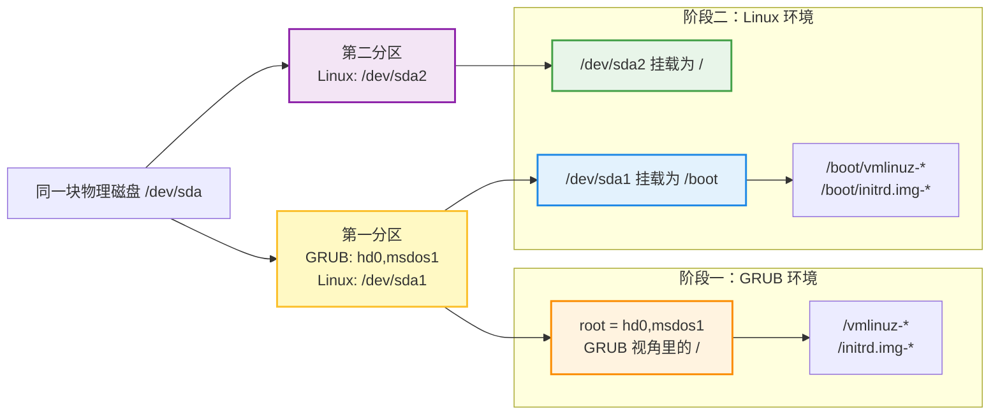
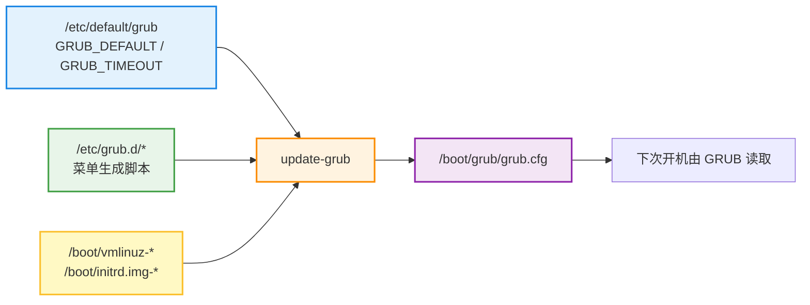

1. Table of Contents, ordered
{:toc}

# 背景与问题

系统升级完成后，`/boot` 里经常不会只剩一个内核。尤其是 Debian 这种发行版升级场景，新内核已经装好并完成重启，旧内核也可能继续保留一段时间，用来给新系统留回退入口。

这台 VPS 就处在这样的状态：系统已经升到 Debian 13，当前运行的是 Debian 13 的新内核，但 Debian 12 时期的旧内核还在 `/boot` 和 GRUB 高级菜单里。这个状态很适合顺着一个具体问题往下看：

```text
系统里装了多个内核时，GRUB 到底会加载哪一个？
```

要回答这个问题，不能只看 `/boot` 里有哪些文件，也不能只看 APT 装了哪些包。需要把三件事分开：

| 问题 | 看什么 | 命令或文件 |
| --- | --- | --- |
| 系统安装了哪些内核 | APT 包状态 | `dpkg -l 'linux-image*'` |
| GRUB 菜单里有哪些启动项 | GRUB 生成结果 | `/boot/grub/grub.cfg` |
| 本次启动实际用了哪个内核 | 已加载进内存的内核 | `uname -r` |

它们互相关联，但不是同一件事。新内核包安装完成后，如果机器还没重启，`uname -r` 仍然会显示旧内核；重启后，只有被 GRUB 选中并加载的那个内核才会成为当前运行内核。

# 这台机器的磁盘视角

这台机器的分区结构很适合解释 `/boot`、GRUB 和 Linux 根分区之间的关系：

```text
/dev/sda
├─/dev/sda1  ext3  UUID=08d8246c...  挂载到 /boot
└─/dev/sda2  ext3  UUID=2277e8c4...  挂载到 /
```

| 分区 | Linux 启动后的挂载点 | 主要内容 |
| --- | --- | --- |
| `/dev/sda1` | `/boot` | GRUB、内核文件 `vmlinuz-*`、初始内存根文件系统 `initrd.img-*` |
| `/dev/sda2` | `/` | Debian 系统主体、服务、Docker 数据和普通文件 |

也就是说，`/boot` 不是根分区里的普通目录那么简单。它是单独的分区。开机早期，GRUB 要从这里读取内核和 initrd；Linux 启动完成后，系统也要把这块分区挂载到 `/boot`，方便后续安装新内核和重新生成 GRUB 配置。

# 启动链路

先不看具体配置行，把启动过程按阶段拆开：



GRUB 不负责启动完整 Debian。它的任务更靠前：找到启动菜单、选择一个菜单项、把对应版本的 Linux 内核和 `initrd.img` 加载进内存。后面真正挂载根分区、启动 systemd、拉起 Docker 和其他服务的，是被加载起来的 Linux 内核。

# 两个 root 不是同一个东西

`/boot/grub/grub.cfg` 里的默认启动项大致会包含这样的片段：

```grub
set root='hd0,msdos1'

linux /vmlinuz-6.12.90+deb13.1-amd64 root=UUID=2277e8c4-09d7-4c4d-bd96-237e417ff3be ro net.ifnames=0 biosdevname=0 consoleblank=0 consoleblank=0

initrd /initrd.img-6.12.90+deb13.1-amd64
```

这里有两个容易混淆的 `root`：

| 写法 | 谁使用 | 含义 |
| --- | --- | --- |
| `set root='hd0,msdos1'` | GRUB | 把第一块磁盘的第一个 MBR 分区当作 GRUB 读文件时的根目录 |
| `root=UUID=2277e8c4...` | Linux 内核 | Linux 启动后把 `/dev/sda2` 挂载成系统根目录 `/` |

`hd0,msdos1` 这种写法之所以看起来不像 Linux，是因为它发生在 Linux 真正启动之前。此时还没有 Linux 内核接管硬件，也没有 Linux 的设备节点、udev、挂载表和命名规则；`/dev/sda1` 这种名字是 Linux 启动后才出现的视角。GRUB 只能用自己的磁盘编号和分区编号来描述“我要从哪块盘的哪个分区读文件”。

所以这里的 `set root` 不能理解成 Linux 里的 `mount /dev/sda1 /boot`。它更像是在 GRUB 自己的小环境里选定一个“文件查找起点”：后面的 `/vmlinuz-*`、`/initrd.img-*` 都从这个 GRUB root 指向的分区顶层开始找。等内核被加载起来，Linux 才会建立自己的 `/dev` 设备命名和挂载体系。

同一块分区在两个阶段里的“名字”和“位置”可以这样理解：



也就是说，`hd0,msdos1`、`/dev/sda1`、`/boot` 描述的是同一个分区在不同阶段的身份：GRUB 阶段它是 GRUB 的 `/`，Linux 阶段它变成 Linux 根目录下面的 `/boot`。真正的 Linux 根目录 `/` 则是另一块分区 `/dev/sda2`。

所以 GRUB 配置里写的是：

```grub
linux /vmlinuz-6.12.90+deb13.1-amd64
initrd /initrd.img-6.12.90+deb13.1-amd64
```

而不是：

```grub
linux /boot/vmlinuz-6.12.90+deb13.1-amd64
initrd /boot/initrd.img-6.12.90+deb13.1-amd64
```

原因在于，GRUB 已经把 `hd0,msdos1` 这个分区当作自己的根目录。对 GRUB 来说，内核文件就在 `/vmlinuz-*`；等 Linux 启动完成后，同一块分区被挂载到 `/boot`，从 Linux 里看到的路径才是 `/boot/vmlinuz-*`。

# 为什么系统启动后还要挂载 /boot

从“本次启动已经完成”的角度看，`/boot` 确实大多数时间没用。GRUB 已经把内核和 initrd 加载进内存，Linux 内核也已经接管启动流程；此时继续运行系统、启动服务、跑 Docker，并不需要反复读取 `/boot` 里的内核文件。

但系统仍然通常会把 `/dev/sda1` 挂载到 `/boot`，原因是后续维护需要它：

1. 安装或升级内核时，包管理器要写入新的 `vmlinuz-*`、`initrd.img-*`、`System.map-*`、`config-*`。
2. 执行 `update-grub` 或 `grub-mkconfig` 时，要更新 `/boot/grub/grub.cfg`。
3. 保证 Linux 运行时维护的 `/boot`，就是 GRUB 下次启动时真正读取的那块分区。

如果 `/boot` 没挂载，内核包可能把新文件写进根分区 `/dev/sda2` 里的空 `/boot` 目录，而不是写进真正给 GRUB 读取的 `hd0,msdos1` 分区。这样从 Linux 当前系统里看，`/boot/vmlinuz-*` 好像已经更新了；但下次开机时，GRUB 仍然去旧的 `/boot` 分区读文件，就可能看不到新内核或新配置。

# /boot 里为什么有两套内核

当前 `/boot` 里保留了两组核心启动文件：

```text
/boot/vmlinuz-6.12.90+deb13.1-amd64
/boot/initrd.img-6.12.90+deb13.1-amd64
/boot/vmlinuz-6.1.0-49-amd64
/boot/initrd.img-6.1.0-49-amd64
```

它们来自不同的内核包：

| APT 包 | 写入的启动文件 | 作用 |
| --- | --- | --- |
| `linux-image-6.12.90+deb13.1-amd64` | `vmlinuz-6.12.90+deb13.1-amd64` | Debian 13 当前默认内核 |
| `linux-image-6.1.0-49-amd64` | `vmlinuz-6.1.0-49-amd64` | Debian 12 时期保留的回退内核 |
| 对应的 initramfs 生成结果 | `initrd.img-*` | 早期启动阶段使用的小型临时系统 |

`vmlinuz-*` 是压缩过的 Linux 内核本体；`initrd.img-*` 不是内核，而是早期启动用的初始内存根文件系统。它提供驱动、模块和脚本，帮助内核找到并挂载真正的根分区。

还有一类包容易让人误会：`linux-image-amd64` 这样的包通常是元包。它不直接等于某一个 `/boot/vmlinuz-*` 文件，而是依赖当前 Debian 发行版推荐的具体内核包。保留这个元包，后续安全更新和小版本内核更新才会继续跟上。

# GRUB 如何决定默认加载哪个

Debian 上通常不直接手写 `/boot/grub/grub.cfg`。它是由 `update-grub` 根据配置、脚本和 `/boot` 里的文件生成的：



当前配置是：

```text
GRUB_DEFAULT=0
GRUB_TIMEOUT=5
```

这意味着默认选择第一个普通启动项。当前菜单结构可以理解成：

```text
Debian GNU/Linux
└─ 默认加载 Linux 6.12.90+deb13.1-amd64

Advanced options for Debian GNU/Linux
├─ Debian GNU/Linux, with Linux 6.12.90+deb13.1-amd64
├─ Debian GNU/Linux, with Linux 6.12.90+deb13.1-amd64 (recovery mode)
├─ Debian GNU/Linux, with Linux 6.1.0-49-amd64
└─ Debian GNU/Linux, with Linux 6.1.0-49-amd64 (recovery mode)
```

安装了两套内核，不代表开机会随机选择。默认策略在 `/etc/default/grub` 里，具体菜单项由 `update-grub` 根据 `/boot` 里的内核文件生成。`GRUB_DEFAULT=0` 时，第一个普通启动项会优先加载，也就是当前 Debian 13 的新内核。

# 当前运行内核和已安装内核为什么可能不同

系统升级时，APT 可以先把新内核安装到 `/boot`，但这不会自动替换已经加载进内存的旧内核。升级过程通常会经历三个状态：

| 阶段 | 包状态 | 运行内核 |
| --- | --- | --- |
| 升级前 | 只有旧内核或旧内核为主 | `6.1.0-49-amd64` |
| 安装新内核后、重启前 | 新旧内核包都已安装 | 仍然是 `6.1.0-49-amd64` |
| 重启后 | 新旧内核包都已安装 | `6.12.90+deb13.1-amd64` |

因此排查内核状态时，三类命令各看一层：

```bash
uname -r
dpkg -l 'linux-image*'
grep -nE "menuentry|linux|initrd" /boot/grub/grub.cfg
```

`uname -r` 只回答“这次启动实际加载了哪个内核”。`dpkg -l` 回答“系统里安装了哪些内核包”。`grub.cfg` 回答“下次开机 GRUB 可以展示哪些启动项”。

# 什么时候清理旧内核

刚完成 Debian 大版本升级时，不建议立刻清理旧内核。旧内核的价值是提供一个低成本回退入口：

- 新内核启动后如果网络、磁盘、Docker 或驱动异常，可以从 GRUB 高级菜单选择旧内核。
- 新内核观察稳定后，再考虑清理旧内核和旧运行库。
- `/boot` 空间足够时，保留一段时间通常比马上清掉更稳。

清理前可以先模拟：

```bash
sudo apt-get -s autoremove
```

确认要移除的内容符合预期后，再执行真实清理：

```bash
sudo apt-get autoremove
```

如果只想清理某个确定的旧内核，也可以针对具体包名处理，但要避免误删当前正在运行的内核。执行任何内核清理前，先确认：

```bash
uname -r
dpkg -l 'linux-image*'
df -hT /boot
```

# 从这台机器推出来的启动关系

这台机器上的现象可以按一条链理解：

```text
APT 安装 linux-image 包
  -> /boot 出现 vmlinuz-* 和 initrd.img-*
  -> update-grub 扫描 /boot 并生成 grub.cfg
  -> GRUB 开机按默认项选择一个内核
  -> Linux 内核根据 root=UUID=... 挂载真正的根分区
```

对应到当前状态：

| 对象 | 实际位置 | 作用 |
| --- | --- | --- |
| GRUB 配置 | `/boot/grub/grub.cfg` | 告诉 GRUB 有哪些启动项 |
| 当前默认内核 | `/boot/vmlinuz-6.12.90+deb13.1-amd64` | Debian 13 新内核，当前正在运行 |
| 当前默认 initrd | `/boot/initrd.img-6.12.90+deb13.1-amd64` | 新内核对应的早期启动环境 |
| 保留的旧内核 | `/boot/vmlinuz-6.1.0-49-amd64` | GRUB 高级菜单里的回退内核 |
| 保留的旧 initrd | `/boot/initrd.img-6.1.0-49-amd64` | 旧内核对应的早期启动环境 |
| `/boot` 分区 | `/dev/sda1` | 存放 GRUB、内核和 initrd |
| 根分区 `/` | `/dev/sda2` | Linux 启动完成后的系统根目录 |

# 常用检查命令

```bash
lsblk -f /dev/sda
findmnt -no SOURCE,TARGET,FSTYPE / /boot /boot/efi
ls -lh /boot
dpkg -l 'linux-image*'
uname -r
grep -nE "menuentry|linux|initrd|set root|search --no-floppy" /boot/grub/grub.cfg
grep -nE "GRUB_DEFAULT|GRUB_TIMEOUT" /etc/default/grub
sudo apt-get -s autoremove
```
